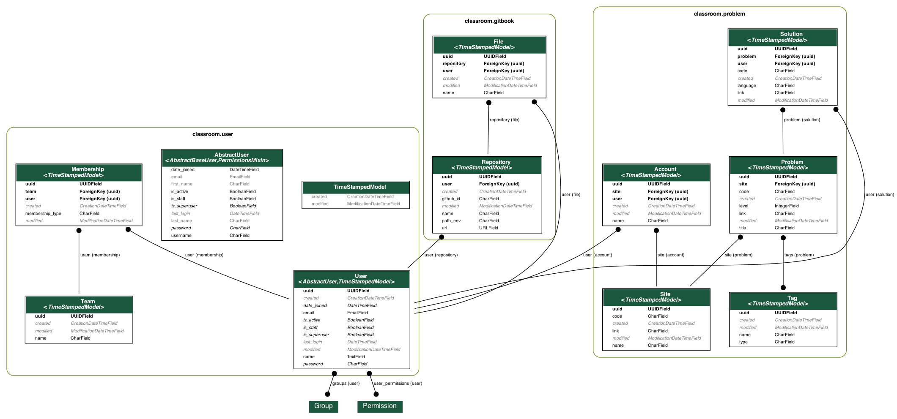

# README

* This is an API server for following gitbook
  * CS Note : https://seanhwangg.gitbook.io/note/
  * Interview Prep : https://seanhwangg.gitbook.io/interview/

## Diagram

* django-admin graph_models user gitbook problem -g -o models.png --exclude-models --no-inheritance




## Django admin API usage

* gitbook
  * combine_markdown
  * combine_solutions
  * embed_markdown

* problem
  * crawl_problems
  * crawl_solutions : support -s BJ
  * read_solutions

## Run

```sh
docker-compose -f local.yml
```

## Deploy

```sh
docker-compose -f production.yml up --force-recreate -d docker-compose -f production.yml logs
```

