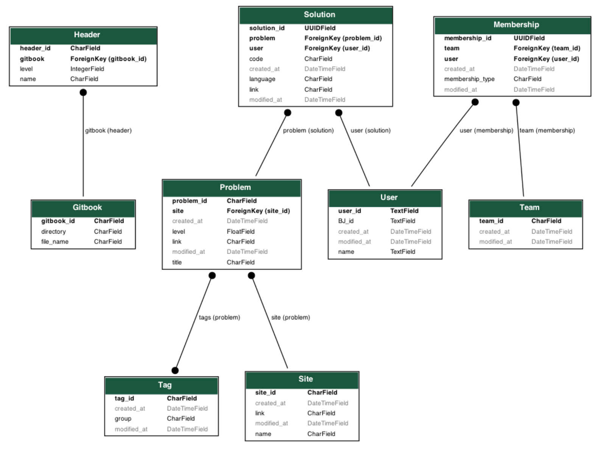

# Classroom API

## Diagram

## Django API usage

> Manage gitbook

* django-admin combine_markdown
* django-admin parse_gitbook

> Crawling

* django-admin crawl_problems
* django-admin crawl_solutions
