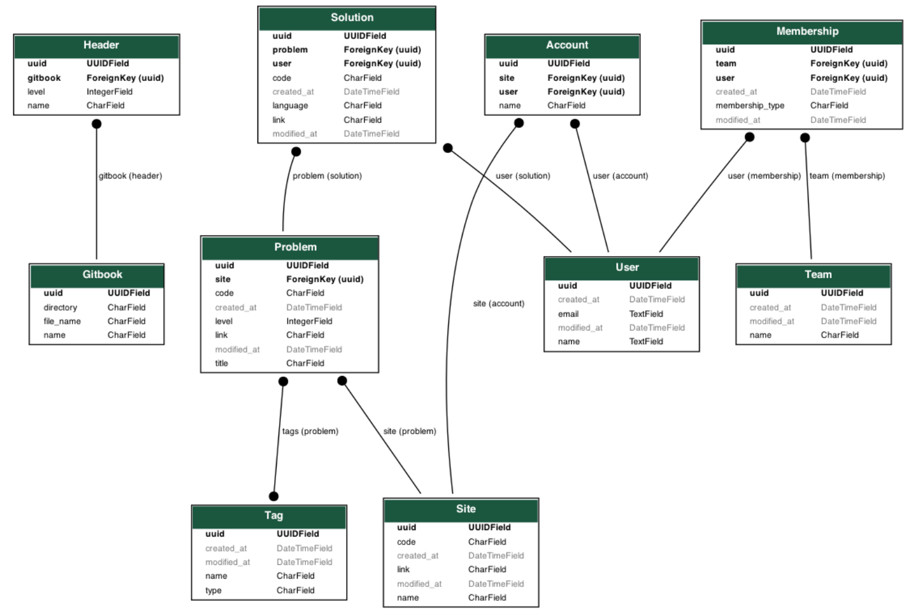

# README

* This is an API server for following gitbook
  * CS Note : https://seanhwangg.gitbook.io/note/
  * Interview Prep : https://seanhwangg.gitbook.io/interview/
## Diagram

* django-admin graph_models -a -g -o models.png

## Django API usage

> Manage gitbook

* django-admin combine_markdown
* django-admin parse_gitbook

> Crawling

* django-admin crawl_problems
* django-admin crawl_solutions

