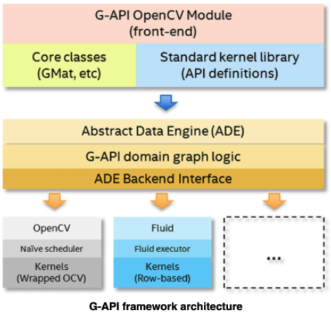
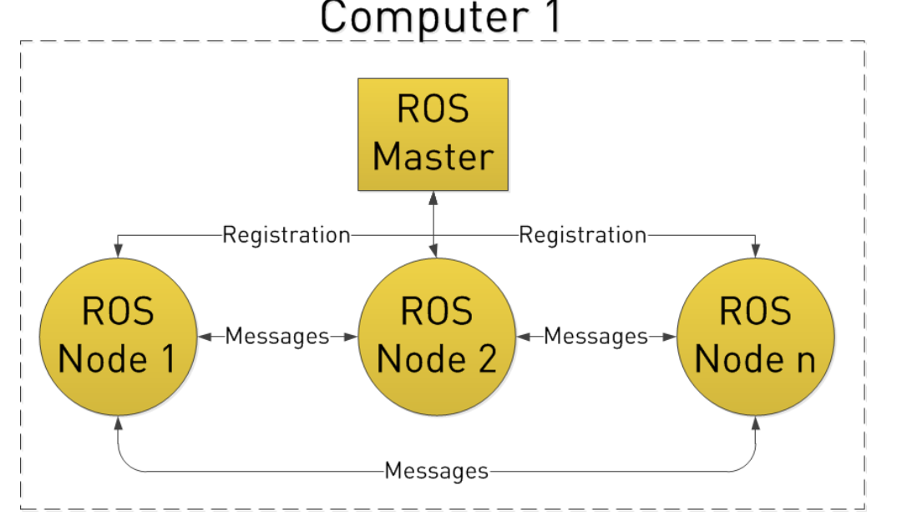
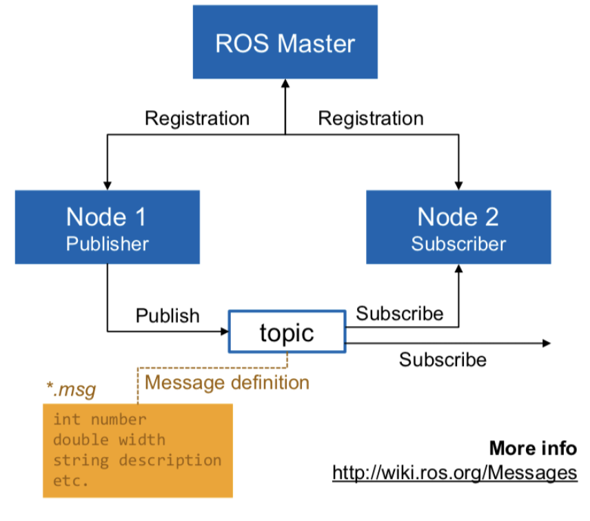

# Module

> Error

* Undefined behavior: the result of F() is a dangling reference

```cpp
function<const int&()> F([]{ return 42; });
int x = F();
```

## CLibrary

> cstdlib
> stdlib.h

* cstdlib contained in std::, so its preferred
* If ptr doesn’t point to a block of memory allocated with malloc, calloc, or realloc, undefined behavior
* free does not change the value of ptr itself, hence it still points to the same (now invalid) location

* atof() : string to double
* atoi() : string to integer
* atol() : string to long integer
* atoll() : string to long long integer
* strtod() : string to double
* strtof() : string to float
* strtol() : string to long integer
* strtold : string to long double
* strtoll : string to long long integer
* strtoul : string to unsigned long integer
* strtoull : string to unsigned long long integer
* rand : Generate random number
* srand : Initialize random number generator
* calloc() : Allocate and zero-initialize array
* free() : Deallocate memory block
* malloc() : Allocate memory block
  * sizeof(int) : allocate int pointer
* realloc() : Reallocate memory block
* srand (time(NULL)); : give new seed
* rand()%(max-min + 1) + min; : Generate number between a to b

> cstdio

* rename, remove() : Rename / Remove file
* tmpfile() : Open a temporary file
* tmpnam() : Generate temporary filename
* fopen() / fclose() : Open / Close file
* fflush() : Flush stream
* freopen() : Reopen stream with different file or mode
* setbuf() : Set stream buffer
* setvbuf() : Change stream buffering
* printf() : Write formatted data to stdout
  * %c %s : character string
  * %hd %d %ld %lld : short, int, long, long long
  * %f %lf : float, double
  * %e : Scientific notation (mantissa/exponent), lowercase
  * %x : hexadecimal
  * %+5d : show every sign
  * %(+)-5d : show only negative sign (blank in place of plus)
  * %3d : minimum width of three spaces      // minus : left-justified
  * %03d : zero fill
  * %.1f : Print one position after the decimal
  * %p : pointer address
  * %% : write % to the stream
  * printf(R"a(|\ :_/=\\__|)a"); : escape all
* fprintf() : Write formatted data to stream
* scanf() : fscanf()     // Read formatted data from stdin / stream
* snprintf() : sprintf() // Write formatted data to sized buffer / string
* sscanf() : Read formatted data from string
* vfprintf() : Write formatted data from variable argument list to stream
* vfscanf() : Read formatted data from stream into variable argument list
* vprintf() : Print formatted data from variable argument list to stdout
* vscanf() : Read formatted data into variable argument list
* vsnprintf() : Write formatted data from variable argument list to sized buffer
* vsprintf() : Write formatted data from variable argument list to string
* vsscanf() : Read formatted data from string into variable argument list
* fgetc() : Get character from stream
* fgets() : Get string from stream
* fputc() : Write character to stream
* puts() : fputs()       // Write string to stdout / stream
* getc() : Get character from stream
* getchar() : Get character from stdin
* gets() : Get string from stdin
* putc() : Write character to stream
* putchar() : Write character to stdout
* ungetc() : Unget character from stream
* fread : Read block of data from stream
* fwrite : Write block of data to stream

### Concurrency

> atomic




```cpp
#include <atomic>
#include <iostream>
#include <thread>

using namespace std;

void count_n_million() {
  atomic<int> counts(0);
  thread threads[3];

  for (int i = 0; i < 3; i++) {
    threads[i] = thread([&]() {
      for (int i = 0; i < 1000000; i++) counts += 1;
    });
  }
  for (int i = 0; i < 3; i++) threads[i].join();

  cout << "total counts \t" << counts.load() << "\n\n";
}
int main() { count_n_million(); }
```




> future




```cpp
#include <condition_variable>
#include <functional>
#include <future>
#include <iostream>
#include <mutex>
#include <queue>
#include <vector>

using namespace std;

bool is_prime(int n) {
  for (int i = 2; i < n; i++)
    if (n % i == 0) return true;
  return false;
}

void prime() {
  promise<void> p;
  future<bool> data = async(is_prime, 444444443);
  while (data.wait_for(chrono::milliseconds(100)) == future_status::timeout) cout << '>' << flush;
  cout << (data.get() ? "prime" : "Not prime") << "\n";
}
```




```cpp
int main() {
  auto work = [](promise<string> *p) { cout << "worked" << endl; };
  promise<string> p;
  future<string> data = p.get_future();
  thread t(work, &p);
  data.wait();

  cout << ": " << data.get() << endl;

  t.join();
}
```




```cpp
void runner(shared_future<void> *whistle) {
  whistle->get();
  cerr << "start!\n";
}

void main() {
  promise<void> p;
  shared_future<void> whistle = p.get_future();

  thread t1(runner, &whistle);
  thread t2(runner, &whistle);
  thread t3(runner, &whistle);
  thread t4(runner, &whistle);

  cerr << "ready...";
  this_thread::sleep_for(chrono::seconds(1));
  cerr << "go!\n";

  p.set_value();

  t1.join();
  t2.join();
  t3.join();
  t4.join();
}
```




> thread




```cpp
// g++ --std=c++11 merge_sort.cpp && ./a.out
#include <algorithm>
#include <chrono>
#include <cstdlib>
#include <thread>
#include <vector>

using namespace std;
void merge(int *array, int l, int m, int r) {
  int n_left = m - l + 1, n_right = r - m;
  int lefts[n_left], rights[n_right];

  copy(&array[l], &array[m + 1], lefts);
  copy(&array[m + 1], &array[r + 1], rights);

  int left_i = 0, right_i = 0, insert_i = l;

  while ((left_i < n_left) || (right_i < n_right)) {
    if (left_i < n_left && (right_i >= n_right || lefts[left_i] <= rights[right_i])) {
      array[insert_i] = lefts[left_i];
      left_i++;
    } else {
      array[insert_i] = rights[right_i];
      right_i++;
    }
    insert_i++;
  }
}
void sequential_merge_sort(int *array, int l, int r) {
  if (l < r) {
    int m = (l + r) / 2;
    sequential_merge_sort(array, l, m);
    sequential_merge_sort(array, m + 1, r);
    merge(array, l, m, r);
  }
}

void parallel_merge_sort(int *array, int l, int r, int depth = 0) {
  if (depth >= log(thread::hardware_concurrency()))
    sequential_merge_sort(array, l, r);
  else {
    int m = (l + r) / 2;
    thread left_thread = thread(parallel_merge_sort, array, l, m, depth + 1);
    parallel_merge_sort(array, m + 1, r, depth + 1);
    left_thread.join();
    merge(array, l, m, r);
  }
}

int main() {
  const int N = 10000;
  int original_array[N], sequential_result[N], parallel_result[N];
  for (int i = 0; i < N; i++) original_array[i] = rand();

  printf("Evaluating Sequential Implementation...\n");
  chrono::duration<double> sequential_ns(0);
  for (int eval = 0; eval < 10; eval++) {
    copy(&original_array[0], &original_array[N - 1], sequential_result);
    auto start_time = chrono::high_resolution_clock::now();
    sequential_merge_sort(sequential_result, 0, N - 1);
    sequential_ns += (chrono::high_resolution_clock::now() - start_time) / 10.0;
  }

  printf("Evaluating Parallel Implementation...\n");
  chrono::duration<double> parallel_ns(0);
  for (int eval = 0; eval < 10; eval++) {
    copy(&original_array[0], &original_array[N - 1], parallel_result);
    auto start_time = chrono::high_resolution_clock::now();
    parallel_merge_sort(parallel_result, 0, N - 1);
    parallel_ns += (chrono::high_resolution_clock::now() - start_time) / 10.0;
  }

  printf("Average Sequential Time: %.2f ms\n", sequential_ns.count() * 1000);
  printf("Average Parallel Time: %.2f ms\n", parallel_ns.count() * 1000);
  printf("Speedup: %.2f\n", sequential_ns / parallel_ns);
  printf("Efficiency %.2f%%\n", 100 * (sequential_ns / parallel_ns) / thread::hardware_concurrency());
}
```




> mutex




```cpp
struct Counter {
  int value;
  Counter() : value(0){}
  void increment(){
    // 1st Method
    lock_guard<mutex> guard(mu);
    ++value;

    // 2nd Method : bad when exception is thrown between
    mutex.lock();
    ++value;
    mutex.unlock();
  }
};

int main(){
  Counter counter;

  vector<thread> threads;
  for(int i = 0; i < 5; ++i){
    threads.push_back(thread([&counter](){
      for(int i = 0; i < 100; ++i){ counter.increment(); }
    }));
  }
  for(auto& thread : threads) thread.join();
  cout << counter.value << endl;
  return 0;
}
```




```cpp
#include <iostream>
#include <mutex>
#include <queue>
#include <thread>
using namespace std;

void count_n_million(bool with_lock) {
  mutex count_lock;
  once_flag flag;
  int counts = 0;
  thread threads[3];

  for (int i = 0; i < 3; i++) {
    threads[i] = thread([&]() {
      call_once(flag, []() { cout << "Starting count \n"; });
      if (with_lock) count_lock.lock();
      for (int i = 0; i < 1000000; i++) counts += 1;

      if (with_lock) count_lock.unlock();
    });
  }
  for (int i = 0; i < 3; i++) threads[i].join();

  cout << "total counts \t" << counts << "\n\n";
}
```




```cpp
void count_sec() {
  mutex cout_lock;
  bool running = true;

  auto yell = [&](const char *name) {
    unsigned int count = 0;
    cout_lock.lock();
    cout << "yell thread \t" << this_thread::get_id() << "\n";
    cout_lock.unlock();
    while (running) {
      count++;
    }
    cout_lock.lock();
    cout << "Total Counting \t" << count << "\n";
    cout_lock.unlock();
  };

  auto counter = [&]() {
    cout_lock.lock();
    cout << "counter thread \t" << this_thread::get_id() << "\n";
    cout_lock.unlock();
    this_thread::sleep_for(chrono::seconds(1));
    running = false;
  };
  thread watch(counter);
  thread person(yell, "sean");
  watch.detach();
  person.join();
  cout << endl;
}
```




> pthread

* Thread is joinable by default in pthread library




```cpp
#include <pthread.h>
#include <stdio.h>
#include <stdlib.h>
#include <unistd.h>

// 1.
int whos_better;
void* f1(void* arg){
  whos_better = 1;
  while(1)
    printf("Thread 1 thinks thread %d is better.\n", whos_better);
  return NULL;
}

void* f2(void* arg){
  whos_better = 2;
  while(1)
    printf("Thread 2 thinks thread %d is better.\n", whos_better);
  return NULL;
}

int main(int argc, char **argv) {
  pthread_t th1, th2;
  pthread_create(&th1, NULL, f1, NULL);
  pthread_create(&th2, NULL, f2, NULL);
  pthread_join(th1, NULL);
  pthread_join(th2, NULL);
  pthread_exit(NULL);
}

// Thread 1 thinks thread 2 is better.
// Thread 1 thinks thread 2 is better.
// Thread 2 thinks thread 2 is better.
// Thread 2 thinks thread 2 is better.  Agrees on what is better




```cpp
char* msg;

void* thread_proc(void* arg){
  usleep(3000);
  msg = "A message from the created thread\n";
  return NULL;
}

int main(int argc, char **argv) {
  pthread_t thread;
  msg = NULL;
  pthread_create(&thread, NULL, thread_proc, NULL);
  printf("%s", msg);
  return 0;
}
```




### Time

> chrono




```cpp
this_thread::sleep_for(milliseconds(x));  // Pause
```




```cpp
#include <iostream>
#include <chrono>
#include <ctime>

int main() {
  std::time_t end_time = std::chrono::system_clock::to_time_t(std::chrono::system_clock::now());
  std::cout << std::ctime(&end_time); // Mon Oct  2 00:59:08 2017
}
```




```cpp
#include <chrono>
#include <iostream>
#include <thread>

using namespace std;
using namespace std::chrono;

int main() {
  auto start_time = system_clock::to_time_t(system_clock::now());
  cout << start_time << endl;  // 1606398149
  this_thread::sleep_for(chrono::seconds(1));
  auto end_time = system_clock::to_time_t(system_clock::now());
  cout << end_time - start_time << " second passed" << endl;  // 1 second passed

  auto start = std::chrono::high_resolution_clock::now();
  this_thread::sleep_for(chrono::seconds(1));
  auto finish = std::chrono::high_resolution_clock::now();
  std::cout << duration_cast<milliseconds>(finish - start).count() << "ms\n";  // 1001ms
}
```




### Util

> algorithm

* InputIterator find (InputIterator first, InputIterator last, const T& val);
* bool is_sorted(ForwardIterator first, ForwardIterator last, Compare comp);




```cpp
#include <algorithm>
#include <vector>

using namepsace std;

int main(){
  // search for sublist
  search(seq.begin(), seq.end(), sublist.begin(), sublist.end());

  // filter divisor
  copy_if(vec.begin(), vec.end(), back_inserter(new), [div](int x) { return (x % div) == 0; });
  str2.erase(remove_if(str2.begin(), str2.end(), [](unsigned char x){return std::isspace(x);})

  // fill
  void fill (ForwardIterator first, ForwardIterator last, const T& val)
  char flags[26][80];
  fill(&flags[0][0], &flags[0][0] + sizeof(flags) / sizeof(flags[0][0]), 0 );      // fill 2d array

  // count
  int myints[] = {10,20,30,30,20,10,10,20};   // 8 elements
  cout << "10 appears " << count (myints, myints+8, 10) << " times.\n";

  // custom sort using map
  stable_sort(arr1.begin(), arr1.begin() + N,
    [&m](int a, int b){
      if (m[a] == m[b])
        return a < b;
      return m[a] < m[b];
    }
  );

  // Binary Search in sorted array
  // returns an iterator pointing to the first in the range [first,last) which does not compare less than val
  // If all the elements in the range compare less than val, the function returns las
  vector<int> v{ 10, 20, 30, 40, 50 };
  lower_bound(v.begin(), v.end(), 10); // 0
}
```




> numeric

* accumulate() : Accumulate values in range
* adjacent_difference() : Compute adjacent difference of range
* inner_product() : Compute cumulative inner product of range
* partial_sum() : Compute partial sums of range
* iota(ForwardIt first, ForwardIt last, T value) : Store increasing sequence




```cpp
#include <numeric>
using namespace std;

int main() {
  vector<vector<int>> m = {{0, 1}, {2, 3}};
  auto sum = accumulate(m.cbegin(), m.cend(), 0, [](auto lhs, const auto& rhs) {
    return accumulate(rhs.cbegin(), rhs.cend(), lhs);
  });

  vector<int> nums(5);
  iota(nums.begin(), nums.end(), 1);
  int sum = accumulate(nums.begin(), nums.end(), 0, [](int total, int current) {
    return total + current;
  });
}
```




> utility

* swap()
* make_pair()
* forward()
* move_if_noexcept()
* decival()

* types
  * pair
  * piecewise_construct_t

* namespace
  * rel_ops




```cpp
#include <iostream>
#include <utility>
using namespace std;

int main() {
  string v1[5] = {"one", "two", "three", "four", "five"};
  string v2[5];

  for_each(begin(v1), end(v1), [](const string &s) { cout << s << " "; });
  cout << endl;
  move(begin(v1), end(v1), v2);
  for_each(begin(v1), end(v1), [](const string &s) { cout << s << " "; });
  cout << endl;
  for_each(begin(v2), end(v2), [](const string &s) { cout << s << " "; });
}
```




> type_traits




```cpp
#include <iostream>
#include <type_traits>

using namespace std;

template <typename T>
void show_value(T t) {
  if constexpr (is_pointer<T>::value) { // std::is_pointer_t<T>
    cout << "Pointer " << *t << endl;
  } else {
    cout << "Not Pointer " << t << endl;
  }
}

int main() {
  int x = 3;
  show_value(x);

  int *p = &x;
  show_value(p);
}
```




> functional




```cpp
#include <functional>
using namespace std;

struct Foo {
  Foo(int num) : num_(num) {}
  void print_add(int i) const { std::cout << num_+i << '\n'; }
  int num_;
};

void print_num(int i) {
  std::cout << i << '\n';
}

struct PrintNum {
  void operator()(int i) const {
    std::cout << i << '\n';
  }
};

int main()
{
  // store a free function
  std::function<void(int)> f_display = print_num;
  f_display(-9);

  // store a lambda
  std::function<void()> f_display_42 = []() { print_num(42); };
  f_display_42();

  // store the result of a call to std::bind
  std::function<void()> f_display_31337 = std::bind(print_num, 31337);
  f_display_31337();

  // store a call to a member function
  std::function<void(const Foo&, int)> f_add_display = &Foo::print_add;
  const Foo foo(314159);
  f_add_display(foo, 1);
  f_add_display(314159, 1);

  // store a call to a data member accessor
  std::function<int(Foo const&)> f_num = &Foo::num_;
  std::cout << "num_: " << f_num(foo) << '\n';

  // store a call to a member function and object
  using std::placeholders::_1;
  std::function<void(int)> f_add_display2 = std::bind( &Foo::print_add, foo, _1 );
  f_add_display2(2);

  // store a call to a member function and object ptr
  std::function<void(int)> f_add_display3 = std::bind( &Foo::print_add, &foo, _1 );
  f_add_display3(3);

  // store a call to a function object
  std::function<void(int)> f_display_obj = PrintNum();
  f_display_obj(18);
}
```




> unistd.h




```cpp
char cwd[1024];
getcwd(cwd, sizeof(cwd));
printf("Current working dir: %s\n", cwd);
```




> variant




```cpp
#include <iostream>
#include <memory>
#include <variant>

using namespace std;

class A {
 public:
  void a() { cout << "I am A" << endl; }
};

class B {
 public:
  void b() { cout << "I am B" << endl; }
};

variant<A, B> GetDataFromDB(bool is_a) {
  if (is_a) {
    return A();
  }
  return B();
}

int main() {
  auto v = GetDataFromDB(true);

  cout << v.index() << endl;  // 0
  get<A>(v).a();              // I am A  // same as get<0>(v).a()
}
```




> gnome

* g_print("%s", ...);
  * print

* g_strdup_printf("%s", line);
  * Similar to the standard C sprintf() function but safer
  * calculates the maximum space required and allocates memory to hold the result
  * returned string should be freed with g_free() when no longer needed.
  * The returned string is guaranteed to be non-NULL

### Test

> gtest

* test fixtures allows for common setup and teardown between tests (::testing::Test)

* ASSERT_TRUE : break test if not true
* EXPECT_TRUE
* EXPENCT_EQ/NE/LT/LE/GT(A, B); # A and B should be same

## Util

### CLI

> gflags




```cpp
#include <gflags/gflags.h>

#include <iostream>

using namespace std;

DEFINE_bool(debug, true, "print debug info");
// DEFINE_string(languages, "english,french,german", "comma-separated list of languages to offer in the 'lang' menu");

int main() { cout << FLAGS_debug; }
```




### Time

> random




```cpp
#include <random>
#include <vector>

using namespace std;

int main() {
  vector<int> v(10);
  generate(v.begin(), v.end(), rand);          // create vector
}
```




## ML

### Media

> Open CV

* command

```sh
g++ 00_video.cpp `pkg-config --cflags --libs opencv4`
```

* Mat
  * CV_64FC1 is simple grayscale image
  * C : number of channels in the matrix

|        | C1  | C2  | C3  | C4  | C(5) | C(6) | C(7) | C(8) |
| ------ | --- | --- | --- | --- | ---- | ---- | ---- | ---- |
| CV_8U  | 0   | 8   | 16  | 24  | 32   | 40   | 48   | 56   |
| CV_8S  | 1   | 9   | 17  | 25  | 33   | 41   | 49   | 57   |
| CV_16U | 2   | 10  | 18  | 26  | 34   | 42   | 50   | 58   |
| CV_16S | 3   | 11  | 19  | 27  | 35   | 43   | 51   | 59   |
| CV_32S | 4   | 12  | 20  | 28  | 36   | 44   | 52   | 60   |
| CV_32F | 5   | 13  | 21  | 29  | 37   | 45   | 53   | 61   |
| CV_64F | 6   | 14  | 22  | 30  | 38   | 46   | 54   | 62   |


* Mat(Size size, int type) : Size can be int rows, int cols
* Mat(Size size, int type, const Scalar& s) : initialize each matrix element with
* Mat::eye(4, 4, CV_64F);
* Mat::ones(2, 2, CV_32F);
* Mat::zeros(3,3, CV_8UC1);
* format(R, Formatter::FMT) : print in format in cout << (FMT_PYTHON / FMT_CSV)
* rows : cols               // show n rows, cols
* type() : show type




```cpp
#include <iostream>
#include <map>

#include "opencv2/highgui/highgui.hpp"
#include "opencv2/imgproc/imgproc.hpp"

using namespace std;
using namespace cv;

int main() {
  Mat img(Size(2, 3), CV_64FC1);  // Greyscale image
  img.setTo(cv::Scalar(100.0));   // fill all with 255
  img.at<double>(1, 1) = 255.5;
  Mat row = img.row(1);  // [100, 255]

  double min, max;
  Point min_loc, max_loc;
  minMaxLoc(img, &min, &max, &min_loc, &max_loc);
  cout << max_loc;  // [1, 1]

  cout << img.reshape(img.rows * img.cols, 1);  // [6, 1]

  struct ComparePoints {
      bool operator () (const cv::Point& a, const cv::Point& b) const {
          return (a.x < b.x) || (a.x == b.x && a.y < b.y);
      }
  };
  map<cv::Point, int, ComparePoints> point2count;
  point2count[min_loc]++;
}
```




```cpp
#include <stdio.h>

#include <iostream>
#include <string>

#include "opencv2/highgui/highgui.hpp"
#include "opencv2/imgproc/imgproc.hpp"

using namespace std;
using namespace cv;

Mat img, templ, result;
string ORIG_WINDOW_NAME = "Source Image", RESULT_WINDOW_NAME = "Result window";

int match_method;
int max_Trackbar = 5;

void MatchingMethod(int, void *);

int main() {
  img = imread("/Users/sean/github/LEARN_C/opencv/data/mario.png", 1);
  templ = imread("/Users/sean/github/LEARN_C/opencv/data/coin.png", 1);

  namedWindow(ORIG_WINDOW_NAME, WINDOW_AUTOSIZE);
  namedWindow(RESULT_WINDOW_NAME, WINDOW_AUTOSIZE);

  string trackbar_label =
      "Method: \n 0: SQDIFF \n 1: SQDIFF NORM \n 2: TM CCORR \n 3: TM CCORR NORM \n 4: TM COEFF \n 5: TM COEFF NORM";
  createTrackbar(trackbar_label, ORIG_WINDOW_NAME, &match_method, max_Trackbar, MatchingMethod);

  MatchingMethod(0, 0);

  waitKey(0);
  return 0;
}

void MatchingMethod(int, void *) {
  Mat orig;
  img.copyTo(orig);

  result.create(img.cols - templ.cols + 1, img.rows - templ.rows + 1, CV_32FC1);

  matchTemplate(img, templ, result, match_method);
  normalize(result, result, 0, 1, NORM_MINMAX, -1, Mat());

  double minVal, maxVal;
  Point minLoc, maxLoc, matchLoc;

  minMaxLoc(result, &minVal, &maxVal, &minLoc, &maxLoc, Mat());

  if (match_method == TM_SQDIFF || match_method == TM_SQDIFF_NORMED)
    matchLoc = minLoc;
  else
    matchLoc = maxLoc;

  rectangle(orig, matchLoc, Point(matchLoc.x + templ.cols, matchLoc.y + templ.rows), Scalar::all(0), 2, 8, 0);
  rectangle(result, matchLoc, Point(matchLoc.x + templ.cols, matchLoc.y + templ.rows), Scalar::all(0), 2, 8, 0);

  imshow(ORIG_WINDOW_NAME, orig);
  imshow(RESULT_WINDOW_NAME, result);

  return;
}
```




```cpp
#include <opencv2/opencv.hpp>

using namespace cv;
using namespace std;

int main() {
  Mat frame = imread("lena.png"), gray, hsv, yCrCb, luv, bgra;
  imshow("frame", frame);
  cvtColor(frame, gray, COLOR_BGR2GRAY);
  imshow("gray", gray);
  cvtColor(frame, bgra, COLOR_BGR2BGRA);
  imshow("gray", bgra);
  waitKey();
}
```




```cpp
#include <iostream>
#include <string>

#include "opencv2/highgui.hpp"
#include "opencv2/imgproc.hpp"

int main() {
  VideoCapture cap(0);
  if (!cap.isOpened()) return -1;

  namedWindow("Video", 1);
  while (true) {
    Mat frame;
    cap >> frame;
    imshow("Video", frame);
    if (waitKey(30) >= 0) break;
  }
  return 0;
}
```




```cpp
#include <iostream>

#include "opencv2/opencv.hpp"

using namespace cv;
using namespace std;

int main() {
  cout << "Built with OpenCV " << CV_VERSION << endl;
  Mat image;
  Mat src;
  VideoCapture capture;
  capture.open(0);
  capture >> src;
  bool isColor = (src.type() == CV_8UC3);
  VideoWriter writer;
  int codec = VideoWriter::fourcc('M', 'P', '4', 'V');
  double fps = 15.0;
  string filename = "live.mp4";
  Size sizeFrame(640, 480);
  writer.open(filename, codec, fps, sizeFrame, isColor);
  cout << "Started writing video... " << endl;
  for (int i = 0; i < 60; i++) {
    capture >> image;
    Mat xframe;
    resize(image, xframe, sizeFrame);
    writer.write(xframe);
    imshow("Sample", image);
    char c = (char)waitKey(1);
    if (c == 27) break;
  }
  cout << "Write complete !" << endl;
  capture.release();
  writer.release();
  return 0;
}
```




```cpp
#include <chrono>
#include <iostream>

#include "opencv2/highgui/highgui.hpp"
#include "opencv2/imgproc/imgproc.hpp"

using namespace cv;
using namespace std;
using namespace std::chrono;

class Parallel_process : public cv::ParallelLoopBody {
 private:
  cv::Mat img;
  cv::Mat &retVal;
  int size;
  int n_thread;

 public:
  Parallel_process(cv::Mat inputImgage, cv::Mat &outImage, int size, int n_thread)
      : img(inputImgage), retVal(outImage), size(size), n_thread(n_thread) {}

  virtual void operator()(const cv::Range &range) const {
    for (int i = range.start; i < range.end; i++) {
      cv::Mat in(img, cv::Rect(0, (img.rows / n_thread) * i, img.cols, img.rows / n_thread));
      cv::Mat out(retVal, cv::Rect(0, (retVal.rows / n_thread) * i, retVal.cols, retVal.rows / n_thread));

      cv::medianBlur(in, out, size);
    }
  }
};

int main() {
  VideoCapture cap(0);

  cv::Mat img, out;

  for (int n_thead = 1; n_thead < 100; n_thead++) {
    auto start1 = high_resolution_clock::now();
    for (int i = 0; i < 1000; i++) {
      cap.read(img);
      out = cv::Mat::zeros(img.size(), CV_8UC3);

      cv::parallel_for_(cv::Range(0, 8), Parallel_process(img, out, 31, 10));

      cv::imshow("blur", out);
      cv::waitKey(1);
    }
    auto stop1 = high_resolution_clock::now();
    auto duration1 = duration_cast<microseconds>(stop1 - start1);
    cout << "TBB Time: " << duration1.count() / 1000 << "ms" << endl;
  }

  return 0;
}
```




```cpp
#include <opencv2/core/ocl.hpp>
#include <opencv2/opencv.hpp>
#include <opencv2/tracking.hpp>

using namespace cv;
using namespace std;

#define SSTR(x) (ostringstream() << std::dec << x).str()

int main(int argc, char **argv) {
  string trackerTypes[8] = {"BOOSTING",   "MIL",    "KCF",   "TLD",
                            "MEDIANFLOW", "GOTURN", "MOSSE", "CSRT"};  // tracker types in 3.4.1
  string trackerType = trackerTypes[2];
  Ptr<Tracker> tracker;

  if (trackerType == "BOOSTING") tracker = TrackerBoosting::create();
  if (trackerType == "MIL") tracker = TrackerMIL::create();
  if (trackerType == "KCF") tracker = TrackerKCF::create();
  if (trackerType == "TLD") tracker = TrackerTLD::create();
  if (trackerType == "MEDIANFLOW") tracker = TrackerMedianFlow::create();
  if (trackerType == "GOTURN") tracker = TrackerGOTURN::create();
  if (trackerType == "MOSSE") tracker = TrackerMOSSE::create();
  if (trackerType == "CSRT") tracker = TrackerCSRT::create();
  VideoCapture video(0);

  if (!video.isOpened()) {
    cout << "Could not read video file" << endl;
    return 1;
  }

  Mat frame;
  bool ok = video.read(frame);

  Rect2d bbox(500, 100, 300, 320);

  // Uncomment the line below to select a different bounding box
  // bbox = selectROI(frame, false);
  rectangle(frame, bbox, Scalar(255, 0, 0), 2, 1);

  imshow("Tracking", frame);
  tracker->init(frame, bbox);

  while (video.read(frame)) {
    double timer = (double)getTickCount();
    bool ok = tracker->update(frame, bbox);
    float fps = getTickFrequency() / ((double)getTickCount() - timer);
    if (ok)
      rectangle(frame, bbox, Scalar(255, 0, 0), 2, 1);
    else
      putText(frame, "Tracking failure detected", Point(100, 80), FONT_HERSHEY_SIMPLEX, 0.75, Scalar(0, 0, 255), 2);

    putText(frame, trackerType + " Tracker", Point(100, 20), FONT_HERSHEY_SIMPLEX, 0.75, Scalar(50, 170, 50), 2);
    putText(frame, "FPS : " + SSTR(fps), Point(100, 50), FONT_HERSHEY_SIMPLEX, 0.75, Scalar(50, 170, 50), 2);
    imshow("Tracking", frame);

    int k = waitKey(1);
    if (k == 27) break;
  }
}
```




* Tictactoe




```cpp
#include <iostream>
#include <string>

#include "tictactoe.hpp"

int main() {
  TicTacToe game(1000);
  game.start();
}
```




```sh
cmake_minimum_required(VERSION 3.0.0)
project(tictactoe)

find_package( OpenCV REQUIRED )

add_executable(main main.cpp)
include_directories(.)

set(LIBS ${OpenCV_LIBS})
target_link_libraries( main ${LIBS} )
```




```cpp
#pragma once

#include <functional>
#include <map>
#include <string>

#include "opencv2/highgui.hpp"
#include "opencv2/imgproc.hpp"

using namespace cv;
using namespace std;

function<void(int event, int r, int c)> callback;

class Board {
 public:
  static void onMouseClick(int event, int r, int c, int flags, void *) { callback(event, r, c); }

  int grid[3][3] = {{0, 0, 0}, {0, 0, 0}, {0, 0, 0}};
  int SIZE;
  Mat board;

  Board(int SIZE) : SIZE(SIZE) {
    namedWindow("board");
    board = Mat::zeros(SIZE, SIZE, CV_8UC3);
    setMouseCallback("board", onMouseClick, &board);

    line(board, Point(0, SIZE / 3), Point(SIZE, SIZE / 3), LINE_CLR, 2);
    line(board, Point(0, SIZE * 2 / 3), Point(SIZE, SIZE * 2 / 3), LINE_CLR, 2);
    line(board, Point(SIZE / 3, 0), Point(SIZE / 3, SIZE), LINE_CLR, 2);
    line(board, Point(SIZE * 2 / 3, 0), Point(SIZE * 2 / 3, SIZE), LINE_CLR, 2);
  }

  void draw(string message) {
    for (int r = 0; r < 3; r++)
      for (int c = 0; c < 3; c++) {
        if (grid[r][c] == 1)
          circle(board, Point(SIZE * r / 3 + SIZE / 6, SIZE * c / 3 + SIZE / 6), SIZE / 6, Scalar(255, 0, 0), -1);
        else if (grid[r][c] == 2)
          circle(board, Point(SIZE * r / 3 + SIZE / 6, SIZE * c / 3 + SIZE / 6), SIZE / 6, Scalar(0, 255, 0), -1);
      }

    putText(board, message, Point(SIZE / 2, SIZE / 2), 2, 2, TEXT_CLR);
    imshow("board", board);
  }

 private:
  const Scalar BG_CLR = Scalar(0, 0, 0);
  const Scalar TEXT_CLR = Scalar(255, 255, 255);
  const Scalar LINE_CLR = Scalar(255, 255, 255);
};
```




```cpp
#pragma once

#include <iostream>
#include <map>
#include <string>

#include "board.hpp"

static int BOARD_SIZE = 500;
static Board board = Board(BOARD_SIZE);
enum class Status {
  ENDED = -1,
  PROGRESS = 0,
  WIN_1 = 1,
  WIN_2 = 2,
  DRAW = 3,
};

class TicTacToe {
 public:
  TicTacToe(Board board) : board(board) {
    callback = [&](int event, int r, int c) {
      if (event == EVENT_LBUTTONDOWN)
        if (move(r * 3 / board.SIZE, c * 3 / board.SIZE)) {
          updateStatus();
          turn++;
        }
    };
    status2message = {
        {Status::ENDED, "Aborted"},      {Status::PROGRESS, ""}, {Status::WIN_1, "Player 1 won"},
        {Status::WIN_2, "Player 2 won"}, {Status::DRAW, "Draw"},
    };
  }

  bool move(int row, int col) {
    if (board.grid[row][col] != 0) return false;
    board.grid[row][col] = turn % 2 + 1;
    return true;
  }

  void updateStatus() {
    for (int i = 0; i < 3; i++) {
      int row_count = 0, col_count = 0, ld_count = 0, rd_count = 0;
      for (int j = 0; j < 3; j++) {
        if (board.grid[i][j] == (turn % 2 + 1)) row_count++;
        if (board.grid[j][i] == (turn % 2 + 1)) col_count++;
        if (board.grid[j][j] == (turn % 2 + 1)) ld_count++;
        if (board.grid[2 - j][j] == (turn % 2 + 1)) rd_count++;
      }
      if (row_count == 3 || col_count == 3 || ld_count == 3 || rd_count == 3) {
        status = turn % 2 == 0 ? Status::WIN_1 : Status::WIN_2;
        return;
      }
    }

    for (int i = 0; i < 3; i++)
      for (int j = 0; j < 3; j++)
        if (board.grid[i][j] == 0) {
          status = Status::PROGRESS;
          return;
        }

    status = Status::DRAW;
  }

  void start() {
    turn = 0;
    status = Status::PROGRESS;
    while (status == Status::PROGRESS) {
      int key = waitKey(100);
      if (key == 'q') status = Status::ENDED;
      board.draw(status2message[status]);
    }
    waitKey(-1);
  }

 private:
  int turn;
  Status status;
  Board board;
  map<Status, string> status2message;
};
```







```sh
cmake_minimum_required(VERSION 3.0.0)
project(2048 CXX)

find_package(OpenCV REQUIRED)

add_executable( 2048 2048.cpp )

set(LIBS ${OpenCV_LIBS})
target_link_libraries( 2048 ${LIBS} )
```




```cpp
#include <algorithm>
#include <vector>

#include "board.h"

using namespace std;

enum class Status { GAMEOVER = -1, PROGRESS = 0 };

static int GSIZE = 4, WSIZE = 500;
static Board board = Board(WSIZE, GSIZE);

Status check_game_status() {
  for (int row = 0; row < GSIZE; row++)
    if (find(board.G[row].begin(), board.G[row].end(), 0) != board.G[row].end()) return Status::PROGRESS;
  return Status::GAMEOVER;
}

void addNewNumber() {
  int row, col;
  do {
    row = rand() % GSIZE;
    col = rand() % GSIZE;
  } while (board.G[row][col] != 0);
  board.G[row][col] = 2;
}

void push_left() {
  for (int j = 0; j < GSIZE; j++) {
    vector<int> old_line = board.G[j];
    vector<int> nonempty, new_line;
    copy_if(old_line.begin(), old_line.end(), back_inserter(nonempty), [](int &value) { return value != 0; });

    bool check;
    for (int number : nonempty) {
      if (check || new_line.empty() || *new_line.rbegin() != number) {
        new_line.push_back(number);
        check = false;
      } else {
        *new_line.rbegin() += number;
        check = true;
      }
    }
    new_line.resize(4, 0);
    board.G[j] = new_line;
  }
}

void rotateCW(vector<vector<int>> &mat, int times) {
  for (int i = 0; i < times; i++)
    for (int x = 0; x < GSIZE / 2; x++)
      for (int y = x; y < GSIZE - x - 1; y++) {
        int temp = mat[x][y];
        mat[x][y] = mat[GSIZE - 1 - y][x];
        mat[GSIZE - 1 - y][x] = mat[GSIZE - 1 - x][GSIZE - 1 - y];
        mat[GSIZE - 1 - x][GSIZE - 1 - y] = mat[y][GSIZE - 1 - x];
        mat[y][GSIZE - 1 - x] = temp;
      }
}

int main() {
  addNewNumber();
  while (check_game_status() == Status::PROGRESS) {
    vector<vector<int>> prev_board = board.G;
    char pressed_key = waitKey(50);
    switch (pressed_key) {
      case 'w':
        rotateCW(board.G, 3);
        push_left();
        rotateCW(board.G, 1);
        break;
      case 's':
        rotateCW(board.G, 1);
        push_left();
        rotateCW(board.G, 3);
        break;
      case 'a':
        push_left();
        break;
      case 'd':
        rotateCW(board.G, 2);
        push_left();
        rotateCW(board.G, 2);
        break;
      case 'q':
        return -1;
      default:
        break;
    }

    if (prev_board != board.G) {
      addNewNumber();
    }
    board.draw();
  }
  return 0;
}
```




```cpp
#include <iostream>
#include <opencv2/highgui.hpp>
#include <opencv2/imgproc.hpp>
#include <string>

using namespace std;
using namespace cv;

enum class Status;
const Scalar BG_CLR = Scalar(0, 0, 0);
const Scalar LINE_CLR = Scalar(255, 255, 255);
const Scalar TEXT_CLR = Scalar(255, 255, 255);

class Board {
 public:
  vector<vector<int>> G;

  Board(int WSIZE, int GSIZE) : WSIZE(WSIZE), GSIZE(GSIZE) {
    namedWindow("board");
    G.resize(GSIZE, vector<int>(GSIZE, 0));
    board = Mat::zeros(WSIZE, WSIZE, CV_8UC3);
  }

  void draw() {
    board = Mat::zeros(WSIZE, WSIZE, CV_8UC3);
    for (int gridNum = 1; gridNum < GSIZE; gridNum++) {
      line(board, Point(0, WSIZE * gridNum / GSIZE), Point(WSIZE, WSIZE * gridNum / GSIZE), LINE_CLR, 2);
      line(board, Point(WSIZE * gridNum / GSIZE, 0), Point(WSIZE * gridNum / GSIZE, WSIZE), LINE_CLR, 2);
    }
    for (int row = 0; row < GSIZE; row++) {
      for (int col = 0; col < GSIZE; col++) {
        if (G[row][col] != 0)
          putText(board, to_string(G[row][col]),
                  Point(col * (WSIZE / GSIZE) + 50 - (to_string(G[row][col]).length() - 1) * 12, row * (WSIZE / GSIZE) + 80), 2,
                  2 - 0.2 * to_string(G[row][col]).length(), TEXT_CLR);
      }
    }
    imshow("board", board);
  }

 private:
  Mat board;
  int GSIZE, WSIZE;
};
```




> gapi

* Data objects do not hold actual data, only capture dependencies
* Operations consume and produce data objects.

```cpp
cv::Mat     // cv::GMat / cv::GMatDesc
vector<Obj> // cv::GArray / cv::GArrayDesc

G_API_NET(Class, API, Tag)
G_API_OP(Class, Function, Name)
G_TYPED_KERNEL
```




```cpp
// terminate called after throwing an instance of 'std::logic_error'
//   what():  Computation's output protocol doesn't match actual arguments!
// Aborted (core dumped)
// -> output format doesn't match in exec
cv::GComputation comp([ot]() {
  cv::GMat in_frame;
  cv::GMat detections = cv::gapi::infer<custom::Objects>(in_frame);
  cv::GArray<pz::DetectedObject> detected_objects = custom::Yolov2PostProc::on(detections, in_frame, in_is_tiny);
  cv::GArray<vas::ot::Object> tracked_objects = custom::vas_ot::on(ot, in_frame, detected_objects);
  cv::GMat out_frame = cv::gapi::copy(in_frame);
  return cv::GComputation(cv::GIn(in_frame, in_is_tiny), cv::GOut(out_frame, tracked_objects));
});
auto exec = comp.compile(cv::descr_of(in_frame), cv::descr_of(is_tiny), cv::compile_args(kernels, networks));
exec(cv::gin(in_frame), cv::gout(out_frame));

// what():  OpenCV(4.3.0-openvino-2020.3.0) ~/intel/openvino/opencv/include/opencv2/gapi/garray.hpp:227:
// error: (-215:Assertion failed) sizeof(T) == m_ref->m_elemSize in function 'check'
// -> output format doesn't match
cv::GComputation comp([ot]() {
  cv::GMat in_frame;
  cv::GArray<vas::ot::Object> tracked_objects = custom::vas_ot::on(ot, in_frame, detected_objects);
  return cv::GComputation(cv::GIn(in_frame, in_is_tiny), cv::GOut(out_frame, tracked_objects));
});
auto exec = comp.compile(cv::descr_of(in_frame), cv::descr_of(is_tiny), cv::compile_args(kernels, networks));
std::vector<int> ints;
exec(cv::gin(in_frame), cv::gout(out_frame, ints));

// terminate called after throwing an instance of 'std::logic_error'
//  what():  Computation output 2 is not a result of any operation
// Aborted (core dumped)
// -> output foramt doesn't match
```




```cpp
#include "opencv2/gapi.hpp"
#include "opencv2/gapi/core.hpp"
#include "opencv2/gapi/imgproc.hpp"
#include "opencv2/highgui.hpp"
#include "opencv2/videoio.hpp"

using namespace std;

int main(int argc, char* argv[]) {
  /* without compile
  cv::VideoCapture cap;
  CV_Assert(cap.isOpened());
  // BODY OF COMP
  cv::GComputation ac(in_frame, out_frame);
  cv::Mat input_frame;
  cv::Mat output_frame;
  CV_Assert(cap.read(input_frame));
  do {
    ac.apply(input_frame, output_frame);
    cv::imshow("output", output_frame);
  } while (cap.read(input_frame) && cv::waitKey(30) < 0);
  */
  cv::VideoCapture cap("/Users/sean/github/LEARN_C/opencv/data/complex_scene_01.mp4");
  cv::GComputation comp([]() {
    cv::GMat in_frame;
    cv::GMat vga = cv::gapi::resize(in_frame, cv::Size(), 0.5, 0.5);
    cv::GMat gray = cv::gapi::BGR2Gray(vga);
    cv::GMat blurred = cv::gapi::blur(gray, cv::Size(5, 5));
    cv::GMat edges = cv::gapi::Canny(blurred, 32, 128, 3);
    cv::GMat b, g, r;
    tie(b, g, r) = cv::gapi::split3(vga);
    cv::GMat out_frame = cv::gapi::merge3(b, g | edges, r);
    return cv::GComputation(cv::GIn(in_frame), cv::GOut(out_frame));
  });
  int width = static_cast<int>(cap.get(cv::CAP_PROP_FRAME_WIDTH));
  int height = static_cast<int>(cap.get(cv::CAP_PROP_FRAME_HEIGHT));
  cv::Mat in_frame(height, width, CV_8UC3);  // dimension required for compile
  cv::Mat blur_frame;
  auto exec = comp.compile(cv::descr_of(in_frame));
  CV_Assert(cap.read(in_frame));
  do {
    exec(cv::gin(in_frame), cv::gout(blur_frame));
    cv::imshow("output", blur_frame);
  } while (cap.read(in_frame) && cv::waitKey(30) < 0);
  return 0;
}
```




* gapi



> SFML

* Consists system, window, graphics, network and audio
* g++ a.cpp -o a -lsfml-graphics -lsfml-window -lsfml-system
* using namespace sf;

* Event

```cpp
Closed        // Event::
LostFocus
GainedFocus

KeyPressed / TextEntered
Resized
MouseEntered / MouseLeft / MouseButtonPressed / MouseButtonReleased / MouseMoved
```




```cpp
if (event.type == Event::TextEntered) {
  if (event.text.unicode < 128)
    cout << "ASCII character typed: " << static_cast<char>(event.text.unicode) << endl;
}

if (event.type == sf::Event::KeyPressed) {
  if (event.key.code == sf::Keyboard::Escape) {
    cout << "the escape key was pressed" << endl;
    cout << "control:" << event.key.control << endl;
    cout << "alt:" << event.key.alt << endl;
    cout << "shift:" << event.key.shift << endl;
  }
}
```




```cpp
Vector2i pos = Mouse::getPosition(app);            // get current position

if (event.type == sf::Event::MouseButtonPressed) {
  if (event.mouseButton.button == sf::Mouse::Right) {
    cout << "the right button was pressed" << endl;
    cout << "mouse x: " << event.mouseButton.x << endl;
    cout << "mouse y: " << event.mouseButton.y << endl;
  }
}
```




* Texture

```cpp
create(200, 200)        // create 200x200 Empty image
loadFromFile("path_to_images", IntRect(10, 10, 32, 32)) // 32x32 rectangle that starts at (10, 10)
setPosition(sf::Vector2f(10.f, 50.f)); // absolute position
move(Vector2f(5.f, 10.f));   // offset relative to the current position

sprite.setRotation(90.f);    // absolute angle
sprite.rotate(15.f);         // offset relative to the current angle

sprite.setScale(Vector2f(0.5f, 2.f)); // absolute scale factor
sprite.scale(Vector2f(1.5f, 3.f));    // factor relative to the current scale

// context
setRepeated([bool])   // texture to be repeatedly tiled within a single sprite
setSmooth([bool])     // makes pixel boundaries less visible
rotate(15.f);             // offset relative to the current angle
```

* RenderWindow

```cpp
create(VideoMode(w, h), "txt!");   // create window size (w, h) with text
close() / isOpen()    // is opened
clear() / draw()      // display()  clear and draw sprite
pollEvent(event)
```

* Sprite

```cpp
setRotation(90.f);    // absolute angle
setTexture(texture)   // set texture
setPosition(x, y)     // set position
setColor(Color([R], [G], [B], [transparency]));
```

* Texture

```cpp
loadFromFile(fn)      // load texture image
setString("t") / setCharacterSize(10) // set string / size
setOrigin(x, y) / setPosition(x, y);  // set position of text
```

* Text

```cpp
setFillColor(Color::White);        // set
```

### ROS




> Command

* roscd : takes you to the default ROS workspace
* roscore : run master node
* rosmsg list
* rosmsg show <n> <t> : show <t>variable in <n> package
* rosnode list : list all the running nodes
* rosnode info <n> : give details of the node
* rostopic list : list all the topics
* rostopic echo <n> : echo all changes in topic (rostopic echo turtle1/cmd_vel)
* rostopic pub : publish (rostopic pub /turtle1/cmd_vel geometry_msgs/Twist -- '[2,0,0]' '[0,0,1]')

* rosrun <n> : run package <n> (turtlesim turtle_teleop_key)
* catkin_make : build

* cd ~/catkin_ws/src
* catkin_create_pkg my_package std_msgs roscpp : create new ROS package

* workspace
  * you have to add setup.bash in the ~/.bashrc file
  * ROS workspace is built using catkin_make command
  * A ROS workspace contains three main folders: source, devel, build
  * user directory that will used to create the user ROS packages

> Files

* package.xml
  * define a license of your package in package.xml
  * contains two dependencies: build a package, execute a package

* package
  * catkin_create_pkg <p> std_msgs roscpp
  * cd ..
  * catkin_make

* publisher
  * name for the topic to publish
  * type of the message
  * frequency of the topic publication

* Subscriber
  * name for the topic to listen to
  * type of the messages to be received

## Gstreamer


* [https://gstreamer.freedesktop.org/documentation/tutorials/basic/hello-world.html?gi-language=c](https://gstreamer.freedesktop.org/documentation/tutorials/basic/hello-world.html?gi-language=c)
* framework for creating multitype streaming media application for video, audio
* used to build media player supporting a variety of formats
* [+] pluggable components can be mixed into arbitrary pipelines, full-fledged video or audio editing app

* protocol handling : file, http, rtsp
* sources : alsa, v4l2
* formats : avi, mp4, ogg
* codecs : mp3, mpeg4, vorbis
* filters : converters, mixers, effects
* sinks : alsa, xvideo, tcp / udp

> Setup

* ubuntu
  * sudo apt-get install gtk+-3.0
  * sudo apt-get install libgstreamer-plugins-base1.0

* mac
  * sudo brew install gtk+-3.0

* Run
  * gcc file_name.c -o file_name `pkg-config --cflags --libs gstreamer-video-1.0 gtk+-3.0 gstreamer-1.0`

> Term

* pad
  * elements input and output, where you can connect other elements
  * viewed as plug or port on the element (restrict the type of data)

* bin
  * container for a collection of elements, mostly control a bin as if it were an element

* pipeline
  * a top-level bin provides a bus for application and manages synchronization for its children

* communication
  * buffer : objects for passing streaming data between elements
  * events : objects sent between elements which can travel upstream / downstream
  * messages : objects posted by elements on pipeline’s message bus
  * query : allow application to request information


* Plugin
  * gst-plugins-base : exemplary set of elements
  * gst-plugins-good : set of good-quality plug-ins under LGPL
  * gst-plugins-ugly : set of good-quality plug-ins that might pose distribution problems
  * gst-plugins-bad : set of plug-ins that need more quality
  * gst-libav : set of plug-ins that wrap libav for decoding and encoding

### Command

> Command

* gst-inspect-1.0
  * plugin_name : inspect plugin_name

* gst-launch-1.0

```sh
-e, --eos-on-shutdown     # Force EOS on sources before shutting the pipeline down
export GST_DEBUG=5            # enable log
export GST_DEBUG=gvatracker:5 # enable log for specific
```

> src

* do not accept data, only generate data (reading from disk or from a sound card)

* videotestsrc

```text
pattern             # smpte (0) / snow (1) / colors (24) – Colors
framerate=1/5
```

* filesrc

```text
Read data from a file in the local file system
```

* multifilesrc
  * Reads buffers from sequentially named files
  * to use with an image decoder, use “caps” property or a capsfilter to force to caps containing a framerate

> Filter

* GstPad queue(GstPad)
  * specified by GstQueue:max-size-buffers, GstQueue:max-size-bytes GstQueue:max-size-time properties
  * Any attempt to push more buffers into queue will block pushing thread until more space becomes available

* h264parse
  * Parses H.264 streams

* timeoverlay
  * overlays the buffer timestamps of a video stream on top of itself

* pngdec
  * Decodes png images. If there is no framerate set on sink caps, it sends EOS after the first picture

```text
# src
video/x-raw     # format (RGBA, RGB, ARGB64, GRAY8, GRAY16_BE), width,height / framerate

# sink
image/png:
```

* vaapi264dec
  * decodes from H264 bitstreams to surfaces suitable for vaapisink or vaapipostproc elements
  * use installed VA-API back-end

* videoconvert
  * Convert video frames between a great variety of video formats.

* video/x-raw

> Sink

* endpoints in a media pipeline (Disk writing, soundcard playback, and video output)

* fakesink
  * location=test.avi : save to video

* multifilesink
  * location=img%d.png
  * max-files : Max files to keep on disk. old files start to be deleted to make room for new ones

> Error

* No such element or plugin 'gvatracker'
  * echo $GST_PLUGIN_PATH
  * gst-inspect-1.0 gvatracker

* ERROR: from element /GstPipeline:pipeline0/GstH264Parse:h264parse0: Failed to parse stream

```sh
gst-launch-1.0 -e multifilesrc location=/home/root/mot17/train/MOT17-02-SDP/yuv_raws/frame%d.yuv index=1 ! h264parse ! vaapih264dec  !  fakesink sync=false
```

* WARNING: erroneous pipeline: could not link multifilesrc0 to videoconvert0

```text
gst-launch-1.0 -e multifilesrc location="/home/root/mot17/train/MOT17-02-SDP/yuv_raws/frame%d.yuv" caps="image/yuv,framerate=(fraction)12/1" index=1  ! videoconvert ! fakesink sync=false
```

* ERROR: from element /GstPipeline:pipeline0/GstMultiFileSrc:multifilesrc0: Internal data stream error.
  Additional debug info:
  ../gstreamer-1.16.0/libs/gst/base/gstbasesrc.c(3072): gst_base_src_loop (): /GstPipeline:pipeline0/GstMultiFileSrc:multifilesrc0:
  streaming stopped, reason not-negotiated (-4)
  ERROR: pipeline doesn't want to preroll.
  * Wrong multifilesrc location

```text
gst-launch-1.0 -e multifilesrc location=frame%d.yuv index=1  ! gvatracker profile=true !  fakesink sync=false
```

### GstBus

```text
GObject
    ╰──GInitiallyUnowned
        ╰──GstObject
            ╰──GstBus
```

* object responsible for delivering GstMessage packets in a first-in first-out way from streaming threads to the application
* marshall the messages between different threads

* GstMessage _gst_bus_timed_pop_filtered(GstBus_ bus,
* GstClockTime timeout,
* GstMessageType types)

* Get a message from a bus whose type matches message type mask types, waiting up to the specified timeout
* discarding any messages that do not match the mask provided
* with timeout 0, behaves like gst_bus_pop_filtered.
* with timeout GST_CLOCK_TIME_NONE, block until a matching message was posted on the bus

### GstMap

* gst_buffer_map(buffer)

### GstBin


* gst_bin_get_by_name (GstBin _bin, const gchar_ name)
  * Gets the element with the given name from a bin recursing into child bins.
  * Returns NULL if no element with the given name is found in the bin.
  * MT safe. Caller owns returned reference.

* gst_bin_add_many (GST_BIN (pipeline), source, filter, sink, NULL);
* gst_object_unref(gst_element)
* g_warning ("Failed to link elements!");

### GstBuffer

* Basic unit of data transfer in GStreamer
* contain timing and offset along with other arbitrary metadata that is associated with GstMemory blocks that buffer contains

* GstBuffer * gst_buffer_new()
  * Creates a newly allocated buffer without any data.

* gstbuffer_make_writable(GstBuffer buffer)
  * Returns a writable copy of buf, if source buffer is already writable, this will simply return the same buffer

### GstElement

* abstract base class needed to construct an element that can be used in a GStreamer pipeline
* contains GList of GstPad structures for all their input (sink) and output (source) pads

> State

* GST_STATE_NULL (default)
  * No resources are allocated in this state, so, transitioning to it will free all resources.
  * The element must be in this state when its refcount reaches 0 and it is freed.

* GST_STATE_READY
  * an element has allocated all of its global resources, that is, resources that can be kept within streams
  * You can think about opening devices, allocating buffers and so on
  * However, the stream is not opened in this state, so the stream positions is automatically zero If a stream was previously opened, it should be closed in this state, and position, properties and such should be reset.

* GST_STATE_PAUSED
  * an element has opened the stream, but is not actively processing it.
  * An element is allowed to modify a stream's position, read and process data and such to prepare for playback as soon as state is changed to PLAYING
  * it is not allowed to play the data which would make the clock run
  * PAUSED is the same as PLAYING but without a running clock.
  * Elements going into the PAUSED state should prepare themselves for moving over to the PLAYING state as soon as possible.
  * Video or audio outputs would, for example, wait for data to arrive and queue it so they can play it right after the state change.
  * Also, video sinks can already play the first frame since this does not affect the clock yet).
  * Autopluggers could use this same state transition to already plug together a pipeline.
  * Most other elements, such as codecs or filters, do not need to explicitly do anything in this state, however.

* GST_STATE_PLAYING
  * an element does exactly the same as in the PAUSED state, except that the clock now runs.

* GstElement _gst_parse_launch (const gchar_ pipeline_description, GError ** error)
  * gst_element_link_many (source, filter, sink, NULL)
* gst_element_factory_make (factory_name, element_name)
  * name of the element is something you can use later on to look up the element in a bin
* gst_object_unref ()
  * unref, decrease reference count by 1
* gst_element_factory_find(factory, GST_ELEMENT_METADATA_KLASS)
* gst_element_factory_get_metadata()
* gst_element_get_name() / gst_element_set_name()

> getter and setter

* gst_element_add_pad() / gst_element_remove_pad()
* gst_element_iterate_pads()
* gst_element_set_state ()
* gst_element_sync_state_with_parent ()

### GstPipeline


* chain of elements create pipeline, links are allowed when two pads are compatibles
* element has one specific function (reading data from file, decoding data)

* gst_pipeline_new ("my-pipeline");
  * create new pipeline

### GstPad

```text
GObject
    ╰──GInitiallyUnowned
        ╰──GstObject
            ╰──GstPad
                ╰──GstProxyPad
```

* GstPad _gst_element_get_static_pad (GstElement_ element, const gchar * name);
  * Retrieves a pad from element by name
  * This version only retrieves already-existing (i.e. 'static') pads.

* gst_pad_get_parent()
  * retrieve GstElement that owns the pad

* GstParse()

```cpp
#define GST_PARSE_ERROR gst_parse_error_quark ()   // get an error quark of parse subsystem
#define GST_TYPE_PARSE_CONTEXT (gst_parse_context_get_type())
```

### GstProbe

* callback that can be attached to a pad
* run in the pipeline's streaming thread context
  * one should usually avoid calling GUI-related functions from within a probe callback
  * nor try to change the state of the pipeline

> Dataprobe

* Data probes notify you when there is data passing on a pad

* GST_PAD_PROBE_TYPE_BUFFER
  * A buffer is pushed or pulled

* gulong gst_pad_add_probe(GstPad * pad,
  * GstPadProbeType mask,
  * GstPadProbeCallback callback,
  * gpointer user_data,
  * GDestroyNotify destroy_data)

* Be notified of different states of pads. callback is called for every state that matches mask

* gst_pad_remove_probe()
  * remove callback
