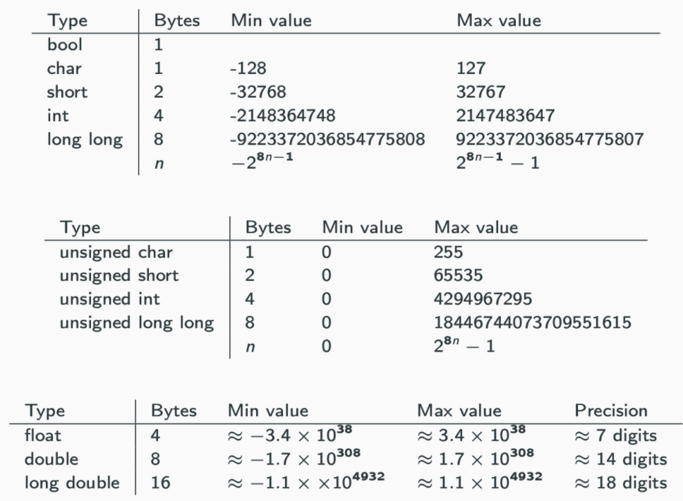
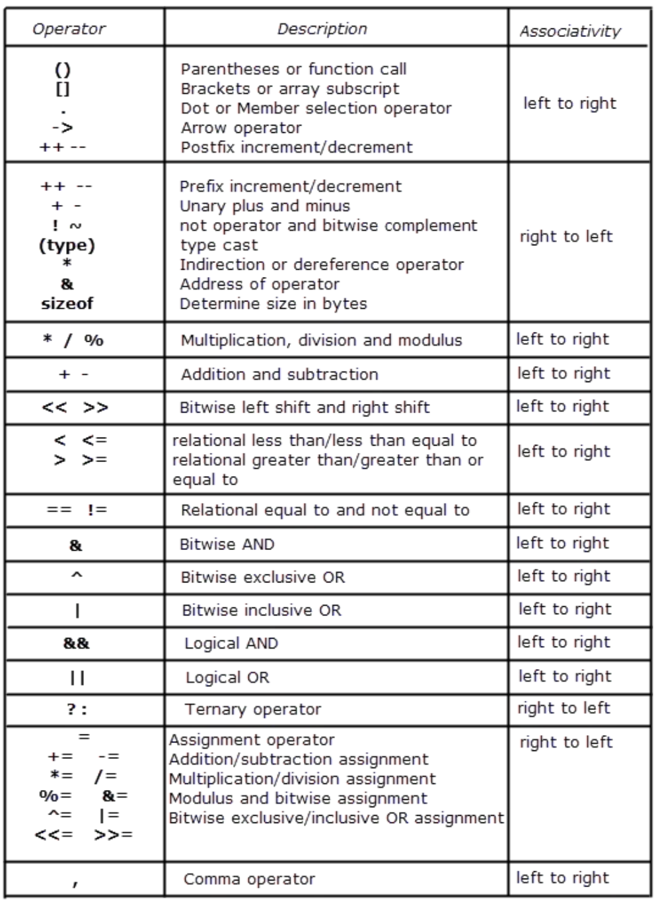
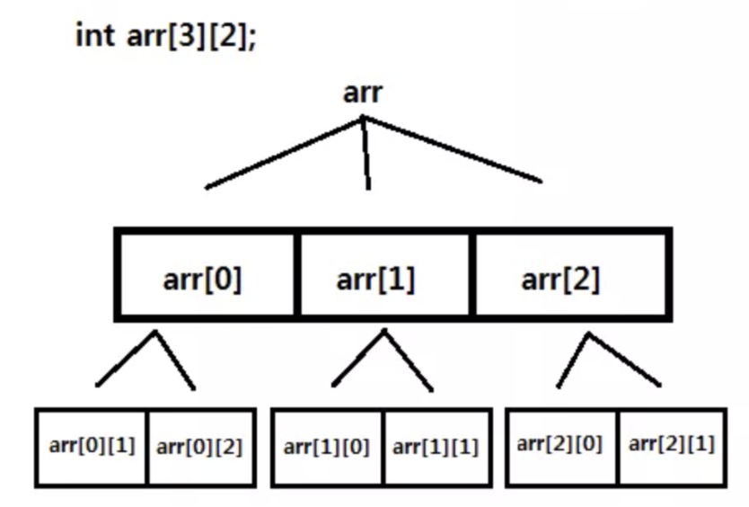

# Syntax

* [Reference](https://modoocode.com/135)

## IO

* comment

```cpp
//          # single line
/**/      # multiple lines
```

> Macro

```cpp
__TIME__ 
__DATE__
__FILE__
__LINE__

#ifndef NUMBER
#define NUMBER 2
#define MAX(x, y) (((x) > (y)) ? (x) : (y))

#endif

cout << MAX(NUMBER, 5) << endl;
```

> Template

* Multi-arg template

```cpp
emplate <typename T>
T summer(T v) {
  return v;
}

template <typename T, typename... Args>
T summer(T first, Args... args) {
  return first + summer(args...);
}

template <typename T>
T *summer(T *v) {
  return v;
}
```

* Recursive template

```cpp
// Factorial<6>::result << endl;
template <int N>
struct Factorial {
  static const int result = N * Factorial<N - 1>::result;
};

template <>
struct Factorial<1> {
  static const int result = 1;
};
```

### Builtin

```cpp
cout << "bool \t" << sizeof(bool) << endl;
cout << "char \t" << sizeof(char) << endl;
cout << "int \t" << sizeof(int) << endl;
cout << "float \t" << sizeof(float) << endl;
cout << "long \t" << sizeof(long) << endl;
cout << "ll \t" << sizeof(long long) << endl;
cout << "double \t" << sizeof(double) << endl;
cout << "ld \t" << sizeof(long double) << endl;

bool *p_bool;
cout << "p_bool \t" << sizeof(p_bool) << endl;
```

### Keywords

> auto

```cpp
auto gamma = {1, 2, 3};  // initializer_list<int>
auto delta = vector<int>{1, 2, 3};
cout << (vector<int>)gamma << "\n";
cout << delta << "\n\n";
```

* Doesn’t preserve const / convert array to pointer

```cpp
int i = 4;
auto j = i;         // int j = i;

int arr[10];
auto arr2 = arr;    // int* arr2 = arr;
decltype(arr) arr3; // int arr3[10];
```

> namespace

```cpp
#include <cstdio>
#include <iostream>
#include <string>
using namespace std;

namespace bw {
const std::string prefix = "(bw::string)";
class string {
  std::string _s = "";
  string();

 public:
  string(const std::string &s) : _s(prefix + s) {}
  const char *c_str() const { return _s.c_str(); }
};
};  // namespace bw

int main() {
  const string s1("This is a string");
  puts(s1.c_str());

  const bw::string s2(s1);
  cout << s2.c_str() << endl;
  return 0;
}
```

* noexcept
  * If expression evaluates to true, the function is declared not to throw any exceptions

> const

* compile time constraint / self documenting, compile optimization, can put in ROM (embedded)
* cannot modify anything that exists outside of the const function
* const applies to the thing left of it. If there is nothing on the left then it applies to the right of it.
* pointers / references to that data must be as restrictive of how they allow data to be changed.

```cpp
const int * p = &f;              # data is const, pointer is not
int * const p = &f;             # data is not, pointer is const
const int * const p = &f;        # data is const, pointer is const
const int i = 9;
const_cast<int&>(i) = 6;        # cast away const
int j;
static_cast<const int &>(j) = 7;    # set data into const
void setName(const string& name)    # const parameters
const string& getName() {}        # const return value
void getName() const {}        # cannot change member variable (only call const function) 
void getName() {}            # non const object call this function
```

> constexpr

* can be used unless goto / try (after C++ 20) / uninitialized, non-literal variable / non constexpr function
* if constexpr should be boolean (true → else won’t compile, vice versa)
* rhs of constexpr must be number

```cpp
int a;
constexpr int b = a;            # Error
```

* can be used in template

```cpp
template <int N>
struct A {
  int operator()() { return N; }
};

int main() {
    constexpr int size = 3;
    int arr[size];
    constexpr int N = 10;
    A<N> a;
    cout << a() << std::endl;        # 10
    constexpr int number = 3;
    enum B { x = number, y, z };      
    cout << B::x << std::endl;        # 3
}
```

* constexpr function

```cpp
constexpr int Factorial(int n) {
    int total = 1;
    for (int i = 1; i <= n; i++)
        total *= i;
    return total;
}
```

> sizeof

```cpp
int arr[6] = {1, 2, 3, 4, 5, 6};
int* parr = arr;
printf("Sizeof(arr) : %d \n", sizeof(arr));    # 24
printf("Sizeof(parr) : %d \n", sizeof(parr));    # 8 (size of pointer)
```

> delete

```cpp
=delete       // ensure not automatically provided by the compiler
```

> volatile

* remove compiler optimization

```cpp
#include <stdio.h>
typedef struct SENSOR {
  int sensor_flag;    // if detected 1
  int data;
} SENSOR;

int main() {
  volatile SENSOR *sensor;
  while (!(sensor->sensor_flag)) {}
  printf("Data : %d \n", sensor->data);
}
```

> decltype

```cpp
typedef decltype(1) myint;
cout << typeid(myint).name();     # i
myint a = 5;
cout << a;
```

* Attract return type in function

```cpp
template <typename T, typename U>
auto add(T t, U u) -> decltype(t + u) {
  return t + u;
}
```

* Don’t get run in runtime

```cpp
struct A {
  int f() { return 0; }
};
decltype(A().f()) ret_val;
```

> typedef

* limited to giving symbolic names to types only.
* interpretation is performed by the compiler.

```cpp
#include <stdio.h>
#include <iostream>

using namespace std;

int add(int a, int b) { return a + b; }
typedef int CAL_TYPE;
typedef int (*Padd)(int, int);
typedef int Arrays[10];

typedef struct Books {
  char title[50];
  int book_id;
} Book;

int main() {
  CAL_TYPE a = 10;
  Arrays arr = {1, 2, 3};
  Padd ptr = add;
  cout << a << endl;       // 10
  cout << arr[2] << endl;  // 3
  cout << ptr(3, 5);       // 8

  Books b;
  return 0;
}
```

> explicit

* Prevent implicit conversion when compilers try to resolve the parameters to a function

```cpp
class String {
public:
    String(int n);         # allocate n bytes to the String object
    String(const char *p);     # initializes object with char *p
};

String mystring = 'x';         # It is not possible if string(int n) was explicit
```

> mutable

* Can be changed in const function → useful for cache

```cpp
class A {
  mutable int data_;

 public:
  A(int data) : data_(data) {}
  void DoSomething(int x) const {
    data_ = x;
  }

  void PrintData() const { std::cout << "data: " << data_ << std::endl; }
};

int main() {
  A a(10);
  a.DoSomething(3);
}
```

### Types



* type(auto_var).name()

> Cast

* static_cast
  * convert pointer / reference from one type to a related type (down / up cast)

```cpp
static_cast<int> // Equivalent to (int)
```

* reinterpret_cast
  * doesn’t check if pointer type and data pointed by pointer is same or not. (down)
  * requires 2 types to be polymorphic (have virtual function)

```cpp
data_type *var_name = reinterpret_cast<data_type *>(pointer_variable);

template<typename T>
void show_binrep(const T& a) {
    const char* beg = reinterpret_cast<const char*>(&a);
    const char* end = beg + sizeof(a);
    while(beg != end)
        cout << bitset<8>(*beg++) << '  ';
    cout << '\n';
}
```

* const_cast
  * only works on pointer / reference (same)
  * cast away constness of the object

* reinterpret_cast
  * reinterpret bits of the object pointed

> Number

* Binary

```cpp
bitset<32>(153).to_string()
bitset<32> bin(52);
bin[1] = 1;
cout << bin.count();                    // return the number of set bit
cout << hex << n;
```

* Char

```cpp
isdigit / isalpha / isalnum(‘1’)
islower(‘A’)
scanf("%c", &c);
```

* size_t
  * basic unsigned integer → depends on system
  * improve code's portability and efficiency → indexing containers should use

* long
  * 0LL for constant
  * right shift checks whether the data is signed or not

```cpp
int a = INT_MIN;
a>>=1;
cout << bitset<32>(a).to_string() << endl;
unsigned int b = INT_MIN;
b>>=1;
cout << bitset<32>(b).to_string() << endl;
```

### Error

> Exception

* unchecked in C++ → compiler doesn’t check if the exceptions are caught or not.
* void fun(int a, char b) throw (Exception1, Exception2, ..) 

> noexcept

* noexcept allows compiler to optimize (Destructor is noexcept by default)

```cpp
int foo() noexcept { throw 1; }
int main() {
  try {
    foo();
  } catch (int x) {
    cout << "Error : " << x << std::endl;  # will not be caught
  }
}
```

* Example

```cpp
#include <iostream>
using namespace std;
```

* child_catch_first.cpp

```cpp
class Parent : public exception {
 public:
  virtual const char *what() const noexcept override { return "Parent!\n"; }
};

class Child : public Parent {
 public:
  const char *what() const noexcept override { return "Child!\n"; }  // this function will not be thrown
};

int main() {
  try {
    throw Child();
  } catch (Parent &p) {
    cout << "Parent Catch!" << endl;
    cout << p.what();
  } catch (Child &c) {
    cout << "Child Catch!" << endl;
    cout << c.what();
  } catch (...) {
    cout << "Default Catch!" << std::endl;
  }
}
```

* Stack rewinding

```cpp
#include <iostream>

using namespace std;

class Resource {
 public:
  Resource(int id) : id_(id) {}
  ~Resource() { cout << "delete resource " << id_ << endl; }

 private:
  int id_;
};

int main() {
  auto func2 = []() {
    Resource r(2);
    throw runtime_error("Exception from 3!\n");
    return 0;
  };
  auto func1 = [func2]() {
    Resource r(1);
    func2();
    return 0;
  };
  try {
    // delete resource 2
    // delete resource 1
    func1();
  } catch (exception &e) {
    // Exception : Exception from 3!
    cout << "Exception : " << e.what();
  }
  cout << endl;
}
```

### cstdio

* C Standard Input and Output Library

> printf

```cpp
#include <stdio.h>

int main()
{
   printf ("Characters: %c %c \n", 'a', 65);
   printf ("Decimals: %d %ld\n", 1977, 650000L);
   printf ("Preceding with blanks: %10d \n", 1977);
   printf ("Preceding with zeros: %010d \n", 1977);
   printf ("Some different radices: %d %x %o %#x %#o \n", 100, 100, 100, 100, 100);
   printf ("floats: %4.2f %+.0e %E \n", 3.1416, 3.1416, 3.1416);
   printf ("Width trick: %*d \n", 5, 10);
   printf ("%s \n", "A string");
   return 0;
}
```

> int sprintf()

```cpp
int main ()
{
  char buffer [100];
  int cx;

  cx = snprintf ( buffer, 100, "The half of %d is %d", 60, 60/2 );

  if (cx>=0 && cx<100)      // check returned value
    snprintf ( buffer+cx, 100-cx, ", and the half of that is %d.", 60/2/2 );

  puts (buffer);

  return 0;
}
```

> iostream

```cpp
istream& getline(istream&& is, string& str, char delim) # Get line
ignore(streamsize n = 1, int delim = EOF);              # Discards from input sequence until n characters or delim
peek()         // Peek next character
read()         // Read block of data 
readsome()     // Read data available in buffer 
putback()      // Put character back 
unget()        // Unget character

\r             // move cursor at the start of the line
\b             // move cursor before last character
void prints() { cout << "ABC\n" << '\b' << "D" << endl; }
```

> progress

```cpp
cout << "ABC\n" << '\b' << "D" << endl; 
float progress = 0.0;
while (progress < 1.0) {
  int barWidth = 70;

  cout << "[";
  int pos = barWidth * progress;
  for (int i = 0; i < barWidth; ++i) {
    if (i < pos)
      cout << "=";
    else if (i == pos)
      cout << ">";
    else
      cout << " ";
  }
  cout << "] " << int(progress * 100.0) << " %\r";
  cout.flush();

  progress += 0.16;
}
```

> fstream

* common

```cpp
#include <fstream>
#include <iostream>    // for cout
using namespace std;
```

* copy file

```cpp
int main(src_file, dst_file) {
  ifstream src(src_file):
  ofstream dst(dst_file):
  dst << src.rdbuf();
}
```

* Class read, write

```cpp
class Human {
  string name;
  int age;

 public:
  Human(const string &name, int age) : name(name), age(age) {}
  string get_info() { return "Name :: " + name + " / Age :: " + to_string(age); }

  friend ofstream &operator<<(ofstream &o, Human &h);
};

ofstream &operator<<(ofstream &o, Human &h) {
  o << h.get_info();
  return o;
}

int main() {
  ofstream new_("data/fstream.txt");  // ifstream or ofstream for one
  if (new_.is_open()) {
    new_ << "First\n";
    new_ << "Second\n";
  } else {
    cout << "Not opened";
  }
  new_.close();

  ofstream out("data/fstream.txt", ios::app);

  Human h("Sean", 15);
  out << h;  //  First
  out.close();

  ifstream in("data/fstream.txt");
  string line;
  char buf[100];
  while (in) {
    in.getline(buf, 100);
    cout << buf << endl;  // First \n Second \n Name :: Sean / Age :: 15
  }

  in.close();
}
```

* erase current contents of the file

```cpp
ofstream ofs;
ofs.open("test.txt", ofstream::out / ofstream::trunc);  // delete
ofs.open("test.txt", std::ios_base::app);    // append
ofs.close()
```

* go to the beginning of the file

```cpp
file.clear(); 
file.seekg(0, ios::beg); 
```

* count number of line

```cpp
file.unsetf(std::ios_base::skipws);
unsigned line_count = count(istream_iterator<char>(file), istream_iterator<char>(), '\n');
```
  
* read char by char

```cpp
char ch;
fstream fin("file", fstream::in);
while (fin >> noskipws >> ch)
  cout << ch; // Or whatever
```

* write and read law integer

```cpp
ofstream numFile;
int num = 12345;
numFile.open( "numfile" );
numFile.write( (char*)&num, sizeof(num) ) ;
numFile.close();
```

* Getting the number back!

```cpp
ifstream numFileIn;
numFileIn.open( "numfile" );
int readN;
numFileIn.read((char*)&readN, sizeof(readN));
cout << readN << endl;
numFileIn.close();
```

> filesystem

* Example

```cpp
#include <filesystem>
#include <iostream>

using namespace std::filesystem;
using namespace std;
int main() {
  create_directory("d");
  create_directory("d/sample");
  for (auto& p : directory_iterator("d")) cout << p.path() << '\n';
  remove_all("d");
}
```

> typeinfo

* Example

```cpp
#include <iostream>
#include <typeinfo>

using namespace std;

int main() {
  cout << sizeof(bool) << endl;        // 1
  cout << typeid(true).name() << endl; // b

  cout << sizeof(char) << endl;        // 1
  cout << typeid('a').name() << endl;  // c

  cout << sizeof(int) << endl;       // 4
  cout << typeid(1).name() << endl;  // i

  cout << sizeof(float) << endl;       // 4
  cout << typeid(1.5f).name() << endl; // f

  cout << sizeof(long) << endl;       // 8
  cout << typeid(1l).name() << endl;  // l

  cout << sizeof(long long) << endl;   // 8
  cout << typeid(1ll).name() << endl;  // x

  cout << sizeof(double) << endl;      // 8
  cout << typeid(1.5).name() << endl;  // d

  cout << sizeof(long double) << endl; // 16

  bool *p_bool;
  cout << sizeof(p_bool) << endl;  // 8

  float a = 3.5;
  int b = static_cast<int>(a);
  b = 3;
  const volatile int *bp = &b;
  cout << "bp " << typeid(bp).name() << endl;  // bp PVKi
  int *cp = const_cast<int *>(bp);
  *cp = 'A';
  cout << "cp " << typeid(cp).name() << endl;  // cp Pi
}
```

## Operation



### Conditional

> goto

```cpp
int n=10;
mylabel:
cout << n << ", ";
n--;
if (n>0) goto mylabel;
```

> case

* create jump table → optimize assembly code
* optimize when case value should be small, sorted 

```cpp
// read a, b, c
#include <stdio.h>
int main() {
  char input;
  printf("알파벳 : ");
  scanf("%c", &input);
  switch (input) {
    case 'a':
      printf("에이 \n");
      break;
    case 'b':
      printf("비 \n");
      break;
    default:
      printf("죄송해요.. 머리가 나빠서 못 읽어요  \n");
      break;
  }
  return 0;
}
```

### String

> string

* Basic

```cpp
string& erase (size_t pos = 0, size_t len = npos);
size_t find_first_not_of (string/char str, size_t pos = 0);    // if no result return string::npos

string& replace (size_t pos,  size_t len,  const string& str);
string substr (size_t pos = 0, size_t len = npos) const;

// emplace_back
vector<vector<int>> v(1);
v[0] = {1};
v.emplace_back(10);
```

* Construct

```cpp
printf("%s", str.c_str());              # print string
cout << setw(5) << setfill('0')         # leading string

string(1, 'c');                         # char to string
to_string(3.1415926);                   # number to string

vector<int> v(make_move_iterator(q.begin()), make_move_iterator(q.end()));  # from deque
```

* Trim string

```cpp
void trimLeftTrailingSpaces(string &input) {
    input.erase(input.begin(), find_if(input.begin(), input.end(), [](int ch) {return !isspace(ch);}));
}

void trimRightTrailingSpaces(string &input) {
    input.erase(find_if(input.rbegin(), input.rend(), [](int ch) { return !isspace(ch);}).base(), input.end());
}
```

* Split string

```cpp
#include <iostream>
#include <iterator>
#include <sstream>
#include <string>
#include <vector>

using namespace std;

using namespace std;
template <typename T>
ostream &operator<<(ostream &out, const vector<T> &v) {
  if (!v.empty()) {
    out << '[';
    std::copy(v.begin(), v.end(), ostream_iterator<T>(out, ", "));
    out << "\b\b]";
  }
  return out;
}
auto SplitString = [](const string &s, char delim = ' ') {
  vector<string> splitteds;

  stringstream ss(s);
  string item;
  while (getline(ss, item, delim)) {
    splitteds.push_back(item);
  }

  return splitteds;
};

int main() { cout << SplitString("ABC BC E") << "\n\n"; }
```

* print in hexadecimal

```cpp
string toHex(string s) {
    stringstream ss;
    for (char ch : s)
        ss << hex << (int)ch;
    return ss.str();
}

to_string(i);                # int to string
```

> sstream

```cpp
#include <sstream>
using namespace std;

int main() {
  // ASCII number to string
  stringstream ss;
  unsigned char num = (unsigned char)205;
  ss.write((char*)&num, sizeof(num)) ;
  cout << ss.str();
}
```

> stringview

```cpp
#include <cwchar>
#include <iostream>
#include <string>
#include <string_view>

using namespace std;

int main() {
  wchar_t wcstr_v[2] = L"A";

  char array[3] = {'B', 'a', 'r'};
  string_view array_v(array, size(array));

  string cppstr = "Foo";
  string_view cppstr_v(&cppstr[0], cppstr.size());

  cout << cppstr_v << '\n' << array_v << '\n' << *wcstr_v;  // Foo \n Bar \n 65
}
```

> regex

```cpp
#include <regex>
using namespace std;

int main() {
  // Regex match
  string a = "GeeksForGeeks"; 
  regex b("(Geek)(.*)");
  regex_match(a, b);
  
  // replace string
  string defangIPaddr(string address) {
    return regex_replace(address, regex("[.]"), "[.]");     // regex(“\\.”) 
  }
}
```

### Pointer

* prefix p, 0 if not defined
* variable that stores an address location → faster when working with array
* provide functions access to large blocks of data

```cpp
#include <iostream>

using namespace std;

int main() {
  int num = 240;
  int *p_num = nullptr;                  // can't assign to address of double
  cout << "before \t" << p_num << "\n";  // before  0x0
  p_num = &num;
  cout << "after \t" << p_num << "\n";  // after 0x7ffee6412588

  char const *p_char = "ABC";
  // char A ABC 0x1097f0f52
  // char B BC 0x1097f0f53
  // char C C 0x1097f0f54
  for (int i = 0; i < 3; i++)
    cout << "char \t" << p_char[i] << "\t" << (p_char + i) << "\t" << (void *)(p_char + i) << "\n\n";

  const int a = 1;
  const int *p_a = &a;  // pointer to const int type
  // (*p_a)++; WRONG
  p_a++;

  int b = 10;
  int *const p_b = &b;  // const pointer to int
  // p_b++; WRONG
  (*p_b)++;
}
```

> Array



* Array name in C is implemented by a constant pointer

```cpp
#include <array>
#include <iostream>

using namespace std;

int main() { 
  array<int, 3> a = {1, 2, 3};

  for (int i : a) cout << i;  // 123
  cout << endl;
  array<int, 3> b = a;

  b = a;
  a[0] = 0;

  cout << b.front() << endl;  // 1

  try {
    b.at(3) = 666;
  } catch (out_of_range const &exc) {
    cout << exc.what() << '\n';  // array::at
  }
}
```

```cpp
#include <vector>
using namespace std;

int main() {
  // 1. create array
  new int[3] {0, 2, 0}
      int bar [5] = { 10, 20, 30 };       // 10 20 30 0 0
  int arr[][2] = {{1, 2}, {3, 4}, {5}};   // 1 2 3 4 5 0 / first can be omitted
  int arr[2][] = {{4, 5, 6}, {7, 8, 9}};  // ERROR

  // 2. Size of array
  int N = sizeof(bar) / sizeof(bar[0]);
  int arr[5];                             // Assume base address of arr is 2000 and int size is 32 bit
  printf("%u %u", arr + 1, &arr + 1);     // 2004 2020

  // 3. vector of array
  vector<int> v[2] = {vector<int>(), vector<int>()};
}
```

> Reference

* return value is extended only when accepted as const reference

```cpp
int function() {
  int a = 5;
  return a;
}

int main() {
  const int& c = function();
}
```

* Do not return reference of local variable → dangling reference

```cpp
int& function() {
  int a = 2;
  return a;
}
```

```cpp
#include <iostream>

using namespace std;

void pointer_basic() {
  int num = 240;
  int *p_num = nullptr;  // can't assign to address of double
  cout << "before \t" << p_num << "\n";
  p_num = &num;
  cout << "after \t" << p_num << "\n\n";

  char const *p_char = "ABC";
  for (int i = 0; i < 3; i++)
    cout << "char \t" << p_char[i] << "\t" << (p_char + i) << "\t" << (void *)(p_char + i) << "\n\n";

  const int a = 1;
  const int *p_a = &a;  // pointer to const int type
  // (*p_a)++; WRONG
  p_a++;

  int b = 10;
  int *const p_b = &b;  // const pointer to int
  // p_b++; WRONG
  (*p_b)++;
}
```

```cpp
#include <iostream>

using namespace std;

int &func1(int &a) { return a; }
int func2(int b) { return b; }
int main() {
  const int &ref = 3;

  int x = ref;
  int &y = x;
  int &z = y;

  cout << "x, y, z \t" << x << " " << y << " " << z << endl;  // x, y, z         3 3 3
  y = 2;
  cout << "x, y, z \t" << x << " " << y << " " << z << endl;  // x, y, z         2 2 2
  z = 3;
  cout << "x, y, z \t" << x << " " << y << " " << z << "\n\n";  // x, y, z         3 3 3

  int arr[3][2] = {{1, 2}, {3, 4}, {5, 6}};
  int(&ref_arr)[3][2] = arr;
  ref_arr[0][0] = 9;
  cout << arr[0] << "\t" << ref_arr[0] << "\n";        // 0x7ffee4d4c570  0x7ffee4d4c570
  cout << arr[0][0] << "\t" << ref_arr[0][0] << "\n";  // 9       9

  int a = 3;
  func1(a) = 4;
  cout << func1(a) << "\t" << &func1(a) << endl;  // 4       0x7ffee4d4c544

  a = func2(2);
  cout << func1(a) << "\t" << &func1(a) << endl;  // 2       0x7ffee4d4c544
}
```

### Iterable

> `<memory>`

* use smart pointer unique, shared, weak using

* Shared Pointer
  * Reference count

```cpp
#include <iostream>
#include <memory>
#include <vector>

using namespace std;

class A : public enable_shared_from_this<A> {
  int *data;

 public:
  A() {
    data = new int[100];
    cout << "Acquired" << endl;
  }

  ~A() {
    cout << "Release" << endl;
    delete[] data;
  }

  shared_ptr<A> get_shared_ptr() { return shared_from_this(); }  // shared_ptr<A>(this); fail
};

int main() {
  vector<shared_ptr<A>> vec;
  vec.push_back(shared_ptr<A>(new A()));  // Acquired
  vec.push_back(shared_ptr<A>(vec[0]));
  vec.push_back(vec[1]->get_shared_ptr());

  cout << vec[0].use_count() << "\n";  // 3
  vec.erase(vec.begin());
  cout << vec[0].use_count() << "\n";  // 2
  vec.erase(vec.begin());
  cout << vec[0].use_count() << "\n";  // 1
  vec.erase(vec.begin());              // Release
}
```

* Unique pointer
  * automatically freed → cannot copy

```cpp
std::unique_ptr<Entity> entity = std::make_shared<Entity>();
```

```cpp
#include <iostream>
#include <memory>
#include <vector>

using namespace std;

class Data {
  int *data;
 public:
  Data() {
    cout << "Acquired" << endl;
    data = new int[100];
  }
  void some() { cout << "Pointer" << endl; }
  ~Data() {
    cout << "Release" << endl;
    delete[] data;
  }
};

void func_with_unique(Data *ptr) { // unique_ptr<Data>& wrong!
  ptr->some();
}

int main() {
  unique_ptr<Data> pa(new Data());  // Acquired (same as auto pa = make_unique<Data>();)
  cout << "[pa]";                   // [pa]
  pa->some();                       // Pointer

  unique_ptr<Data> pb = move(pa);  // pa is now dangling pointer
  cout << "[pb]";                  // [pb]
  pb->some();                      // Pointer
  func_with_unique(pb.get());      // Pointer
  // Release
}
```

> vector

* Member functions

```cpp
iterator insert (const_iterator position, const value_type& val);
```

* Merge vectors

```cpp
AB.reserve( A.size() + B.size() );         // preallocate memory
AB.insert( AB.end(), A.begin(), A.end() );
AB.insert( AB.end(), B.begin(), B.end() );
```

* convert spaced int to vector

```cpp
vector<int> stringToVector(string input) {
    vector<int> output;
    stringstream ss;
    ss.str(input);
    int item;
    while (ss >> item)    output.push_back(item);
    return output;
}

vector<int> vect{ 10, 20, 30 };
```

> deque

```cpp
push_front() /push_back()
pop_front() / pop_back()
front() / back()
```

> queue

```cpp
size() / empty()
front()
pop()
push()
```

> stack

```cpp
stack<int> s ({1, 2, 3});
```

> list

```cpp
assign()
clear()
emplace()
emplace_front() / emplace_back()
erase()
insert()
merge()
methods()
pop_front() / pop_back()            # pop element from front / back
push_front() / push_back()            # add element to front / back
size()
swap()
resize()
```

> tuple

```cpp
tuple<int, double, std::string> t(7, 9.8, "text");
double d = get<1>(t);

#include <iostream>
#include <string>
#include <tuple>

using namespace std;

template <class TupType, size_t... I>
void print(const TupType& _tup, index_sequence<I...>) {
  cout << "(";
  (..., (cout << (I == 0 ? "" : ", ") << get<I>(_tup)));
  cout << ")\n";
}

template <class... T>
void print(const tuple<T...>& _tup) {
  print(_tup, make_index_sequence<sizeof...(T)>());
}

int main() {
  auto abc = make_tuple(5, "Hello", -0.1);
  print(abc);
  int a;
  string b;
  double c;
  tie(a, b, c) = abc;
  cout << a << ", " << b << ", " << c << endl;
}
```

### Sort

```cpp
// Inversion Count : sum of (mid - i) during merge step
void mergeSort(int arr[], int l, int r) {
    if (l < r) {
        int m = l+(r-l)/2;
        mergeSort(arr, l, m);
        mergeSort(arr, m+1, r);
  
        merge(arr, l, m, r);
    }
}

void merge(int arr[], int l, int m, int r) {
    int n1 = m - l + 1, n2 = r - m;
    int L[n1], R[n2];

    for (i = 0; i < n1; i++)
        L[i] = arr[l + i];
    for (j = 0; j < n2; j++)
        R[j] = arr[m + 1+ j];

    int i = 0, j = 0, k = l;
    while (i < n1 && j < n2) {
        if (L[i] <= R[j])
            arr[k++] = L[i++];
        else
            arr[k++] = R[j++];
    }

    while (i < n1)
        arr[k++] = L[i++];

    while (j < n2)
        arr[k++] = R[j++];
}
```

* Quicksort

```cpp
int partition (int arr[], int low, int high) { 
    int pivot = arr[high]; // pivot 
    int i = (low - 1); // Index of smaller element 
  
    for (int j = low; j < high; j++) { 
        if (arr[j] <= pivot) { 
            i++; 
            swap(&arr[i], &arr[j]); 
        } 
    } 
    swap(&arr[i + 1], &arr[high]); 
    return (i + 1); 
} 
  
void quickSort(int arr[], int low, int high) { 
    if (low < high) { 
        int pi = partition(arr, low, high);   
        quickSort(arr, low, pi - 1); 
        quickSort(arr, pi + 1, high); 
    } 
}
```

> priority_queue

```cpp
top()
push()
pop()
```

* own comparator

```cpp
priority_queue<int, std::vector<int>, std::greater<int> > my_min_heap;
priority_queue<int*, vector<int*>, cmp> queue;
struct cmp {
  bool operator() (int a, int b) const {
    return ...
  }
};

auto comp = [](Node a, Node b){ return a.val < b.val };
priority_queue<Node, vector<Node>, decltype(comp)> pq;
```

### Hashable

> set

```cpp
erase()
insert()
size()

auto cmp = [](int x, int y){ return x < y; };
auto set = set<int,decltype(cmp)>(cmp);

struct cmp {
    bool operator() (int a, int b) const {
        return ...
    }
};

std::set<int, cmp> s;

// Iterate Backward
for (auto rit = myset.rbegin(); rit != myset.rend(); ++rit)
cout << ' ' << *rit;

// multiset erase just one element
auto itr = my_multiset.find(value);
if (itr!=my_multiset.end())
    my_multiset.erase(itr);

m[cur].erase(m[cur].lower_bound(next));
```

> map

```cpp
map<string, int> m(wordMap.begin(), wordMap.end());        # using range of pair

auto cmp = [](int a, int b) { return a < b;};
map<int, int, decltype(cmp)> m(cmp);

map<int, int> n2m{{1, 2}};
n2m[5]++;
for (auto it : n2m)
  cout << it.first << " " << it.second << endl;                # iterate

mp.insert({ 2, 30 });
mp.find(2);
```

## OOP

### Class

* enum class

```cpp
enum class BattleCondition { red, yellow, green };
auto currentLight = BattleCondition::green;
const auto shieldLevel = [&]() {  // reference scoping
  switch (currentLight) {
    case BattleCondition::green:
      return 30;
    case BattleCondition::yellow:
      return 50;
    case BattleCondition::red:
    default:
      return 100;
  }
}();
std::cout << "current shield " << shieldLevel << std::endl;
```

* Complex number class

```cpp
class Complex {
 private:
  double real, img;

 public:
  explicit Complex(double r) : real(r){};

  Complex(double r, double i) : real(r), img(i) {}

  Complex operator+(const Complex &obj) const { return Complex(real + obj.real, img + obj.img); }

  Complex operator++()  // ++var
  {
    Complex temp(*this);
    real++;
    return temp;
  }

  Complex &operator++(int)  // var++
  {
    real++;
    return *this;
  }

  Complex &operator+=(const Complex &c) {
    (*this) = (*this) + c;
    return *this;
  }

  friend ostream &operator<<(ostream &os, const Complex &c) {
    return os << c.real << " + " << c.img << "i";  // can access private
  }

  double &operator[](const int index) { return index == 0 ? real : img; }

  Complex abs() {
    real *= -1;
    img *= -1;
    return *this;
  }

  double val() const { return real * real + img * img; }
};
bool operator<(const Complex &p1, const Complex &p2) { return p1.val() < p2.val(); }

void complex_() {
  Complex a = Complex(1, 0);
  Complex b = {1, 2};
  if (a < b) {
    cout << "b is greater \n";
  }
  a[0] = 2;
  cout << "a + b \t" << a + b << endl;
  a += b;
  cout << "a += b \t" << a << "\t" << a[0] << "\t" << a[1] << endl;

  a.abs().abs();
  cout << "a.abs().abs() \t" << a << "\n\n";  // should be Complex &abs()

  // Complex c = 3; doesn't work because explicit
}
```

> pimple

* [+] Binary interface is independent of private fields. changes doesn’t break dependent code.
* [+] Compilation time drops because only the implementation file needs to be rebuilt
* [+] Hide certain internal details such as implementation techniques
* [-] increase in memory usage due to more memory allocation critical in embedded software
* [-] maintenance is complex due to additional class in order to use pimpl, additional pointer indirection
* [-] Hidden implementation cannot be inherited, although a class PImpl can.

```cpp
#include "user.h"

#include <iostream>
using namespace std;

struct User::Impl {
  Impl(string name) : name(name){};

  ~Impl();

  void welcomeMessage() { cout << "Welcome, " << name << endl; }
  string name;
  int salary = -1;
};

// Constructor connected with our Impl structure
User::User(string name) : pimpl(new Impl(name)) { pimpl->welcomeMessage(); }
User::~User() = default;
User::User(const User& other) : pimpl(new Impl(*other.pimpl)) {}
User& User::operator=(User rhs) {
  swap(pimpl, rhs.pimpl);
  return *this;
}

int User::getSalary() { return pimpl->salary; }
void User::setSalary(int salary) {
  pimpl->salary = salary;
  cout << "Salary set to " << salary << endl;
}
```

```cpp
#pragma once
#include <memory>
#include <string>
using namespace std;

class User {
 public:
  ~User();
  User(string name);

  User(const User& other);
  User& operator=(User rhs);

  int getSalary();
  void setSalary(int);

 private:
  class Impl;
  unique_ptr<Impl> pimpl;
};
```

### Inheritance

```cpp
struct Animal {
  string type;
  Animal(){};
  Animal(string type) : type(type) {}
  ~Animal() {}
  virtual void hi() { cout << type << endl; }
};

class Person : public Animal {
 private:
  string name;

 public:
  Person(){};
  Person(string name) : Animal("Person"), name(name) {}
  Person(const Person &p) : Animal("Person"), name(p.name) {}

  void setName(string name) { this->name = name; }
  string getName() { return name; };
  string getName() const { return "const " + name; };
  void hi() override  // override can be ommited but catch compiler error like hi() const
  {
    cout << type << " : " << name << endl;
  }
  void hi() const { cout << type << " : " << name << " const" << endl; }
};

void inheritance() {
  // Down casting
  vector<Animal *> animals = {new Animal("Dog"), new Person("sean")};
  const Person sean = Person("tom");
  for (auto animal : animals) animal->hi();
  sean.hi();
}
```

> struct

* members and base classes are public by default in structs

```cpp
struct Node {
  int value;
  Node(int value) {
    this->value = value;
  }
};
```

## Pattern

### Creational

* [Creational Theory](../cs/cs.md#Creational)

> Resource acquisition is in initialization (RAII)

* resource is acquired in constructor (optional) / relinquished in destructor (e.g. file io)
* Instances of the class are stack allocated
* shared_ptr is one example
* Resources (heap memory, file handles, sockets) should be owned by an object

```cpp
#include <fstream>
#include <iostream>
#include <sstream>
#include <string>
using namespace std;
class OpenFile {
 public:
  OpenFile(const char* filename) {
    // throws an exception on failure
    _file.open(filename);
  }

  ~OpenFile() { _file.close(); }

  string readLine() {
    string line;
    getline(_file, line);
    return line;
  }

 private:
  ifstream _file;
};
int main() {
  OpenFile f("Makefile");
  cout << f.readLine();
}
```

> Factory

```cpp
#include <iostream>
#include <string>

using namespace std;

class Coffee {
  protected:
  string _type;

  public:
  Coffee(string type) : _type(type) {}
  string getType() { return _type; }
};

class Espresso : public Coffee {
  public:
  Espresso() : Coffee("Espresso") { cout << endl << "Making a cup of espresso" << endl; }
};

class Cappuccino : public Coffee {
  public:
  Cappuccino() : Coffee("Cappuccino") { cout << endl << "Making a cup of cappuccino." << endl; }
};

class CoffeeMakerFactory {
  private:
  Coffee* _coffee;

  public:
  Coffee* GetCoffee() {
    int choice;

    cout << "Select type of coffee to make: " << endl;
    cout << "1: Espresso" << endl;
    cout << "2: Cappuccino" << endl;
    cout << "Selection: " << endl;
    cin >> choice;

    switch (choice) {
      case 1: return new Espresso;
      case 2: return new Cappuccino;
      default:
        cout << "Invalid Selection" << endl;
        return NULL;
    }
  }
};

int main() {
  CoffeeMakerFactory coffeeMachine;
  Coffee* cup;
  cup = coffeeMachine.GetCoffee();
  cout << endl << "Ordered " << cup->getType() << endl;
}
```

> Abstract factory

```cpp
#include <iostream>
#include <string>

using namespace std;

class Door {
  public:
    Door() {}
    virtual void Open() = 0;
};

class GasCarDoor : public Door {
  public:
    GasCarDoor() {}
    void Open() { cout << "click" << endl; }
};

class ElectricCarDoor : public Door {
  public:
    ElectricCarDoor() {}
    void Open() { cout << "shhhhh" << endl; }
};

class Engine {
  protected:
    string _sound;

  public:
    Engine(string sound) : _sound(sound) {}
    virtual void Run() = 0;
};

class GasEngine : public Engine {
   public:
    GasEngine() : Engine("vroom") {}
    void Run() { cout << _sound << endl; }
};

class ElectricEngine : public Engine {
   public:
    ElectricEngine() : Engine("shh") {}
    void Run() { cout << _sound << endl; }
};

class CarFactory {
   public:
    virtual Door* BuildDoor() = 0;
    virtual Engine* BuildEngine() = 0;
};

class GasCarFactory : public CarFactory {
   public:
    Door* BuildDoor() { return new GasCarDoor(); }
    Engine* BuildEngine() { return new GasEngine(); }
};

class ElectricCarFactory : public CarFactory {
   public:
    Door* BuildDoor() { return new ElectricCarDoor(); }
    Engine* BuildEngine() { return new ElectricEngine(); }
};

int main() {
  CarFactory* CarPlant;
  int choice;

  cout << "Select a car type: " << endl;
  cout << "1: Gasoline" << endl;
  cout << "2: Electric" << endl;
  cout << "Selection: ";
  cin >> choice;
  cout << endl;

  switch (choice) {
    case 1:
      CarPlant = new GasCarFactory;
      break;
    case 2:
      CarPlant = new ElectricCarFactory;
      break;
  }

  Door* myDoor = CarPlant->BuildDoor();
  Engine* myEngine = CarPlant->BuildEngine();
  myDoor->Open();
  myEngine->Run();
}
```

### Structural

> Adoptor

```cpp
#include <iostream>
using namespace std;

class Int {
  int data;

 public:
  Int(int data) : data(data) {}
  Int(const Int &i) : data(i.data) {}
  operator int() { return data; }  // Use all default int operators
  friend ostream &operator<<(ostream &os, const Int &i) {
    return os << "data = " << i.data;  // can access private
  }
};
int main() {
  Int x = 3;
  int a = x + 4;

  x = a * 2 + x + 4;
  std::cout << x << std::endl;  // data = 21
}
```

### Behavior

> mediator

```cpp
#include <algorithm>
#include <iostream>
#include <set>
#include <sstream>
using namespace std;
// Without graph, it’s coupled and cannot be tested alone

class Nodes {
 public:
  set<int> nodes = set<int>();
  void addNode(int n) { nodes.insert(n); }
  void remNode(int n) { nodes.erase(n); }
  int size() { return nodes.size(); }
};
class Edges {
 public:
  set<pair<int, int>> edges;
  void addEdge(int n1, int n2) { edges.insert(std::make_pair(n1, n2)); }
  void remNode(int n) {
    for (set<pair<int, int>>::iterator itr = edges.begin(); itr != edges.end();) {
      if (itr->first == n || itr->second == n)
        edges.erase(itr++);
      else
        ++itr;
    }
  }
  int size() { return edges.size(); }
};
class Graph {
 public:
  Nodes nodes;
  Edges edges;
  void remNode(int n) {
    edges.remNode(n);
    nodes.remNode(n);
  }
  void addEdge(int n1, int n2) {
    nodes.addNode(n1);
    nodes.addNode(n2);
    edges.addEdge(n1, n2);
  }
  string info() {
    stringstream ss;
    ss << "# nodes" << nodes.size() << ", # edges" << edges.size();
    return ss.str();
  };
};

int main() {
  Graph g;
  g.addEdge(1, 2);
  g.addEdge(3, 2);
  cout << g.info() << endl;
  g.remNode(2);
  cout << g.info();
}
```

### Functional

> functor

* is a function that can be manipulated as an object, or an object representing a single, generic function.
* Functors support and encourage a number of powerful programming techniques including:
  * programming in a functional style
  * higher order functions
  * internal iterators
  * reuse and specialization through composition rather than inheritance and overloading
  * generic "callback" or "extension point" APIs
  * generic "filters" or predicate APIs
  * many "behavioral" design patterns, such as Visitor, Strategy, Chain of Responsibility, etc.

```cpp
// g++ functors.cpp && ./a.out
#include <iostream>
#include <string>
using namespace std;

/**
 * struct is public by default
 */
int main() {
  class Tagger {
    string tag;
    Tagger();

   public:
    Tagger(string tag) : tag(tag) {}
    string operator()(string contents) const { return "<" + tag + ">" + contents + "</" + tag + ">"; }
  };

  const Tagger pTagger("p");
  const Tagger h1Tagger("h1");
  cout << "pTagger \t" << pTagger("hello") << endl;
  cout << "h1Tagger \t" << h1Tagger("hello") << endl;
}
```

## Module

### Concurrency

> atomic

```cpp
#include <atomic>
#include <iostream>
#include <thread>

using namespace std;

void count_n_million() {
  atomic<int> counts(0);
  thread threads[3];

  for (int i = 0; i < 3; i++) {
    threads[i] = thread([&]() {
      for (int i = 0; i < 1000000; i++) counts += 1;
    });
  }
  for (int i = 0; i < 3; i++) threads[i].join();

  cout << "total counts \t" << counts.load() << "\n\n";
}
int main() { count_n_million(); }
```

> thread

```cpp
// g++ --std=c++11 merge_sort.cpp && ./a.out
#include <algorithm>
#include <chrono>
#include <cstdlib>
#include <thread>
#include <vector>

using namespace std;
void merge(int *array, int l, int m, int r) {
  int n_left = m - l + 1, n_right = r - m;
  int lefts[n_left], rights[n_right];

  copy(&array[l], &array[m + 1], lefts);
  copy(&array[m + 1], &array[r + 1], rights);

  int left_i = 0, right_i = 0, insert_i = l;

  while ((left_i < n_left) || (right_i < n_right)) {
    if (left_i < n_left && (right_i >= n_right || lefts[left_i] <= rights[right_i])) {
      array[insert_i] = lefts[left_i];
      left_i++;
    } else {
      array[insert_i] = rights[right_i];
      right_i++;
    }
    insert_i++;
  }
}
void sequential_merge_sort(int *array, int l, int r) {
  if (l < r) {
    int m = (l + r) / 2;
    sequential_merge_sort(array, l, m);
    sequential_merge_sort(array, m + 1, r);
    merge(array, l, m, r);
  }
}

void parallel_merge_sort(int *array, int l, int r, int depth = 0) {
  if (depth >= log(thread::hardware_concurrency()))
    sequential_merge_sort(array, l, r);
  else {
    int m = (l + r) / 2;
    thread left_thread = thread(parallel_merge_sort, array, l, m, depth + 1);
    parallel_merge_sort(array, m + 1, r, depth + 1);
    left_thread.join();
    merge(array, l, m, r);
  }
}

int main() {
  const int N = 10000;
  int original_array[N], sequential_result[N], parallel_result[N];
  for (int i = 0; i < N; i++) original_array[i] = rand();

  printf("Evaluating Sequential Implementation...\n");
  chrono::duration<double> sequential_ns(0);
  for (int eval = 0; eval < 10; eval++) {
    copy(&original_array[0], &original_array[N - 1], sequential_result);
    auto start_time = chrono::high_resolution_clock::now();
    sequential_merge_sort(sequential_result, 0, N - 1);
    sequential_ns += (chrono::high_resolution_clock::now() - start_time) / 10.0;
  }

  printf("Evaluating Parallel Implementation...\n");
  chrono::duration<double> parallel_ns(0);
  for (int eval = 0; eval < 10; eval++) {
    copy(&original_array[0], &original_array[N - 1], parallel_result);
    auto start_time = chrono::high_resolution_clock::now();
    parallel_merge_sort(parallel_result, 0, N - 1);
    parallel_ns += (chrono::high_resolution_clock::now() - start_time) / 10.0;
  }

  printf("Average Sequential Time: %.2f ms\n", sequential_ns.count() * 1000);
  printf("Average Parallel Time: %.2f ms\n", parallel_ns.count() * 1000);
  printf("Speedup: %.2f\n", sequential_ns / parallel_ns);
  printf("Efficiency %.2f%%\n", 100 * (sequential_ns / parallel_ns) / thread::hardware_concurrency());
}
```

> mutex

```cpp
struct Counter {
  int value;
  Counter() : value(0){}
  void increment(){
    // 1st Method
    lock_guard<mutex> guard(mu);
    ++value;

    // 2nd Method : bad when exception is thrown between
    mutex.lock();
    ++value;
    mutex.unlock();
  }
};

int main(){
  Counter counter;

  vector<thread> threads;
  for(int i = 0; i < 5; ++i){
    threads.push_back(thread([&counter](){
      for(int i = 0; i < 100; ++i){ counter.increment(); }
    }));
  }
  for(auto& thread : threads) thread.join();
  cout << counter.value << endl;
  return 0;
}
```

### Time

 chrono

* sleep

```cpp
this_thread::sleep_for(milliseconds(x));  # Pause
```

* current time

```cpp
#include <iostream>
#include <chrono>
#include <ctime>    

int main()
{
    std::time_t end_time = std::chrono::system_clock::to_time_t(std::chrono::system_clock::now());

    std::cout << std::ctime(&end_time); // Mon Oct  2 00:59:08 2017
}
```

* Measure time

```cpp
#include <chrono>
#include <iostream>
#include <thread>

using namespace std;
using namespace std::chrono;

int main() {
  auto start_time = system_clock::to_time_t(system_clock::now());
  cout << start_time << endl;  // 1606398149
  this_thread::sleep_for(chrono::seconds(1));
  auto end_time = system_clock::to_time_t(system_clock::now());
  cout << end_time - start_time << " second passed" << endl;  // 1 second passed

  auto start = std::chrono::high_resolution_clock::now();
  this_thread::sleep_for(chrono::seconds(1));
  auto finish = std::chrono::high_resolution_clock::now();
  std::cout << duration_cast<milliseconds>(finish - start).count() << "ms\n";  // 1001ms
}
```

> chrono

* sleep

```cpp
this_thread::sleep_for(milliseconds(x));  # Pause
```

* current time

```cpp
#include <iostream>
#include <chrono>
#include <ctime>    

int main()
{
    std::time_t end_time = std::chrono::system_clock::to_time_t(std::chrono::system_clock::now());

    std::cout << std::ctime(&end_time); // Mon Oct  2 00:59:08 2017
}
```

* Measure time

```cpp
#include <chrono>
#include <iostream>
#include <thread>

using namespace std;
using namespace std::chrono;

int main() {
  auto start_time = system_clock::to_time_t(system_clock::now());
  cout << start_time << endl;  // 1606398149
  this_thread::sleep_for(chrono::seconds(1));
  auto end_time = system_clock::to_time_t(system_clock::now());
  cout << end_time - start_time << " second passed" << endl;  // 1 second passed

  auto start = std::chrono::high_resolution_clock::now();
  this_thread::sleep_for(chrono::seconds(1));
  auto finish = std::chrono::high_resolution_clock::now();
  std::cout << duration_cast<milliseconds>(finish - start).count() << "ms\n";  // 1001ms
}
```

### Util

> algorithm

```cpp
InputIterator find (InputIterator first, InputIterator last, const T& val);
bool is_sorted(ForwardIterator first, ForwardIterator last, Compare comp);
```

```cpp
#include <algorithm>
#include <vector>

using namepsace std;

int main(){
  // search for sublist
  search(seq.begin(), seq.end(), sublist.begin(), sublist.end());

  // filter divisor
  copy_if(vec.begin(), vec.end(), back_inserter(new), [div](int x) { return (x % div) == 0; });
  str2.erase(remove_if(str2.begin(), str2.end(), [](unsigned char x){return std::isspace(x);})

  // fill
  void fill (ForwardIterator first, ForwardIterator last, const T& val)
  char flags[26][80];
  fill(&flags[0][0], &flags[0][0] + sizeof(flags) / sizeof(flags[0][0]), 0 );      // fill 2d array

  // count
  int myints[] = {10,20,30,30,20,10,10,20};   // 8 elements
  cout << "10 appears " << count (myints, myints+8, 10) << " times.\n";

  // custom sort using map
  stable_sort(arr1.begin(), arr1.begin() + N, 
    [&m](int a, int b){
      if (m[a] == m[b])
        return a < b;
      return m[a] < m[b];
    }
  );

  // Binary Search in sorted array
  // returns an iterator pointing to the first in the range [first,last) which does not compare less than val
  // If all the elements in the range compare less than val, the function returns las
  vector<int> v{ 10, 20, 30, 40, 50 };
  lower_bound(v.begin(), v.end(), 10); // 0
}
```

> numeric

```cpp
accumulate()                 # Accumulate values in range
adjacent_difference()        # Compute adjacent difference of range
inner_product()              # Compute cumulative inner product of range
partial_sum()                # Compute partial sums of range
iota(ForwardIt first, ForwardIt last, T value)        # Store increasing sequence
```

```cpp
#include <numeric>
using namespace std;

int main() {
  vector<vector<int>> m = {{0, 1}, {2, 3}};
  auto sum = accumulate(m.cbegin(), m.cend(), 0, [](auto lhs, const auto& rhs) {
    return accumulate(rhs.cbegin(), rhs.cend(), lhs);
  });

  vector<int> nums(5);
  iota(nums.begin(), nums.end(), 1);
  int sum = accumulate(nums.begin(), nums.end(), 0, [](int total, int current) {
    return total + current;
  });
}
```

> utility

```cpp
swap()
make_pair()
forward()
move_if_noexcept()
decival()

types:
pair
piecewise_construct_t

namespace:
rel_ops
```

```cpp
#include <iostream>
#include <utility>
using namespace std;

int main() {
  string v1[5] = {"one", "two", "three", "four", "five"};
  string v2[5];

  for_each(begin(v1), end(v1), [](const string &s) { cout << s << " "; });
  cout << endl;
  move(begin(v1), end(v1), v2);
  for_each(begin(v1), end(v1), [](const string &s) { cout << s << " "; });
  cout << endl;
  for_each(begin(v2), end(v2), [](const string &s) { cout << s << " "; });
}
```

> type_traits

```cpp
#include <iostream>
#include <type_traits>

using namespace std;

template <typename T>
void show_value(T t) {
  if constexpr (is_pointer<T>::value)  // std::is_pointer_t<T>
  {
    cout << "Pointer " << *t << endl;
  } else {
    cout << "Not Pointer " << t << endl;
  }
}

int main() {
  int x = 3;
  show_value(x);

  int *p = &x;
  show_value(p);
}
```

> functional

```cpp
#include <functional>
using namespace std;

struct Foo {
  Foo(int num) : num_(num) {}
  void print_add(int i) const { std::cout << num_+i << '\n'; }
  int num_;
};
 
void print_num(int i)
{
  std::cout << i << '\n';
}

struct PrintNum {
  void operator()(int i) const
  {
    std::cout << i << '\n';
  }
};
 
int main()
{
  // store a free function
  std::function<void(int)> f_display = print_num;
  f_display(-9);

  // store a lambda
  std::function<void()> f_display_42 = []() { print_num(42); };
  f_display_42();

  // store the result of a call to std::bind
  std::function<void()> f_display_31337 = std::bind(print_num, 31337);
  f_display_31337();

  // store a call to a member function
  std::function<void(const Foo&, int)> f_add_display = &Foo::print_add;
  const Foo foo(314159);
  f_add_display(foo, 1);
  f_add_display(314159, 1);

  // store a call to a data member accessor
  std::function<int(Foo const&)> f_num = &Foo::num_;
  std::cout << "num_: " << f_num(foo) << '\n';

  // store a call to a member function and object
  using std::placeholders::_1;
  std::function<void(int)> f_add_display2 = std::bind( &Foo::print_add, foo, _1 );
  f_add_display2(2);

  // store a call to a member function and object ptr
  std::function<void(int)> f_add_display3 = std::bind( &Foo::print_add, &foo, _1 );
  f_add_display3(3);

  // store a call to a function object
  std::function<void(int)> f_display_obj = PrintNum();
  f_display_obj(18);
}
```

> Error

* Undefined behavior: the result of F() is a dangling reference

```cpp
function<const int&()> F([]{ return 42; });
int x = F(); 
```

> unistd.h

```cpp
char cwd[1024];
getcwd(cwd, sizeof(cwd));
printf("Current working dir: %s\n", cwd);
```

> variant

```cpp
#include <iostream>
#include <memory>
#include <variant>

using namespace std;

class A {
 public:
  void a() { cout << "I am A" << endl; }
};

class B {
 public:
  void b() { cout << "I am B" << endl; }
};

variant<A, B> GetDataFromDB(bool is_a) {
  if (is_a) {
    return A();
  }
  return B();
}

int main() {
  auto v = GetDataFromDB(true);

  cout << v.index() << endl;  // 0
  get<A>(v).a();              // I am A  // same as get<0>(v).a()
}
```

> gnome

* g_print("%s", ...);
  * print

* g_strdup_printf("%s", line);
  * Similar to the standard C sprintf() function but safer
  * calculates the maximum space required and allocates memory to hold the result
  * returned string should be freed with g_free() when no longer needed.
  * The returned string is guaranteed to be non-NULL

### Test

> gtest

```sh
gtest

test fixtures allows for common setup and teardown between tests (::testing::Test)

ASSERT_TRUE                # break test if not true
EXPECT_TRUE
EXPENCT_EQ/NE/LT/LE/GT(A, B); # A and B should be same
```
