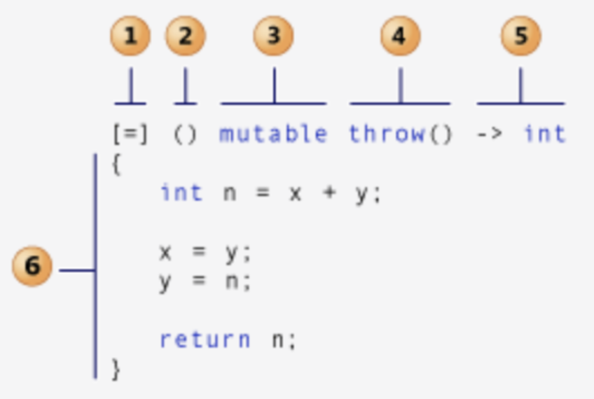
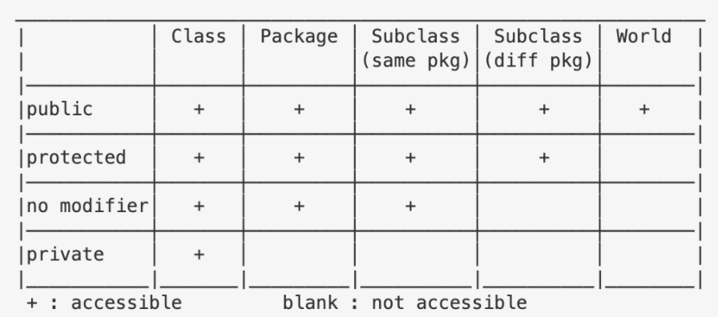

# Syntax

> Link Error

* starts with L
* Error when combine object files to create executable

* duplicate symbols found
  * Same function declared in multiple files (#once)
  * include same header multiple times (Check inline, static, #ifdef)

* unresolved external symbol
  * Can’t find function declaration, header include

* Use of deleted function 'std::atomic<int>::atomic(const std::atomic<int>&)
  * Can't assign atomic from int
  * Can't directly print atomic, use .load

> Compile Error

* starts with C




```cpp
// errors.cpp:1:10: fatal error: 'a' file not found
// #include <a>
#include <iostream>

// error: expected namespace name
// using namespace sd;

// ld: symbol(s) not found for architecture x86_64
// int man () {
int main() {
  // unknown type name 'in'
  // in a;

  // error: expression is not assignable
  // int a = 2 = 3;
  int a = 3;
  // error: expected ';' after expression
  // a++
  // a++;

  // error: use of undeclared identifier 'b'
  // b = 3;

  // warning: ivision by zero is undefined [-Wdivision-by-zero]
  // cout << 1 / 0;

  // error : cannot initialize a variable of type 'int' with an lvalue of type 'const char [3]
  // int a = "ff";

  int arr[1];
  arr[0] = 0;
  // error: AddressSanitizer: stack-buffer-overflow on address 0x7ffee07ea414 [-fsanitize=address]
  // std::cout << arr[1];

  // error: cannot delete expression of type 'int'
  // delete arr[0];

  // error: variable 'd' declared with deduced type 'auto' cannot appear in its own initializer
  // auto d = []() { d(); };

  auto e = "ab";
  // error: assigning to 'const char *' from incompatible type 'int
  // e = 3;

  // error: no matching conversion for C-style cast from 'std::__1::string' (aka 'basic_string<char, char_traits<char>, allocator<char> >') to 'int'
  // -> cannot cast string to int
  // (int) e;

  // error: expected type
  // -> type must be followed by new
  // new 1

  return 0;
  // warning: unused variable 'a' [-Wunused-variable]
  // int a = 2;
}
```




## IO

* comment

```cpp
//          # single line
/**/      # multiple lines
```

### Keyword

> Macro

* processed by the preprocessor

```cpp
__LINE__            // line number of current source line (a decimal constant).
__FILE__            // presumed name of the source file (a character string literal).
__DATE__            // date of translation of the source file (Dec  4 2020)
__TIME__            // time of translation of the source file ("19:43:50")
__STDC__            // Whether__STDC__ is predefined

#ifndef NUMBER
#define NUMBER 2
#define MAX(x, y) (((x) > (y)) ? (x) : (y))

#endif

cout << MAX(NUMBER, 5) << endl;
```




```cpp
#ifndef BST_HPP        // define macro if not
#define BST_HPP
#endif
#pragma once           // equivalent

#undef                 // unset defined variable
```




```cpp
#include <iostream>

using namespace std;

int main() {
#ifndef NUMBER
#define NUMBER 2
#define MAX(x, y) (((x) > (y)) ? (x) : (y))
#endif
  cout << MAX(NUMBER, 5) << endl;  // 5

#if defined(__APPLE__)
  cout << "APPLE" << endl;
#elif defined(__linux__)
  cout << "LINUX" << endl;
#elif defined(_WIN32)
  cout << "WINDOW" << endl;
#endif

#define ConcatName(x, y) x##y
#define Print(var) cout << #var << ": " << var;

  int ConcatName(a, b) = 3;
  Print(ab);  // ab: 3

  return 0;
}
```




* inline
  * checks types unlike macro

```cpp
#define square(x) x* x                   // square(3 + 3) → 15
inline int square(int a){return a * a; } // square(3 + 3) → 36
```

> Template

* Compile time polymorphism
* Compiler creates a new instance of a template function for every data type (Every instance has its own copy of static variable)
* Non-type parameters must be const
* template specialization can be done by template <>

```cpp
template<typename Data>
class Node {
  public:
    Data const data;
    Node(const Data & d) : data(d) {}
};
```




```cpp
emplate <typename T>
T summer(T v) {
  return v;
}

template <typename T, typename... Args>
T summer(T first, Args... args) {
  return first + summer(args...);
}

template <typename T>
T *summer(T *v) {
  return v;
}
```




```cpp
#include <iostream>
#include <iterator>

using namespace std;
template <typename T>
ostream &operator<<(ostream &out, const vector<T> &v) {
  if (!v.empty()) {
    out << '[';
    std::copy(v.begin(), v.end(), ostream_iterator<T>(out, ", "));
    out << "\b\b]";
  }
  return out;
}

template <typename T>
ostream &operator<<(std::ostream &out, const vector<std::vector<T>> &G) {
  out << "[";
  for (int i = 0; i < G.size(); i++) {
    out << G[i];
    if (i != G.size() - 1)
      out << "\n";
  }
  out << "]";
  return out;
```




```c++
#include <iostream>

using namespace std;

template <typename T>
T summer(T v) {
    return v;
}

template <typename T, typename... Args>
T summer(T first, Args... args) {
    return first + summer(args...);
}

template <typename T>
T *summer(T *v) {
    return v;
}
template <int N>
struct Factorial {
    static const int result = N * Factorial<N - 1>::result;
};

template <>
struct Factorial<1> {
    static const int result = 1;
};

int main() {
    cout << summer(1, 2, 13) << endl;       // 16
    cout << summer((void *)0x123) << endl;  // 0x123
    cout << Factorial<6>::result << endl;   // 720
    return 0;
}
```




* auto




```cpp
// determine type from initializer
auto gamma = {1, 2, 3};  // initializer_list<int>
auto delta = vector<int>{1, 2, 3};
cout << (vector<int>)gamma << "\n";
cout << delta << "\n\n";

// Doesn’t preserve const / convert array to pointer
int i = 4;
auto j = i;         // int j = i;

int arr[10];
auto arr2 = arr;    // int* arr2 = arr;
decltype(arr) arr3; // int arr3[10];
```




> namespace

```cpp
#include <cstdio>
#include <iostream>
#include <string>
using namespace std;

namespace bw {
const std::string prefix = "(bw::string)";
class string {
  std::string _s = "";
  string();

 public:
  string(const std::string &s) : _s(prefix + s) {}
  const char *c_str() const { return _s.c_str(); }
};
};  // namespace bw

int main() {
  const string s1("This is a string");
  puts(s1.c_str());

  const bw::string s2(s1);
  cout << s2.c_str() << endl;
  return 0;
}
```

* noexcept
  * If expression evaluates to true, the function is declared not to throw any exceptions

> const

* compile time constraint / self documenting, compile optimization, can put in ROM (embedded)
* cannot modify anything that exists outside of the const function
* const applies to the thing left of it. If there is nothing on the left then it applies to the right of it.
* pointers / references to that data must be as restrictive of how they allow data to be changed.




```cpp
const int * p = &f;           // data is const, pointer is not
int * const p = &f;           // data is not, pointer is const
const int * const p = &f;     // data is const, pointer is const
const int i = 9;
const_cast<int&>(i) = 6;      // cast away const
int j;
static_cast<const int &>(j) = 7; // set data into const
void setName(const string& name) // const parameters
const string& getName() {}       // const return value
void getName() const {}     // cannot change member variable (only call const function)
void getName() {}           // non const object call this function
```




```cpp
#include <iostream>
using namespace std;
struct X {
  X& ref() { return *this; }
};

int main() {
  // non-const lvalue reference to type 'X'
  // -> X().ref()
  X& x = X();

  int a = 5;
  // error: const' qualifier may not be applied to a reference
  // int &const ref1 = a;

  const int &ref2 = a;  // valid
  // error: cannot assign to variable 'ref2' with const-qualified type 'const int &'
  // -> const cannot be modified
  // ref2 = 7;

  const int b = 6;
  // error: binding reference of type 'int' to value of type 'const int' drops 'const' qualifier
  // -> cannot create non const pointed by  const pointer
  // int &ref = b;

  int c = 1, e = 2;
  int const *d = &c;
  d = &e;
  // error: read-only variable is not assignable
  // -> cannot modify const pointed int
  // *d = 3;
  cout << *d;

  int const f = 5;
  int *ptr = (int *)&f;
  *ptr = 10;
  cout << f;  // depends on compiler
}
```




> constexpr

* can be used unless goto / try (after C++ 20) / uninitialized, non-literal variable / non constexpr function
* if constexpr should be boolean (true → else won’t compile, vice versa)
* rhs of constexpr must be number

```cpp
int a;
constexpr int b = a;            # Error
```

* can be used in template

```cpp
template <int N>
struct A {
  int operator()() { return N; }
};

int main() {
    constexpr int size = 3;
    int arr[size];
    constexpr int N = 10;
    A<N> a;
    cout << a() << std::endl;        # 10
    constexpr int number = 3;
    enum B { x = number, y, z };
    cout << B::x << std::endl;        # 3
}
```

* constexpr function

```cpp
constexpr int Factorial(int n) {
    int total = 1;
    for (int i = 1; i <= n; i++)
        total *= i;
    return total;
}
```

* delete

```cpp
=delete       // ensure not automatically provided by the compiler
```

* inline
  * For small, commonly-used functions, the overhead of the function call is more than the time needed to actually execute the function’s code
  * This overhead occurs for small functions because execution time of small function is less than the switching time.

```cpp
#include <iostream>
using namespace std;
inline int cube(int s) {
  return s*s*s;
}
int main()
{
  cout << "The cube of 3 is: " << cube(3) << "\n";
  return 0;
} //Output: The cube of 3 is: 27
```

* sizeof

```cpp
int arr[6] = {1, 2, 3, 4, 5, 6};
int* parr = arr;
printf("Sizeof(arr) : %d \n", sizeof(arr));    # 24
printf("Sizeof(parr) : %d \n", sizeof(parr));    # 8 (size of pointer)
```

* volatile
  * remove compiler optimization

```cpp
#include <stdio.h>
typedef struct SENSOR {
  int sensor_flag;    // if detected 1
  int data;
} SENSOR;

int main() {
  volatile SENSOR *sensor;
  while (!(sensor->sensor_flag)) {}
  printf("Data : %d \n", sensor->data);
}
```

* decltype

```cpp
typedef decltype(1) myint;
cout << typeid(myint).name();     # i
myint a = 5;
cout << a;
```




```cpp
template <typename T, typename U>
auto add(T t, U u) -> decltype(t + u) {
  return t + u;
}
```




```cpp
struct A {
  int f() { return 0; }
};
decltype(A().f()) ret_val;
```




> typedef

* limited to giving symbolic names to types only.
* interpretation is performed by the compiler.

```cpp
#include <stdio.h>
#include <iostream>

using namespace std;

int add(int a, int b) { return a + b; }
typedef int CAL_TYPE;
typedef int (*Padd)(int, int);
typedef int Arrays[10];

typedef struct Books {
  char title[50];
  int book_id;
} Book;

int main() {
  CAL_TYPE a = 10;
  Arrays arr = {1, 2, 3};
  Padd ptr = add;
  cout << a << endl;       // 10
  cout << arr[2] << endl;  // 3
  cout << ptr(3, 5);       // 8

  Books b;
  return 0;
}
```

> explicit

* Prevent implicit conversion when compilers try to resolve the parameters to a function

```cpp
class String {
public:
    String(int n);         # allocate n bytes to the String object
    String(const char *p);     # initializes object with char *p
};

String mystring = 'x';         # It is not possible if string(int n) was explicit
```

> mutable

* Can be changed in const function → useful for cache

```cpp
class A {
  mutable int data_;

 public:
  A(int data) : data_(data) {}
  void DoSomething(int x) const {
    data_ = x;
  }

  void PrintData() const { std::cout << "data: " << data_ << std::endl; }
};

int main() {
  A a(10);
  a.DoSomething(3);
}
```

### Types


```cpp
cout << "bool \t" << sizeof(bool) << endl;
cout << "char \t" << sizeof(char) << endl;
cout << "int \t" << sizeof(int) << endl;
cout << "float \t" << sizeof(float) << endl;
cout << "long \t" << sizeof(long) << endl;
cout << "ll \t" << sizeof(long long) << endl;
cout << "double \t" << sizeof(double) << endl;
cout << "ld \t" << sizeof(long double) << endl;

bool *p_bool;
cout << "p_bool \t" << sizeof(p_bool) << endl;
```

* type(auto_var).name()

> Cast

* static_cast
  * convert pointer / reference from one type to a related type (down / up cast)

```cpp
static_cast<int> // Equivalent to (int)
```

* reinterpret_cast
  * doesn’t check if pointer type and data pointed by pointer is same or not. (down)
  * requires 2 types to be polymorphic (have virtual function)

```cpp
data_type *var_name = reinterpret_cast<data_type *>(pointer_variable);

template<typename T>
void show_binrep(const T& a) {
    const char* beg = reinterpret_cast<const char*>(&a);
    const char* end = beg + sizeof(a);
    while(beg != end)
        cout << bitset<8>(*beg++) << '  ';
    cout << '\n';
}
```

* const_cast
  * only works on pointer / reference (same)
  * cast away constness of the object

* reinterpret_cast
  * reinterpret bits of the object pointed

> Number

* Binary

```cpp
bitset<32>(153).to_string()
bitset<32> bin(52);
bin[1] = 1;
cout << bin.count();                    // return the number of set bit
cout << hex << n;
```

* Char

```cpp
isdigit / isalpha / isalnum(‘1’)
islower(‘A’)
scanf("%c", &c);
```

* size_t
  * basic unsigned integer → depends on system
  * improve code's portability and efficiency → indexing containers should use

* long
  * 0LL for constant
  * right shift checks whether the data is signed or not

```cpp
int a = INT_MIN;
a>>=1;
cout << bitset<32>(a).to_string() << endl;
unsigned int b = INT_MIN;
b>>=1;
cout << bitset<32>(b).to_string() << endl;
```

### Error

> Exception

* unchecked in C++ → compiler doesn’t check if the exceptions are caught or not.
* void fun(int a, char b) throw (Exception1, Exception2, ..)

> noexcept

* noexcept allows compiler to optimize (Destructor is noexcept by default)

```cpp
int foo() noexcept { throw 1; }
int main() {
  try {
    foo();
  } catch (int x) {
    cout << "Error : " << x << std::endl;  # will not be caught
  }
}
```




```cpp
#include <iostream>
using namespace std;
class Parent : public exception {
 public:
  virtual const char *what() const noexcept override { return "Parent!\n"; }
};

class Child : public Parent {
 public:
  const char *what() const noexcept override { return "Child!\n"; }  // this function will not be thrown
};

int main() {
  try {
    throw Child();
  } catch (Parent &p) {
    cout << "Parent Catch!" << endl;
    cout << p.what();
  } catch (Child &c) {
    cout << "Child Catch!" << endl;
    cout << c.what();
  } catch (...) {
    cout << "Default Catch!" << std::endl;
  }
}
```




```cpp
#include <iostream>
using namespace std;

class Resource {
 public:
  Resource(int id) : id_(id) {}
  ~Resource() { cout << "delete resource " << id_ << endl; }

 private:
  int id_;
};

int main() {
  auto func2 = []() {
    Resource r(2);
    throw runtime_error("Exception from 3!\n");
    return 0;
  };
  auto func1 = [func2]() {
    Resource r(1);
    func2();
    return 0;
  };
  try {
    // delete resource 2
    // delete resource 1
    func1();
  } catch (exception &e) {
    // Exception : Exception from 3!
    cout << "Exception : " << e.what();
  }
  cout << endl;
}
```




### cstdio

* C Standard Input and Output Library

> printf

```cpp
#include <stdio.h>

int main() {
  printf ("Characters: %c %c \n", 'a', 65);
  printf ("Decimals: %d %ld\n", 1977, 650000L);
  printf ("Preceding with blanks: %10d \n", 1977);
  printf ("Preceding with zeros: %010d \n", 1977);
  printf ("Some different radices: %d %x %o %#x %#o \n", 100, 100, 100, 100, 100);
  printf ("floats: %4.2f %+.0e %E \n", 3.1416, 3.1416, 3.1416);
  printf ("Width trick: %*d \n", 5, 10);
  printf ("%s \n", "A string");
  return 0;
}
```

> int sprintf()

```cpp
int main ()
{
  char buffer [100];
  int cx;

  cx = snprintf ( buffer, 100, "The half of %d is %d", 60, 60/2 );

  if (cx>=0 && cx<100)      // check returned value
    snprintf ( buffer+cx, 100-cx, ", and the half of that is %d.", 60/2/2 );

  puts (buffer);

  return 0;
}
```

> iostream

* Increase type safety, reduce errors, allow extensibility
* Inheritable: mechanism is built from real classes such as std::ostream

```cpp
istream& getline(istream&& is, string& str, char delim) # Get line
ignore(streamsize n = 1, int delim = EOF);              # Discards from input sequence until n characters or delim
peek()         // Peek next character
read()         // Read block of data
readsome()     // Read data available in buffer
putback()      // Put character back
unget()        // Unget character

\r             // move cursor at the start of the line
\b             // move cursor before last character
void prints() { cout << "ABC\n" << '\b' << "D" << endl; }
```




```cpp
// cout with only endl                     1461.310252 ms
// cout with only '\n'                      343.080217 ms
// printf with only '\n'                     90.295948 ms
// cout with string constant and endl      1892.975381 ms
// cout with string constant and '\n'       416.123446 ms
// printf with string constant and '\n'     472.073070 ms
// cout with some stuff and endl           3496.489748 ms
// cout with some stuff and '\n'           2638.272046 ms
// printf with some stuff and '\n'         2520.318314 ms

#include <stdio.h>
#include <iostream>
#include <ctime>

class TimedSection {
  char const *d_name;
  timespec d_start;
  public:
    TimedSection(char const *name) : d_name(name) {
      clock_gettime(CLOCK_REALTIME, &d_start);
    }
    ~TimedSection() {
      timespec end;
      clock_gettime(CLOCK_REALTIME, &end);
      double duration = 1e3 * (end.tv_sec - d_start.tv_sec) + 1e-6 * (end.tv_nsec - d_start.tv_nsec);
      std::cerr << d_name << '\t' << std::fixed << duration << " ms\n";
    }
};

int main() {
  const int iters = 10000000;
  char const *text = "01234567890123456789"; {
    TimedSection s("cout with only endl");
    for (int i = 0; i < iters; ++i) std::cout << std::endl;
  }
  {
    TimedSection s("cout with only '\\n'");
    for (int i = 0; i < iters; ++i) std::cout << '\n';
  }
  {
    TimedSection s("printf with only '\\n'");
    for (int i = 0; i < iters; ++i) printf("\n");
  }
  {
    TimedSection s("cout with string constant and endl");
    for (int i = 0; i < iters; ++i) std::cout << "01234567890123456789" << std::endl;
  }
  {
    TimedSection s("cout with string constant and '\\n'");
    for (int i = 0; i < iters; ++i) std::cout << "01234567890123456789\n";
  }
  {
    TimedSection s("printf with string constant and '\\n'");
    for (int i = 0; i < iters; ++i) printf("01234567890123456789\n");
  }
  {
    TimedSection s("cout with some stuff and endl");
    for (int i = 0; i < iters; ++i) std::cout << text << "01234567890123456789" << i << std::endl;
  }
  {
    TimedSection s("cout with some stuff and '\\n'");
    for (int i = 0; i < iters; ++i) std::cout << text << "01234567890123456789" << i << '\n';
  }
  {
    TimedSection s("printf with some stuff and '\\n'");
    for (int i = 0; i < iters; ++i) printf("%s01234567890123456789%i\n", text, i);
  }
}
```




```cpp
cout << "ABC\n" << '\b' << "D" << endl;
float progress = 0.0;
while (progress < 1.0) {
  int barWidth = 70;

  cout << "[";
  int pos = barWidth * progress;
  for (int i = 0; i < barWidth; ++i) {
    if (i < pos)
      cout << "=";
    else if (i == pos)
      cout << ">";
    else
      cout << " ";
  }
  cout << "] " << int(progress * 100.0) << " %\r";
  cout.flush();

  progress += 0.16;
}
```




> fstream

```cpp
#include <fstream>
#include <iostream>    // for cout
using namespace std;
```




```cpp
int main(src_file, dst_file) {
  ifstream src(src_file):
  ofstream dst(dst_file):
  dst << src.rdbuf();
}
```




```cpp
class Human {
  string name;
  int age;

 public:
  Human(const string &name, int age) : name(name), age(age) {}
  string get_info() { return "Name :: " + name + " / Age :: " + to_string(age); }

  friend ofstream &operator<<(ofstream &o, Human &h);
};

ofstream &operator<<(ofstream &o, Human &h) {
  o << h.get_info();
  return o;
}

int main() {
  ofstream new_("data/fstream.txt");  // ifstream or ofstream for one
  if (new_.is_open()) {
    new_ << "First\n";
    new_ << "Second\n";
  } else {
    cout << "Not opened";
  }
  new_.close();

  ofstream out("data/fstream.txt", ios::app);

  Human h("Sean", 15);
  out << h;  //  First
  out.close();

  ifstream in("data/fstream.txt");
  string line;
  char buf[100];
  while (in) {
    in.getline(buf, 100);
    cout << buf << endl;  // First \n Second \n Name :: Sean / Age :: 15
  }

  in.close();
}
```




```cpp
// go to the beginning of the file
file.clear();
file.seekg(0, ios::beg);

ofstream ofs;
ofs.open("test.txt", ofstream::out / ofstream::trunc);  // delete
ofs.open("test.txt", std::ios_base::app);    // append
ofs.close()
```




```cpp
// number of line count
file.unsetf(std::ios_base::skipws);
unsigned line_count = count(istream_iterator<char>(file), istream_iterator<char>(), '\n');
char ch;

fstream fin("file", fstream::in);
while (fin >> noskipws >> ch)
  cout << ch; // Or whatever
```




```cpp
// write and read law integer
ofstream numFile;
int num = 12345;
numFile.open( "numfile" );
numFile.write( (char*)&num, sizeof(num) ) ;
numFile.close();

// Getting the number back!
ifstream numFileIn;
numFileIn.open( "numfile" );
int readN;
numFileIn.read((char*)&readN, sizeof(readN));
cout << readN << endl;
numFileIn.close();
```




> filesystem

```cpp
#include <filesystem>
#include <iostream>

using namespace std::filesystem;
using namespace std;
int main() {
  create_directory("d");
  create_directory("d/sample");
  for (auto& p : directory_iterator("d")) cout << p.path() << '\n';
  remove_all("d");
}
```

> typeinfo

```cpp
#include <iostream>
#include <typeinfo>

using namespace std;

int main() {
  cout << sizeof(bool) << endl;        // 1
  cout << typeid(true).name() << endl; // b

  cout << sizeof(char) << endl;        // 1
  cout << typeid('a').name() << endl;  // c

  cout << sizeof(int) << endl;       // 4
  cout << typeid(1).name() << endl;  // i

  cout << sizeof(float) << endl;       // 4
  cout << typeid(1.5f).name() << endl; // f

  cout << sizeof(long) << endl;       // 8
  cout << typeid(1l).name() << endl;  // l

  cout << sizeof(long long) << endl;   // 8
  cout << typeid(1ll).name() << endl;  // x

  cout << sizeof(double) << endl;      // 8
  cout << typeid(1.5).name() << endl;  // d

  cout << sizeof(long double) << endl; // 16

  bool *p_bool;
  cout << sizeof(p_bool) << endl;  // 8

  float a = 3.5;
  int b = static_cast<int>(a);
  b = 3;
  const volatile int *bp = &b;
  cout << "bp " << typeid(bp).name() << endl;  // bp PVKi
  int *cp = const_cast<int *>(bp);
  *cp = 'A';
  cout << "cp " << typeid(cp).name() << endl;  // cp Pi
}
```

## Operation


> Overloading

* . / :: / ? / : / sizeof - cannot be overloaded
* operator++();        # overload for ++a
* operator++(int);     # overload for a++

* How computer overload function
  1. Find function with exact type
  2. Char, unsigned char, short → int / Unsigned short → int, unsigned int / Float →  double / Enum →  int
  3. float → int / Enum →  double, float / 0 → pointer, float, double / pointer → void pointer
  4. Function Overload
  5. Defined overloading




```cpp
// 1. outside of class → equal binary operators implement this operator // as a non-member function.
bool operator<(const c& p1, const c& p2) { 
    return p1.data < p2.data;
}

// 2. within class
// a unary operator or a binary operator doesn’t treat both of operands equally (it will change its left)
// useful to make it a member function of left operand’s type, if it has to access operand's private parts
bool operator<(c p) const { 
    return n < p.n; 
}

// 3. create struct 
struct Compare {
    bool operator()(c a, c b) {
        return a.data < b.data;
    }
};
```




```cpp
#include <cstdio>
#include <iostream>
#include <string>
#include <vector>
using namespace std;

class Complex {
 private:
  double real, img;

 public:
  explicit Complex(double r) : real(r){};

  Complex(double r, double i) : real(r), img(i) {}

  Complex operator+(const Complex &obj) const { return Complex(real + obj.real, img + obj.img); }

  Complex operator++()  // ++var
  {
    Complex temp(*this);
    real++;
    return temp;
  }

  Complex &operator++(int)  // var++
  {
    real++;
    return *this;
  }

  Complex &operator+=(const Complex &c) {
    (*this) = (*this) + c;
    return *this;
  }

  friend ostream &operator<<(ostream &os, const Complex &c) {
    return os << c.real << " + " << c.img << "i";  // can access private
  }

  double &operator[](const int index) { return index == 0 ? real : img; }

  Complex abs() {
    real *= -1;
    img *= -1;
    return *this;
  }

  double val() const { return real * real + img * img; }
};
bool operator<(const Complex &p1, const Complex &p2) { return p1.val() < p2.val(); }

int main() {
  Complex a = Complex(1, 0);
  Complex b = {1, 2};
  if (a < b) {
    cout << "b is greater \n";
  }
  a[0] = 2;
  cout << "a + b \t" << a + b << endl;
  a += b;
  cout << "a += b \t" << a << "\t" << a[0] << "\t" << a[1] << endl;

  a.abs().abs();
  cout << "a.abs().abs() \t" << a << "\n\n";  // should be Complex &abs()
}

```




### Conditional

> goto

* Bad practice




```cpp
int n=10;
mylabel:
cout << n << ", ";
n--;
if (n>0) goto mylabel;
```




> case

* create jump table → optimize assembly code
* optimize when case value should be small, sorted




```cpp
// read a, b, c
#include <stdio.h>
int main() {
  char input;
  printf("알파벳 : ");
  scanf("%c", &input);
  switch (input) {
    case 'a':
      printf("에이 \n");
      break;
    case 'b':
      printf("비 \n");
      break;
    default:
      printf("죄송해요.. 머리가 나빠서 못 읽어요  \n");
      break;
  }
  return 0;
}
```




### Pointer

* prefix p, 0 if not defined
* variable that stores an address location → faster when working with array
* provide functions access to large blocks of data




```cpp
#include <iostream>

using namespace std;

int main() {
  int num = 240;
  int *p_num = nullptr;                  // can't assign to address of double
  cout << "before \t" << p_num << "\n";  // before  0x0
  p_num = &num;
  cout << "after \t" << p_num << "\n";  // after 0x7ffee6412588

  char const *p_char = "ABC";
  // char A ABC 0x1097f0f52
  // char B BC 0x1097f0f53
  // char C C 0x1097f0f54
  for (int i = 0; i < 3; i++)
    cout << "char \t" << p_char[i] << "\t" << (p_char + i) << "\t" << (void *)(p_char + i) << "\n\n";

  const int a = 1;
  const int *p_a = &a;  // pointer to const int type
  // (*p_a)++; WRONG
  p_a++;

  int b = 10;
  int *const p_b = &b;  // const pointer to int
  // p_b++; WRONG
  (*p_b)++;
}
```




> Array


* Array name in C is implemented by a constant pointer




```cpp
#include <array>
#include <vector>
#include <iostream>

using namespace std;

int main() {
  // 1. create array
  new int[3] {0, 2, 0}
      int bar [5] = { 10, 20, 30 };       // 10 20 30 0 0
  int arr[][2] = {{1, 2}, {3, 4}, {5}};   // 1 2 3 4 5 0 / first can be omitted
  int arr[2][] = {{4, 5, 6}, {7, 8, 9}};  // ERROR

  // 2. Size of array
  int N = sizeof(bar) / sizeof(bar[0]);
  int arr[5];                             // Assume base address of arr is 2000 and int size is 32 bit
  printf("%u %u", arr + 1, &arr + 1);     // 2004 2020

  // 3. vector of array
  vector<int> v[2] = {vector<int>(), vector<int>()};

  // 4. Array module
  array<int, 3> a = {1, 2, 3};

  for (int i : a) cout << i;  // 123
  cout << endl;
  array<int, 3> b = a;

  b = a;
  a[0] = 0;

  cout << b.front() << endl;  // 1

  try {
    b.at(3) = 666;
  } catch (out_of_range const &exc) {
    cout << exc.what() << '\n';  // array::at
  }
}
```




> reference

* return value is extended only when accepted as const reference




```cpp
// [WRONG] Do not return reference of local variable → dangling reference
int& function() {
  int a = 2;
  return a;
}

// Reference to function
int function() {
  int a = 5;
  return a;
}

int main() {
  const int& c = function();
}
```




```cpp
#include <iostream>

using namespace std;

void pointer_basic() {
  int num = 240;
  int *p_num = nullptr;  // can't assign to address of double
  cout << "before \t" << p_num << "\n";
  p_num = &num;
  cout << "after \t" << p_num << "\n\n";

  char const *p_char = "ABC";
  for (int i = 0; i < 3; i++)
    cout << "char \t" << p_char[i] << "\t" << (p_char + i) << "\t" << (void *)(p_char + i) << "\n\n";

  const int a = 1;
  const int *p_a = &a;  // pointer to const int type
  // (*p_a)++; WRONG
  p_a++;

  int b = 10;
  int *const p_b = &b;  // const pointer to int
  // p_b++; WRONG
  (*p_b)++;
}
```

```cpp
#include <iostream>

using namespace std;

int &func1(int &a) { return a; }
int func2(int b) { return b; }
int main() {
  const int &ref = 3;

  int x = ref;
  int &y = x;
  int &z = y;

  cout << "x, y, z \t" << x << " " << y << " " << z << endl;    // x, y, z  3 3 3
  y = 2;
  cout << "x, y, z \t" << x << " " << y << " " << z << endl;    // x, y, z  2 2 2
  z = 3;
  cout << "x, y, z \t" << x << " " << y << " " << z << "\n\n";  // x, y, z  3 3 3

  int arr[3][2] = {{1, 2}, {3, 4}, {5, 6}};
  int(&ref_arr)[3][2] = arr;
  ref_arr[0][0] = 9;
  cout << arr[0] << " " << ref_arr[0] << "\n";        // 0x7ffee4d4c570  0x7ffee4d4c570
  cout << arr[0][0] << " " << ref_arr[0][0] << "\n";  // 9       9

  int a = 3;
  func1(a) = 4;
  cout << func1(a) << "\t" << &func1(a) << endl;  // 4       0x7ffee4d4c544

  a = func2(2);
  cout << func1(a) << "\t" << &func1(a) << endl;  // 2       0x7ffee4d4c544
}
```




```cpp
#include <iostream>
using namespace std;

void main() {
  auto change = [&](int &num, int to) { num = 3; };

  auto change_2 = [&](int &num) { change(num, 2); };
  int a = 1;
  change_2((a));
  cout << a << endl;
}
```




## Iterable

> iterator




```cpp
#include <iostream>
#include <iterator>

using namespace std;

int main() {
  int arr[3] = {1, 2, 3};
  copy(arr, arr + sizeof(arr) / sizeof(int), ostream_iterator<int>(cout, " "));
  cout << endl;
}
```




> memory

* use smart pointer unique, shared, weak using
  * Shared Pointer : Reference count
  * Unique pointer : automatically freed → cannot copy




```cpp
#include <iostream>
#include <memory>
#include <vector>

using namespace std;

class A : public enable_shared_from_this<A> {
  int *data;

 public:
  A() {
    data = new int[100];
    cout << "Acquired" << endl;
  }

  ~A() {
    cout << "Release" << endl;
    delete[] data;
  }

  shared_ptr<A> get_shared_ptr() { return shared_from_this(); }  // shared_ptr<A>(this); fail
};

int main() {
  vector<shared_ptr<A>> vec;
  vec.push_back(shared_ptr<A>(new A()));  // Acquired
  vec.push_back(shared_ptr<A>(vec[0]));
  vec.push_back(vec[1]->get_shared_ptr());

  cout << vec[0].use_count() << "\n";  // 3
  vec.erase(vec.begin());
  cout << vec[0].use_count() << "\n";  // 2
  vec.erase(vec.begin());
  cout << vec[0].use_count() << "\n";  // 1
  vec.erase(vec.begin());              // Release
}
```




```cpp
// std::unique_ptr<Entity> entity = std::make_shared<Entity>();

#include <memory>
#include <vector>

using namespace std;

class Data {
  int *data;
 public:
  Data() {
    cout << "Acquired" << endl;
    data = new int[100];
  }
  void some() { cout << "Pointer" << endl; }
  ~Data() {
    cout << "Release" << endl;
    delete[] data;
  }
};

void func_with_unique(Data *ptr) { // unique_ptr<Data>& wrong!
  ptr->some();
}

int main() {
  unique_ptr<Data> pa(new Data());  // Acquired (same as auto pa = make_unique<Data>();)
  cout << "[pa]";                   // [pa]
  pa->some();                       // Pointer

  unique_ptr<Data> pb = move(pa);  // pa is now dangling pointer
  cout << "[pb]";                  // [pb]
  pb->some();                      // Pointer
  func_with_unique(pb.get());      // Pointer
  // Release
}
```




> vector

```cpp
iterator insert (const_iterator position, const value_type& val);
```




```cpp
AB.reserve( A.size() + B.size() );         // preallocate memory
AB.insert( AB.end(), A.begin(), A.end() );
AB.insert( AB.end(), B.begin(), B.end() );
```




```cpp
vector<int> stringToVector(string input) {
  vector<int> output;
  stringstream ss;
  ss.str(input);
  int item;
  while (ss >> item)    output.push_back(item);
  return output;
}

vector<int> vect{ 10, 20, 30 };
```




> deque

* jpush_front() /push_back()
* pop_front() / pop_back()
* front() / back()




```cpp
#include <iostream>
#include <deque>

int main () {
  std::deque<int> mydeque;
  int sum(0);
  mydeque.push_back (10);
  mydeque.push_back (20);
  mydeque.push_back (30);

  while (!mydeque.empty()) {
    sum+=mydeque.back();
    mydeque.pop_back();
  }

  std::cout << "The elements of mydeque add up to " << sum << '\n';

  return 0;
}
```




> queue

```cpp
size() / empty()
front()
pop()
push()
```

> stack

```cpp
stack<int> s ({1, 2, 3});
```

> list

```cpp
assign()
clear()
emplace()
emplace_front() / emplace_back()
erase()
insert()
merge()
methods()
pop_front() / pop_back()            # pop element from front / back
push_front() / push_back()            # add element to front / back
size()
swap()
resize()
```

> tuple

```cpp
tuple<int, double, std::string> t(7, 9.8, "text");
double d = get<1>(t);

#include <iostream>
#include <string>
#include <tuple>

using namespace std;

template <class TupType, size_t... I>
void print(const TupType& _tup, index_sequence<I...>) {
  cout << "(";
  (..., (cout << (I == 0 ? "" : ", ") << get<I>(_tup)));
  cout << ")\n";
}

template <class... T>
void print(const tuple<T...>& _tup) {
  print(_tup, make_index_sequence<sizeof...(T)>());
}

int main() {
  auto abc = make_tuple(5, "Hello", -0.1);
  print(abc);
  int a;
  string b;
  double c;
  tie(a, b, c) = abc;
  cout << a << ", " << b << ", " << c << endl;
}
```

### String

> cstring

dd
* memcpy, memmove() : Copy Move block of memory
* strcpy, strncpy() : Copy string / characters from string
* strcat() : Concatenate strings
* strncat() : Append characters from string
* memcmp() : Compare two blocks of memory
* strcmp : strncmp() // Compare two strings, Compare characters of two strings
* strcoll() : Compare two strings using locale
* strxfrm() : Transform string using locale
* memchr() : Locate character in block of memory
* strchr() : Locate first occurrence of character in string
* strcspn() : Get span until character in string
* strpbrk() : Locate characters in string
* strrchr() : Locate last occurrence of character in string
* strspn() : Get span of character set in string
* strstr() : Locate substring
* strtok() : Split string into token
* memset() : Fill block of memory
* strerror() : Get pointer to error message string
* strlen() : Get string length




```cpp
// strlen vs sizeof
// # characters between the beginning of the string and the terminating null character
char mystr[100]="test string"; // sizeof : 100, strlen : 11
```




> string

* c_str()
  * printf("%s", str.c_str()); : printf string
* setfill()
  * setw(5) << setfill('0') : leading string
* string(1, 'c') : char to string
* to_string() : number tos = 0, size_t len = npos);
* size_t find_first_not_of (string/char str, size_t pos = 0); : if no result return string::npos
* string& replace (size_t pos,  size_t len,  const string& str);
* string substr (size_t pos = 0, size_t len = npos) const;




```cpp
vector<int> v(make_move_iterator(q.begin()), make_move_iterator(q.end()));  // from deque

string& erase (size_t p
// string to hexadecimal
string toHex(string s) {
  stringstream ss;
  for (char ch : s)
    ss << hex << (int)ch;
  return ss.str();
}

// int to string
to_string(i);

// emplace_back
vector<vector<int>> v(1);
v[0] = {1};
v.emplace_back(10);

// trim
void trimLeftTrailingSpaces(string &input) {
  input.erase(input.begin(), find_if(input.begin(), input.end(), [](int ch) {return !isspace(ch);}));
}

void trimRightTrailingSpaces(string &input) {
  input.erase(find_if(input.rbegin(), input.rend(), [](int ch) { return !isspace(ch);}).base(), input.end());
}

inline string& trim(string& str, const string& chars = "\t\n\v\f\r ")
{
  str.erase(0, str.find_first_not_of(chars));
  str.erase(str.find_last_not_of(chars) + 1);
  return str;
}
```




```cpp
#include <iostream>
#include <iterator>
#include <sstream>
#include <string>
#include <vector>

using namespace std;

using namespace std;
template <typename T>
ostream &operator<<(ostream &out, const vector<T> &v) {
  if (!v.empty()) {
    out << '[';
    std::copy(v.begin(), v.end(), ostream_iterator<T>(out, ", "));
    out << "\b\b]";
  }
  return out;
}
auto SplitString = [](const string &s, char delim = ' ') {
  vector<string> splitteds;

  stringstream ss(s);
  string item;
  while (getline(ss, item, delim)) {
    splitteds.push_back(item);
  }

  return splitteds;
};

int main() { cout << SplitString("ABC BC E") << "\n\n"; }
```




> sstream




```cpp
#include <sstream>
using namespace std;

int main() {
  // ASCII number to string
  stringstream ss;
  unsigned char num = (unsigned char)205;
  ss.write((char*)&num, sizeof(num)) ;
  cout << ss.str();
}
```




> stringview




```cpp
#include <cwchar>
#include <iostream>
#include <string>
#include <string_view>

using namespace std;

int main() {
  wchar_t wcstr_v[2] = L"A";

  char array[3] = {'B', 'a', 'r'};
  string_view array_v(array, size(array));

  string cppstr = "Foo";
  string_view cppstr_v(&cppstr[0], cppstr.size());

  cout << cppstr_v << '\n' << array_v << '\n' << *wcstr_v;  // Foo Bar 65
}
```




> regex




```cpp
#include <regex>
using namespace std;

int main() {
  // Regex match
  string a = "GeeksForGeeks";
  regex b("(Geek)(.*)");
  regex_match(a, b);

  // replace string
  string defangIPaddr(string address) {
    return regex_replace(address, regex("[.]"), "[.]");     // regex(“\\.”)
  }
}
```




### Sort




```cpp
// Inversion Count : sum of (mid - i) during merge step
void mergeSort(int arr[], int l, int r) {
  if (l < r) {
    int m = l+(r-l)/2;
    mergeSort(arr, l, m);
    mergeSort(arr, m+1, r);

    merge(arr, l, m, r);
  }
}

void merge(int arr[], int l, int m, int r) {
  int n1 = m - l + 1, n2 = r - m;
  int L[n1], R[n2];

  for (i = 0; i < n1; i++)
    L[i] = arr[l + i];
  for (j = 0; j < n2; j++)
    R[j] = arr[m + 1+ j];

  int i = 0, j = 0, k = l;
  while (i < n1 && j < n2) {
    if (L[i] <= R[j])
      arr[k++] = L[i++];
    else
      arr[k++] = R[j++];
  }

  while (i < n1)
    arr[k++] = L[i++];

  while (j < n2)
    arr[k++] = R[j++];
}
```




```cpp
int partition (int arr[], int low, int high) {
  int pivot = arr[high]; // pivot
  int i = (low - 1); // Index of smaller element

  for (int j = low; j < high; j++) {
    if (arr[j] <= pivot) {
      i++;
      swap(&arr[i], &arr[j]);
    }
  }
  swap(&arr[i + 1], &arr[high]);
  return (i + 1);
}

void quickSort(int arr[], int low, int high) {
  if (low < high) {
    int pi = partition(arr, low, high);
    quickSort(arr, low, pi - 1);
    quickSort(arr, pi + 1, high);
  }
}
```




> priority_queue

* top()
* push()
* pop()




```cpp
// own comparator
priority_queue<int, std::vector<int>, std::greater<int> > my_min_heap;
priority_queue<int*, vector<int*>, cmp> queue;
struct cmp {
  bool operator() (int a, int b) const {
    return ...
  }
};

auto comp = [](Node a, Node b){ return a.val < b.val };
priority_queue<Node, vector<Node>, decltype(comp)> pq;
```




## Hashable

> set

* erase()
* insert()
* size()




```cpp
auto cmp = [](int x, int y){ return x < y; };
auto set = set<int,decltype(cmp)>(cmp);

struct cmp {
  bool operator() (int a, int b) const {
    return ...
  }
};

std::set<int, cmp> s;

// Iterate Backward
for (auto rit = myset.rbegin(); rit != myset.rend(); ++rit)
cout << ' ' << *rit;

// multiset erase just one element
auto itr = my_multiset.find(value);
if (itr!=my_multiset.end())
  my_multiset.erase(itr);

m[cur].erase(m[cur].lower_bound(next));
```




> map




```cpp
#include <iostream>
#include <map>

int main ()
{
  std::map<char,int> mymap;

  // first insert function version (single parameter):
  mymap.insert ( std::pair<char,int>('a',100) );
  mymap.insert ( std::pair<char,int>('z',200) );

  std::pair<std::map<char,int>::iterator,bool> ret;
  ret = mymap.insert ( std::pair<char,int>('z',500) );
  if (ret.second==false) {
    std::cout << "element 'z' already existed";
    std::cout << " with a value of " << ret.first->second << '\n';
  }

  std::map<char,int>::iterator it = mymap.begin();
  mymap.insert (it, std::pair<char,int>('b',300));  // max efficiency inserting
  mymap.insert (it, std::pair<char,int>('c',400));  // no max efficiency inserting

  // third insert function version (range insertion):
  std::map<char, int> anothermap;
  anothermap.insert(mymap.begin(),mymap.find('c'));

  for (it=mymap.begin(); it!=mymap.end(); ++it)
    std::cout << it->first << " => " << it->second << '\n';

  for (it=anothermap.begin(); it!=anothermap.end(); ++it)
    std::cout << it->first << " => " << it->second << '\n';

  return 0;
}
```




```cpp
map<string, int> m(wordMap.begin(), wordMap.end());    // using range of pair

auto cmp = [](int a, int b) { return a < b;};
map<int, int, decltype(cmp)> m(cmp);

map<int, int> n2m{{1, 2}};
n2m[5]++;
for (auto it : n2m)
  cout << it.first << " " << it.second << endl;        // iterate

mp.insert({ 2, 30 });
mp.find(2);
```




> unordered_map




```cpp
#include <iostream>
#include <string>
#include <unordered_map>

int main() {
  // Create an unordered_map of three strings (that map to strings)
  std::unordered_map<std::string, std::string> u = {
    {"RED","#FF0000"},
    {"GREEN","#00FF00"},
    {"BLUE","#0000FF"}
  };

  std::cout << "Iterate and print keys and values of unordered_map, being explicit with the type of the iterator, n:\n";
  for( const std::pair<std::string, std::string>& n : u ) {
    std::cout << "Key:[" << n.first << "] Value:[" << n.second << "]\n";
  }

  std::cout << "Iterate and print keys and values of unordered_map, using auto:\n";
  for( const auto& n : u ) {
    std::cout << "Key:[" << n.first << "] Value:[" << n.second << "]\n";
  }

  std::cout << "Iterate and print keys and values using structured binding (since C++17):\n";
  for( const auto& [key, value] : u ) {
    std::cout << "Key:[" << key << "] Value:[" << value << "]\n";
  }

  // Add two new entries to the unordered_map
  u["BLACK"] = "#000000";
  u["WHITE"] = "#FFFFFF";

  std::cout << "Output values by key:\n";
  std::cout << "The HEX of color RED is:[" << u["RED"] << "]\n";
  std::cout << "The HEX of color BLACK is:[" << u["BLACK"] << "]\n";
}
```




## OOP

### Function

> Term

* Member initializer list
  * Your class has a reference member
  * Your class has a non static const member or
  * Your class member doesn't have a default constructor
  * For initialization of base class members
  * MyClass(int a, int b, int c):a(a),b(b),c(c){}

* Uniform initialization
  * Implicit type conversion is disabled




```cpp
#include <iostream>

int x = f(2) + g(3);  // unspecified whether f() or g() is called first

class A {
 public:
  A() { cout << "A constructor!" << endl; }
};

int main() {
  A a{};      // Initialization
  A b();      // Define Function b that returns A
}
```




> Lambda



* capture clause / lambda-introducer
* parameter list / lambda declarator Optional.
* mutable specification Optional.
* exception-specification Optional.
* trailing-return-type Optional.
* lambda body
  * [&] : captured by reference
  * [=] : captured by value

* If capture clause includes capture-default &, then no identifier can have the form & identifier

```cpp
struct S { void f(int i); };
void S::f(int i) {
    [&, i]{};          // OK
    [&, &i]{};         // ERROR: i preceded by & when & is the default
    [=, this]{};       // ERROR: this when = is the default
    [=, *this]{ };     // OK: captures this by value. See below.
    [i, i]{};          // ERROR: i repeated
}

// returns same result for same argument values and it has no side effects like modifying an argument
g = lambda x: x*x*x    // print(g(7))

vector<int> vecVals = GenerateRandVec(10, 1, 50);
int x = 1;
auto valueLambda = [=]() { cout << x << endl; };
auto refLambda = [&]() { cout << x << endl; };

x = 13;

valueLambda();     // 1
refLambda();       // 13
```




```cpp
#include <iostream>
using namespace std;

int main() {
  auto change = [&](int &num, int to) { num = to; };
  auto change_2 = [&](int &num) { change(num, 2); };
  int a = 1;
  change_2(a);
  cout << a << endl;
}
```




### Class

* any instance variables that are declared const can be initialized only in an initializer list
* A class is abstract if it has at least one pure virtual function




```cpp
// Function Declaration / implementation
bool BitParser::getBitAt(int buffer, int bitIndex) {
    bool isBitSet = false;
    return isBitSet;
}
```




> Term

* Constructor
  * Default copy constructor automatically created → avoid if using heap in constructor

```cpp
= default;         # should define constructor

Delete implicitly-declared copy constructor
T has non-static data members that cannot be copied or member of rvalue reference type
T has direct / virtual base class that cannot be copied or a deleted or inaccessible destructor
```

* Destructor
  * the function, program, or a block containing local variables ends, or a delete operator is called
  * X static, const, private, arguments, any return type
  * Objects are destroyed in reverse order of their creation
  * object class with a Destructor cannot become a member of the union.
  * The programmer cannot access the address of destructor




```cpp
#include <iostream>
using namespace std;
int i;

class A {
 public:
  ~A() { i = 10; }
};
int foo() {
  i = 3;
  A ob;
  return i;
}

int main() {
  cout << foo() << endl;  // 3
  cout << i;              // 10
  return 0;
}
```




```cpp
enum Color { red, green, blue };
enum class CarColor { red, blue, black };         // strongly typed enum can share variable name

enum class BattleCondition { red, yellow, green };
auto currentLight = BattleCondition::green;
const auto shieldLevel = [&]() {  // reference scoping
  switch (currentLight) {
    case BattleCondition::green:
      return 30;
    case BattleCondition::yellow:
      return 50;
    case BattleCondition::red:
    default:
      return 100;
  }
}();
std::cout << "current shield " << shieldLevel << std::endl;
```




```cpp
class Complex {
 private:
  double real, img;

 public:
  explicit Complex(double r) : real(r){};

  Complex(double r, double i) : real(r), img(i) {}

  Complex operator+(const Complex &obj) const { return Complex(real + obj.real, img + obj.img); }

  Complex operator++()  // ++var
  {
    Complex temp(*this);
    real++;
    return temp;
  }

  Complex &operator++(int)  // var++
  {
    real++;
    return *this;
  }

  Complex &operator+=(const Complex &c) {
    (*this) = (*this) + c;
    return *this;
  }

  friend ostream &operator<<(ostream &os, const Complex &c) {
    return os << c.real << " + " << c.img << "i";  // can access private
  }

  double &operator[](const int index) { return index == 0 ? real : img; }

  Complex abs() {
    real *= -1;
    img *= -1;
    return *this;
  }

  double val() const { return real * real + img * img; }
};
bool operator<(const Complex &p1, const Complex &p2) { return p1.val() < p2.val(); }

void complex_() {
  Complex a = Complex(1, 0);
  Complex b = {1, 2};
  if (a < b) {
    cout << "b is greater \n";
  }
  a[0] = 2;
  cout << "a + b \t" << a + b << endl;
  a += b;
  cout << "a += b \t" << a << "\t" << a[0] << "\t" << a[1] << endl;

  a.abs().abs();
  cout << "a.abs().abs() \t" << a << "\n\n";  // should be Complex &abs()

  // Complex c = 3; doesn't work because explicit
}
```




> Access modifier

* private
  * Members declared as private are accessible only within the same class

* protected
  * Only the class and its child classes can access protected members



> Error




```cpp
#include <string>
#include <vector>
using namespace std;

class Movie
{
public:
  // Movie(){};
  ~Movie() { delete director_; }
  string &GetTitle() const;
  void SetTitle(string title);

private:
  // error: field has incomplete type 'A'
  // -> shared_ptr<Movie> mv; works
  // Movie mv;
  string title_;
  string *director_;
};

// error: out-of-line definition of 'GetTitle' does not match any declaration in 'Movie'
// -> const is missing
// string& Movie::GetTitle() {}

// error: C++ requires a type specifier for all declarations
// Movie::setTitle(string title) : title(title) {}

// error: only constructors take base initializers
// void Movie::SetTitle() : title_(title) {}

int main()
{
  // error: no viable conversion from 'Movie *' to 'Movie'
  // Movie m = new Movie;

  // error: no matching constructor for initialization of 'Movie'
  // -> Movie(string name) { director_ = new string(name); }
  // Movie harry_potter("sean");

  // error for object 0x1: pointer being freed was not allocated
  // -> Person(const Person& rhs) = delete; // check in compile time
  Movie titanic;

  // error: redefinition of 'titanic'
  // -> check for same variable name
  // Movie titanic;

  // error: type 'Movie' does not provide a call operator
  // -> overload operator()
  // titanic();

  // error: no viable overloaded '='
  // -> overload operator =
  // titanic = 1;

  // error: no member named 'length' in 'Movie'
  // -> create member variable length
  // titanic.length;

  // error: invalid operands to binary expression ('std::__1::ostream' (aka 'basic_ostream<char>') and 'B')
  // std::cout << titanic;

  // ld: symbol(s) not found for architecture x86_64
  // -> ldd a.o # check for dependency and see whether missing .cpp implementation
  // titanic.GetTitle();
}
```




> pimple

* [+] Binary interface is independent of private fields. changes doesn’t break dependent code.
* [+] Compilation time drops because only the implementation file needs to be rebuilt
* [+] Hide certain internal details such as implementation techniques
* [-] increase in memory usage due to more memory allocation critical in embedded software
* [-] maintenance is complex due to additional class in order to use pimpl, additional pointer indirection
* [-] Hidden implementation cannot be inherited, although a class PImpl can.




```cpp
#include "user.h"

#include <iostream>
using namespace std;

struct User::Impl {
  Impl(string name) : name(name){};

  ~Impl();

  void welcomeMessage() { cout << "Welcome, " << name << endl; }
  string name;
  int salary = -1;
};

// Constructor connected with our Impl structure
User::User(string name) : pimpl(new Impl(name)) { pimpl->welcomeMessage(); }
User::~User() = default;
User::User(const User& other) : pimpl(new Impl(*other.pimpl)) {}
User& User::operator=(User rhs) {
  swap(pimpl, rhs.pimpl);
  return *this;
}

int User::getSalary() { return pimpl->salary; }
void User::setSalary(int salary) {
  pimpl->salary = salary;
  cout << "Salary set to " << salary << endl;
}
```




```cpp
#pragma once
#include <memory>
#include <string>
using namespace std;

class User {
 public:
  ~User();
  User(string name);

  User(const User& other);
  User& operator=(User rhs);

  int getSalary();
  void setSalary(int);

 private:
  class Impl;
  unique_ptr<Impl> pimpl;
};
```




* static
  * static automatically initialized to 0
  * only access static members, accessed using only class name and scope resolution operator
  * function can be called even if no objects of the class exist
  * variables begins first time program flow encounters declaration and ends at program termination




```cpp
ClassName::static_var_name = 0;

// static function with unresolved linking doesn’t throw error if not called
void Log(const char* message);
int Multiply(int a, int b) {    # with static no linking error
    Log("Multiply");
    return a * b;
}
int main() { cout << "HI"; }      # Linking error

// Doesn’t get destroyed out of function
int* function() {
  static int a = 2;
  return &a;
}

int main() {
  int* pa = function();
  printf("%d \n", *pa);    # 2
}

// initialized once in each function
void function() {
  static int cnt = 0;
  cnt++;
  printf("function called : %d \n", how_many_called);
}
void function2() {
  static int how_many_called = 0;
  cnt++;
  printf("function 2 called : %d \n", how_many_called)
}
int main() {
  function();        # 1
  function2();        # 1
  function();        # 2
  function2();        # 2
  return 0;
}

// must be defined outside the class declaration.
class BufferedOutput{
   static void ResetCount() { bytecount = 0; }
   static long bytecount;
};
long BufferedOutput::bytecount;

// can be accessed using the member-selection (. and ->)
BufferedOutput Console;
long nBytes = Console.bytecount;
```




* extern
  * specifies variable / function is defined in another translation unit → must be applied all other files

* friend
  * A friend class can access private and protected members of other class where it is declared as a friend




```cpp
// B can see A private, but A cannot see B private
class A {
  private:
    int x;
    friend class B;
};

class B {
  private:
    int y;
};
```




### Inheritance

* Virtual
  * a member function which is declared within a base class and overridden by a derived class
  * The resolving of function call is done at Run-time




```cpp
struct Animal {
  string type;
  Animal(){};
  Animal(string type) : type(type) {}
  ~Animal() {}
  virtual void hi() { cout << type << endl; }
};

class Person : public Animal {
 private:
  string name;

 public:
  Person(){};
  Person(string name) : Animal("Person"), name(name) {}
  Person(const Person &p) : Animal("Person"), name(p.name) {}

  void setName(string name) { this->name = name; }
  string getName() { return name; };
  string getName() const { return "const " + name; };
  void hi() override  // override can be ommited but catch compiler error like hi() const
  {
    cout << type << " : " << name << endl;
  }
  void hi() const { cout << type << " : " << name << " const" << endl; }
};

void inheritance() {
  // Down casting
  vector<Animal *> animals = {new Animal("Dog"), new Person("sean")};
  const Person sean = Person("tom");
  for (auto animal : animals) animal->hi();
  sean.hi();
}
```




> struct

* members and base classes are public by default in structs




```cpp
struct Node {
  int value;
  Node(int value) {
    this->value = value;
  }
};
```




## Pattern

### Creational

* [Creational Theory](../cs/cs.md#Creational)

> Resource acquisition is in initialization (RAII)

* resource is acquired in constructor (optional) / relinquished in destructor (e.g. file io)
* Instances of the class are stack allocated
* shared_ptr is one example
* Resources (heap memory, file handles, sockets) should be owned by an object




```cpp
#include <fstream>
#include <iostream>
#include <sstream>
#include <string>
using namespace std;
class OpenFile {
 public:
  OpenFile(const char* filename) {
    // throws an exception on failure
    _file.open(filename);
  }

  ~OpenFile() { _file.close(); }

  string readLine() {
    string line;
    getline(_file, line);
    return line;
  }

 private:
  ifstream _file;
};
int main() {
  OpenFile f("Makefile");
  cout << f.readLine();
}
```




> Factory




```cpp
#include <iostream>
#include <string>

using namespace std;

class Coffee {
  protected:
  string _type;

  public:
  Coffee(string type) : _type(type) {}
  string getType() { return _type; }
};

class Espresso : public Coffee {
  public:
  Espresso() : Coffee("Espresso") { cout << endl << "Making a cup of espresso" << endl; }
};

class Cappuccino : public Coffee {
  public:
  Cappuccino() : Coffee("Cappuccino") { cout << endl << "Making a cup of cappuccino." << endl; }
};

class CoffeeMakerFactory {
  private:
  Coffee* _coffee;

  public:
  Coffee* GetCoffee() {
    int choice;

    cout << "Select type of coffee to make: " << endl;
    cout << "1: Espresso" << endl;
    cout << "2: Cappuccino" << endl;
    cout << "Selection: " << endl;
    cin >> choice;

    switch (choice) {
      case 1: return new Espresso;
      case 2: return new Cappuccino;
      default:
        cout << "Invalid Selection" << endl;
        return NULL;
    }
  }
};

int main() {
  CoffeeMakerFactory coffeeMachine;
  Coffee* cup;
  cup = coffeeMachine.GetCoffee();
  cout << endl << "Ordered " << cup->getType() << endl;
}
```




```cpp
#include <iostream>
#include <string>

using namespace std;

class Door {
  public:
    Door() {}
    virtual void Open() = 0;
};

class GasCarDoor : public Door {
  public:
    GasCarDoor() {}
    void Open() { cout << "click" << endl; }
};

class ElectricCarDoor : public Door {
  public:
    ElectricCarDoor() {}
    void Open() { cout << "shhhhh" << endl; }
};

class Engine {
  protected:
    string _sound;

  public:
    Engine(string sound) : _sound(sound) {}
    virtual void Run() = 0;
};

class GasEngine : public Engine {
   public:
    GasEngine() : Engine("vroom") {}
    void Run() { cout << _sound << endl; }
};

class ElectricEngine : public Engine {
   public:
    ElectricEngine() : Engine("shh") {}
    void Run() { cout << _sound << endl; }
};

class CarFactory {
   public:
    virtual Door* BuildDoor() = 0;
    virtual Engine* BuildEngine() = 0;
};

class GasCarFactory : public CarFactory {
   public:
    Door* BuildDoor() { return new GasCarDoor(); }
    Engine* BuildEngine() { return new GasEngine(); }
};

class ElectricCarFactory : public CarFactory {
   public:
    Door* BuildDoor() { return new ElectricCarDoor(); }
    Engine* BuildEngine() { return new ElectricEngine(); }
};

int main() {
  CarFactory* CarPlant;
  int choice;

  cout << "Select a car type: " << endl;
  cout << "1: Gasoline" << endl;
  cout << "2: Electric" << endl;
  cout << "Selection: ";
  cin >> choice;
  cout << endl;

  switch (choice) {
    case 1:
      CarPlant = new GasCarFactory;
      break;
    case 2:
      CarPlant = new ElectricCarFactory;
      break;
  }

  Door* myDoor = CarPlant->BuildDoor();
  Engine* myEngine = CarPlant->BuildEngine();
  myDoor->Open();
  myEngine->Run();
}
```




### Structural

> Adoptor




```cpp
#include <iostream>
using namespace std;

class Int {
  int data;

 public:
  Int(int data) : data(data) {}
  Int(const Int &i) : data(i.data) {}
  operator int() { return data; }  // Use all default int operators
  friend ostream &operator<<(ostream &os, const Int &i) {
    return os << "data = " << i.data;  // can access private
  }
};
int main() {
  Int x = 3;
  int a = x + 4;

  x = a * 2 + x + 4;
  std::cout << x << std::endl;  // data = 21
}
```




### Behavior

> mediator




```cpp
#include <algorithm>
#include <iostream>
#include <set>
#include <sstream>
using namespace std;
// Without graph, it’s coupled and cannot be tested alone

class Nodes {
 public:
  set<int> nodes = set<int>();
  void addNode(int n) { nodes.insert(n); }
  void remNode(int n) { nodes.erase(n); }
  int size() { return nodes.size(); }
};
class Edges {
 public:
  set<pair<int, int>> edges;
  void addEdge(int n1, int n2) { edges.insert(std::make_pair(n1, n2)); }
  void remNode(int n) {
    for (set<pair<int, int>>::iterator itr = edges.begin(); itr != edges.end();) {
      if (itr->first == n || itr->second == n)
        edges.erase(itr++);
      else
        ++itr;
    }
  }
  int size() { return edges.size(); }
};
class Graph {
 public:
  Nodes nodes;
  Edges edges;
  void remNode(int n) {
    edges.remNode(n);
    nodes.remNode(n);
  }
  void addEdge(int n1, int n2) {
    nodes.addNode(n1);
    nodes.addNode(n2);
    edges.addEdge(n1, n2);
  }
  string info() {
    stringstream ss;
    ss << "# nodes" << nodes.size() << ", # edges" << edges.size();
    return ss.str();
  };
};

int main() {
  Graph g;
  g.addEdge(1, 2);
  g.addEdge(3, 2);
  cout << g.info() << endl;
  g.remNode(2);
  cout << g.info();
}
```




### Functional

> functor

* is a function that can be manipulated as an object, or an object representing a single, generic function.
* Functors support and encourage a number of powerful programming techniques including:
  * programming in a functional style
  * higher order functions
  * internal iterators
  * reuse and specialization through composition rather than inheritance and overloading
  * generic "callback" or "extension point" APIs
  * generic "filters" or predicate APIs
  * many "behavioral" design patterns, such as Visitor, Strategy, Chain of Responsibility, etc.




```cpp
// g++ functors.cpp && ./a.out
#include <iostream>
#include <string>
using namespace std;

/**
 * struct is public by default
 */
int main() {
  class Tagger {
    string tag;
    Tagger();

   public:
    Tagger(string tag) : tag(tag) {}
    string operator()(string contents) const { return "<" + tag + ">" + contents + "</" + tag + ">"; }
  };

  const Tagger pTagger("p");
  const Tagger h1Tagger("h1");
  cout << "pTagger \t" << pTagger("hello") << endl;
  cout << "h1Tagger \t" << h1Tagger("hello") << endl;
}
```


