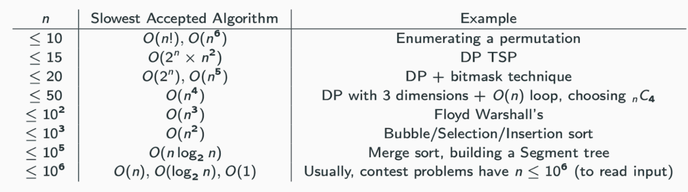
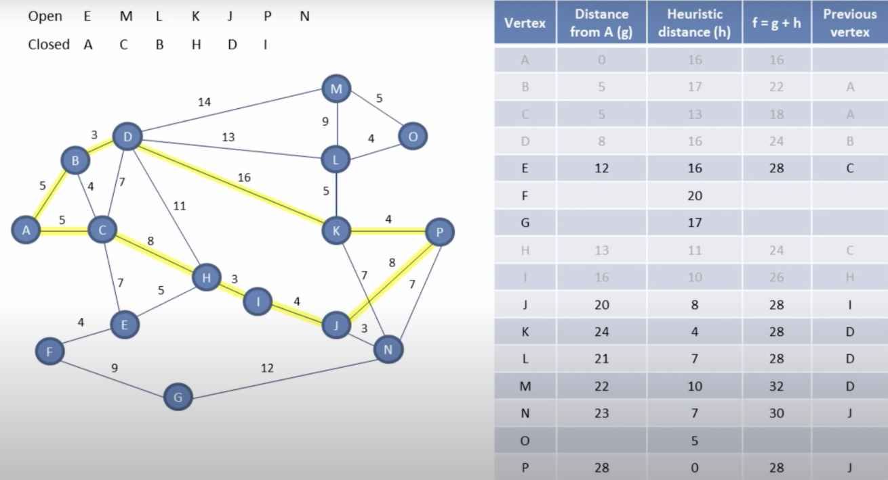

# Algorithm



| name            | Memory   | Time     |
| --------------- | -------- | -------- |
| Brute Force     | O(1)     | O(N)     |
| Dynamic Program | O(N^2)   | O(1)     |
| Segment Tree    | O(N)     | O(log N) |
| Sparse Table    | O(NlogN) | O(1)     |
| LCA             | O(N)     | O(1)     |

## Greedy

[greedy](https://www.youtube.com/watch?v=ARvQcqJ_-NY)

> Exchange Argument

* OS be a solution achieved by not choosing g.
* Show how to transform OS into some solution OS' that chooses g, and that is at least as good as OS.

1. Say G is the event with the earliest finish time. (First greedy decision: include G).
2. Let OS be a legal schedule that doesn't include G such that $$ |OS'| \geq |OS|%0 $$
3. Let the events in OS be $$ j_1, ..., j_k%0 $$ ordered by start and finish times ( $$ J_1 \neq G%0 $$ ) (Exchange Arg)
    * Must show that OS' is a valid solution
    * OS' is better than OS

* Use 1-3 in an inductive argument

```text
Base case : the greedy strategy works for an instance of size 1.
IH : Assume the greedy works for all instances of size < n.
```

$$ |O S(I)| \leq\left|O S^{\prime}(I)\right|=\left|\{g\} \cup S\left(I^{\prime}\right)\right| \leq\left|\{g\} \cup G S\left(I^{\prime}\right)\right|=|G S(I)|%0 $$

> Minimum $ rooms

* Algorithm
  * Number each room from 1 to n.
  * Sort the events by earliest start time.
  * Put the first event in room 1.
  * For events 2...n, put each event in the smallest numbered room that is available.

* Proof
  * Let t be a certain time during the conference.
  * Let B(t) be the set of all events that are happening at time t
  * Let R be the number of rooms in an arbitrary valid schedule.
  * Let L be a lower bound on the number of rooms for all solutions, max_t|B(t)|.
  * Let k be the number of rooms needed for the greedy strategy
  * WWS At some point, t

 $$ |B(t)| k $$

* Let t be the starting time of the first event to be scheduled in room k
* Then room k was the minimum room number available at that time
* This means at time t, there were events going on in rooms 1, ..., k -1 plus the event in room k

### Two_pointer

## Dynamic_programming

* an optimization problem on DAGs
* Each subproblem is a vertex and there is a directed edge from u to v that is used to calculate v

* Q. Given a target find minimum / maximum, cost / path / sum to reach the target
* A. Choose min / max among all possible paths before current state, then add value for current state

## Divide_Concur

> Master theorem

* Calculates Complexity for divide and conquer algorithm

$$
T(n)=a T\left(\frac{n}{b}\right)+O\left(n^{d}\right)
$$

$$
T(n) \epsilon\left\{\begin{array}{ll}
O\left(n^{d}\right) & \text { top heavy: } a<b^d \\
O\left(n^{d} \log n\right) & \text { steady : } a=b^{d} \\
O\left(n^{\log _{b} a}\right) & \text { bottom heavy: } a>b^{d}
\end{array}\right.
$$

* Proof: After k levels, there are $a^k$ subproblems, each of size $\frac{n}{b^k}$
* So, during the kth level of recursion, the time complexity

$$
O\left(\left(\frac{n}{b^{k}}\right)^{d}\right) a^{k}=O\left(a^{k}\left(\frac{n}{b^{k}}\right)^{d}\right)=O\left(n^{d}\left(\frac{a}{b^{d}}\right)^{k}\right)
$$

> Cook Toom

* multiplication algorithm for large integers
* Run Time $Θ(n^{1.46})$

## Knapsack

## Recursion

[Recursion](https://www.youtube.com/watch?v=kx6DfrYfWnQ)

[Finbonacci](https://www.youtube.com/watch?v=zg-ddPbzcKM)

### backtracking

* Bounding function : kill some live nodes without actually expanding them
* generic method that can be applied to problems with large solution set, in search and optimization problems
* often be a first step towards finding a greedy or dynamic programming algorithm
* often gives a more efficient runtime over exhaustive search or brute force
* but may not result in a polynomial time algorithm, and is usually an improved exponential time (also for NP-complete problems)
* Often, they are better on typical inputs that their worst-cast
* Difference between divide and conquer is decrease size by a factor vs difference.

* Instance : What does the input look like?
* Solution format : What does the output look like?
* Constraints : What properties must a solution have?
* Objective function : What makes a solution have?




```py
# return all subset →  Without backtracking
def subsets(li):
  res = []
  dfs(sorted(li), 0, [], res)
  return res

def dfs(li, i, cur, res):
  res.append(cur)
  for i in range(i, len(li)):
    dfs(li, i+1, cur+[li[i]], res)

# return all subset that sums up to target → With backtracking
def combinationSum(li, targ):
  res = []
  dfs(sorted(li), targ, 0, [], res)
  return res

def dfs(nums, target, idx, cur, res):
  if targ < 0:
    return                    # backtracking
  if targ == 0:
    res.append(cur)
    return
  for i in range(i, len(li)):
    dfs(li, targ - li[i], i, cur + [li[i]], res)
```




> 8 Queen

* Put 8 queens on a chessboard such that no two are attacking
* Brute force : Put all possible arrangements of 8 queens on the chess board
* Instance : An empty 8 x 8 chess board
* Solution format : A placement of 8 queens
* Constraint : No two queens are attacking
* Object : Find a solution with the constraint
* Consider one row at a time, eliminating possible non-solution board positions early in their construction.

## Path

* [DFS BFS](https://www.youtube.com/watch?v=pcKY4hjDrxk)

> BFS

* Algorithm

```text
procedure BFS(G, s)
    for each vertex u in V:
        dist(u)=∞
    dist(s) = 0
    Q = [s] (queue just containing s)
    while Q is not empty
        u = eject(Q)
            for all edges (u,v) in E
                if dist(v)=∞ then
                    inject(Q,v)
                    dist(v)=dist(u) + 1
```

* Proof

```text
After BFS is done, dist(v) is the length of the shortest path from s to v
→ After every iteration, dist(v) is the length of some path from s to v.

loop invariant
← After BFS is done, dist(v) is the length of the shortest path from s to v for all vertices v in V.

Suppose there is a path p from s to v such that length(p) < dist(v)
Then let z be the last vertex in the path s.t. dist(z) = d(z) and let w be the first vertex in thee path s.t. dist(w) > d(w)

Case 1: d(w) = d(z) + 1. Then in the algorithm z is put in the queue before q and when z is ejected, w is injected with dist(w) =
Case 2: d(w) > d(z) + 1. Then the path p is actually not the shortest path.

# Complexity
Notice that in BFS, each vertex enters the queue (F) at most one time.
This was the assumption we made about graph search when we calculated its Complexity.
So BFS runs in O V + E time.
```

> DFS

* Algorithm

```py
def dfs(i, j):
    if 0 <= i < len(G) and 0 <= j < len(G[0]) and G[i][j] == '1':
        G[i][j] = '0'
        list(map(dfs, (i+1, i-1, i, i), (j, j, j+1, j-1)))
        return 1
    return 0
```

* Proof

```text
After BFS is done, dist(v) is the length of the shortest path from s to v
→ After every iteration, dist(v) is the length of some path from s to v.

loop invariant
← After BFS is done, dist(v) is the length of the shortest path from s to v for all vertices v in V.

Suppose there is a path p from s to v such that length(p) < dist(v)
Then let z be the last vertex in the path s.t. dist(z) = d(z) and let w be the first vertex in thee path s.t. dist(w) > d(w)

Case 1: d(w) = d(z) + 1.
Then in the algorithm z is put in the queue before q and when z is ejected, w is injected with dist(w) =
Case 2: d(w) > d(z) + 1.
Then the path p is actually not the shortest path.
```

* Complexity

```text
Notice that in BFS, each vertex enters the queue (F) at most one time.
This was the assumption we made about graph search when we calculated its Complexity.
So BFS runs in O V + E time.
```

> Dijkstra

* Doesn't work for negative edge weight

* Proof

```text
Claim: After Dijkstra’s is done, dist(v) is the length of the shortest path from s to v.
(→) After every iteration, dist(v) is the length of some path from s to v.
(←) After Dijkstra’s is done, dist(v) is the length of the shortest path from s to v for all vertices v ∈ V.
```

* Complexity

```text
O(V * O(deletemin) + E * O(decreasekey))
```

| Type        | Array                               | Heap                               |
| ----------- | ----------------------------------- | ---------------------------------- |
| Approach    | indexed by vertex, giving key value | each key value is less than parent |
| deletemin   | O(V)                                | O(log(V))                          |
| decreasekey | O(1)                                | O(log(V))                          |

> A*



> Prims Algorithm

```text
Put all vertices in U.
Pick any vertex s to start from.
Put s in X.
Repeat until all vertices are in X.
    Find the minimum edge that has one vertex in X and one vertex in U.
    Move the endpoint that is in U to X.
    Add that edge to the output.
```

> Kruskal Algorithm

* Pick the next lightest edge that doesn't create a cycle

```text
Given an undirected, connected graph with positive edge weights:
    Start with only the vertices.
    Repeat until graph is connected:
        Add the lightest edge that doesn't create a cycle
```

> Bellman Fold

* Single source shortest path in O(V x E)
* Can be used to detect negative-weight cycles

```py
def bellman_ford(G, source):
  dist, pre = dict(), dict()
  for node in G:
    dist[node], pre[node] = float('inf'), None
  dist[source] = 0

  for _ in range(len(G) - 1):
    for node in G:
      for nei in G[node]:
        if dist[nei] > dist[node] + G[node][nei]:
          dist[nei], pre[nei] = dist[node] + G[node][nei], node

for node in G:
  for nei in G[node]:
    assert dist[nei] <= dist[node] + G[node][nei], "Negative weight cycle."

return dist, pre
```

> Floyd

* all pairs shortest pathSoftest path from every pair in O(V^3)

## Ordering

## Cut

> Strongly Connected Component

* [Visualization](https://www.cs.usfca.edu/~galles/JavascriptVisual/ConnectedComponent.html)
* [Strongly Connected Component](https://www.youtube.com/watch?v=RpgcYiky7uw)

```text
Run DFS on G and order the vertices in decreasing order of the postnumbers from the previous step.
Every time DFS increments cc, you have found a new SCC.

Complexity    O(V + E)
```

* Union find

```py
def find(x):
    if x != UF[x]:
        UF[x] = find(UF[x])
    return UF[x]
def union(x, y):
    UF[find(x)] = find(y)

def countComponents(edges: List[List[int]]) -> int:
    UF = list(range(len(edges)))
    for x, y in edges:
        union(x, y)
     return len({find(x) for x in range(len(edges))})
```

## Streaming

> Lossy count algorithm

* Identify elements in a data stream whose frequency count exceed a threshold (ranking)

* Step 1: Divide the incoming data stream into buckets of width  w = 1 / e, where e is mentioned by user as the error bound (along with minimum support threshold = σ)
* Step 2: Increment the frequency count of each item according to the new bucket values. After each bucket, decrement all counters by 1.
* Step 3: Repeat – Update counters and after each bucket, decrement all counters by 1.


