# Computer Science

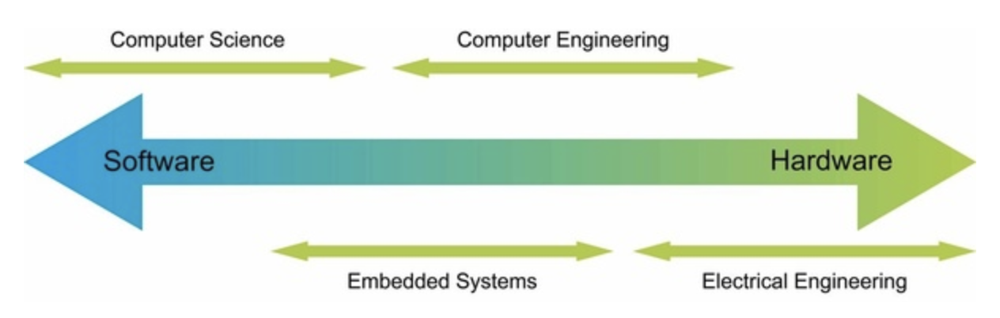

> Program

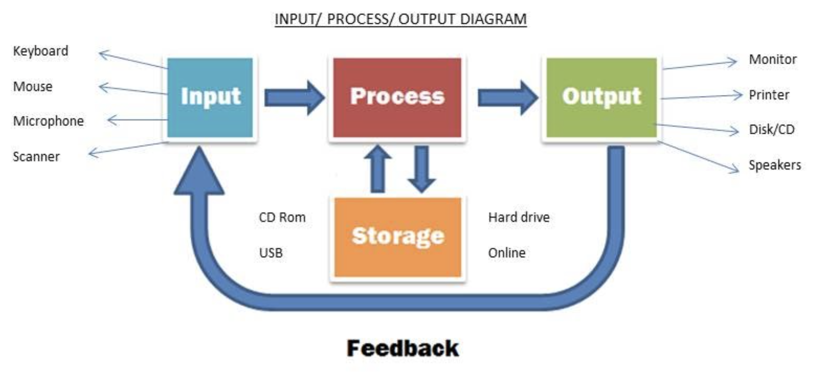

* Input
  * Keyboard, Scanner
* Output
  * Screen, Headset
* Input + output
  * Touch screen, Digital camera

### Hardware


> Term

* ALU (Arithmetic / logic unit)
  * combinational digital circuit that performs arithmetic and bitwise operations on integer binary numbers

* Amdahl's Law
  * when we speed up one part of a system, the effect on the overall system performance depends on both how significant this part was and how much it sped up

$$
S= T_{\text {old }} / T_{\text {new }} = \frac{1}{(1-\alpha)+\alpha / k}
$$

* Architecture
  * determine arch or uname -m command
  * 64-bit extension of arm

| Type         | ARM                            | x86                            |
| ------------ | ------------------------------ | ------------------------------ |
| CPU          | Reduced Instruction Set (RISC) | Complex Instruction Set (CISC) |
| Instruction  | Single instruction per cycle   | More than a cycle              |
| Optimization | with software focused          | with hardware focused          |
| Memory       | More (Less Registers)          | Less (More register)           |
| Calculation  | Uses available memory          | Need supplement memory         |
| Usage        | Mobile                         | Game                           |
| Venter       | ARM                            | Intel (80**)                   |

* Bus
  * carry bytes of information back and forth between the components

* Data processing unit
  * new class of programmable processor and will join CPUs and GPUs as one of the three pillars of computing

* DMA (Direct memory access)
  * Access data from I/O and memory without CPU
  * designed to transfer fixed-size chunks of bytes known as words
  * bytes in a word (the word size) is a fundamental system parameter that varies across systems (32 bits / 64 bits)

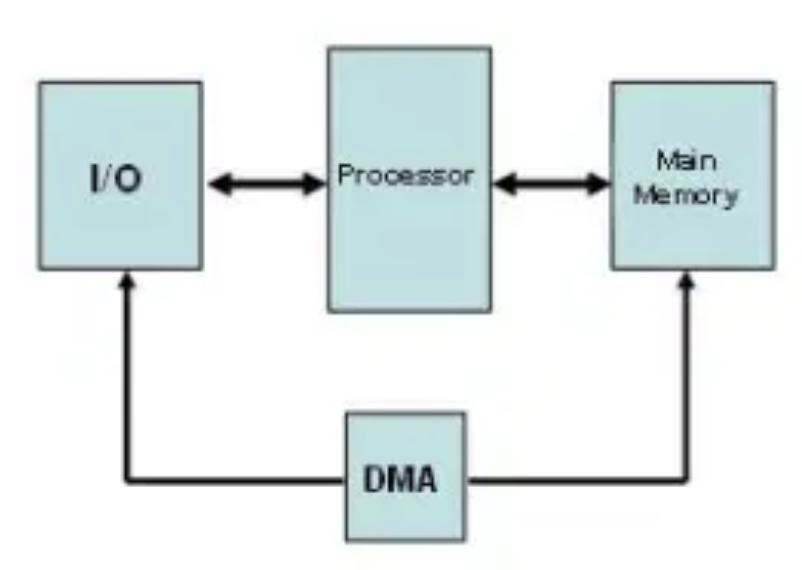

* Burst Mode : Block level data
* Cycle stealing Mode : CPU prioritize DMA, 1cycle break, fast IO

* I/O devices
  * long-term storage of data
  * Connected to I/O bus by controller or adapter -> transfer information between the I/O bus and an I/O device
  * Controller : chip sets in the device itself, or on the system's main printed circuit board (motherboard)
  * Adater : Card that plugs into a slot on the motherboard

* Post Processing Engine
  * Bias add, scale, shift + Activation function
  * Programmability

* Yocto project
  * OpenEmbedded Core (oe-core) contains base layer of recipes, classes and files

> Mender

* open-source project for updating embedded Linux devices (IoT)
* based on client-server architecture, where server uses the microservices design pattern
  * multiple small and isolated services that make up the server
  * Docker Compose environment brings all these components up and connects them to store and control the deployment of software updates OTA to the device
* Web UI or REST APIs can be used for device management and also for uploading and deploying updates
* Pros
  * Roll-back if the update fails
  * Atomic updates (no partial install)
  * Compatibility check (verifies if the artifact was created for that device type)
  * The authenticity of update images (update signature verification)
  * Persistent data storage


### Component

* Cooling
  * Heat sink fan majority
  * Thermal compound for cpu fill in the gap
  * Water vs air cool
  * Pump housing
  * More quiet expensive

* Firmware
  * programs stored in ROM devices

* HDD (Hard disk drive)
  * Every program has different pagemap (memory map) / page sizes is around 4 KB


* Solid State Drive (SSD)
  * Server-based SSDs serves as a cache server or as persistent storage
  * fast scratch disk for frequently accessed data

* Motherboard
  * Cpu memory bus(extra) sata connection m.2
  * North bridge south bridge platform controller chip
  * Network interface chip, integrated sound card
  * Atx

* Paging
  * OS retrieves data from secondary storage in same-size blocks to the main memory
  * convert virtual frame number into the physical frame number
  * table lookaside buffer gets flushed in context switch

* CPU (Central processing unit)
  * Interprets (or executes) instructions stored in main memory
  * its core is a word-size storage device (or register) called the program counter (PC)
  * calculate 1 billion operations per second / 0.3 nano per operation → cooler
  * Load: Copy a byte or a word from main memory into a register, overwriting the previous contents of the register.
  * Store: Copy a byte or a word from a register to a location in main memory, overwriting the previous contents of that location.
  * Operate: Copy the contents of two registers to the ALU, perform an arithmetic operation on the two words, and store the result in a register, overwriting the previous contents of that register.
  * Jump: Extract a word from the instruction itself and copy that word into the program counter (PC), overwriting the previous value of the PC

* GPU
  * specialized for graphics

* VPU
  * specialized for visions

* Register
  * Memory in cpu (16 registers / each store 64 bit for 64-bit cpu)
  * Register instruction pointer (intel 64)

### Cache


* L1, L2 are implemented using SRAM (static random access memory)
* L1 cache
  * 10,000 bytes
  * on processor chip accessed nearly as fast as the register file
* L2 cache
  * 0.1m - 1m bytes
  * connected to processor by special bus, 5 ~ 10 times slower than L1

> Mapping

* Direct Mapping
  * each block of main memory maps into one unique line of cache
  * bad when a program accesses 2 blocks that map to the same line
  * victim cache doesn't swap data to main memory but places into a specified line of cache


* Associative Mapping
  * Full associativity mapping searches tag through entire cache
  * locality of reference principle: recently requested data is likely to be requested again
  * main memory: 256 blocks of 128 Kbits.
  * cache memory: 16, 32-bit words and capacity of 32k words.

> Question

* 22-bit address space, 512-byte cache, a cache block size of 64 bytes. Bits for index/tag?
  * 3 / 13

## Operating System

* availability : make usre system operates correctly and efficiently in an easy-to-use manner
* resource manager : virtualize resources (CPU, memory, disk) using file, virtual memory, process

* Design Goals
  * abstraction : provide applications with simple, uniform mechanisms for manipulating complicated and different low-level hardware devices
  * persistency : stores files persistently, thus making them safe over the long-term
  * concurrency : protection between applications, as well as between the OS and application
  * efficiency : time, memory wise
  * security : protect the hardware from misuse by runaway applications
  * mobility : increasingly important as OSes are run on smaller and smaller device


> Terms

* Context switching
  * Storing the state of a process or thread, so that it can be restored and resume execution at a later point
  * Allows multiple processes to share a single central processing unit (CPU)
  * Essential feature of a multitasking operating system

* DOS (the Disk Operating System)
  * didn’t think memory protection was important -> malicious application could scribble all over memory

* Kernel
  * Allocate resources, memory, CPU, network
  * Transition from one process to another is managed by the operating system kernel
  * Most applications are not self-contained and make calls (system calls) to Linux kernel and library
  * Kernel time is the time spent in Linux kernel, and user time is time spent in application or library code
  * not a separate process. a collection of code and data structures that the system uses to manage all the processes


* limited direct execution (LDE)
  * 1: initialize trap table, and CPU remembers its location for subsequent use (priviledge instructions)

* User mode
  * applications do not have full access to hardware resources
* Kernel mode
  * OS has full access to the resouces
* Trap table
  * set up in boot time with privileged mode
  * tell hardware what code to run when exceptional events occur

* System call : allow the kernel to carefully expose certain key pieces of functionality to user programs
  * protection: user code cannot specify an exact address to jump to, but rather must request a particular service via number
  * system-call number is assigned to each system call
  * aka OS provies a standard library to applications (ex: open(), read())

> File system

* UMA
  * All processors access the same memory with global address space
  * Responsibility on the programmer to synchronized memory accesses
  * Symmetric multiprocessing (SMP)
  * Cache coherence → have same cache memory
  * most modern multi-core CPUs, cache coherency is usually handled by the processor hardware


* NUMA
  * Adding more processor to a shared memory system increase traffic on the shared memory bus


* Distributed Memory
  * Programmer should define how/when data is communicated between the nodes in distributed system
  * Scalable → off-the-shelf computers, networking equipment to build distributed memory systems


### Process

* operating system’s abstraction for a running program
  * program appears to have exclusive use of both the processor, main memory, and I/O devices
* sends parents to exit code when exit
* zero is special called init → process that starts the rest
* most systems, there are more processes to run than there are CPUs to run them
* Traditional systems could only execute one program at a time, while newer multicore processors can execute several programs simultaneously

> Switch

* cooperative approach
  * OS truts the process of the system to behave reasonably
  * the OS regains control of the CPU by waiting for a system call or an illegal operation of some kind to take place

* Non-Cooperative approach
  * A timer device raises an interrupt every so many milliseconds, pre-configured interrupt handler in the OS runs
  * Sceduler : whether to continue running the currently-running process, or switch to a different one
  * context switch : : all the OS has to do is save a few register values for the currently-executing process

> Thread

* Easier to share data between threads
* Multithreading make program run faster when mulitple processors are available

### Virtual Memory

* divided into virtual frame number and offset
* Virtual address space





```cpp
#include <unistd.h>
#include <stdio.h>
#include <stdlib.h>

int main(int argc, char *argv[]) {
  int *p = malloc(sizeof(int));
  assert(p != NULL);
  printf("(%d) address pointed to by p: %p\n", getpid(), p);
  *p = 0; // a3
  while (1) {
    Spin(1);
    *p = *p + 1;
    printf("(%d) p: %d\n", getpid(), *p); // a4
  }
  return 0;
}
// ./mem &; ./mem &
// p : 1
// p : 1
// p : 2
// p : 2 ...
```




### Memory

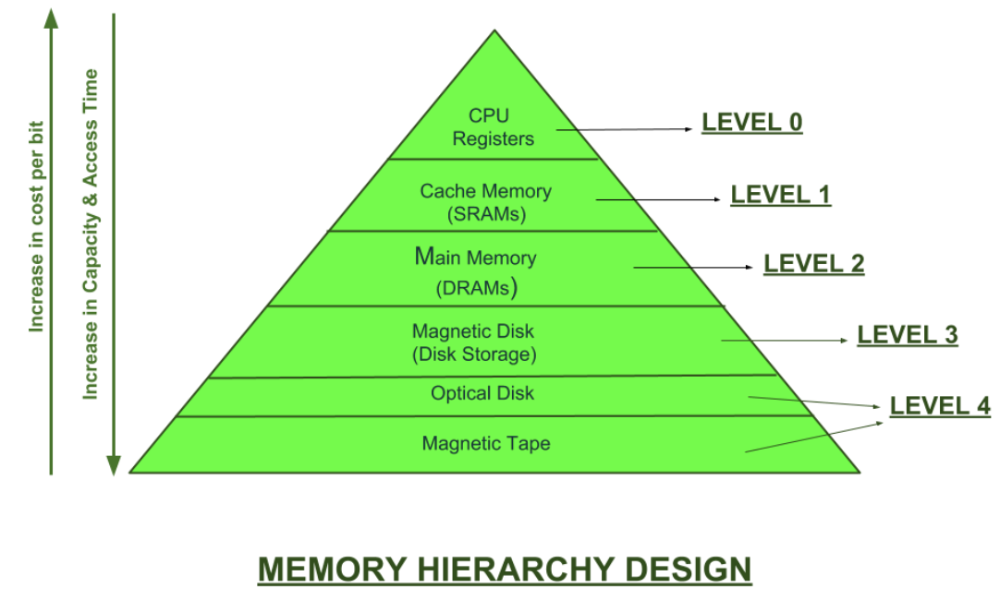

* storage at one level serves as a cache for storage at the next lower level

```sh
1 byte = 8 bits
1 kilobyte (K / Kb) = 210 bytes = 1,024 bytes
1 megabyte (M / MB) = 220 bytes = 1,048,576 bytes
1 gigabyte (G / GB) = 230 bytes = 1,073,741,824 bytes
1 terabyte (T / TB) = 240 bytes = 1,099,511,627,776 bytes
1 petabyte (P / PB) = 250 bytes = 1,125,899,906,842,624 bytes
1 exabyte (E / EB) = 260 bytes = 1,152,921,504,606,846,976 bytes
```

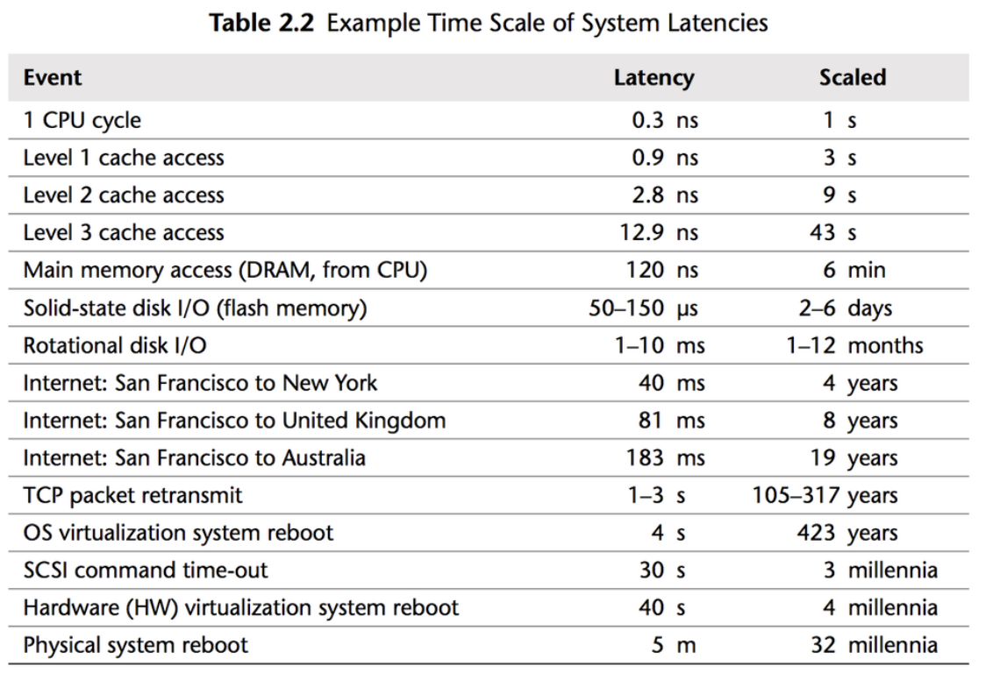

* Disc
  * In order to access a particular byte, track #, sector #, offset needed.
  * Each block usually contains 512 bytes.
  * Data must be brought to main memory (RAM)
  * Hard Disc: slow, Sequential access, permanent

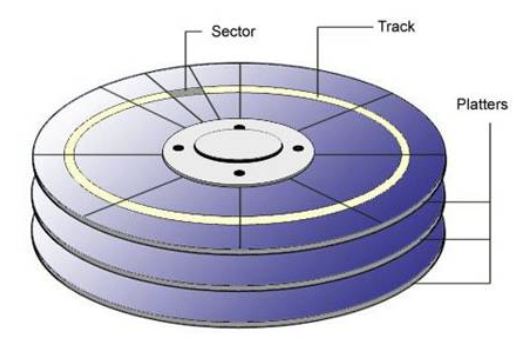

* Main Memory
  * temporary storage device that holds both a program and the data it manipulates while the processor is executing the program
  * fast, random access, temporary
  * dynamic RAM
  * divided into physical frame number and offset
  * Physically consists of DRAM (dynamic random access memory) chips
  * Logically organized as a linear array of bytes with its unique address starting at zero
  * a few of these simple operations, and they revolve around main memory, the register file, and the arithmetic/logic unit (ALU)

* Random Access memory
  * volatile
  * RAM - CPU : 0.1 microsecond
  * SSD : 50-150 microsecond
  * Hard Disk : 1000 microseconds
  * SRAM, DRAM, SDRAM, PSRAM, DDR SDRAM

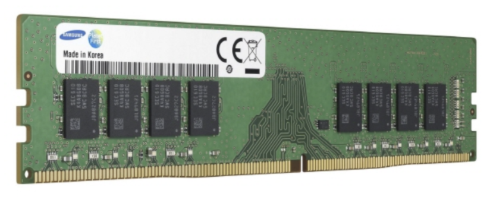

### Caching

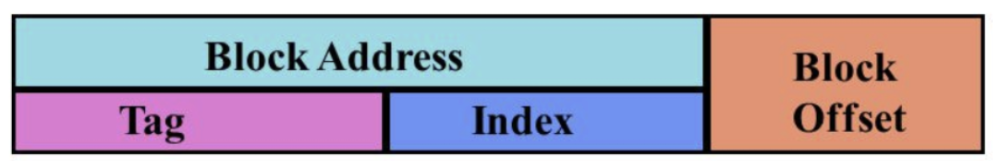

* temporal/spatial locality
* static RAM is used

* 2j : associativity
* 2k : cache entries (indices)
* 2m : address
* 2n : block size
* line : of bits (aka, index)
* tag : of lines required to uniquely identify a memory address block
* word :  least significant bits which uniquely identify a word on a line of cache

> Invalidation

* Write-through
  * when data hit / use the memory again soon
  * [+] complete data consistency between cache and storage
  * [+] nothing lost in crash, power failure
  * [-] higher latency

* Write-back
  * When data hit
  * doesn’t use the memory again

* Write-allocate
  * When data misses
  * use the memory again soon

* No-write-allocate
  * When data misses
  * doesn’t use the memory again

> Eviction

* First In First Out (FIFO)
  * evicts the first block accessed first without any regard to how often or how many times it was accessed before.
* Last In First Out (LIFO)
  * The cache evicts the block accessed most recently first without any regard to how often or how many times it was accessed before.
* Least Recently Used (LRU)
  * Discards the least recently used items first.
* Most Recently Used (MRU)
  * Discards, in contrast to LRU, the most recently used items first.
* Least Frequently Used (LFU)
  * Counts how often an item is needed. Those that are used least often are discarded first.
* Random Replacement (RR)
  * Randomly selects a candidate item and discards it to make space when necessary

### File system

> Term

* File allocation table
  * directory entry points to the first block in the file

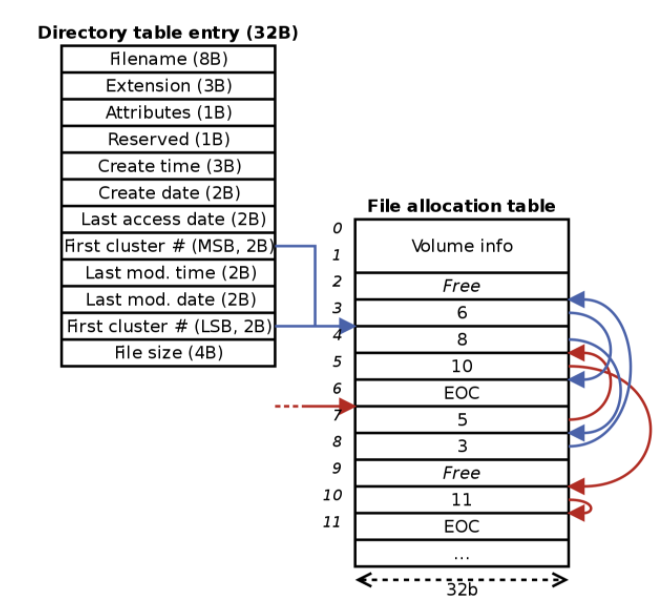

* Inode structure

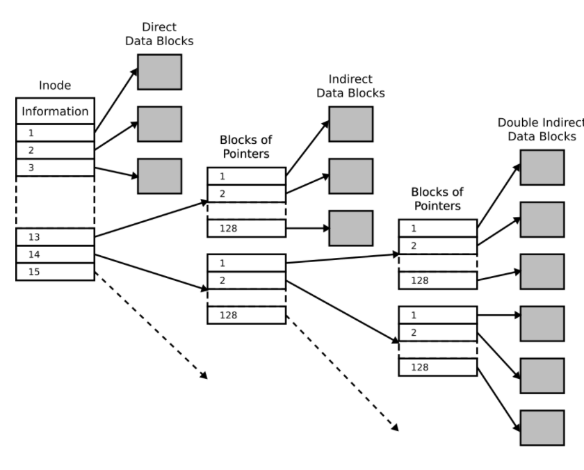

* Load Balance
  * reduces individual server load to prevents server from becoming a single point of failure
  * improving overall application availability and responsiveness
  * second load balancer can be connected to the first to form a cluster

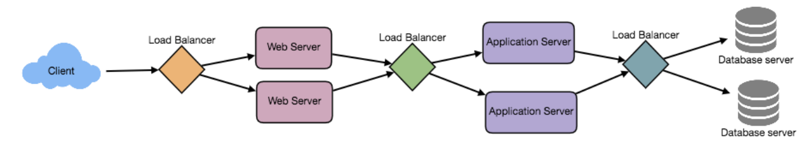

| Type       | preemptive                           | non-preemptive                             |
| ---------- | ------------------------------------ | ------------------------------------------ |
| Overview   | resource allocated to limited time   | can be interrupted                         |
| resource   | allocated until its burst time       | cannot be interrupted                      |
| Cpu        | High                                 | Low                                        |
| Overhead   | Yes                                  | No                                         |
| Starvation | Possible                             | Impossible                                 |
| Example    | Round Robin, Shortest Remaining Time | First come First serve, Shortest Job First |

### Scheduling

* Least Connection
  * useful when many persistent client connections that are unevenly distributed between servers

* Least Response Time
  * directs traffic to the server with the fewest active connections and the lowest average response time

* Least Bandwidth
  * selects the server that is serving the least amount of traffic measured in megabits per second (Mbps)

* Round Robin


* useful when not many persistent connections and the servers are of equal specification

* Weighted Round Robin
  * Better handle servers with different processing capacities

* IP Hash
  * hash of the IP address of the client is calculated to redirect the request to a server

## Network

* Troubleshoot
  * Failure → Check other website
  * check other computer
  * check DHCP

> Terms

* Anycast
  * to route traffic to different destinations depending on factors like location, congestion or link health

* Autonomous system
  * collection of networks that all fall under the control of a single network operator

* BGP
  * Border Gateway Protocol
  * Routers share data via this protocol, learn about the most optimal paths to forward traffic

* Broadband connection
  * Always on → long lasting connections that don't need to be established with each use

* Dial-UP
  * connection is established by actually dialing a phone number → phone line at about a 110bps

* Encapsulation
  * entirety of a packet at one layer becoming payload section at another layer is known
  * IP datagram (packets) encapsulates a TCP segment

* Extranet
  * privately held WAN infra generally owned by one company or organizations
  * may allow other access for a fee for specific purposes
  * can be an intranet with selective business-related access
  * used to carry a wide variety of services like internet
  * ex: Azure, AWS, GCP

* RFC
  * request for comments
  * responsible for keeping the internet running to agree upon the standard requirements

* Root server
  * 13 were distributed to very specific geographic regions → now, distributed across the globe via anycast
  * 13 authorities that provide route name lookups as a service


* SOA (Start of Authority)
  * establishes a zone and maintains authority over the zone.
  * authority-domain.        # trailing dot is important

* Hypervisor
  * Software that manages VM while offering guests virtual operating platform indistinguishable from hardware

* IANA
  * Internet Assigned numbers authority
  * non-profit organization that helps manage IP address allocation, Autonomous System number allocation

* ICANN
  * Internet Corporation for Assigned Names and Numbers, nonprofit organization
  * Coordinating the maintenance of databases related to namespaces and numerical spaces of the internet
  * Ensure the network's stable and secure operation

* ICMP (internet control message protocol)


* ICS
  * Industrial Control System
  * normally refers to smaller-scale systems
  * Industrial automation
  * ex. Control system for power plant and factory

* ISP (Internet service provider)
  * X Internet Secure Payment, mostly handles routing issue
  * KT, SK, LG U+

* Internet
  * Worldwide publicly accessible infrastructures of cables, routers, switches, servers
  * Used to carry a wide variety of services
  * ex. World Wide Web, email, file transfer protocol, VoIP, streaming video, gaming, etc

* Intranet
  * the privately accessible infrastructure of cables, routers, switches, and servers
  * generally limited to a single company, organization, or group of companies
  * used to carry a wide variety of services like the internet

* Medianet
  * networks optimized for distributing large video applications and similar technologies
  * uses smart bandwidth detection systems
  * provides smooth video transmission on any platform
  * ex. Hulu, Netflix, WebEx, and GoToMeeting

* NAT (Network address translation)
  * allows a gateway (router, firewall) to rewrite source IP of outgoing IP datagram while retaining the original IP in order to rewrite it into the response
  * solves IPv4 exhaustion by using non-routable address space
  * One to many NAT masquerade IP


* Non-Routable Address Space
  * 10.0.0.0/8
  * 172.16.0.0/12
  * 192.168.0.0/16

* NTP (Network Time Protocol)
  * used to keep all computers on a network synchronized in time

* ping
  * Lets you send a special type of ICMP message called an Echo Request
  * If destination is up and running, it sends back and ICMP Echo Reply message
  * How large the ICMP message in bytes
  * how long it took for the round trip communication

* POTS (Plain Old Telephone Service)
  * aka Public Switched Telephone Network or PSTN
  * System they built is known as USENET → increased to 300bps

* Registrar
  * organization responsible for assigning individual domain names to other organizations or individuals

* SCADA (Supervisory control and data acquisition)
  * refers to networks and technologies used to control industrial application
  * SCADA is a subset of ICS → describes a system that spans large geographic areas
  * ex. pipelines, power distribution and water

* Service record (SRV)
  * define location of various specific services
  * often used to return the records of services like CalDAV, which has a calendar and scheduling service

* Split horizon
  * method of preventing a routing loop in a network

* tracert
  * discover the path between two nodes, and gives you information about each hop along the way

* Traffic
  * choose routes that have less traffic to speed up the data getting to the destination it is intended for

* Virtualization : concept of a physical, logical machine to be abstracted away from each other
  * a single physical machine called a host could run many individual virtual instances called guest

* virtual private cloud (VPU)
  * demand configurable pool of shared resources allocated within a public cloud environment, providing a certain level of isolation between the different organizations (denoted as users hereafter) using the resources
  * LB 80 443

* Zone
  * contains SOA and NS
  * allow for easier control over multiple levels of a domain by using a hierarchy
  * web, mail, ftp, dns, voip, proxy server should be placed in Demilitarized Zone(DMZ)


> Connection

* Client-server network
  * All devices access resources through a central server and devices needing access are clients
  * network management is overseen by server
  * security build around access to the server
  * server allows or restricts access to network resources → goes down, no one cannot access


* Peer-to-peer
  * computer responsible for own security and management
  * each computer-managed as separate device
  * usually only used for a very small network → Microsoft limits to only 10 systems per network
  * ex. Homegroup, workstation, most home networks


* Point to point
  * connects two nodes directly to each other with no intervening device
  * ex. two ends of a WAN connection, computer to switch, switches or routers to each other

* Point-to-Multiple
  * Crossover cable connecting two computers
  * Often part of a hybrid system

> Topology

* Networks can have different physical and logical topologies
* logical refers to how data moves through the network, patterns of data flow in a network
* refers to the physical layout of the wires in a network

* Bus
  * One of the oldest networking topologies
  * All nodes connect directly to the main cable called the bus → Simple to put together
  * Only one node can send a signal at a time → the more nodes active, the more collision on networks
  * The contention is used to determine which nodes send signals
  * After the collision, all nodes again contend to send a signal
  * Recommended for 30 nodes or less
  * [-] Single bad node or cable brings down the whole network
  * [-] Not part of current TIA/EIA 568-C standard


* Ring
  * Packets move in a ring around a network
  * Each node is given an opportunity to send a signal
  * No contention between nodes
  * Heavy traffic will not bring down the network → slow down

* Full mesh
  * All devices directly connected to all other devices → most expensive type of topology
  * Provides full redundancy
  * Requires multiple NICs and cables for each node
  * ex. WAN environment

* Partial mesh
  * All devices directly connected to at least two other devices
  * Provides strong redundancy but not full redundancy
  * Multiple NICs and cable runs on each machine
  * WAN environment → internet

* Hybrid
  * combines normal str with some other topology
  * physical hybrid star vs physical-logical
  * ex. ring + star / bus + star

* Physical Logical
  * Network physically looks one way but functions differently
  * ex. ring networks that look like a star or star using a hub


* Star
  * Won’t bring down the network with one damaged node
  * All nodes connected to a central hub or switch → easily to troubleshoot
  * it’s susceptible to a single point of failure
  * recognized in TIA/EIA 568-C standard
  * ex. LANs


> Metric

* Hop
  * number of nodes a packet has to pass through in order to get to its destination

* Reliability
  * Keep a long-term log of reliability of different routes

* Throughput
  * amount of data that can pass through a link in a specific amount of time

> Types


* LAN
  * used for connecting personal computers through a communication medium (twisted pair, coaxial cable)
  * TIA/EIA 568-C defines characteristics of LANs
  * normally uses twisted-pair cabling to connect devices → can use fiber optic cables to connect switches
  * Should use CAT 6 or 6A in current LAN builds
  * Hierarchical star only topology recognized by 568-C
  * LAN nodes tied together with switches or hubs
  * ex. buildings, offices, several close buildings.
  * [+] Fast transfer with inexpensive hardware (hubs, network adapters, and ethernet cables), Security

* WLAN
  * Wireless local area networks (Wi-Fi) defined by IEEE 802.11 standard
  * 802.11ac - most current standard 802.11ax - being developed

* PAN
  * Personal area networks defined by IEEE 802.15 standard group, Infrared (IrDA)
  * [+] Limited range of less than 30feet
  * ex. Bluetooth keyboards and mouse/phones

* MAN
  * metropolitan area networks
  * uses the same technology as WANs covers an area of only 50 kilometers or so across
  * A term falling out of use → WAN used to apply to both WANs and MANs

* WAN
  * Stands for wide area networks
  * one large network that covers a large geographic area
  * can be many smaller networks linked into one large one
  * Use routers and switches to connect up networks
  * ex. Internet

> Port

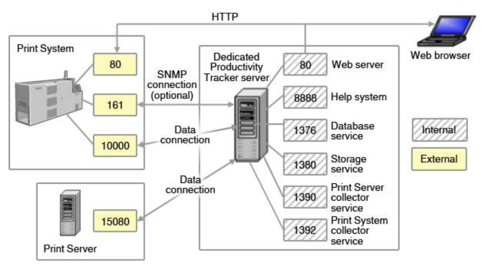

* 16-bit number that's used to direct traffic to specific services running on a networked computer

* 20, 21 : File transfer protocol
* 53 : domain name system
* 80 : HTTP (web service)
* 443 : HTTPS
* 1-1023 : system ports
* 1024-49151 : registered ports
* 49152-65535 : dynamic and/or private ports

* Forwarding
  * port preservation source port chosen by a client is the same port used by the router
* Preservation
  * source port chosen by a client is the same port used by the router

> OSI (Open systems interconnection reference)

* Mnemonic: all people seem to need data processing / please do not throw sausage pizza away
* Created as a reference model and teaching aid → not intended to reflect any actual network architecture
* device to teach how protocols work with networks to carry data
* model for organizations creating new protocols
* abstract model: the actual model with its seven layers
* Set of specifically created protocols → not actually used in any network system
* Telecommunication standardization sector of the international telecommunications union(ITU-T)


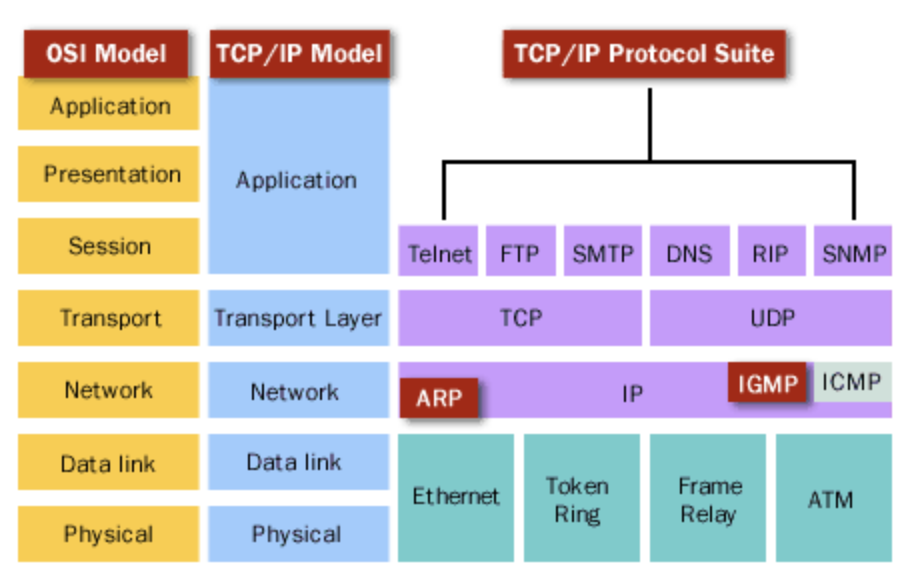

* Divide-and-conquer approach → makes divided into small, manageable tasks to reduce complexity
* Modularity → provides the independence of layers, which is easier to understand and implement.
* Easy to modify →  ensures independence of layers / implementation change without affecting other layers.
* Easy to test →  Each layer of the layered architecture can be analyzed and tested individually

### 1: Pysical

* Transmit data in the form of 1s and 0s (bits)
* Encoding methods to transmit data, bits placement on media, and how bits start/stop
* Media usage, kinds of media permitted, media usage, physical connections, pin usages
* Specifies standards that apply to specific types of media
* Simplex, Duplex communication → information can flow in uni/both directions across cable
* Half duplex → only one device can talk at a time
* modulation varies the voltage of charge moving across the cable

* Polar

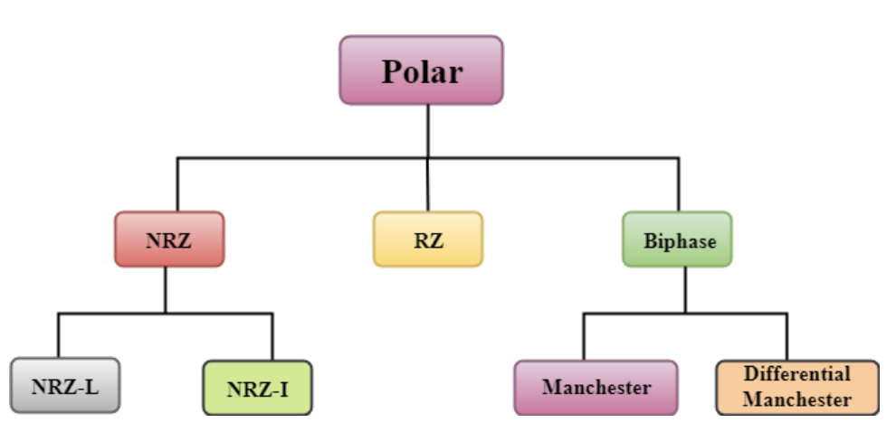

* Bipolar

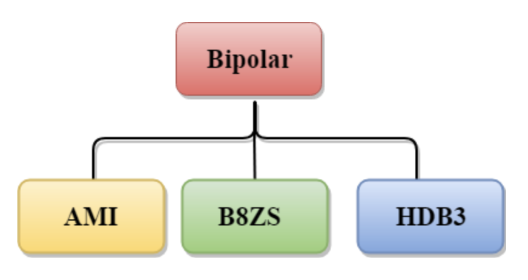

* Unipolar

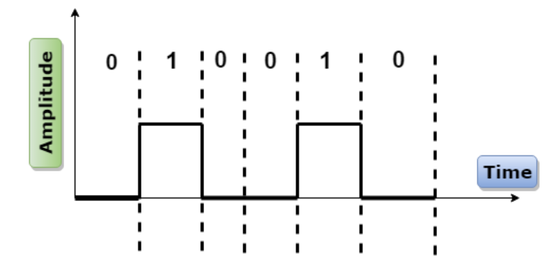

* Pulse Amplitude Modulation
  * not useful in data communication as pulses are not digital → PCM technique

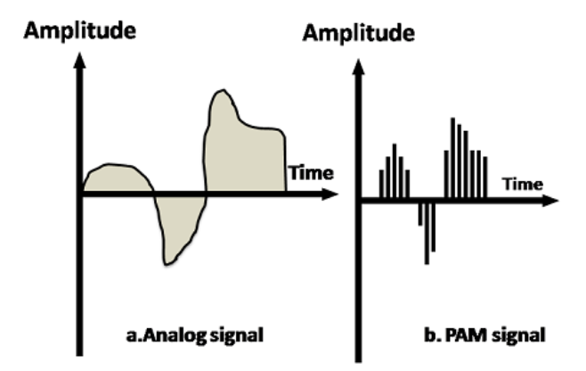

* Pulse Code Modulation

* Modem
  * Baud rate measure of how many bits can be passed across a phone line in a second → 110bps

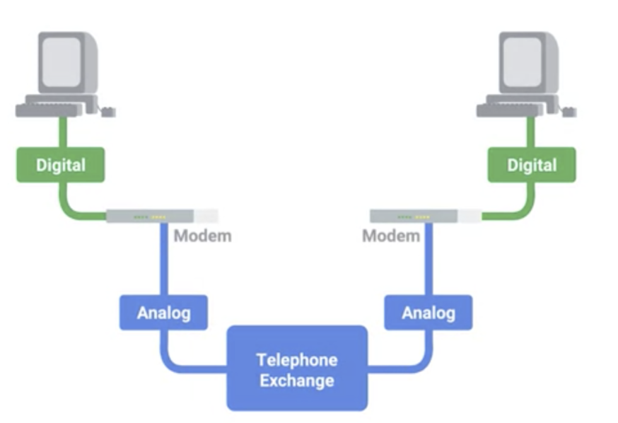

* Hub
  * allow connections from many computers at once
  * Older technology falling out of use → Due to collision domain
  * repeater → Message sent by one host is sent to all other hosts
  * logically function as a bus topology
  * too many host causes collision
  * Intelligent hub has network diagnostic abilities

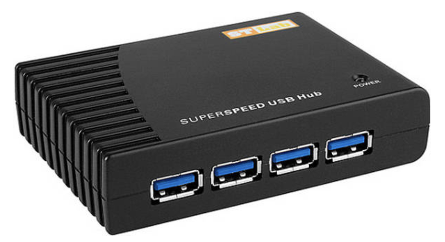

* Passive
  * work like cable splitters
  * the more devices the weaker the signal to each device

* Active
  * central connecting device in network that regenerates signals on the output side to keep the signal strong
  * need a power source → power added to signal when passed through port
  * prevent weakening of signal by multiple devices being attached
  * repeats signal to all hosts connected to hub
  * No more than 5 segments can be linked
  * 4 linking devices only can be used to form segments
  * 3 segments can be populated by computers

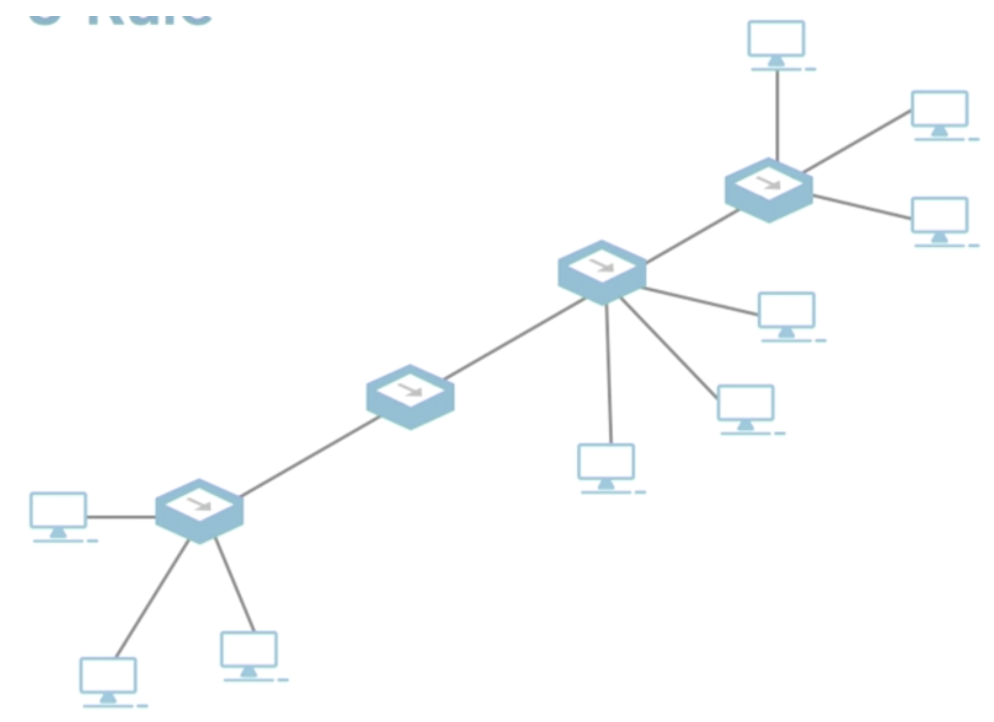

* Cable
  * Link LED flashes when linked, Activity LED flashes when data flows
  * connect different devices to each other, allowing data to be transmitted over them

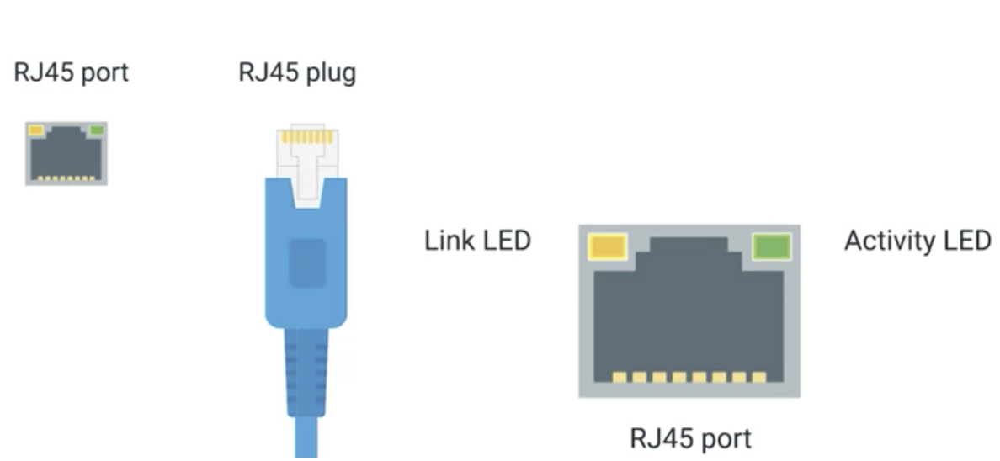

* Copper Cable
  * Multiple pairs of copper wires inside plastic insulator
  * Cat5 < Cat5e < Cat6 to reduce crosstalk → One wire accidentally detected on another wire

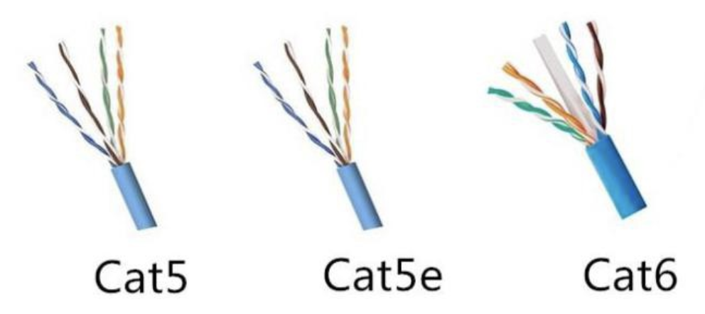

* Fiber Cable
  * Contain individual optical fibers, which are tiny tubes made out of glass about the width of a human hair
  * Much more expensive and fragile

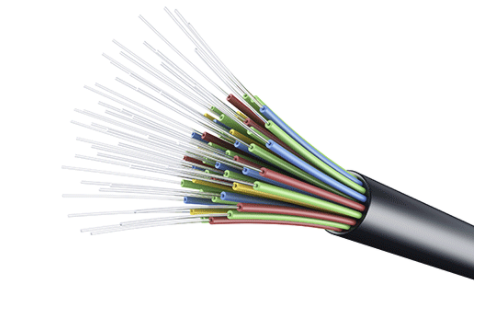

### 2: Data-link (frame)

* Provides error-free transmission of frames from one node to the next over physical media
* Establishes, terminates links between nodes → provides media access management
* Traffic control → transmits, receives frames sequentially
* Detects, recovers errors on physical layer →  retransmit unacknowledged frames
* Frame delimiting / duplicate frame receipt

> Term

* Access points
  * Devices that allow computers to access the network
  * Commonly used to connect home computers to internet
  * Authentication and encryption
  * Combine role of switches and routers

* Bridge
  * Older technology
  * break up a network into smaller segments


* Mac
  * 48-bit number 6 groups of 2 hex # globally unique identifier attached to an individual network interface
  * Controls the hardware responsible for interaction with the wired, optical or wireless transmission medium
  * Addressing of destination stations (one or groups) / source-station addressing information


* NIC
  * network interface card or controller
  * allows computer or other device to access the network
  * can come in form of an expansion card, USB or built into the motherboard
  * needs to match technology being used → 802.11n Wifi or UTP
  * speed being used → gigabit ethernet speed network
  * network architecture → token ring network / ethernet network


* Switches
  * device used to connect multiple computers → inspect contents of ethernet protocol data sent in network
  * determine which system data intended and only send that data to one system → reduce collision domain
  * multilayer switch can work on more than 1 layer
  * Multiport bridge → separate larger networks into smaller segments called collision domains


> CSMA

* /CD
  * Carrier sensing Media Access / Collision Detection
  * Node listens for traffic on a network → if traffic not heard, node releases packet onto the network
  * if two nodes release packets at the same time, the packets hit each other and a collision occurs
  * a collision causes a power spike heard by all nodes and destroys the data contained in the two packets
  * If collision nodes randomly set internal clock → times up, nodes attempt to send a new transmission
  * If no collision, then the transmission was successful  → network freed up for another node to transmit
  * ex. Ethernet


* /CA
  * Carrier sensing media access / Collision avoidance
  * Releases warning packet before releasing data packet → if warning packet, they won't transmit.
  * Once data packet heard, other nodes are able to transmit
  * two warning packets transmitted at the same time cause a collision
  * ex. WIFI


> Ethernet


* most widely installed LAN technology. Ethernet is a link layer protocol in the TCP/IP stack
* solve collision domain by using CSMA/CD carrier sense multiple access with collision detection
* uses MAC addresses to ensure data has both and address for vendor and receiver of transmission
* Calculated by performing what's known as a cyclical redundancy check against the frame
* CRC for data integrity, polynomial division to create a number that represent a larger set of data

* Preamble
  * seven bytes alternating 0, 1 → buffer between frames, synch internal clocks
  * SFD signals to a receiving device that the preamble is over

* Dest Address
  * Unicast: least sig bit is 0, intended for one address
  * Multicast: least sig bit is 1, dealing for multiple address
  * Broadcast: All 1

* EtherType
  * describes protocol of the contents of the frame
  * Sometimes VLAN presents, and indicates that frame itself is VLAN frame
  * Technique that lets you have multiple logical LANs operating on the same physical equipment

* Payload
  * Contains all the data from higher layers such as IP, transport, and application layers

### 3: Network

* responsible for packet forwarding including routing through intermediate routers
* Don’t know where a certain MAC address locate → not ideal for communicating across distances
* Controls the operations of the subnetwork it is on
* Determines the best physical path for data using network conditions to choose the best path
* Uses priority of services to determine the best path
* number of hops and steps between source and destination, bandwidth, throughput
* Subnet traffic control → let routers send instructions to throttle frame transmissions when buffered filled

> Terms

* Address mapping
  * Translate logical address into physical addresses

* ARP
  * A protocol used to discover the hardware address of a node with a certain IP address
  * ARP table list IP addresses and MAC address associated with them

* Datagram

* Version : IPv4 or IPv6
* Total Length : Indicates total length of IP datagram it's attached to → max packet size 65535
* Header Length : usually 20 bytes for IPv4
* Service types : specify QoS (quality of service)
* Identification : When larger than max packet, indicate it’s same transmission
* Flags : Indicate if allowed to be fragmented, or already been fragmented
* TTL : How many router hops a datagram can traverse before thrown away
* Protocol : Transport layer protocols are used (e.g. TCP, UDP)
* Header Checksum : TTL field updates every router that a datagram touches → Checksum changes too
* Source
* Destination
* Options : Optional used to set special characteristics primarily for testing
* Padding : Series of zeros


* Frame fragmentation
  * Determines frame size of routers located downstream → maximum transmission unit size
  * frame into smaller sizes and reassembles the full frame at destination
* Router
  * Move data around large networks WANs → Inspect IP data to determine where to send things
  * Make independent decisions about forward and send data around network
  * Create and update table based on hop, network traffic, reliability
  * Take traffic originating from home to forward it along to the ISP
  * Need configured interfaces, tell connected networks, criteria for what is allowed through routers
  * Can be programmed for multiple protocol


* Subnet
  * Divide subnet ID / Host ID (1 for broadcast, 0 for ip address)
  * allows routers to send instructions to sending nodes to throttle frame transmissions when buffered filled


* Subnet usage account
  * Allows device to keep track of frames forwarded by subnet intermediate systems
  * Uses this to produce billing information

* Communication subnets
  * Build headers used by network layer on other devices to route packets to destination
  * Relieve higher layers of the need-to-know data transmission and switching technologies
  * Use protocols on lower layers to send data to destinations separated by intermediate nodes
  * Send informations between adjacent nodes

* CIDR
  * C is too small and B is too large → Classless Inter-Domain Routing
  * demarcation point : to describe where one network or system and another one begins

> IP

* V4
  * IP address belong to networks not to the devices attached to those networks
  * static IP addresses are reserved for servers and network devices
  * dynamic IP addresses are reserved for clients
  * address class system way of defining how the global IP address space is split up
  * The loopback IP for IPV4 is 127.0.0.1.


* IPv6
  * First 16 bytes are network id / host id
  * 2001:0db8:- reserved for education
  * ::1    loop back
  * FF00::    multicast
  * FE80::    Link local unicast → local network segment communications are configured based upon MAC
  * remove any leading 0  / :0:0: → can be shortened to ::


> Routing


* Routes frames among connected networks
* Router has at least two network interfaces
* Mostly handles routing issue
* Two routing information protocol: Link state routing protocols, Distance-vector protocols

* Distance state protocol
  * Router B tells A that shortest distance is now B
  * Takes long time in change from far away from it


* Link state protocol
  * Require more memory and processing power
  * Information about each router is propagated to every other router on the autonomous system


### 4: Trasport


* ensures error-free / proper sequence / no loss or duplication
* transport layer handles multiplexing and demultiplexing using port
* Firewall block and allow traffic to various ports

> Term

* UDP
  * user datagram protocol
  * useful for messages for not important → streaming video
* Firewall
  * Filtering access control list
  * Port number
  * Host-based
  * Network-based

> TCP

* 3 / 4 way handshake
* connection-oriented protocol establishes a connection to ensure all data is properly transmitted


* State
  * LISTEN : TCP socket is ready and listening for incoming connections → server only
  * SYN_SENT : Synchronization request has been sent, but no connection yet → client only
  * ESTABLISHED : connection is working order and both sides can send → both
  * FIN_WAIT : FIN has been sent, but corresponding ACK from the other end hasn't been received
  * CLOSE_WAIT : closed at TCP, but application that opened socket hasn't released its hold on the socket
  * CLOSED : Fully terminated

* Segment
  * Source port
  * Destination port
  * Sequence number : keep track of where in a sequence of TCP segments
  * ACK number : the number of the next expected segmen
  * Header Length : how long the TCP header for this segment is
  * Empty
  * Control flags : URG 1 means urgent → not used in moden network
  * ACK 1 means ack should be examined
  * PSH transmitting device wants receiving device to push currently-buffered data to application on the receiving end ASAP
  * RST one sides in TCP couldn't properly recover from missing / malformed segments
  * SYN make receiving end knowns to examine sequence number field
  * FIN 1 mean transmitting computer doesn’t have any more data
  * Window
  * Checksum : Compared with the header to check data lost / corruption
  * Urgent : Control flag to point out particular segments being important
  * Options : used for more complicated protocol
  * Padding
  * Data payload


### 5: Session

* Facilitating communication between actual application and transport layer
* Takes unencapsulated application layer data from all layers below it, and hands it off to presentation layer

### 6: Presentation

* Making sure that encapsulated application layer data is understood by the application in question
* Encryption or compression of data

* SSL

### 7: Application


> Term

* DHCP (Dynamic Host Configuration Protocol)
  * Automates the configuration process of hosts on a network
  * Configure IP addresses for client devices to ensures devices can obtain an IP address when needed
  * Assign the same IP to the same machine each time, if possible
  * discovery
    * Process a client configured to used DHCP attempts to get network configuration information
    * DHCPOFFER has the field that specifies the MAC address of the client

* Name Resolution


> Domain

* Domain zones allows for easier control over multiple levels of a domain
* Used to demarcate where control moves from a TLD name server to an authoritative name servers
* Fully qualified domain name (FQDN) combines host, domain, top level domain with dot
* DNS support up to 127 characters / 127 levels of domain in total for a single FQDN
* subdomain is a domain that is part of a larger domain
* Top level domain(TLD) → top of the hierarchical DNS name resolution system (.com .net)
* www.linkedin.com => 108.174.10.10 : forward lookup


* CNAME
  * redirect traffic from one domain to another → naver.com to www.naver.com
  * only need to change on A-record

* Collision Domain
  * A network segment where only one device can communicate at a time
  * If multiple systems send data at once, electrical pulses sent across cable can interfere with each other

* DNS (Domain Name System)
  * Allows the application to translate a name into a network address
  * Caching / Recursive provided by ISP to store known domain name lookups for a certain amount of time
  * Recursive name servers → ISP perform full DNS resolution requests
  * Root name servers
  * TLD name servers
  * Authoritative name servers → weather.com


* Public DNS
  * name servers specifically set up so that anyone can use them for free
  * Google operates public name servers on the IPs 8.8.8.8 and 8.8.4.4.
  * public DNS servers also respond to ICMP echo requests → test general internet connectivity using ping

* Domain Name System Security Extensions (DNSSEC)
  * suite of Internet Engineering Task Force (IETF) specifications for securing certain kinds of information provided by the Domain Name System (DNS) as used on Internet Protocol (IP) networks