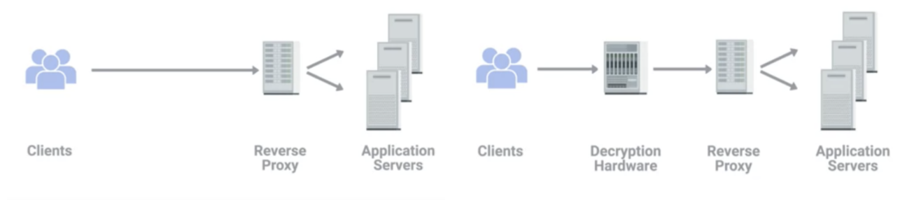
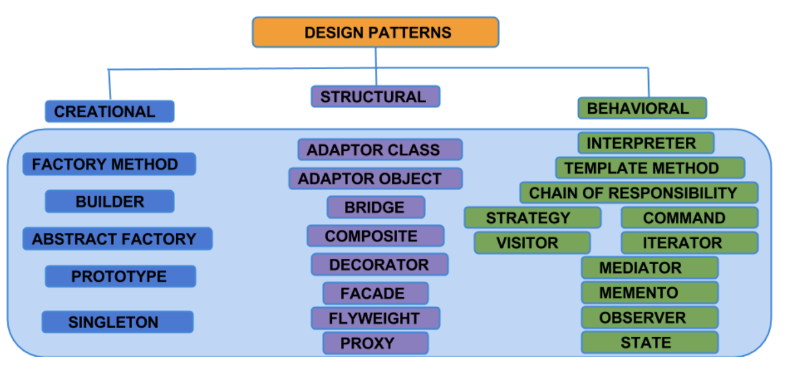
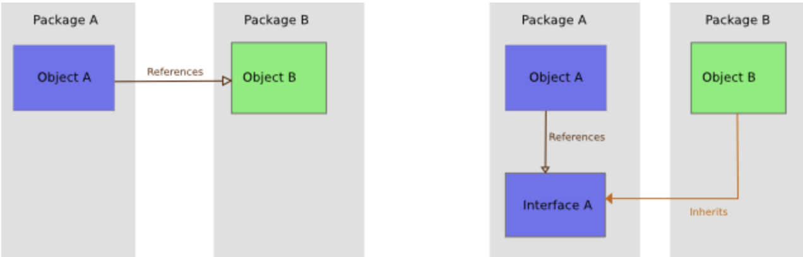
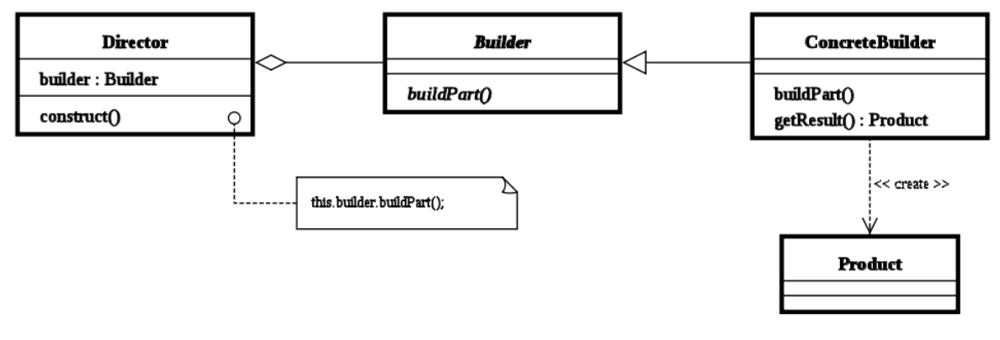
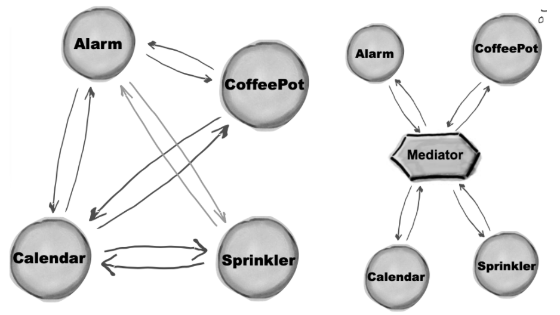
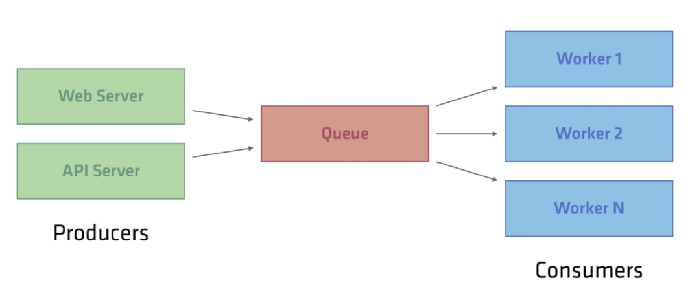
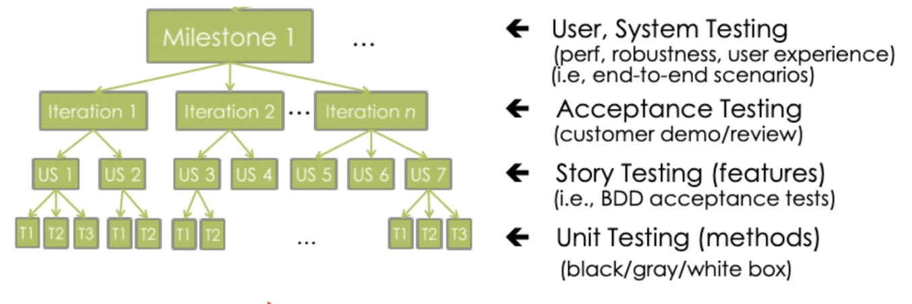
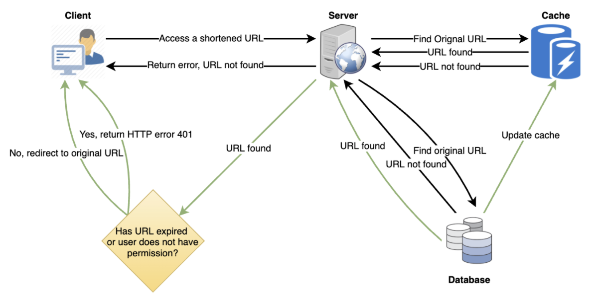

# Computer Science


> Program


* Input
  * Keyboard, Scanner
* Output
  * Screen, Headset
* Input + output
  * Touch screen, Digital camera

## Software

> Terms

* Software development Toolkit

* Library / Frameworks
  * predefined set of classes that does similar things

* kernel
  * cgroups is essential for container process isolation.

* Process
  * sends parents to exit code when exit
  * zero is special called init → process that starts the rest

* Time
  * Universal time coordinate : Compromise between english and french abbreviation
  * GMT : Greenwich Mean Time, time zone at UTC + 0.0

* Posix (Portable Operating System Interface)
  * standards specified by IEEE Computer Society for maintaining compatibility between operating systems

* rpath
  * designates the run-time search path hard-coded in an executable file or library

* standalone (freestanding program)
  * no external module, library, program designed to boot with bootstrap procedure of target processor 

* Windows Driver Model (wdm)
  * framework for device drivers that was introduced with Windows 98 and Windows 2000 to replace VxD which was used on older versions of Windows such as Windows 95 and Windows 3.1

* X Window System
  * xAuthority file is in ~, stores credentials in cookies used by xauth for authentication of X sessions

> Encodings

* Rules for translating a Unicode string into a sequence of bytes are called an encoding
* Byte Order Mark # Set encoding for file

* ASCII
  * American Standard Code for Information Interchange


> Cloud

* computing resources are provisioned in a shareable way so that users get what they need when they need 
* best be defined as infrastructure as a service or IaaS
* keep their data secure, accessible, and available
* operate in lots of different geographic regions → easily duplicate your data across multiple sites

* Cloud computing
  * platform independent → increase mobility and productivity
  * more storage capacity

* Hybrid
  * Sensitive in public, secure in private

* Private
  * used by a single large corporation and generally physically hosted on its own premises 

* Public
  * large cluster of machines run by another company

> GNU

* GNU (Gnu is Not Unix)
  * OS project by Free Software Foundation
  * First free desktop environment

* GNOME (GNU Network Object Model Environment)
  * GTK based linux desktop
  * [+] many keyboard shortcuts
  * [-] limited native function, heaviest resource computer desktop

* GPL (GNU General Public License)
  * software licence

> Service

* IaaS
  * Infrastructure as a service
  * You shouldn't have to worry about building your own network or your own servers

* PaaS
  * Platform as a service abstracts away the server instances you need
  * subset of cloud computing where a platform is provided for customers to run their services
  * This basically means that an execution engine is provided for whatever software someone wants to run
  * web developer writing a application w/o entire server complete with file system, dedicated resources

* SaaS
  * Software as a service
  * way of licensing the use of software to others while keeping that software centrally hosted and managed

### Files

> Text

* ini
  * text-based content config file a structure and syntax comprising key-value pairs for properties

* mime
  * two-part identifier for file formats and format contents transmitted on the Internet
  * image/png, text/html, text/plain

* tar
  * collecting several files into one archive file, including videos and images, for easier distribution
  * contain useful information about files contain, user permissions, dates, directory structures

* csv
  * [+] easy import / export
  * [-] No type information / No standard / No unicode support

* json
  * Keys are unique Strings that cannot be null.
  * Values can be anything from a String, Boolean, Number, list, or even null.
  * [+] serialization format or serving up data for your APIs
  * [-] lacking features to support editing, comment

* xml
  * load to dom → everything into memory
  * SAX → Simple API for XML

```sh
' "   # &apos; &quot;
< >   # &lt; &gt;
&     # &amp;
```

* yaml
  * YAML is a superset of JSON, which means you can parse JSON with a YAML parser
  * suited for configuration, readable and editable by humans
  * ability to self reference, support for complex types, embedded block literals, comments
  * [-] YAML parsers are younger and have been known to be less secure.

```yml
y|Y|yes|Yes|YES|n|N|no|No|NO|true|True|TRUE|false|False|FALSE|on|On|ON|off|Off|OFF
- disktype=ssd    # list 
- disktype: ssd   # map
```

> Image

* Img extension

* Bitmap Picture (BMP)
  * Does not support effective image compression
  * easily created from existing pixel data stored in an array
  * Images that will be sent to print.

* Graphics Interchange Format (GIF)
  * have fewer colors, smaller file size, 256 colors → quality deterioration 
  * Very small Icon, animation, simple drawing → animated files

* Joint Photographic Experts Group (JPEG)
  * 24bit color with up to 16million colors
  * Lossy compression
  * Standard format for most digital cameras
  * Great for making smaller sizes
  * Compatible across MAC, PC, mobile, web browser

* portable network graphics (PNG)
  * lossless compression
  * Portable Network Graphics
  * Background images without jagged edges
  * Lossless compression
  * PNG 8     smaller than GIF, 256 colors and 1 bit transparency
  * PNG 24    larger than JPEG
  * Use for text images, Images while editing process

* obj
  * a geometry definition file format

* svg
  * Scalable Vector Graphics
  * responsive

* tiff
  * Tagged Image Format File
  * Can be viewed and edited in nearly every photo editing software.

### Security

> Term

* Mac filtering
  * Configure your access points to only allow for connections from a specific set of MAC addresses belonging to devices you trust

* WEP
  * Wired equivalent privacy
  * Web uses 40 bit for encryption keys → cracked in few minutes
  * Wi-Fi Protected Access uses 128 bits for encryption keys
  * WPA2 uses 256 bits for keys 
  * Encryption technology that provides a very low level of privacy

> Proxy

* server that acts on behalf of a client in order to access another service
* Not implementation → exist in many layers
* intermediary for requests from clients seeking resources from servers that provide those resources


* Web proxy
  * Reduce web traffic by caching web data / Deny malign websites → old technologies

* reverse proxy
  * appear to be a single server to external clients, but actually represents many servers living behind it
  * load balancing / decryption



* VPN
  * Allow for the extension of a private or local network to hosts that might not be on that local network
  * transport payload section to carry encrypted payload that actually contains an entire second set of packets
  * requires strict authentication procedures to ensure they connected to by authorized users 


### Parallel programming

* Simultaneous execution doing multiple things at once
* Concurrence is a program structure dealing with multiple things at once

> Terms

* Concurrency
  * ability of an algorithm or program to be broken into different parts that can be executed out of order
* Critical path
  * Sequence of project network activities which add up to the longest overall duration
* Span
  * length of the longest series of operations (critical path) to be performed sequentially due to dependencies

## Pattern



### Object Oriented

* Consistent terminology  / Templates that match problem to solution
* Only relevant in OO languages → not in C

> Terms

* Abstraction
  * process of removing physical, spatial, temporal details in objects to focus attention on details

* Class
  * Template to create objects to avoid recreating them each time → cookie cutter
  * attributes → properties and state of entity
  * methods → behavior of entity

* Child Class
  * keeps attributes and methods of its parent
  * overrides / adds new attributes or methods of its own

* Object
  * Represents (the) noun (person, car, date) that responds to messages (method, things it does to itself)
  * Identity (coffee mug), Attributes (color, size, fullness), Behavior (fill() empty() clean())
  * Opaque so that it cannot be seen (messages are only way)
  * Active relation (collide) must be represented by a separate object like NearbyFriendsTracker

* Method
  * Programming procedure that can return a value
  * defined as part of a class → only access data known to its object

* Composition
  * Composition over inheritance → save memory (is_hot, is_sugar …)


* Encapsulation
  * bundling of data with methods that operate on data, or restrict access to some of components

* Inheritance
  * establishes a relation between two classes as parent and child

* Polymorphism
  * Allows child classes to be instantiated and treated as same type as its parent
  * Enables parent class to be manifested into any of its child classes

> Relation

* UML
  * Visibility : (public), - (private) # (protected) ~ (package)

* Aggregation
  * Implies a relationship where the child can exist independently of the parent
  * ex) professor ↔ students


* Association
  * Represents the ability of one instance to send a message to another instance
  * ex) student ↔ seat

* Composition
  * It is not a standard UML relationship, but it is still used in various applications
  * whole/part relationship. if composite is deleted, other associated parts are delete
  * Final keyword to represent Composition
  * ex) visitor center ↔ Lobby, Human ↔ Leg
  * Implement : class implements interface

### Principle

> Interface Segregation

* no client should be forced to depend on methods it does not use

> Liskov substitution

* S is a subtype of T, then objects of type T may be replaced with objects of type S (GAPI kernel impl)

> Loose Coupling

* Loose Coupling → changes should not change other classes for maintainable/extensible code

> Dependency Inversion



* High-level modules should not depend on low-level modules. 
* Both should depend on abstractions, abstractions should not depend on details. 
* many unit testing tools rely on inheritance to accomplish mocking

### Creational

* Used to create objects in a systematic way
* Polymorphism is widely used
* Creation classes can't be OCP but let other classes be OCP and SRP
* Creating an object requires naming a concrete class 
* Creating a complex object is a unique responsibility
* [+] Flexibility → Different subtypes of objects from same class at runtime

> Builder



* Separate the construction of a complex object from its representation 
* same construction process can create different representations

### Structural

* Establishes useful relationships between software components in configuration
* Inheritance

> Adaptor


* allows the interface of an existing class to be used as another interface
* Implement the interface your class expects.
* Get a reference to the object that we are adapting
* Adaptor composite describes objects that treated same way as a single instance of same object type

> Decorator


* allows behavior to be added to an individual object, dynamically
* doesn't affect behavior of other objects from the same class
* useful for adhering to the Single Responsibility Principle

> Delegation

* allows object composition to achieve the same code reuse as inheritance
* an object handles a request by delegating to a second object (the delegate)
* The delegate is a helper object, but with the original context

> Mediator


* Increase the reusability of the objects supported by the mediator by decoupling them from the system
* Simplifies maintenance of the system by centralizing control logic
* Commonly used to coordinate related GUI components
* Without proper design, the mediator object itself can become overly complex
* Graph Without graph class, it’s coupled and cannot be tested alone

> Model view controller


> Model view presenter


* Model: the data (subject) 
* View: a rendering of the data, often a UI 
* Presenter: Mediator that manages the relationships
* Upgrade version of Observer → View may not be just a passive view
* Model and View pre-exists → Can't have view observe model because view doesn't implement Observer interface for subject

> Producer consumer



* Used in concurrent programming
* Should be executed as Python processes when tasks are CPU Bound (GIL)
* Enforce mutual exclusion of producers and consumer 
* Prevents producer from trying to add data to a full queue 
* Prevent consumers from trying to remove data from a empty queue

> Proxy

* a class functioning as an interface to something else

> Strategy 

* We need multiple subclasses have same codes
* It defines a family of algorithms, encapsulates each one, and makes them interchangeable.
* Strategy lets the algorithm vary independently from clients that use it.
* Create an interface for a family of algorithms, to be used as the type of a field (delegate) in the client. 
* Specific algorithms implement the interface.
* A constructor, setter, or Factory binds the field with the desired variant.
* Composition over inheritance

### Behavioral 

* Best practices of objects interaction → define protocols
* methods and signatures

> Iterator

* used to traverse a container and access the container's elements.

## Hardware

* hrchitecture
  * determine arch or uname -m command
  * 64-bit extension of arm

| Type         | ARM                            | x86                            |
| ------------ | ------------------------------ | ------------------------------ |
| CPU          | Reduced Instruction Set (RISC) | Complex Instruction Set (CISC) |
| Instruction  | Single instruction per cycle   | More than a cycle              |
| Optimization | with software focused          | with hardware focused          |
| Memory       | More (Less Registers)          | Less (More register)           |
| Calculation  | Uses available memory          | Need supplement memory         |
| Usage        | Mobile                         | Game                           |
| Venter       | ARM                            | Intel (80**)                   |

* Data processing unit
  * new class of programmable processor and will join CPUs and GPUs as one of the three pillars of computing

* Direct memory access
  * Access data from I/O and memory without CPU


```sh
Cycle stealing Mode   # CPU prioritize DMA, 1cycle break, fast IO
Burst Mode            # Block level data 
```

* Post Processing Engine
  * Bias add, scale, shift + Activation function
  * Programmability

* kernel
  * allocate resources, memory, CPU, network
  * Most applications are not self-contained and make calls (system calls) to Linux kernel and library
  * Kernel time is the time spent in Linux kernel, and user time is time spent in application or library code

* Yocto project
  * OpenEmbedded Core (oe-core) contains base layer of recipes, classes and files

> Memory


* Disc
  * In order to access a particular byte, track #, sector #, offset needed.
  * Each block usually contains 512 bytes.
  * Data must be brought to main memory (RAM)


* Central processing unit
  * calculate 1 billion operations per second / 0.3 nano per operation → cooler

* GPU
  * specialized for graphics

* VPU
  * specialized for visions

* Register
  * Memory in cpu (16 registers / each store 64 bit for 64-bit cpu)
  * Register instruction pointer (intel 64)

* Random Access memory
  * volatile
  * RAM - CPU  # 0.1 microsecond
  * SSD        # 50-150 microsecond
  * Hard Disk  # 1000 microseconds
  * SRAM, DRAM, SDRAM, PSRAM, DDR SDRAM


## Software Engineering

```sh
wiki?curid=10015            # wiki based
https://stackshare.io/      # compare different stacks
```

### KPI

> KPI (Key Performance Indicator)

* Operational
  * problem understanding : clarify any uncertainties arount the problem SLA (Service-Level Agreement)
* Tactical
  * SME (subject matter expert)
  * accurate and repeatable analysis
  * concise documentation / automatic alerting & monitoring for unseen changes
* Strategical
  * Prioritize and identify important problem that are not actively being worked on product, process, policy
* evaluate the success of an organization or of a particular activity in which it engages

> CPS (Cost Per Sales)

* the amount of money paid for every sale generated

> CTR (Click Through Rate)

* number of clicks that your ad receives divided by the number of times your ad is shown

### Delivery

> Open source

* https://naver.github.io/OpenSourceGuide/book/

> Bill of materials

* Customer Relationship Management

> CPM (Cost per Mile | cost per thousand)

* cost an advertiser pays for one thousand views or clicks of an advertisement

> minimum viable product (MVP) 

* a development technique in which a new product or website is developed with sufficient features to satisfy early adopters.

> Release

```
Binary Release      # most windows machines do not have a compiler installed
Source Release      # common in linux. b/c vary in cpu, installed library, kernel, compilers version
Blue-Green deploy  # two complete deployments with active (rolled out) + idle (test)
Canary deploy    # rollout new model with small subset of users, then monitor its performance 

Maintenance Release # release of a product that does not add new features or content
```

> POC (Proof of concept)

* check before releasing the product

> Root cause analysis 

* Find why customer act something

> stock-keeping unit (SKU)

* a unique identifier for each distinct product and service that can be purchased in business

### Dev-ops

* collaboration among everyone participating in delivering software

> Terms

* on premise
  * all computing resources are accessed and managed by premises

* Process of Reference
* Meeting
  * Learn progress, status -> Update big board
  * Surface problems that are slowing things downj

* Standup questions
  * What have you accomplished since the last standup?
  * What did you learn that would be valuable for the team to know?
  * What's impeding you?
  * What do you intend to do before the next stand up?

* Milestone
  * Project get paid after milestone

* Iteration (sprint)
  * Trying to make a large project act like a small one  Default to 20 days.
  * How much communication do I need to have with the customer? How much risk?
  * Rapid feedback from the customer to avoid deviating from the customer’s wants

* User Story
  * keep the end goal in mind from the user's perspective to prevent things like feature creep and facilitate communication between all stakeholders.
  * Describes an observable end-user feature in customer language
  * Can have direct feed-back from the customer
  * Planning poker to decide estimates
  * In Business Driven Development Scenario, disambiguating user stories using sequence and special cases (multiple scenarios per story)
  * BDD scenario is covered by matching automated story test

```text
Scenario 1: Favorite a New Route
Given that the user is on the Save Route screen
And they are saving a route named “RouteA”
When the user presses the “Favorite” button
And then they press the “Save” button
Then the app should go to the Routes page
And “RouteA” should be shown as a favorite.

As a person who like to walk            # Who will benefit from the feature?
I want to have an accurate measure of the distance I traveled  # Not a system capability (task)
So that I can see how far I walk every day        # Benefit in the world
```

> Break following user story into two

* As a user I want to message a nearby buddy so that we can meet up.  → 
* As an initiator I want to send invitation to a nearby buddy so that we can meet up
* As a user I want to receive messages so that we can meet up

> Task

* risk addressed (unseen technical requirements and risks)
* inaccurate estimates 
* no division of labor

### Test



```
Unit Testing          # Functional level
Component Testing     # Library, compiled binary
System Testing        # External libraries of a system
Performance Testing   # Sub-system, system levels to verify timing / resource usages
Coverage  Test        # seek to execute all possibility
Equivalence classes   # no need to write two tests that expose the same bug
Bottom-up testing     # when testing if something works, its parts should already be tested

acceptance 
capacity              # application be checked against the expected load?
explorative 
```

> TDD

* Kent Beck in 1990's part of Extreme programming software development process (created Sunit, Junit)
* unit tests are written before production code


> Test fixture, context

* fixed environment in which tests are run so that results are repeatable.
* Loading a database with a specific, known set of data
* Erasing a hard disk and installing a known clean operating system installation
* Copying a specific known set of files
* Preparation of input data and set-up/creation of fake or mock objects

> Mocking

```
Mocks       # fake object that helps to verify whether an interaction with an object occurred
Stub        # A stub adds simplistic logic to a dummy, providing different outputs
Fakes       # anything that is not real, which, based on their usage, can be either stubs or mocks
```

* Non-deterministic result, Difficult to create or reproduce, slow (complete database)
* Doesn't yet exist or may change behavior 
* same interface as the real objects they mimic
* [-] increased maintenance on the tests themselves during system evolution (refactoring)


## Operating System

* https://classroom.udacity.com/courses/ud189 

### Memory


```
1 byte = 8 bits
1 kilobyte (K / Kb) = 210 bytes = 1,024 bytes
1 megabyte (M / MB) = 220 bytes = 1,048,576 bytes
1 gigabyte (G / GB) = 230 bytes = 1,073,741,824 bytes
1 terabyte (T / TB) = 240 bytes = 1,099,511,627,776 bytes
1 petabyte (P / PB) = 250 bytes = 1,125,899,906,842,624 bytes
1 exabyte (E / EB) = 260 bytes = 1,152,921,504,606,846,976 bytes 
```

> Hard Disk

* slow
* Sequential access
* permanent

> Main

* fast, random access, temporary
* dynamic RAM 
* divided into physical frame number and offset

### Caching


* temporal/spatial locality
* static RAM is used

```
2j        # associativity
2k        # cache entries (indices)
2m        # address
2n        # block size

line      # of bits (aka, index)
tag       # of lines required to uniquely identify a memory address block
word      #  least significant bits which uniquely identify a word on a line of cache
```

> Policy

* Write-through
    * when data hit
    * use the memory again soon

* Write-back
    * When data hit
    * doesn’t use the memory again

* Write-allocate
    * When data misses
    * use the memory again soon

* No-write-allocate
    * When data misses
    * doesn’t use the memory again

### File system

> File allocation table


* directory entry points to the first block in the file

> Inode structure


> Load Balance


* reduces individual server load to prevents server from becoming a single point of failure
* improving overall application availability and responsiveness
* second load balancer can be connected to the first to form a cluster

| Type       | preemptive                           | non-preemptive                             |
| ---------- | ------------------------------------ | ------------------------------------------ |
| Overview   | resource allocated to limited time   | can be interrupted                         |
| resource   | allocated until its burst time       | cannot be interrupted                      |
| Cpu        | High                                 | Low                                        |
| Overhead   | Yes                                  | No                                         |
| Starvation | Possible                             | Impossible                                 |
| Example    | Round Robin, Shortest Remaining Time | First come First serve, Shortest Job First |

## Network

> Terms

* Autonomous system
  * collection of networks that all fall under the control of a single network operator

* Collision Domain
  * A network segment where only one device can communicate at a time
  * If multiple systems send data at once, electrical pulses sent across cable can interfere with each other

* Domain Name System Security Extensions (DNSSEC)
  * suite of Internet Engineering Task Force (IETF) specifications for securing certain kinds of information provided by the Domain Name System (DNS) as used on Internet Protocol (IP) networks

* Encapsulation
  * The entirety of a packet at one layer becoming the payload section at another layer is known 
  * IP datagram (packets) encapsulates a TCP segment

* Extranet
  * privately held WAN infra generally owned by one company or organizations (Azure, AWS, GCP)
  * may allow other access for a fee for specific purposes 
  * can be an intranet with selective business-related access 
  * used to carry a wide variety of services like internet

* RFC
  * request for comments
  * responsible for keeping the internet running to agree upon the standard requirements

* IANA
  * Internet Assigned numbers authority 
  * non-profit organization that helps manage IP address allocation, Autonomous System number allocation

* ICANN
  * Internet Corporation for Assigned Names and Numbers, nonprofit organization
  * Coordinating the maintenance of databases related to namespaces and numerical spaces of the internet
  * Ensure the network's stable and secure operation

* ICS
  * Industrial Control System
  * normally refers to smaller-scale systems
  * Industrial automation
  * ex. Control system for power plant and factory

* ISP
  * Internet service provider (X Internet Secure Payment) mostly handles routing issue
  * KT, SK, LG U+

* Internet
  * Worldwide publicly accessible infrastructures of cables, routers, switches, and servers
  * Used to carry a wide variety of services
  * ex. World Wide Web, email, file transfer protocol, VoIP, streaming video, gaming, etc

* Intranet
  * the privately accessible infrastructure of cables, routers, switches, and servers 
  * generally limited to a single company, organization, or group of companies 
  * used to carry a wide variety of services like the internet

* Medianet
  * networks optimized for distributing large video applications and similar technologies
  * uses smart bandwidth detection systems
  * provides smooth video transmission on any platform
  * ex. Hulu, Netflix, WebEx, and GoToMeeting

> Port


* 16-bit number that's used to direct traffic to specific services running on a networked computer

```sh
20, 21       # File transfer protocol
53           # domain name system
80           # HTTP (web service)
443          # HTTPS
1-1023       # system ports
1024-49151   # registered ports
49152-65535  # dynamic and/or private ports
```

* Forwarding
  * port preservation source port chosen by a client is the same port used by the router
* Preservation
  * source port chosen by a client is the same port used by the router

### OSI Model


* Divide-and-conquer approach → makes divided into small, manageable tasks to reduce complexity
* Modularity → provides the independence of layers, which is easier to understand and implement.
* Easy to modify →  ensures independence of layers / implementation change without affecting other layers.
* Easy to test →  Each layer of the layered architecture can be analyzed and tested individually

> [1] Physical

* Transmit data in the form of 1s and 0s (bits)
* Encoding methods to transmit data, bits placement on media, and how bits start/stop
* Media usage, kinds of media permitted, media usage, physical connections, pin usages
* Specifies standards that apply to specific types of media
* Simplex, Duplex communication → information can flow in uni/both directions across cable
* Half duplex → only one device can talk at a time
* modulation varies the voltage of charge moving across the cable

* Polar


* Bipolar


* Unipolar


* Pulse Amplitude Modulation
  * not useful in data communication as pulses are not digital → PCM technique


* Pulse Code Modulation

* Modem
  * Baud rate measure of how many bits can be passed across a phone line in a second → 110bps


> Hub


* allow connections from many computers at once
* Older technology falling out of use → Due to collision domain
* repeater → Message sent by one host is sent to all other hosts
* logically function as a bus topology
* too many host causes collision
* Intelligent hub has network diagnostic abilities

* Passive
  * work like cable splitters
  * the more devices the weaker the signal to each device

* Active
  * central connecting device in network that regenerates signals on the output side to keep the signal strong
  * need a power source → power added to signal when passed through port
  * prevent weakening of signal by multiple devices being attached
  * repeats signal to all hosts connected to hub
  * No more than 5 segments can be linked
  * 4 linking devices only can be used to form segments
  * 3 segments can be populated by computers


> Cable

* Link LED flashes when linked, Activity LED flashes when data flows
* connect different devices to each other, allowing data to be transmitted over them


* Copper Cable
  * Multiple pairs of copper wires inside plastic insulator
  * Cat5 < Cat5e < Cat6 to reduce crosstalk → One wire accidentally detected on another wire


* Fiber Cable
  * Contain individual optical fibers, which are tiny tubes made out of glass about the width of a human hair
  * Much more expensive and fragile


## Design

### TinyURL

> Requirements

* Functional
  * Given a URL, our service should generate a shorter and unique alias of it, called a short link.
  * This link should be short enough to be easily copied and pasted into applications.
  * When users access a short link, our service should redirect them to the original link.
  * Users should optionally be able to pick a custom short link for their URL.
  * Links will expire after a standard default timespan → specify the expiration time.

* Non-Functional Requirements
  * The system should be highly available →  if service is down, all the URL redirections will fail
  * URL redirection should happen in real-time with minimal latency.
  * Shortened links should not be guessable (not predictable).

* Extended Requirements
  * Analytics; e.g., how many times a redirection happened?
  * Our service should also be accessible through REST APIs by other services.

> Terms

```sh
ratio      # ratio between read and write (100:1)
QPS_read   # read query per second (20K)
QPS_write  # write query per second (200)
duration   # years to store (5 y)
size       # size of URL object (500 bytes)

storage    # storage needed (2003.15e7s/y+5y500bytes=15TB)
band_write # bandwidth of incoming data     (200500 bytes=100KB/s)
band_read  # bandwidth of reading data (20K500 bytes=10MB/s)
cache      # cache for 20% per day w/o dup (20K864000.2500bytes=170G)
len        # base64 encoding (646=68.7 bil)
```

> Database


* Our service is read-heavy
* We need to store billions of records → Each object is small (less than 1K).
* There are no relationships between records other than storing which user created a URL.
* base36 ([a-z ,0-9]) or base62 ([A-Z, a-z, 0-9])

> API

```sh
createURL(api_dev_key, original_url, custom_alias=None, user_name=None, expire_date=None)
"""
  Params:
    api_dev_key (str)    The API key of a registered account to throttle users based on quota.
    original_url (str)    Original URL to be shortened.
    custom_alias (str)    Optional custom key for the URL.
    user_name (str)    Optional user name to be used in the encoding.
    expire_date (str)    Optional expiration date for the shortened URL.
  Returns: (str)
    A successful insertion returns the shortened URL; otherwise, it returns an error code
"""

deleteURL(api_dev_key, url_key)
```

> Question

* Hash vs KGS
  * Hash can be used concurrently
  * Key Generation Service (KGS) → simple, fast, no duplications and collisions



* Different hash functions?
  * MD5         # 128-bit hash value
  * SHA256

* Range Based Partitioning vs Hash-Based Partitioning
  * unbalanced DB servers / overloaded partitions (consistent hashing)

* Load balance?
  * Clients and Application servers / Application and database servers / Application and Cache servers
  * Round Robin LB → periodically queries the backend server about its load and adjusts traffic

* Key duplication?
  * append an increasing sequence number to each input URL
  * append user id which should be unique → not signed in

* How to avoid KGS being a single point of failure?
  * Whenever the primary server dies, the standby server can take over to generate and provide keys

* How would we perform a key lookup?
  * We can look up the key in our database to get the full URL
  * If in DB, send “HTTP 302 Redirect”, passing the stored URL in the “Location” field of the request
  * If not in our system, issue an “HTTP 404 Not Found” status or redirect back to the homepage

### Pastebin

> Requirement

* Functional
  * Users should be able to upload or “paste” their data and get a unique URL to access it.
  * Users will only be able to upload text.
  * Data and links will expire after a specific timespan automatically; users can specify expiration time.
  * Users should optionally be able to pick a custom alias for their paste.

* Non-Functional
  * The system should be highly reliable, any data uploaded should not be lost.
  * The system should be highly available → If our service is down, users can’t access their Pastes
  * Users should be able to access their Pastes in real-time with minimum latency
  * Paste links should not be guessable (not predictable)

* Extended
  * Analytics, e.g., how many times a paste was accessed?
  * Our service should also be accessible through REST APIs by other services.