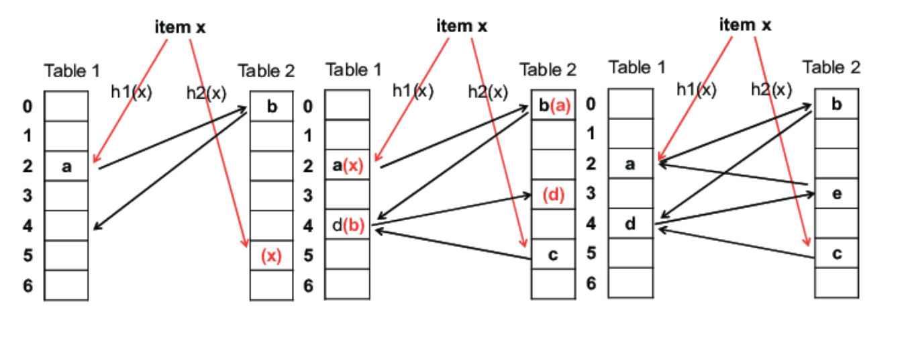
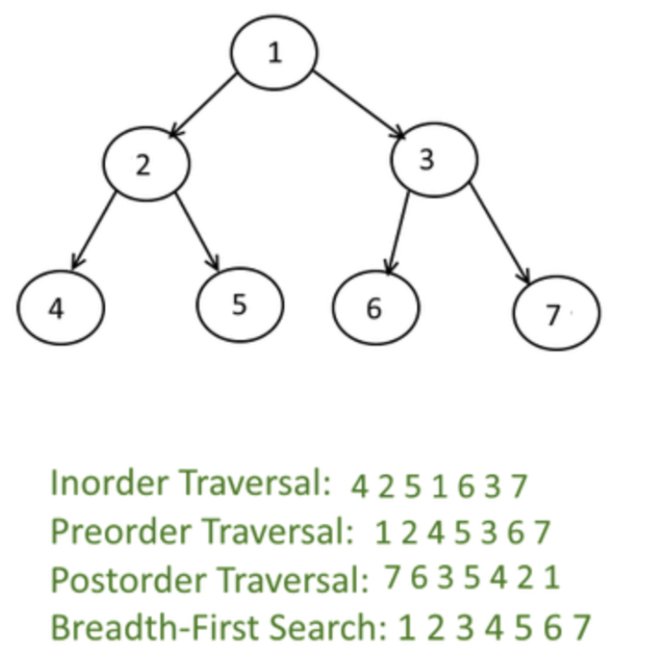
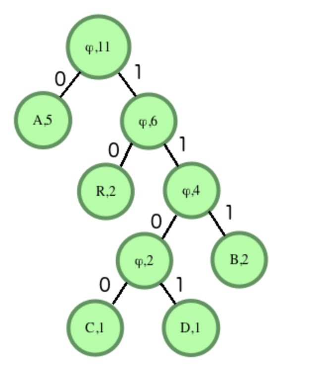
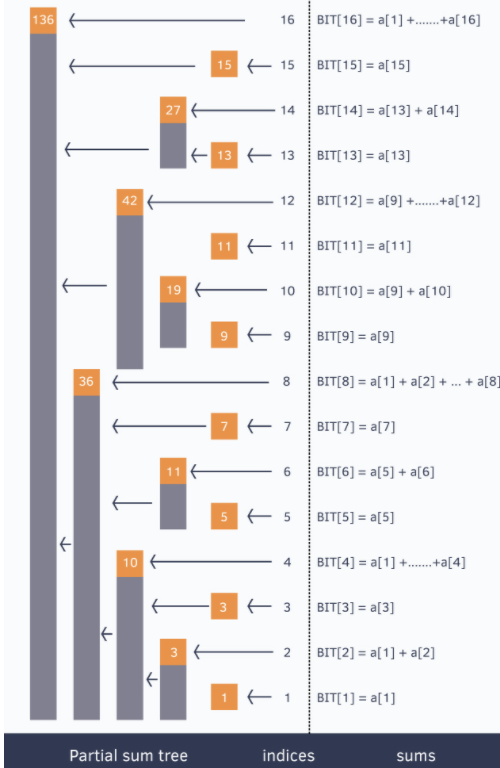
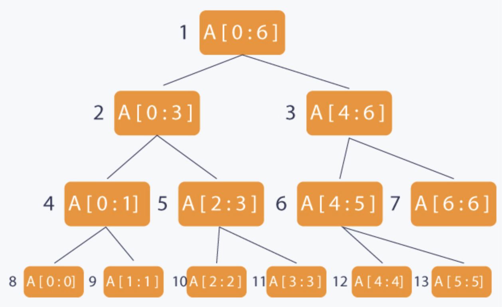
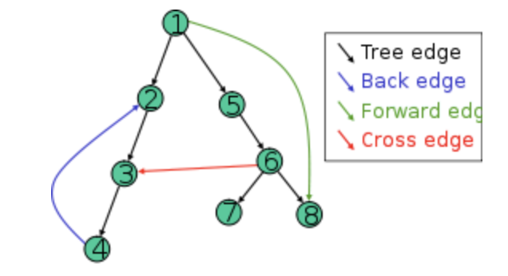
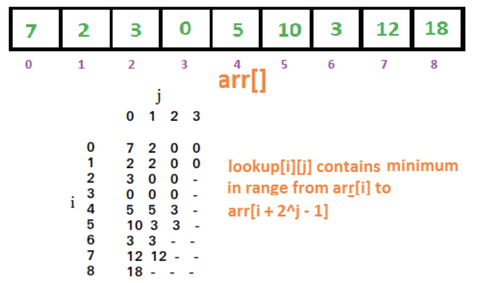
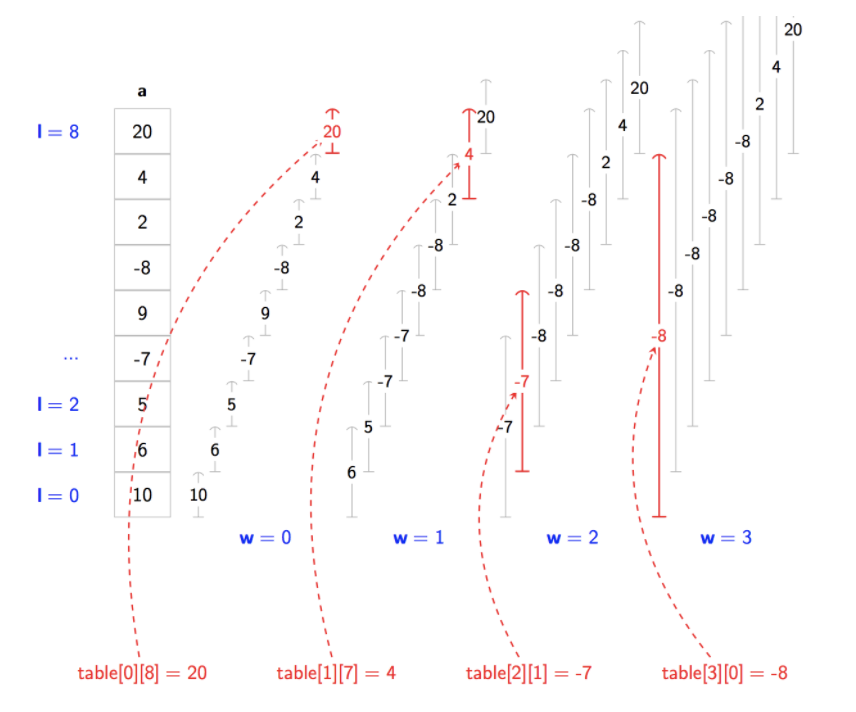

# Data_structure

## List

### 2D

### LinkedList

| Type          | Access | Search | Insert | Delete |
| ------------- | ------ | ------ | ------ | ------ |
| Array         | 1      | n      | n      | n      |
| Stack         | n      | n      | 1      | 1      |
| Queue         | n      | n      | 1      | 1      |
| Singly-Linked | n      | n      | 1      | 1      |
| Doubly-Linked | n      | n      | 1      | 1      |




```py
class Node(object):
  def __init__(self, val):
    self.val = val
    self.next = None

class MyLinkedList(object):
  def __init__(self):
    self.head = None
    self.size = 0

  def __str__(self):
    ret = ""
    cur = self.head
    while cur:
      ret += (str(cur.val) + " -> ")
      cur = cur.next
    return rets

  def get(self, idx):
    if idx < 0 or idx >= self.size or not self.head:
      return None
    cur = self.head
    for i in range(idx):
      cur = cur.next
    return cur

  def addAtIndex(self, idx, val):
    if idx < 0 or idx > self.size:
      return
    node = Node(val)
    if idx == 0:
      node.next = self.head
      self.head = node
    else:
      pre = self.get(idx - 1)
      node.next = pre.next
      pre.next = node
    self.size += 1

  def deleteAtIndex(self, idx):
    if idx < 0 or idx >= self.size:
      return
    if idx == 0:
      self.head = self.head.next
    else:
      pre = self.get(idx - 1)
      pre.next = pre.next.next
    self.size -= 1
```




```py
class LRUCache:
  def __init__(self, MSize):
    self.size = MSize
    self.cache = {}
    self.next, self.before = {}, {}
    self.head, self.tail = '#', '$'
    self.connect(self.head, self.tail)

  def connect(self, a, b):
    self.next[a], self.before[b] = b, a

  def delete(self, key):
    self.connect(self.before[key], self.next[key])
    del self.before[key], self.next[key], self.cache[key]

  def append(self, k, v):
    self.cache[k] = v
    self.connect(self.before[self.tail], k)
    self.connect(k, self.tail)
    if len(self.cache) > self.size:
      self.delete(self.next[self.head])

  def get(self, key):
    if key not in self.cache: return -1
    val = self.cache[key]
    self.delete(key)
    self.append(key, val)
    return val

  def put(self, key, value):
    if key in self.cache: self.delete(key)
    self.append(key, value)
```




### Stack

### Queue

> MIQ increasing queue

* find the first element smaller than the current in the left | right




```py
l = [5, 3, 1, 2, 4]

def monotonic_increase_queue(l):
  q = collections.deque()
  l_small, r_small = [-1] * len(l),  [-1] * len(l)
  for i, v in enumerate(l):
    while q and l[q[-1]] >= v:  # right is from the popping out
      r_small[pop()] = v
    if q:                       # left is from the pushing in
      l_small[i] = A[q[-1]]
    #append(i)
return l_small, r_small
```




| i   | v   | q         | l[q]      | l_small              | r_small              |
| --- | --- | --------- | --------- | -------------------- | -------------------- |
| -1  | -1  | []        | []        | [-1, -1, -1, -1, -1] | [-1, -1, -1, -1, -1] |
| 0   | 5   | [0]       | [5]       | [-1, -1, -1, -1, -1] | [-1, -1, -1, -1, -1] |
| 1   | 3   | [1]       | [3]       | [-1, -1, -1, -1, -1] | [3, -1, -1, -1, -1]  |
| 2   | 1   | [2]       | [1]       | [-1, -1, -1, -1, -1] | [3, 1, -1, -1, -1]   |
| 3   | 2   | [2, 3]    | [1, 2]    | [-1, -1, -1, 1, -1]  | [3, 1, -1, -1, -1]   |
| 4   | 4   | [2, 3, 4] | [1, 2, 4] | [-1, -1, -1, 1, 2]   | [3, 1, -1, -1, -1]   |

### Deque

> Maximum in sliding window

* Question
  * Given a large array of integers and a window of size w
  * find the current maximum value in the window as the window slides through the entire array.

* Solution
  * O(N)
  * Remove the indices of all elements from the back of the deque, which are smaller than or equal to the current element.
  * If the element no longer falls in the current window, remove the index of the element from the front.
  * Push the current element index at the back of the window.
  * The index of the current maximum element is at the front.

### Priority_queue

## Hash

| Term             | Meaning                                 |
| ---------------- | --------------------------------------- |
| Identity law     | $A \cup \varnothing=A$                  |
| Idempotent Law   | $A \cup A =A$                           |
| Domination Law   | $A \cup U =U$                           |
| Communtative Law | $A \cup B =B \cup A$                    |
| Associative Law  | $(A \cup B) \cup C = A \cup (B \cup C)$ |

> Term

* Bloom Filter (Burton Howard Bloom, 1970)
  * space-efficient probabilistic data structure used to test whether an element is a member of a set
  * False positive matches are possible, but false negatives are not

* cuckoo hashing
  * Use two hash functions
  * O(1) : worst case insert / lookup






```py
class ListNode:
  def __init__(self, key = None, val = None):
    self.pair = (key, val)
    self.next = None

class HashMap:
  def __init__(self):
    self.m = 1000
    self.h = [ListNode() for _ in range(self.m)]

  def put(self, key, val):
    idx = key % self.m
    cur = self.h[idx]
    while True:
      if cur.pair[0] == key:
      cur.pair = (key, val)
      return
      if cur.next == None:
      break
      cur = cur.next
    cur.next = ListNode(key, val)

  def get(self, key):
    idx = key % self.m
    cur = self.h[idx]
    while cur:
      if cur.pair[0] == key:
      return cur.pair[1]
      cur = cur.next
    return -1

  def remove(self, key):
    idx = key % self.m
    cur = prev = self.h[idx]
    cur = cur.next

    while cur:
      if cur.pair[0] == key:
      prev.next = cur.next
      break
      cur, prev = cur.next, prev.next
```




### Set

### Map

## Tree

* [Tree](https://docs.google.com/forms/d/1_ofN6F79XzQAos7-Xl3ZKjcz-N4kMF4EUGlPX3yenpg/edit)
* Connected and has no cycles (n-1 edges).
* Root has no incoming edges and non-root has exactly one incoming edge from parent
* root vertex r is at level 0
* Binary tree is a rooted tree in which every (internal) vertex has no more than two children.
* Traveral



> N-ary to binary




```py
def convert_n_ary_to_binary(root,isLeft = 1):
  if root == None:
    return

  btnode = BinaryTreeNode(root.data)
  lastnode = btnode

  for child in root.children:
    if isLeft == 1:
      lastnode.left = convert_n_ary_to_binary(child, 0)
      lastnode = lastnode.left
    else:
      lastnode.right = convert_n_ary_to_binary(child, 1)
      lastnode = lastnode.right

  return btnode

def convert_binary_to_n_ary(node, isLeft = 1):
  if node == None:
    return

  nnode = TreeNode(node.data)
  temp = node

  if isLeft == 1:
    while(temp.left != None):
      child = convert_binary_to_n_ary(temp.left, 0)
      nnode.children.append(child)
      temp = temp.left
  else:
    while(temp.right != None):
      child = convert_binary_to_n_ary(temp.right, 1)
      nnode.children.append(child)
      temp = temp.right

  return nnode

node1 = TreeNode(1)
node2 = TreeNode(2)
node3 = TreeNode(3)
node4 = TreeNode(4)
node1.children.append(node2)
node1.children.append(node3)
node1.children.append(node4)
node5 = TreeNode(5)
node6 = TreeNode(6)
node3.children.append(node5)
node3.children.append(node6)

print("Original n-ary tree")
node1.display_level_order()
bnode1 = convert_n_ary_to_binary(node1)
print("Converted binary tree")
display_level_order(bnode1)
# If the tree is converted into BT then the following statement must return "5"
# print("Root.Left.Left.Right = " + str(bnode1.left.left.right.data))

tnode1 = convert_binary_to_n_ary(bnode1)
print("\nConverted n-ary tree")
tnode1.display_level_order()
```




> KD tree

* Organizing some number of points in a space with k dimensions
* Pick median to balance KDTree
* Can start with either X or Y
* Right child is greater and equal.
* Single rotation


* Double rotation


> RB Tree

* Each node is either red or black
* Red node only contains black children
* Root is black
* Black height is same for every descendent

* Proof that the height is log(n)
  * compress every red child into parent → create 2-3-4 trees
  * height of compressed is at most half of the original
  * height of compressed is log2(N)
  * the number of leaves is between 2h'< n < 4h'

* Insertion
  * X : the node you are inserting
  * P : parent of the node
  * G : grandparent of the node
  * Traverse down the tree to find the appropriate spot to insert
  * As we traverse the tree, at each node we encounter, check whether any node has two red children.
  * if so, color parent as red and both children as black.
  * if any violation occurs(if grandparent is also red), perform appropriate rotation.
  * After we find the spot, P is black → done
  * P is red, P is left|right child of G, X is left|right child of P → single rotation
  * P is red, P is left|right child of G, X is right|left child of P → double rotation

> Huffman encoding

* Tree must be full tree
* Exists an optimal tree where two lowest frequent symbols must be siblings at the two lowest level
* The two longest codewords have the same length
* Entropy of tree

$$
\sum_{i} p_{i} \log _{2} \frac{1}{p_{i}}
$$



### Trie

* Search / Insertion : O(key_length)
* memory : O(ALPHABET_SIZE * key_length * N

### Binary index tree

* Fast cumulative sum query → easier to implement than Segment Tree
* Time Complexity: O(n) (Build)
* Time Complexity: O(log n) (Range Query, update one element)






```py
# Count smaller than self
class BIT:
  def __init__(self, n):
    self.n = n + 1
    self.sums = [0] * self.n

  def update(self, i, delta):
    while i < self.n:
      self.sums[i] += delta
      i += i & (-i)

  def query(self, i):
    res = 0
    while i > 0:
      res += self.sums[i]
      i -= i & (-i)
    return res

def countSmaller(self, li):
  ranks, bit, ret = {e : i + 1 for i, e in enumerate(sorted(li))}, self.BIT(len(li)), []
  for e in reversed(li):
    ret.append(bit.query(ranks[e] - 1))
    bit.update(ranks[e], 1)
  return ret[::-1]
```




```py
class Node:
  def __init__(self):
    self.children = dict()
    self.is_leaf = False

class Trie:
  def __init__(self):
    self.root = Node()

  def add_word(self, word):
    cur = self.root
    for letter in word:
      if letter not in cur.children:
        cur.children[letter] = Node()
      cur = cur.children[letter]
    cur.is_leaf = True

  def remove_word(self, word):
    cur = self.root
    for letter in word:
      if letter not in cur.children:
        return False
      cur = cur.children[letter]
    return self

  def search(self, word):
    cur = self.root
    for letter in word:
      if letter not in cur.children:
        return False
      cur = cur.children[letter]
    return cur.is_leaf
```




### Segment_Tree

* m number of Minimum / Sum Range Query + n elements in array
* Use lazy propagation segment tree to support range update
  * Time Complexity: O(n) (Build tree)
  * Space Complexity: O(n)
  * Time Complexity: O(log(n)) (Query)



```py
def range_minimum_query(ST, ST_l, ST_r, l, r, idx):
    if l <= ST_l and r >= ST_r:
        return ST[idx]

    if ST_r < l or ST_l > r:
        return math.inf

    mi = ST_l + (ST_r - ST_l) // 2
    min(range_minimum_query(ST, ST_l, mi, l, r, 2*idx + 1), RMQ(ST, mi + 1, ST_r, l, r, 2*idx + 2))

def buildST(list, l, r, ST, idx):
    if l == r:
        ST[idx] = list[l]
        return ST[idx]

    mid = l + (r - l) // 2
    left = buildST(list, l, mid, ST, idx*2 + 1)
    right = buildST(list, mid + 1, r, ST, idx*2 + 2)

    if left <= right:
        ST[idx] = left
    else:
        ST[idx] = right

    return ST[idx]
```

> Lazy Segment Tree

* [Lazy segment tree](https://www.youtube.com/watch?v=xuoQdt5pHj0)

## Graph

* [Graph](https://docs.google.com/forms/d/1E8HkTLzD7yVQ3Vqr9RhAYax10HYzW8S8tRadvmUaZbo/edit)

> Terms

* Directed
  * DAGs : Directed acyclic graphs are directed graphs with no cycle
  * Weakly : Undirected version of directed graph is connected
  * Strongly Connected : Directed graph G is strongly connected a path exists for all ordered pair vertices
  * Strongly Connected Component : Strongly connected components is maximal strongly connected piece
  * Connectivity Deficit : minimum number of directed edges you have to add to make graph strongly connected

* Undirected
  * Connected : G is connected if for any pair of vertices v, w there is a path from v to w
  * CC : Connected components is maximal connected piece

* Edge
  * Tree : solid edge included in the DFS output tree (pre u < pre v < post v < post u)
  * Back : leads to an ancestor (pre v < pre u < post u < post v)
  * Cross : leads to neither anc. or des (pre v < post v < pre u < post(u)

* Adjacent (coincident)
  * Two edges of a graph are called adjacent if they share a common vertex.
  * Two vertices are called adjacent if they share a common edge.

* incident : An edge and a vertex on that edge



* Path
  * Walk : Vertices may repeat. Edges may repeat (Closed or Open)
  * Trail : Vertices may repeat. Edges cannot repeat (Open)
  * Circuit : Vertices may repeat. Edges cannot repeat (Closed)
  * Path : Vertices cannot repeat. Edges cannot repeat (Open)
  * Cycle : Vertices cannot repeat. Edges cannot repeat (Closed)
  * Hamiltonian : Visits every vertex in the graph
  * Eulerian : Visits every edge in the graph

> Articulation Point

```sh
case v = root
vertex will be the point of articulation iff this vertex has more than one child.
case v ≠ root.
During DFS, (v, to) is articulation iff none of the vertices to or its descendents in the DFS traversal tree has a back-edge to any of the ancestors of v, then v is an articulation point.
visited time ≤ low time of adjacent vertex
```

> Maximal independent set

* Given an undirected graph, find the largest set of vertices such that no two are connected with an edge
* Instance : an undirected graph
* Solution format : subset of vertices = S
* Constraint : no two vertices in S are connected by an edge
* Objective : Maximize |S|
* Runtime: 2T(n- 1) + O(n)

> Seven Bridge of Konigsberg


* Whenever one enters a vertex by a bridge, one leaves the vertex by a bridge
* In other words, during any walk in the graph, # enters a non-terminal vertex equals # one leaves it
* However, there are 4 vertices with odd degrees, so we cannot create a desired path

> Cycle Detect

* Question
  * An undirected connected graph G has a cycle if and only if it’s DFS output tree has a back edge.

* Solution
  * Complexity    O(V + E)
  * Proof → : Suppose DFS tree has no back edge. Then all of the original edges are in the DFS tree. Then the graph itself is a tree (no cycles)
  * ← : Suppose the graph is a tree (has no cycles) then there can’t be any backedges, because the DFS output tree is a tree with all the vertices

### Sparse_Table



* Range Greatest Common Divisor
* Minimum query
  * Space O(N logN)
  * Run-time (build) O(N logN)
  * Run-time (Query) O(1)



```py
"""
[10, 6, -7, -8, 0, 0, 0, 0, 0]
[6, 5, -7, -8, 0, 0, 0, 0, 0]
[5, -7, -8, 0, 0, 0, 0, 0, 0]
[-7, -7, -8, 0, 0, 0, 0, 0, 0]
[9, -8, -8, 0, 0, 0, 0, 0, 0]
[-8, -8, -8, 0, 0, 0, 0, 0, 0]
[2, 2, 0, 0, 0, 0, 0, 0, 0]
[4, 4, 0, 0, 0, 0, 0, 0, 0]
[20, 0, 0, 0, 0, 0, 0, 0, 0]
"""
def build_ST(l):
  n = len(l)
  ST = [l[i] + [0]*(n - 1) for i in range(n)]
  j = 1
  while (1 << j) <= n:
    i = 0
    while (i + (1 << j) - 1) < n:
      ST[i][j] = min(ST[i][j - 1], ST[i + (1 << (j - 1))][j - 1])
      i+=1
  j+=1
  return ST

def query(l, r, ST):
  j = math.log2rR - l + 1)
  return min(ST[L][j], ST[R - (1 << j) + 1][j])
```
