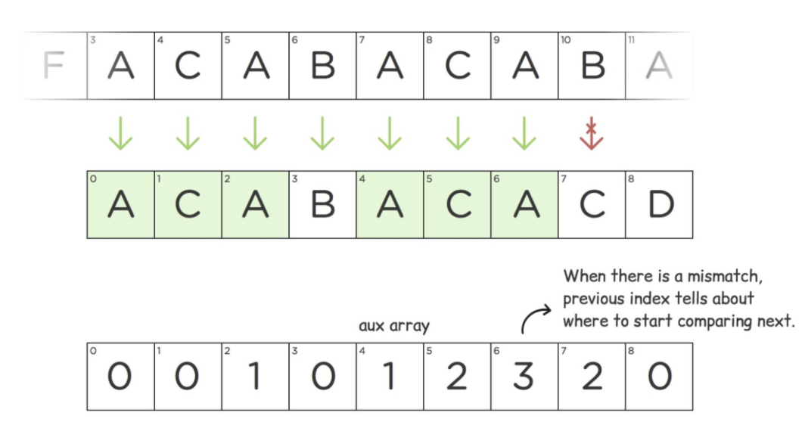

# Language

## Syntax

## Operation

### Interactive




```py
import sys
sys.stdout.flush()
```




## Conditional

## Iterate

[Comprehension](https://docs.google.com/forms/d/1yUmg8IRuwrDaf8NayKeoDjLZv7XDIQHcbVUY9PJ-SP0/edit)

[While](https://docs.google.com/forms/d/18QwLLbameGJBtyrTsBI046VqHAIhMpxYD5KjK4bFcIM/edit)

### String

> KMP



### Regex

* ?: make the match-group non captured

## Sort

> Selction Sort




```py
def selection_sort(a1 … an):
  for i in range(1, n - 1):
    am = minimum(ai, ..., an)
    swap ai and am
```




```text
Loop invariant: After t loop, the first t elements are (1) sorted, (2) minimum
Base: It is true when t = 0, because there is no element.
Inductive Hypothesis: For some t iterations, the first t elements are (1) sorted, (2) minimum

SIH: For k iteration where k = 1 … t, the k elements are (1) sorted, (2) minimum
WTS: For t + 1 iteration, the first t + 1 elements are (1) sorted, (2) minimum

During the (t + 1)st iteration, the algorithm finds am, the minimum value of at+1, …, am and swap with at+1. So, after the (t + 1)st iteration, at+1 is the minimum value of at+1, ..., an

We have a1, ..., at are all less than at+1 and at+1 is minimum of at+1, ..., an ⇒  (1)
We have a1, …, at are in the sorted order and all less than at+1 ⇒ (2)

Therefore: for any 0 ≤ t ≤ n - 1, the loop invariant is true after t iterations.

Since we execute the loop exactly n times, the loop invariant with t = n guarantees that all n elements of the list will be in the correct order at the end of the algorithm.
```




> Merge Sort




```text
procedure MergeSort(a1, …, an):
  if n == 0:
    return ()
  if n == 1:
    return (a1)
  m = ⌊n | 2⌋
  L1 = MergeSort(a1, …, am)
  L2 = MergeSort(am+1, …, an)
  return RMerge(L1, L2)

procedure RMerge(a1, …, ak, b1, …, bl: sorted lists)
  if first list is empty:  return b1, …, bl
  if second list is empty: return a1, …, ak
  if a1 ≤ b1:  return a1 · RMerge(a2, …, ak, b1, …, bl)
  else:        return b1 · RMerge(a1, …,ak, b2, …, bl)
```




```txt
Base : Suppose n=0. Then both lists are empty. Vacuously true.
Induction : Suppose n ≥ 1 and RMerge(a1, ..., ak, b1,...,bl) returns a sorted list containing
all elements from either list whenever k + l = n - 1
WTS : RMerge(a1, ..., ak, b1, ..., bl) returns a sorted list containing all elements from either list
whenever k + l = n.

# Inductive step
Case 1: at least one of the lists is empty.
  Similar to base case. In the first or second line, return all of the elements, in sorted order.
Case 2 : neither list empty and a1 ≤ b1
  Since both lists are sorted, this means a1 is the smallest overall. The total size of the input of
  RMerge(a2, ... , ak, b1, ... , bl) is (k - 1) + l = n - 1 so by the IH, it returns a sorted list containing all
  elements from either list. Adding a1 to the start maintains the order and gives a sorted list with all
elements.
Case 3 : neither list empty and b1 ≤ a1
  WLOG same as case 2

# Strong Induction
Base case : Suppose n=0. Then, return the empty list, (trivially) sorted.
SIH : MergeSort correctly sorts all lists with k elements, for any 0 ≤ k < n
Goal : prove that MergeSort(a1, ..., an) returns a sorted list containing all n elements.
Induction Step : Suppose n=1. Then, return a1, a (trivially) sorted list containing all elements.
```




> Quicksort

* quick select can be used to find nth largest element in average of O(n) time

