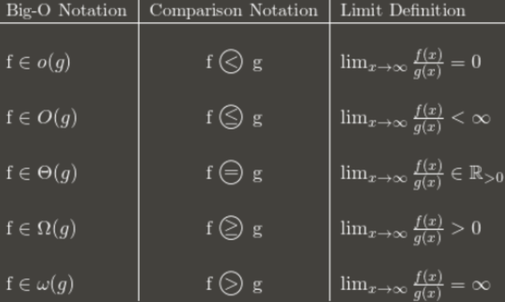
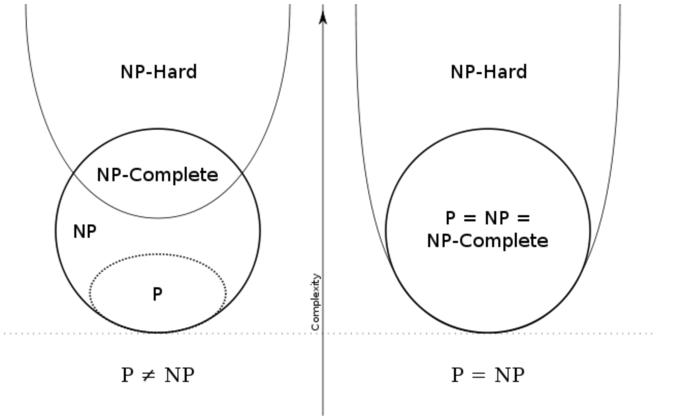
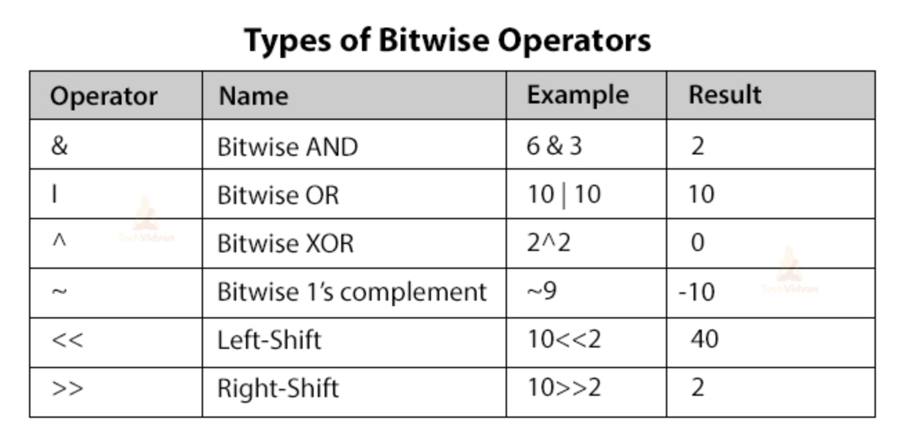
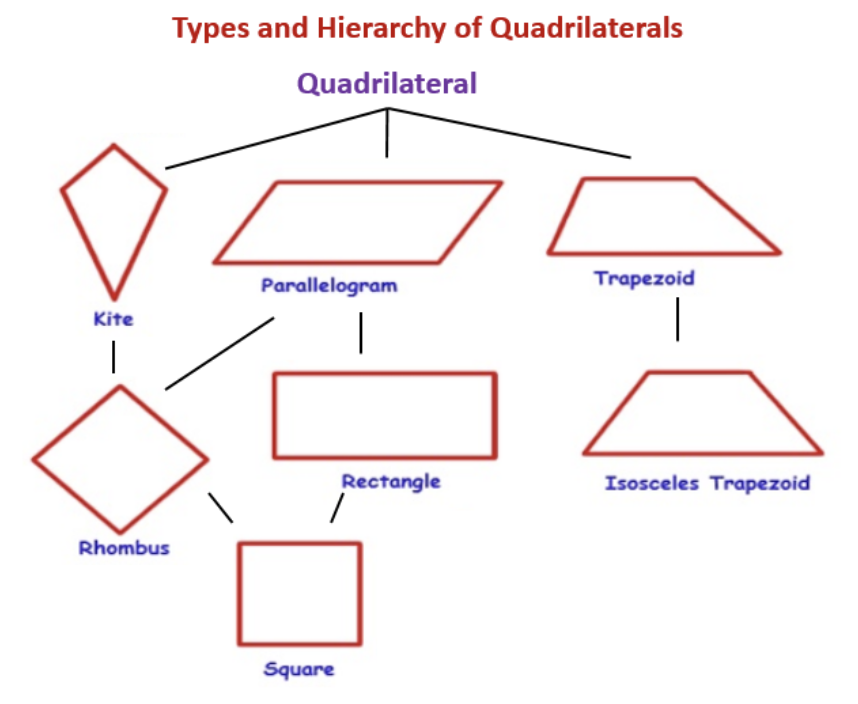
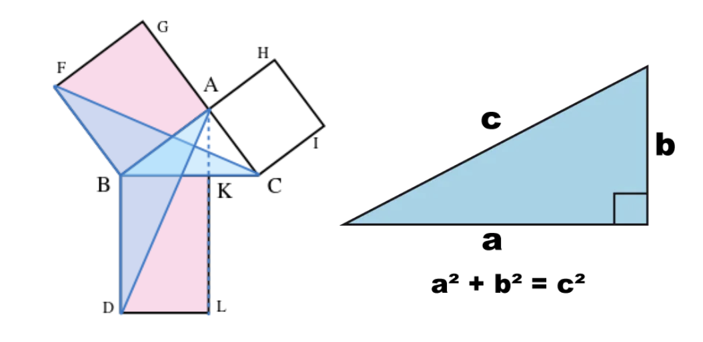
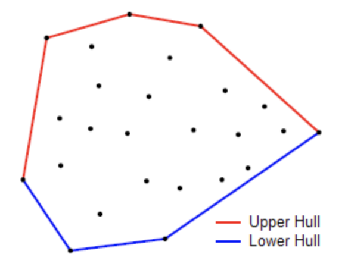

# Math

> Term

* Vacuous Truth
  * conditional that is only true because antecedent cannot be satisfied

* [Absolute value](https://www.youtube.com/watch?v=r6hS_8nm1jM)

* Addition
  * [Basic Multiplication](https://www.youtube.com/watch?v=mvOkMYCygps)
  * [Multiplication table](https://www.youtube.com/watch?v=xO_1bYgoQvA&list=PLD45913551291638C)

* Multiplication
  * [- * - is positive 1](https://www.youtube.com/watch?v=rK4sXm_MPWo)
  * [- * - is positive 2](https://www.youtube.com/watch?v=pzQY-9Nmtws)
  * [Order of operation 2](https://www.youtube.com/watch?v=ClYdw4d4OmA)
  * [Order of operation 2](https://www.youtube.com/watch?v=GiSpzFKI5_w)
  * [Subtract](https://docs.google.com/forms/d/1pLBK2MS25YizpvRDLHQBYfWsFvH1Vxq1mI56Q8BC5X8/edit)
  * [Multiply 1](https://docs.google.com/forms/d/1ggcgV1g-E0RV6QLgD3Ynnb6uJi3ooaLtQkUhH4fozaU/edit)
  * [Multiply 2](https://docs.google.com/forms/d/1TEBH7EzTysw_BeXxltjpFevm5leHWtw_oIDLG3Yg5Ro/edit)

* Division
  * [Idea of Division](https://www.youtube.com/watch?v=QI6x0KNxiCs)
  * [Multiplication to division](https://www.youtube.com/watch?v=qcMJ1pN36r4)
  * [Dividing 0](https://www.youtube.com/watch?v=SQzjzStU1RQ)
  * [Divising negative](https://www.youtube.com/watch?v=bQ-KR3clFgs)
  * [Unknowns Multiplication](https://www.youtube.com/watch?v=TqAtt3g6Tkc)
  * [Partial quotient](https://www.youtube.com/watch?v=Ws4Zq-gceSY)
  * [Long Division](https://www.youtube.com/watch?v=KFzcwWTEDDI)
  * [Adding fraction](https://www.youtube.com/watch?v=bcCLKACsYJ0)
  * [Improper Fraction](https://www.youtube.com/watch?v=-sA-vI2a2mM)
  * [Comparing Fraction](https://www.youtube.com/watch?v=8OKTrN0uT-Q)
  * [Addming mixed number](https://www.youtube.com/watch?v=4TBVB4hLQhY)
  * [division](https://docs.google.com/forms/d/1PdTSZzBfQMEk-0gK228MSYCfsFA3N1-oJEYEYoNm8TY/edit)
  * [quotient](https://docs.google.com/forms/d/1aUwp8EZpKeSLwDnXXM5QJQD4FIyqCi5MYWwfBhZV8FQ/edit)

* [Remainder](https://www.youtube.com/watch?v=P1qyjdh_sIw)

* Exponent
  * [Intro to Exponent](https://www.youtube.com/watch?v=XZRQhkii0h0)
  * [Negative Exponent](https://www.youtube.com/watch?v=JnpqlXN9Whw)
  * [Fractional Exponent](https://www.youtube.com/watch?v=tOuCdKqO6-s)
  * [Square Root](https://www.youtube.com/watch?v=mbc3_e5lWw0)
  * [Cube Root](https://www.youtube.com/watch?v=87_qIofPwhg)
  * [exponent](https://docs.google.com/forms/d/1oTC8TfBk8CDKimLdeHVR_wz6cDxYhJjC0IYbDwEO2PU/edit)

* [Prime](https://docs.google.com/forms/d/1-IziMX_y-CI5tHumG3OIhRhsdDLLQtkTb8DCzSTSEOI/edit)

* Equation
  * [What is a function?](https://www.youtube.com/watch?v=kvGsIo1TmsM)
  * [Linear Equation 1](https://www.youtube.com/watch?v=_y_Q3_B2Vh8)
  * [Linear Equation 2](https://www.youtube.com/watch?v=AOxMJRtoR2A)
  * [Variable](https://docs.google.com/forms/d/1Mue_sBppqzcez70ukrU_N66nqM3WJPh1T5x3Q66YjZM/edit)

> Complexity



* Big O

```text
o (strictly faster)  # f(n) = o(g(n))
f(n) ∈ O(g(n)) and f(n) ∉ θ(g(n))

O (upper)            # f(n) = O(g(n))
∃ positive constants c and k, such that f(n) <= cg(n) for all n >= k.
```

$$
\lim _{n \rightarrow \infty} \frac{f(n)}{g(n)} \neq \infty \Rightarrow f=O(g)
$$

* Big Omega

```text
Omega (lower)    f(n) = Ω(g(n))
∃ positive constants c and k such that f(n) >= c * g(n) for all n >= k
```

$$
\lim _{n \rightarrow \infty} \frac{f(n)}{g(n)} \neq 0 \Rightarrow f=\Omega(g)
$$

* Big Theta

```text
θ (average)    f(n) = θ(g(n))
∃ positive constants c1, c2 and k such that c1 * g(n) ≤ f(n) <= c2 * g(n) for all n >= k
```

$$
\lim _{n \rightarrow \infty} \frac{f(n)}{g(n)} \neq 0, \infty \Rightarrow f=\theta(g)
$$

> PNP



* P (Polynomial Time)
  * Sorting

* NP (Nondeterministic Polynomial Time)
  * Verifiable in polynomial time

* NP Complete
  * Boolean satisfiability problem
  * Hamiltonian path

* NP Hard
  * Do not have to be decision problems
  * TSP minimum distance
  * May not be verifiable in P time

* Reduction
  * Reduction from X to Y
  * polynomial time algorithm converting X inputs to equivalent Y inputs
  * Assume you have a black box for Y,  a polynomial time algorithm uses that box to solve X.
  * YP|NP →  XP|NP

* modular multiplicative inverse

```py
def modInverse(a, m):
    for x in range(1, m):
        if (a * x) % m == 1:
            return x
    return 1
```

```text
modular multiplicative inverse is an integer 'x' such that.

a x ≅ 1 (mod m)

The multiplicative inverse of “a modulo m” exists iff a and m are relatively prime.

Examples: Input: a = 3, m = 11
Output: 4
Explanation: Since (4*3) mod 11 = 1, 4 is modulo inverse of 3(under 11)
```

* Zellar's Formula

$$
\left(d+\left\lfloor\frac{13(m+1)}{5}\right\rfloor+y+\left\lfloor\frac{y}{4}\right\rfloor+\left\lfloor\frac{y / / 100}{4}\right\rfloor-2 y / / 100\right) \% 7
$$

## Algebra

> Log

* Definition

$$ y=\log _{b}(x) \Leftrightarrow b^{y}=x $$

* Quotient rule

$$ \log _{a}\left(\frac{x}{y}\right)=\log _{a} x-\log _{a} y $$

* Change of base

$$ \log _{a} x=\frac{\log _{b} x}{\log _{b} a} $$ 

### Prime

* [Euclidean-algorithm)](https://velog.io/@yerin4847/W1-%EC%9C%A0%ED%81%B4%EB%A6%AC%EB%93%9C-%ED%98%B8%EC%A0%9C%EB%B2%95)
  * [Prime numbers](https://www.youtube.com/watch?v=mIStB5X4U8M)
  * [Prime Factorization](https://www.youtube.com/watch?v=XWq8bplP-_E)
  * [GCD](https://www.youtube.com/watch?v=bLTfBvkrfsM)
  * [LCM 1](https://www.youtube.com/watch?v=znmPfDfsir8)
  * [LCM 2](https://www.youtube.com/watch?v=QUem_2dkB9I)
  * [LCM 3](https://www.youtube.com/watch?v=D6yHKOYJiso)

## Binary



> Binary

* [Binary](https://www.youtube.com/watch?v=ku4KOFQ-bB4)
* [Decimal to Binary](https://www.youtube.com/watch?v=H4BstqvgBow)
* [Adding in binary](https://www.youtube.com/watch?v=RgklPQ8rbkg)
* [Multiplying in binary](https://www.youtube.com/watch?v=xHWKYFhhtJQ)
* [Hexadecimal](https://www.youtube.com/watch?v=4EJay-6Bioo)
* [Bin to Hex](https://www.youtube.com/watch?v=8T4F7WboWPQ)
* [Bit](https://docs.google.com/forms/d/1o4hD5qOYlRfdoVcmeWQ83jBpngrnI2Cq6UUB8ULzaYA/edit)


## Combinatorics

> Terms

* Binomial coefficient

$$
n C k=C_{k}^{n}=\frac{n !}{k !(n-k) !}
$$

> Permutation

$$
P_{k}^{n}=\frac{n !}{(n-k) !}
$$

* How many different rearrangements are there of the letters in the word BUBBLE?
  * 6! | 3!


> Counting

* How many ways can 10 balls be selected if twice as many red balls as blue balls must be selected?
  * 3

* Case analysis




* How many ways can 10 balls be selected if at most one red ball is selected?




```md
If at most one red ball is selected, then either 1 red ball is selected or 0 red balls are selected. Since these two possibilities are distinct, the sum rule applies with no overcounting adjustment. In either case, we have two categories, blue and green, and either 9 or 10 choices of those type of balls.
```

$$
\left(\begin{array}{c}
9+2-1 \\
9
\end{array}\right)+\left(\begin{array}{c}
10+2-1 \\
10
\end{array}\right)=\left(\begin{array}{c}
10 \\
9
\end{array}\right)+\left(\begin{array}{c}
11 \\
10
\end{array}\right)=10+11=21
$$




* Complement
  * How many different phone numbers are there that begin with (858)-353- and contain at least one zero?
    * 104 – 94 = 10000 – 6561 = 3439
  * How many 4-digit campus telephone numbers have one or more repeated digits?
    * 104 - 10 * 9 * 8 * 7
  * number of arrangements of the letters of BANANA such that no two N's appear in adjacent positions?
    * 40
  * A subset of {1,2, …,12} is said to be selfish if it contains its size as an element. How many subsets have the property that both the subset and its complement is selfish?
    * 772

* Stars and bars
  * Suppose we are playing a game where we can place 5 indistinguishable knights into 3 different castles. How many combinations do we have?
    * C(7, 2)
  * Consider equation a + b + c + d = 10 where a, b, c, d are non-negative integers. How many solutions does this equation have?
    * C(13, 3)
  * How many different orders for six hot dogs are possible if there are three varieties of hot dogs?
    * C(8, 2)
  * Find the number of non-negative integer solutions of 3x + y + z = 24.
    * 117

* Inclusion | Exclusion
  * Among 30 students, 14 are girls, and 22 are right-handed. Minimum number of right-handed girls?
    * 6
  * How many of the integers 1, 2, . . . 10000 are divisible by 2, 3, or 7?
    * 7143
  * Six people are in a line. Number of arrangements such that no three consecutive are in increasing order of height, from front to back.
    * 349

## Geometry

> Term

* Euclidean
  * To draw a straight line from any point to any point.
  * To produce (extend) a finite straight line continuously in a straight line.
  * To describe a circle with any centre and distance (radius).
  * That all right angles are equal to one another.
  * That, if a straight line falling on two straight lines make the interior angles on the same side less than two right angles, the two straight lines, if produced indefinitely, meet on that side on which the angles are less than two right angles. [The parallel postulate]


> Triangle

* Area SSS

$$
\sqrt{p(p-a)(p-b)(p-c)}
$$

* Area SAS

$$
\frac{a \cdot b \cdot \sin (\theta)}{2}
$$

> Quadrillateral



* Area

$$
when s=\frac{a+b+c+d}{2}

S=\sqrt{(s-a)(s-b)(s-c)(s-d)}
$$

* Polygon

> Check point(q) in a polygon(p1, ... , pn)

```sh
for i in 2, …, n
  if $$ \overline{p_{i} q} \cdot \overline{p_{i-1} p_{i}} \geq 0 $$
    return true
return false
```

$$
\text { Area }=\frac{1}{2}\left|\begin{array}{cc}
x_{1} & y_{1} \\
x_{2} & y_{2} \\
x_{3} & y_{3} \\
\vdots & \vdots \\
x_{n} & y_{n} \\
x_{1} & y_{1}
\end{array}\right|=\frac{1}{2}\left[\left(x_{1} y_{2}+x_{2} y_{3}+x_{3} y_{4}+\cdots+x_{n} y_{1}\right)-\left(y_{1} x_{2}+y_{2} x_{3}+y_{3} x_{4}+\cdots+y_{n} x_{1}\right)\right]
$$

> Terms

* Convex Set
  * Given any collection of convex sets (finite, countable or uncountable), their intersection is a convex set
  * Proof: If the intersection is empty, or consists of a single point, the theorem is true by definition. Otherwise, take any two points A, B in the intersection. The line AB joining these points must also lie wholly within each set in the collection, hence must lie wholly within their intersection

* Homeomorphism
  * a continuous function between topological spaces that has a continuous inverse function
* Inscribed square problem
  * Does every plane simple closed curve contain all four vertices of some square?

* Pythagorean Theorem



$$
\text { hypotenuse }^{2}=\text { base }^{2}+\text { perpendicular }^{2}
$$

> Coordinates

* Cylindrical
  * z : height
  * r : radius from the z-axis
  * θ : angle its projection on the xy-plane makes with respect to the horizontal axis

* Spherical
  * ρ : distance from the origin
  * θ : the angle its projection on the xy-plane makes with respect to the horizontal axis
  * φ : the angle that it makes with respect to the z-axis.

> Convex Haul

* monotone chain, O(n log n)
* Returns: a list of vertices of the convex hull in counter-clockwise order
* divide points into half and find convex hull recursively
* When merging two polygons, check whether extension of line intersects with boundary and pick next point in counter clockwise







```py
def ccw(A,B,C):
  return (C.y-A.y) * (B.x-A.x) > (B.y-A.y) * (C.x-A.x)

def intersect(A,B,C,D):
  return ccw(A,C,D) != ccw(B,C,D) and ccw(A,B,C) != ccw(A,B,D)
```




```py
def dist_point2point(p1, p2):
  """Calculate distance between p1, p2.
  Args: p1 (float, float): coordinates of p1
        p2 (float, float): coordinates of p2
  Returns: float: distance
  """
  return ((p2[1] - p1[1]) ** 2 + (p2[0] - p1[0]) ** 2) ** 0.5

def general_two_point(p1, p2):
  a = p1[1] - p2[1]
  b = p2[0] - p1[0]
  c = (p1[0] - p2[0]) * p1[1] + (p2[1] - p1[1]) * p1[0]

  norm = (a ** 2 + b ** 2) ** 0.5

  return (a / norm, b / norm, c / norm)

def dist_point2segment(q, p1, p2):
  x1, y1 = p1
  x2, y2 = p2
  x3, y3 = q

  dx = x2 - x1
  dy = y2 - y1

  if dx == 0 and dy == 0:
    return -1, -1

  u = ((x3 - x1) * dx + (y3 - y1) * dy) / (dx * dx + dy * dy)
  u = min(1, max(0, u))

  return x1 + u * dx, y1 + u * dy

def distance_point_segment(q, p1, p2):
  return dist_point2point(dist_point2segment(q, p1, p2), q)

def computeDistancePointToPolygon(P, q):
  if len(P) < 3:
    raise(Exception("Polygon must have more than 2 vertices"))

  minDist = float('inf')
  for i in range(len(P)):
    minDist = min(minDist, distance_point_segment(
      q, P[i], P[(i + 1) % len(P)]))

  return minDist
```




```py
def computeTangentVectorToPolygon(P, q):
  minDist = computeDistancePointToPolygon(P, q)
  indices = []

  for i in range(len(P)):
    if minDist == distance_point_segment(q, P[i], P[(i + 1) % len(P)]):
      indices.append(i)

  if len(indices) == 2:
    px, py = P[indices[1]] if distance(q, P[indices[1]]) < distance(
      q, P[(indices[1] + 1) % len(P)]) else P[(indices[1] + 1) % len(P)]
    qx, qy = q
    dx = qx - px
    dy = qy - py
    x = -dy
    y = dx
    norm = (x ** 2 + y ** 2) ** 0.5
    return x / norm, y / norm
  else:
    a, b, c = computeLineThroughTwoPoints(
      P[indices[0]], P[(indices[0] + 1) % len(P)])
    return b, -a

def isPointInPolygon(q, Ps):
  for i in range(1, len(Ps)):
    x0, y0 = q
    x1, y1 = Ps[i - 1]
    x2, y2 = Ps[i]

    v1 = np.array([-(y2 - y1), x2 - x1])
    v2 = np.array([x0 - x1, y0 - y1])
    if (np.dot(v1, v2) >= 0):
      return True
  return False

def isLineIntersect(p1, p2, p3, p4):
  x1, y1 = p1
  x2, y2 = p2
  x3, y3 = p3
  x4, y4 = p4
  num = (x4 - x3) * (y1 - y3) - (y4 - y3)(x1 - x3)
  den = (y4 - y3) * (x2 - x1) - (x4 - x3)(y2 - y1)

  if num == 0 and den == 0:
    print("Two lines coincide")
    return True
  elif num != 0 and den == 0:
    print("Two lines are parallel")
    return False
  elif num != 0 and den != 0:
    return True

  return False

def calculateShortestPoint(q, p1, p2):
  x1, y1 = p1
  x2, y2 = p2
  x3, y3 = q

  dx = x2 - x1
  dy = y2 - y1

  if dx == 0 and dy == 0:
    return -1, -1

  u = ((x3 - x1) * dx + (y3 - y1) * dy) / (dx * dx + dy * dy)
  u = 1 if u > 1 else 0
  return x1 + u * dx, y1 + u * dy

def isPolygonIntersect(P1, P2):
  N = len(P1)
  M = len(P2)
  for q in P1:
    if isPointInPolygon(q, P2):
      return True

  for i in range(len(P1)):
    for j in range(len(P2)):
      if isLineIntersect((P1[i], P1[(i + 1) % N]), (P2[j], P2[(j + 1) % M])):
        return True

  return False
```




```py
def outerTrees(self, points):
  points = sorted(points)

  if len(points) <= 1:
    return points

  # 2D cross product of OA and OB vectors, i.e. z-component of their 3D cross product.
  # positive if OAB a counter-clockwise turn, negative for clockwise turn, and zero if collinear
  def cross(o, a, b):
    return (a[0] - o[0]) * (b[1] - o[1]) - (a[1] - o[1]) * (b[0] - o[0])

  lower = []
  for p in points:
    while len(lower) >= 2 and cross(lower[-2], lower[-1], p) < 0:
      lower.pop()
    lower.append(p)

  upper = []
  for p in reversed(points):
    while len(upper) >= 2 and cross(upper[-2], upper[-1], p) < 0:
      upper.pop()
    upper.append(p)

  return lower[:-1] + upper[:-1]    # Omit last because it’s at the beginning of the other list.
```




### Coordinate System

> Cartesians

| notation | meaning                                     |
| -------- | ------------------------------------------- |
| x        | coordinate representing horizontal position |
| y        | coordinate representing vertical position   |

* To Polar

$$x_{p}=r \cos (\theta)$$
$$y_{p}=r \sin (\theta)$$

> Polar

| notation     | meaning                                                   |
| ------------ | --------------------------------------------------------- |
| $\mathrm{r}$ | Distance from the origin                                  |
| $\theta$     | angle measured counter-clockwise from the positive x-axis |

* To Cartesians

$$r=\sqrt{x_{p}^{2}+y_{p}^{2}}$$

$$\theta =\tan ^{-1}\left(y_{p} \mid x_{p}\right)$$


## Trignometry


* Radian degree conversion

$$
b(d e g)=180 \cdot a(r a d) \mid \pi
$$

$$
a(r a d)=\pi \cdot b(d e g) \mid 180
$$

## Calculus

> Derivative

* chain rule
  * f ○ g

> Integral

* Area of revolution

$$
S=\int_{a}^{b} 2 \pi f(x) \sqrt{1+\left[f^{\prime}(x)\right]^{2}} d x
$$

> Laplace


## Probability

* Theorem of total probability

$$ p(x)=\sum_{y} p(x \mid y) $$
$$ p(y) \quad p(x)=\int p(x \mid y) p(y) d y $$

> Term

* Chi square test
  * data must be random, raw, mutually exclusive, drawn from independent variables / large enough sample
  * Expected: $E_{i}$
  * Observed: $O_{i}$

$$ x_{c}^{2}=\sum \frac{\left(O_{i}-E_{i}\right)^{2}}{E_{i}} $$


* Event
  * subset of possible outcomes denoted as E

$$ P(E)=\sum_{s \in E} p(s) $$

* Likelihood
  * Trying to find optimal value for the mean or standard deviation for a distribution given measurements

* Monte Carlo
  * Car hidden behind one of three doors. Goats hidden behind the other two. The player gets to choose a door. Host opens another door, revealing a goat.
  * Players can choose whether to swap choices with other closed doors or stay with the original choice.
  * Should player change

* Probability Mass Function : Discrete


* Probability distribution function : Continuous


* Sample space
  * (finite or countable) set of possible outcomes, denoted as S

> Bayes

* Assume that features are linearly independent
* Posterior

$$ p(\text { label } \mid \text { features })=\frac{p(\text { label }) \cdot p(\text { features } \mid \text { label })}{p(\text { features })} $$

| Term         | Symbol                                    |
| ------------ | ----------------------------------------- |
| Prior        | $p(label)$                                |
| Evidence     | $p(features)$                             |
| Likelyhood   | $p(features \mid label)$                  |
| Sensor Model | $P(z \mid x)$                             |
| Action Model | $P\left(x_{t} \mid u_{t}, x_{t-1}\right)$ |


* $\operatorname{Bel}\left(x_{t}\right)$


| Equation                                                                                                                                                                            | Derivation           |
| ----------------------------------------------------------------------------------------------------------------------------------------------------------------------------------- | -------------------- |
| $P\left(x_{t} \mid u_{1}, z_{1}, \ldots, u_{t}, z_{t}\right)$                                                                                                                       |                      |
| $\eta P\left(z_{t} \mid x_{t}, u_{1}, z_{1}, \ldots, z_{t-1}, u_{t}\right) P\left(x_{t} \mid u_{1}, z_{1}, \ldots, z_{t-1}, u_{t}\right)$                                           | Bayes                |
| $\eta P\left(z_{t} \mid x_{t}\right) P\left(x_{t} \mid u_{1}, z_{1}, \ldots, z_{t-1}, u_{t}, x_{t-1}\right)$                                                                        | Sensor Independence  |
| $\eta P\left(z_{t} \mid x_{t}\right) \int P\left(X_{t} \mid u_{1}, z_{2}, \ldots, u_{t-1}, x_{t-1}\right) \cdot P\left(X_{t-1} \mid u_{1}, z_{2}, \ldots, u_{t-1}\right) d x_{t-1}$ | Total Probability    |
| $\eta P\left(z_{t} \mid x_{t}\right) \int P\left(X_{t} \mid u_{t-1}, x_{t-1}\right) \cdot P\left(X_{t-1} \mid u_{1}, z_{2}, \ldots, u_{t-1}\right) d x_{t-1}$                       | Markvian             |
| $\eta P\left(z_{t} \mid x_{t}\right) \int P\left(X_{t} \mid u_{t-1}, x_{t-1}\right) \cdot \operatorname{Bel}\left(X_{t-1}\right) d x_{t-1}$                                         | Definition of Belief |

> Conditional probability

$$ P(x | y) $$

* The probability that two siblings are girls if one knows the oldest is a girl | one of them is a girl

$$ \frac{1}{2} * \frac{1}{3} $$

> Joint Probability

$$ \mathrm{p}(\mathrm{x}, \mathrm{y}) $$

* independent

$$ \mathrm{p}(\mathrm{x}, \mathrm{y})=\mathrm{p}(\mathrm{x}) \mathrm{p}(\mathrm{y}) $$

* dependent

$$ \mathrm{p}(\mathrm{x}, \mathrm{y})=\mathrm{p}(\mathrm{x} \mid \mathrm{y}) \mathrm{p}(\mathrm{y}) $$

> Random variable

* Descrete
  * described informally as a variable whose values depend on outcomes of a random phenomenon
  * Year that a random student was born
* Continous
  * Mass of a random animal selected at the new orleans zoo

> Variance

* measures how far a set of (random) numbers are spread out from their average value

$$ \operatorname{var}(X)=E\left[(X-E[X])^{2}\right]=E\left[X^{2}\right]-E[X]^{2} $$

* Covariance
  * Positive | negative value indicates a increasing | decreasing linear relationship
  * Population covariance (Excel) formula has denominator N instead of sample covariance with n -1

$$ cov(X, Y) = E[(X-E[X])(Y-E[Y])]=E[X Y]-E[X] E[Y] $$
$$ cov(X, X) = var(X) $$

### Distribution

> Binomial

* probability of k successive in n independent Bernoulli trials, given success is p
* p : binomial probability
* n : total event
* k : desired event

$$ (nCk)  p^k (1 - p)^(n-k) $$

* A coin is tossed 10 times. What is the probability of getting exactly 6 heads?
  * 10𝐶6 ∗ 0.56 * 0.54 = 0.205078125

> Bernoulli

* a performance of an experiment with two possible outcomes
* Record how many coins land heads up and how many land tails up

> Beta

$$ \frac{x^{\alpha-1}(1-x)^{\beta-1}}{B(\alpha, \beta)} $$


> Gaussian

* kExpect most of the measurements to be close to mean and symmetrical
* mean : μ
* PDF

$$ \frac{1}{\sqrt{2 \pi \sigma^{2}}} e^{-\frac{(x-u)^{2}}{2 \sigma^{2}}} $$


> Gamma

* k : shape parameter
* θ : scale parameter
* PDF

$$ \frac{1}{\Gamma(k) \theta^{k}} x^{k-1} e^{-x / \theta} $$

> Geometric


> Poisson

* Events occur independently
* Approximation is good if p ≤ 0.1 and λ = np ≤ 5
* lambda = n*p : mean
* n : number of times an event occurs in an interval


* There are an average of 20 calls per hour. What is the probability that there are exactly 18 calls in 1 hour?

$$ \frac{20^{18} \cdot e^{-20}}{18 !} $$

> Uniform


### Estimation

* Assume a joint distribution

| Equation                              | Meaning |
| ------------------------------------- | ------- |
| $P(D, \theta)$                        |
| $D=\left(x_{1}, \ldots, x_{n}\right)$ | Data    |

> Maximum Likelihood

$$\theta_{M L E}=\arg \max _{\theta} P(D \mid \theta)$$

* [-] Often Overfit

> Maximize Posteriori

* [+] Easy to compute and interpretable
* [+] Regularization effect, shrinkage →  Avoid Overfitting
* [-] Point estimate → No representation of uncertainty in θ
* [-] Not invariant under reparameterization
* [-] Must assume prior on θ


$$\theta_{MAP}=\arg \max_{\theta} P(\theta \mid D)$$


### Expectation

* Definition

$$ E(X)=\sum_{s \in S} P(s) X(s)=\sum_{r \in X(S)} P(X=r) r $$

* Linearity

$$ E\left(X_{1}+\ldots+X_{n}\right)=E\left(X_{1}\right)+\ldots+E\left(X_{n}\right) $$

* What is the expected value of the number of pips showing on a die after it is rolled once?

$$ (1 + 2 + 3 + 4 + 5 + 6) ∗ \frac{1}{6} = 3.5 $$

* I play solitary and have a probability p of winning. Let X be the number of games until I win a game.
  * Let A be the probability of winning a game in a first try.

$$ E(X)=P(A) E(X \mid A)+P\left(A^{c}\right) E\left(X \mid A^{c}\right) $$
$$ =p(1)+(1-p)(1+E(X)) $$

## Proof

### Induction

* Sample question
  * Domino falls over
  * Empty room example → No one passed the hallway
  * A(0) = 1, A(1) = 4, A(n) = 3A(n − 1) + 4A(n − 2) for n > 1

> Arithmetic sum

$$ \frac{n(n+1)}{2} $$

* Base

$$ 1=\frac{1(1+1)}{2} $$

* Inductive hypothesis

$$ 1+2+\ldots+k=\frac{k(k+1)}{2} $$

* Proof

$$ 1+2+\ldots+(k+1) $$
$$ = [1+2+3+\ldots+k]+(k+1) $$
$$ =\frac{k(k+1)}{2}+(k+1) $$
$$ =\frac{k(k+1)+2(k+1)}{2} $$
$$ =\frac{(k+1)+(k+2)}{2} $$

> Strong

* Let F(S) be the number of breaks required for bar size S which is m * n.

* Base: F(1) = 0 because we don’t need to break for a bar of size 1.
* Strong Inductive Hypothesis: Suppose F(k) = k - 1 true for 1 ≤ k < S.
* Inductive Step:
  * For a chocolate bar with the size of S, break it into the size of a and b. where a < S, b < S, and a + b = S.
  * F(a) = a - 1 and F(b) = b - 1 by our strong inductive hypothesis.
  * Then the total number of break would be 1 + (a - 1) + (b - 1) = S - 1 = m * n - 1.


## Series

> arithmetic series

$$ a_{n}=a_{1}+(n-1) d $$

* Sum

$$ \frac{n\left(a_{1}+a_{n}\right)}{2} $$

> geometric series

$$ \sum_{k=0}^{\infty} a r^{k} $$

* Sum
  * n : number of terms

$$ S_{n}=\frac{a\left(r^{n}-1\right)}{r-1} $$

## Statistic

## Linear Algebrra

> Terms

* E : Essential matrix
* F : Fundametal matrix
* q : pixel coordinate

* Determinant

$$
|A|=\left|\begin{array}{lll}
a & b & c \\
d & e & f \\
g & h & i
\end{array}\right|=a\left|\begin{array}{cc}
e & f \\
h & i
\end{array}\right|-b\left|\begin{array}{ll}
d & f \\
g & i
\end{array}\right|+c\left|\begin{array}{ll}
d & e \\
g & h
\end{array}\right|
$$

* EigenValue
  * x : eigenvector

$$ Ax = λx $$
$$ (A - λI) * x = 0 $$

* Nullspace

$$ N=\left\{x \in R^{n} \mid A x=0\right\} $$

* Nullity
  * dimension of its nullspace

$$
\left[\begin{array}{ccccc}
1 & 1 & 0 & 7 & -2 \\
0 & 0 & 1 & -2 & 2
\end{array}\right]\left[\begin{array}{c}
x_{1} \\
x_{2} \\
x_{3} \\
x_{4} \\
x_{5}
\end{array}\right]=\left[\begin{array}{c}
-1 \\
1 \\
0 \\
0 \\
0
\end{array}\right]+x_{4}\left[\begin{array}{c}
-7 \\
0 \\
2 \\
1 \\
0
\end{array}\right]+x_{5}\left[\begin{array}{c}
2 \\
0 \\
-2 \\
0 \\
1
\end{array}\right]
$$

* Orthonormal
  * A square matrix is orthonormal (also called unitary) if its columns are orthonormal vectors.
  * A rotation matrix is an orthonormal matrix with determinant = 1.
  * also possible for an orthonormal matrix to have determinant = -1
This is a rotation plus a flip (reflection)

  * A matrix A is orthonormal iff

$$
\mathrm{A}^{-1}=\mathrm{A}^{\top} \\
\mathrm{AA}^{\top}=\mathrm{A}^{\top} \mathrm{A}=\mathrm{I}
$$

* Principal point
  * Where principal axis and image plane meets

* Rank
  * Dimension of column space

* Skew Symmetric
  * matrix S is skew symmetric iff S = -S^T
  * The determinant of a skew symmetric matrix is 0


* Trace
  * Sum of diagonal elements. If it is non-square, undefined

### Vector

> Projection


$$
c=\frac{x \cdot v}{v \cdot v}=\frac{x \cdot v}{\|v\|^{2}} \\
(\lambda-c v) \cdot v=0
$$

$$ \operatorname{Proj}_{L}(a+b)=\operatorname{Proj}_{L}(a)+\operatorname{Proj}_{L}(b) $$

> Dot product

* Less than 90 degrees ⇒ positive

$$ a \cdot b=\sum a_{i} b_{i}=|a \| b| \cos \theta $$

> Cross Product

$$ a \times b=\sum a_{i} b_{i}=|a \| b| \sin \theta $$

* Area of parallelogram ab
* Right Hand Rule
* 0 if parallel
* angle between two vector

$$ \theta=\cos ^{-1}\left(\frac{\mathbf{a} \cdot \mathbf{b}}{|\mathbf{a}||\mathbf{b}|}\right) $$

* Unit vector

$$ \frac{v}{\|v\|} $$

* Transformation
  * To transform v by E == E * v

### Coordinate Systems


| symbol          | name                           | Description                                                             |
| --------------- | ------------------------------ | ----------------------------------------------------------------------- |
| $C$             | Camera Matrix                  | World -> Pixel                                                          |
| $E$             | Essential Matrix               |                                                                         |
| $F$             | Fundametal Matrix              |                                                                         |
| $\Pi$           | Projection matrix              | Camera -> Firm                                                          |
| $K$             | Intrinsic / Calibration matrix | Camera -> Pixel (3, 3)                                                  |
| ${ }_{a}^{b} R$ | Rotation Matrix                | wrt camera b                                                            |
| ${ }_{c}^{w} T$ | Extrinsic parameter            | World → Camera                                                          |
| $\alpha$        | aspect ratio                   | 1 unless pixels are not square                                          |
| $(C_x, C_y)$    | principal point                | (0, 0) unless optical axis doesn't intersect projection plane at origin |
| d               | Look at point                  |
| e               | Center point of projection     |
| f               | Focal length                   | in units of pixels when world coordiantes in mm                         |
| S               | skew                           | 0 unless pixels are shaped like rhombi / parallelograms                 |
| u               | camera up vectro               |

> Perspective Projection

* Given 3D points in camera coordinates, determine corresponding image coordinates.
* Transforming 3D points into 2D is called Projection.
* Most common for computer graphics.
* Simplified model of the human eye, or camera lens (pinhole camera)
* Things farther away appear to be smaller.
* Discovery attributed to Filippo Brunelleschi in the early 1400's
* Project along rays that converge in center of projection.
* express using homogeneous coordinates and 4x4 matrices as follows
* Using projection matrix, homogeneous division seems more complicated than multiplying all by -d/z.
* Handle different types of projections in a unified way.
* Define arbitrary view volumes.


> Object coordinate

* Often origin is in geometric center, on the base, or in a corner of the object
* Transformation from object to world coordinate is given by model matrix

* To Camera

$$\mathrm{P}_{\mathrm{C}}=\mathrm{C}^{-1} \mathrm{MP}_{\mathrm{o}}$$

> World Coordinate (${ }^{w} p$)

* If there is a ground, usually x / y is horizontal and z points up
* Otherwise, x / y is often screen plane, z points out of the screen

* to camera
  * multiply by extrinsic parameter

$$\left[\begin{array}{cc}{ }^{C} \mathcal{R} & { }^{C} O_{W} \\ 0^{T} & 1\end{array}\right]$$

> Camera coordinate (${ }^cp$)

* Origin defines center of projection of camera
* x-y plane is parallel to image plane
* z-axis is perpendicular to image plane


* To world coordinate

$$\boldsymbol{C}=\left[\begin{array}{cccc}\boldsymbol{x}_{C} & \boldsymbol{y}_{C} & \mathbf{z}_{C} & \boldsymbol{e} \\ 0 & 0 & 0 & 1\end{array}\right]$$

* To film coordinate

$$\left[\begin{array}{cccc}f / s_{x} & 0 & o_{x} & 0 \\ 0 & f / s_{y} & o_{y} & 0 \\ 0 & 0 & 1 & 0\end{array}\right]$$

* To Pixel
  * Multiply by intrinsic parameter (K)

$$\left[\begin{array}{ccc}f & s & c_{x} \\ 0 & \alpha f & c_{y} \\ 0 & 0 & 1\end{array}\right]$$

* To Canonical View Volume
  * Projection matrix

> Canonical View Volume Coordinate

* 3D volume seen by camera
* Projection matrix that user defined view volume transforms into canonical view volume [-1,1]x[-1,1]x[-1,1].
* Multiplying corner vertices of view volume by projection matrix and performing homogeneous divide yields corners of canonical view volume.
* Perspective and orthographic projection are treated the same way.
* Canonical view volume is the last state in which coordinates are in 3D.
* Last stage in which coordinates are in 3D
* Only things that end up inside the canonical volume can appear in the window
* Parallel sides and unit dimensions make many operations easier
  * Clipping – decide what is in the window
  * Rasterization - decide which pixels are covered
  * Hidden surface removal - decide what is in front
  * Shading - decide what color things are


* to image coordinate
  * Viewport transformation

> Perspective view volume

* Convert the view-frustum to the simple symmetric projection frustum.
* Transform the simple frustum to the canonical view frustum.

> Pixel / Calibrated coordinate

* in 2D
### Matrix

> Term

* Singular
  * a square (n × n) matrix that meets any / all of these conditions
  * columns are linearly dependent
  * rows are linearly dependent
  * determinant = 0
  * matrix is not invertible
  * matrix is not full rank (i.e., rank < n)

> Transformation

* Affine : $[A]_{2 \times 3}$
  * any transformation that preserves collinearity
  * 6DOF
  * Combination of linear transformations, and translations
  * Origin does not necessarily map to origin
  * Lines map to lines
  * Parallel lines remain parallel
  * Ratios are preserved
  * Closed under composition

* Projective : $[\hat{H}]_{2 \times 3}$
  * 8DOF
  * Origin does not necessarily map to origin
  * Lines map to lines
  * Closed under composition
  * Parallel lines do not necessarily remain parallel
  * Ratios are not preserved
  * Models change of basis

* Rigid $[R \mid t]_{2 \times 3}$
  * 3 Degree of freedom

* Similarity $[s R \mid t]_{2 \times 3}$
  * 4 Degree of freedom

* Translation


* Rotation
  * Counterclockwise
  * RTR = I
  * det(R) = 1
  * 2D : SO2 / 3D : SO3


