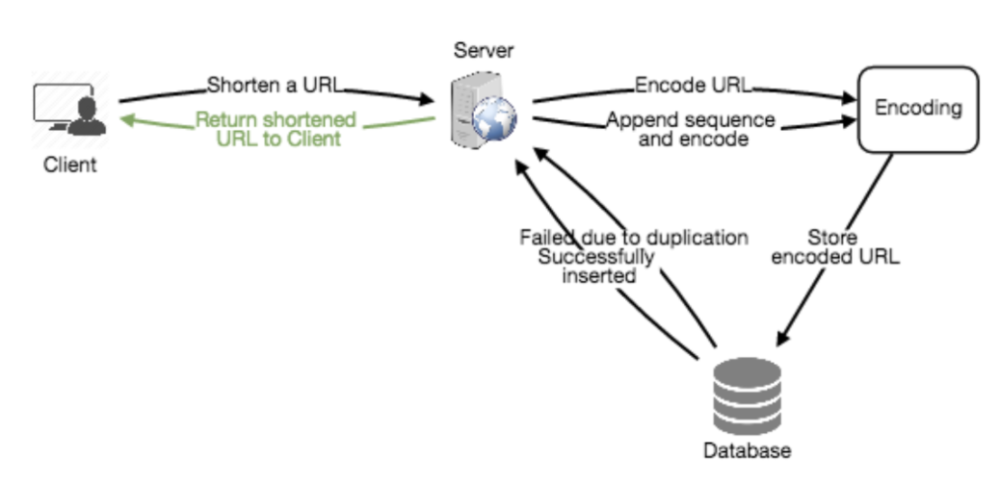

# Software

> Terms

* BIOS (basic input input system)
  * firmware used to perform hardware initialization during the booting process (power-on startup)
  * provide runtime services for operating systems and programs
* Software development Toolkit

* Library / Frameworks
  * predefined set of classes that does similar things

* Time
  * Universal time coordinate : Compromise between english and french abbreviation
  * GMT : Greenwich Mean Time, time zone at UTC + 0.0

* Posix (Portable Operating System Interface)
  * standards specified by IEEE Computer Society for maintaining compatibility between operating systems

* Program Counter (PC)
  * PC points at (contains the address of) some machine-language instruction in main memory

* rpath
  * designates the run-time search path hard-coded in an executable file or library

* standalone (freestanding program)
  * no external module, library, program designed to boot with bootstrap procedure of target processor

* Windows Driver Model (wdm)
  * framework for device drivers that was introduced with Windows 98 and Windows 2000 to replace VxD which was used on older versions of Windows such as Windows 95 and Windows 3.1

* Von Neumann model of computing
  * Fetch, decode, execute

* X Window System
  * xAuthority file is in ~, stores credentials in cookies used by xauth for authentication of X sessions

> Flynn's Taxonomy


* SISD
  * A sequential computer which exploits no parallelism in either the instruction or data streams
  * Single control unit (CU) fetches single instruction stream (IS) from memory

* MISD
  * Not a commonly used architecture → fault tolerance

* SIMD
  * Image processing, GPU

* MIMD
  * Multicore PC

  * SPMD

  

  * MPMD

  

> Encodings

* Rules for translating a Unicode string into a sequence of bytes are called an encoding
* Byte Order Mark # Set encoding for file

* ASCII
  * American Standard Code for Information Interchange


```sh
code point (U+ or \u)
U+0000~U+FFFF    # BMP (Basic Multilingual Plane)
U+10000~U+1FFFF  # SMP (Supplementary Multilingual Plane)
```

* URL encoding

```sh
! @    # %21, %40
```

* UTF-8
  * Three byte encoding for korean

```sh
# Korean
[(initial) × 588 + (medial) × 28 + (final)] + 44032
Initial consonants # ㄱㄲㄴㄷㄸㄹㅁㅂㅃㅅㅆㅇㅈㅉㅊㅋㅌㅍㅎ
Medial vowels      # ㅏㅐㅑㅒㅓㅔㅕㅖㅗㅘㅙㅚㅛㅜㅝㅞㅟㅠㅡㅢㅣ
Final consonants   # noneㄱㄲㄳㄴㄵㄶㄷㄹㄻㄼㄽㄾㄿㅀㅁㅂㅄㅅㅆㅇㅈㅊㅋㅌㅍㅎ
U+0080~U+07FF      # 110xxxxx 10xxxxxx
U+0800~U+FFFF      # 1110xxxx 10xxxxxx 10xxxxxx
U+10000~U+1FFFFF   # 11110xxx 10xxxxxx 10xxxxxx 10xxxxxx
```

* CP949
* EUC-KR

> GNU (Gnu is Not Unix)

* OS project by Free Software Foundation, first free desktop environment
* Developed environment with all major components of Unix OS, excep for kernal (LINUX project)

* GNOME (GNU Network Object Model Environment)
  * GTK based linux desktop
  * [+] many keyboard shortcuts
  * [-] limited native function, heaviest resource computer desktop

* GPL (GNU General Public License)
  * software licence

> Convention

* No comment
  * may forget to update the comments when you update the code, and they end up being misleading
  * make code readable, with good variable, function names, and to structure well that no longer need any comments

## Engineering

* wiki?curid=10015 : wiki based
* https://stackshare.io/ : compare different stacks

> Term

* Continuous delivery
  * Increase productivity : No manual intervention after writing codes

### KPI

> KPI (Key Performance Indicator)

* Operational
  * problem understanding : clarify any uncertainties arount the problem SLA (Service-Level Agreement)
* Tactical
  * SME (subject matter expert)
  * accurate and repeatable analysis
  * concise documentation / automatic alerting & monitoring for unseen changes
* Strategical
  * Prioritize and identify important problem that are not actively being worked on product, process, policy
* evaluate the success of an organization or of a particular activity in which it engages

* CPS (Cost Per Sales)
  * the amount of money paid for every sale generated

* CTR (Click Through Rate)
  * number of clicks that your ad receives divided by the number of times your ad is shown

### Delivery

> Term

* Open source
  * https://naver.github.io/OpenSourceGuide/book/

* Bill of materials
  * Customer Relationship Management

* CPM (Cost per Mile | cost per thousand)
  * cost an advertiser pays for one thousand views or clicks of an advertisement

* minimum viable product (MVP)
  * a development technique in which a new product or website is developed with sufficient features to satisfy early adopters.

* Release
  * Canary deploy : rollout new model with small subset of users, then monitor its performance
  * Binary Release : most windows machines do not have a compiler installed
  * Source Release : common in linux. b/c vary in cpu, installed library, kernel, compilers version
  * Blue-Green deploy : two complete deployments with active (rolled out) + idle (test)
  * Maintenance Release : release of a product that does not add new features or content

* POC (Proof of concept)
  * check before releasing the product
* Root cause analysis
  * Find why customer act something

* stock-keeping unit (SKU)
  * a unique identifier for each distinct product and service that can be purchased in business

### Dev-ops

* collaboration among everyone participating in delivering software

> Terms

* Iteration (sprint)
  * Trying to make a large project act like a small one  Default to 20 days.
  * How much communication do I need to have with the customer? How much risk?
  * Rapid feedback from the customer to avoid deviating from the customer’s wants
* on premise
  * all computing resources are accessed and managed by premises

* Process of Reference
* Meeting
  * Learn progress, status -> Update big board
  * Surface problems that are slowing things downj

* Standup questions
  * What have you accomplished since the last standup?
  * What did you learn that would be valuable for the team to know?
  * What's impeding you?
  * What do you intend to do before the next stand up?

* Milestone
  * Project get paid after milestone

* Task
  * risk addressed (unseen technical requirements and risks)
  * inaccurate estimates
  * no division of labor

* User Story
  * keep the end goal in mind from the user's perspective to prevent things like feature creep and facilitate communication between all stakeholders.
  * Describes an observable end-user feature in customer language
  * Can have direct feed-back from the customer
  * Planning poker to decide estimates
  * In Business Driven Development Scenario, disambiguating user stories using sequence and special cases (multiple scenarios per story)
  * BDD scenario is covered by matching automated story test

```text
Scenario 1: Favorite a New Route
Given that the user is on the Save Route screen
And they are saving a route named “RouteA”
When the user presses the “Favorite” button
And then they press the “Save” button
Then the app should go to the Routes page
And “RouteA” should be shown as a favorite.

As a person who like to walk            # Who will benefit from the feature?
I want to have an accurate measure of the distance I traveled  # Not a system capability (task)
So that I can see how far I walk every day        # Benefit in the world
```

> Break following user story into two

* As a user I want to message a nearby buddy so that we can meet up.  →
* As an initiator I want to send invitation to a nearby buddy so that we can meet up
* As a user I want to receive messages so that we can meet up

### Test

* refactoring, work on either the code or the tests, but not both at once.


> Term

* Acceptance Test (Functional Test, End-to-End Test, Blackbox test)
  * human-readable story that we can follow
* Capacity Test
  * application be checked against the expected load
* Coverage Test
  * seek to execute all possibility
* System Testing
  * External libraries of a system
* Component Testing
  * Library, compiled binary
* Bottom-up testing
  * when testing if something works, its parts should already be tested
* Performance Testing
  * Sub-system, system levels to verify timing / resource usages
* Equivalence classes
  * no need to write two tests that expose the same bug
* Unit Testing
  * Functional level
* Explorative


* TDD
  * Kent Beck in 1990's part of Extreme programming software development process (created Sunit, Junit)
  * unit tests are written before production code


* Test fixture, context
  * fixed environment in which tests are run so that results are repeatable.
  * Loading a database with a specific, known set of data
  * Erasing a hard disk and installing a known clean operating system installation
  * Copying a specific known set of files
  * Preparation of input data and set-up/creation of fake or mock objects

* Mocking
  * Stub : A stub adds simplistic logic to a dummy, providing different outputs
  * Mocks : fake object that helps to verify whether an interaction with an object occurred
  * Fakes : anything that is not real, which, based on their usage, can be either stubs or mocks
  * Non-deterministic result, Difficult to create or reproduce, slow (complete database)
  * Doesn't yet exist or may change behavior
  * same interface as the real objects they mimic
  * [-] increased maintenance on the tests themselves during system evolution (refactoring)

## Architucture

> 

* Increaese design awareness in software community

* Class should be deep
  * Add complexity, must restructure when requirement changes
  * Abstraction ([-] Java File IO vs [+] Linux File IO)


* Desfine Errors Out of Existence
  * Huge source of complexity -> define semantics to eliminate exceptions
  * Minimize the number of places where exceptions must be handled (vs return value)
  * tcl unset command enclosed with all exception handler
  * Window : can't delete file if open vs Linux : delete file and clean up when deleted closed
  * Java : substring range exceptions vs Python : not throw exception

* Tactical vs Strategic Programming
  * get next feature / bug fix working ASAP / No shortcuts No kludges
  * bad design, high complexity, tactical tornadoes
  * Startup's deadline / Facebook move quickly


> Types

* Microservice
  * independently deployable modules
  * [+] tests are also faster / faster, simpler CD
  * [+] Each microservice can be independently scaled / robust / security

* single-tier app
  * application where user interface, backend business logic & database all reside in same machine
  * [-] business has no control over the application, cannot fix buggy code
  * [-] vulnerable to being tweaked & reversed engineered

* two tier
  * Logical separation of components in an application or a service
  * components are the database, backend application server, user interface, messaging, caching


### Object Oriented

* Consistent terminology  / Templates that match problem to solution
* Only relevant in OO languages → not in C

> Terms

* Abstraction
  * process of removing physical, spatial, temporal details in objects to focus attention on details

* Class
  * Template to create objects to avoid recreating them each time → cookie cutter
  * attributes → properties and state of entity
  * methods → behavior of entity

* Child Class
  * keeps attributes and methods of its parent
  * overrides / adds new attributes or methods of its own

* Object
  * Represents (the) noun (person, car, date) that responds to messages (method, things it does to itself)
  * Identity (coffee mug), Attributes (color, size, fullness), Behavior (fill() empty() clean())
  * Opaque so that it cannot be seen (messages are only way)
  * Active relation (collide) must be represented by a separate object like NearbyFriendsTracker

* Method
  * Programming procedure that can return a value
  * defined as part of a class → only access data known to its object

* Composition
  * Composition over inheritance → save memory (is_hot, is_sugar …)


* Encapsulation
  * bundling of data with methods that operate on data, or restrict access to some of components

* Inheritance
  * establishes a relation between two classes as parent and child

* Polymorphism
  * Allows child classes to be instantiated and treated as same type as its parent
  * Enables parent class to be manifested into any of its child classes

> Relation

* UML
  * Visibility : (public), - (private) # (protected) ~ (package)


* Aggregation
  * Implies a relationship where the child can exist independently of the parent
  * ex) professor ↔ students


* Association
  * Represents the ability of one instance to send a message to another instance
  * ex) student ↔ seat

* Composition
  * It is not a standard UML relationship, but it is still used in various applications
  * whole/part relationship. if composite is deleted, other associated parts are delete
  * Final keyword to represent Composition
  * ex) visitor center ↔ Lobby, Human ↔ Leg
  * Implement : class implements interface

### Principle

* Interface Segregation
  * no client should be forced to depend on methods it does not use

* Liskov substitution
  * S is a subtype of T, then objects of type T may be replaced with objects of type S (GAPI kernel impl)

* Loose Coupling
  * Loose Coupling → changes should not change other classes for maintainable/extensible code

* Dependency Inversion
  * High-level modules should not depend on low-level modules.
  * Both should depend on abstractions, abstractions should not depend on details.
  * many unit testing tools rely on inheritance to accomplish mocking


* Open Closed
  * Classes should be open to extension but closed to modification
  * Don’t new an object’s fields inside its constructor, pass in via constructor (or setter) instead

```java
Car myCar = new Car(18);           // X
Car myCar = new Car(new Tire(18)); // O

// Provide a setter to change behavior on the fly
interface Itire { ...int size(); … }
class Toyo implements ITire { … int size() { … } … }
class Car {
    ITire tire;                                                // compose interface
    void setTire(ITire tire) { this.tire = tire; } // merely set Tire, not change tire
}
```

* Single responsibility
  * When a new type of event is added, only need to add new event class
  * Each class should have one responsibility (entity, capability, relationship, computation, etc)
  * Easy to violate SRP because objects need to be connected to one another
  * Is the class minding its own business?
  * For method X, does the method "X itself"?
  * For element X, should the class know about X?
  * For class C, is change X a "C reason" to change?

```java
class Person {
  public void rainOn(); // X
  public boolean isWet(); // O
  public String getSpouseName(); // X
  public boolean isLeftHanded(); // O
}
```

* Separate of concern
  * Program that embodies SoC well is called a modular program

### Pattern


> Creational


* Used to create objects in a systematic way
* Polymorphism is widely used
* Creation classes can't be OCP but let other classes be OCP and SRP
* Creating an object requires naming a concrete class
* Creating a complex object is a unique responsibility
* Dependency inversion principle
* Defines an interface for creating an object that defer instantiation to subclasses
* User expectation yields multiple, related objects
* [+] Flexibility → Different subtypes of objects from same class at runtime

* Factory
  * Abstract factory pattern is used for factory of factories → UI Theme / Car


* Singleton
  * External hardware resource usage limitation required
  * Log files generation / Cache
  * Performance benefit as it prevents multiple users to repeatedly access and read the configuration file
  * Borg subclass of the singleton pattern has its own state and therefore will produce different objects

* Borg
  * Borg: subclass have the same state as their parents classes objects
  * Singlton: subclass of the singleton has its own state / objects are the same, not just the state

> Builder


* Separate the construction of a complex object from its representation
* same construction process can create different representations

> Structural

* Establishes useful relationships between software components in configuration
* Inheritance

* Adaptor
  * allows the interface of an existing class to be used as another interface
  * Implement the interface your class expects.
  * Get a reference to the object that we are adapting
  * Adaptor composite describes objects that treated same way as a single instance of same object type


* Decorator
  * allows behavior to be added to an individual object, dynamically
  * doesn't affect behavior of other objects from the same class
  * useful for adhering to the Single Responsibility Principle


* Delegation
  * allows object composition to achieve the same code reuse as inheritance
  * an object handles a request by delegating to a second object (the delegate)
  * The delegate is a helper object, but with the original context

* Mediator
  * Increase the reusability of the objects supported by the mediator by decoupling them from the system
  * Simplifies maintenance of the system by centralizing control logic
  * Commonly used to coordinate related GUI components
  * Without proper design, the mediator object itself can become overly complex
  * Graph Without graph class, it’s coupled and cannot be tested alone


* Model view controller


* Model view presenter
  * Model: the data (subject)
  * View: a rendering of the data, often a UI
  * Presenter: Mediator that manages the relationships
  * Upgrade version of Observer → View may not be just a passive view
  * Model and View pre-exists → Can't have view observe model because view doesn't implement Observer interface for subject


* Producer consumer
  * Used in concurrent programming
  * Should be executed as Python processes when tasks are CPU Bound (GIL)
  * Enforce mutual exclusion of producers and consumer
  * Prevents producer from trying to add data to a full queue
  * Prevent consumers from trying to remove data from a empty queue


* Proxy
  * a class functioning as an interface to something else

* Strategy
  * We need multiple subclasses have same codes
  * It defines a family of algorithms, encapsulates each one, and makes them interchangeable.
  * Strategy lets the algorithm vary independently from clients that use it.
  * Create an interface for a family of algorithms, to be used as the type of a field (delegate) in the client.
  * Specific algorithms implement the interface.
  * A constructor, setter, or Factory binds the field with the desired variant.
  * Composition over inheritance

> Behavioral

* Best practices of objects interaction → define protocols
* methods and signatures

* Iterator
  * used to traverse a container and access the container's elements.

> Functional

* functor
  * a function that can be manipulated as an object, or an object representing a single, generic function.
  * Functors support and encourage a number of powerful programming techniques including:
  * programming in a functional style
  * higher order functions
  * internal iterators
  * reuse and specialization through composition rather than inheritance and overloading
  * generic "callback" or "extension point" APIs
  * generic "filters" or predicate APIs
  * many "behavioral" design patterns, such as Visitor, Strategy, Chain of Responsibility, etc.

## Files

> Text

* ini
  * text-based content config file a structure and syntax comprising key-value pairs for properties

* mime
  * two-part identifier for file formats and format contents transmitted on the Internet
  * image/png, text/html, text/plain

* tar
  * collecting several files into one archive file, including videos and images, for easier distribution
  * contain useful information about files contain, user permissions, dates, directory structures

* csv
  * [+] easy import / export
  * [-] No type information / No standard / No unicode support

* json
  * Keys are unique Strings that cannot be null.
  * Values can be anything from a String, Boolean, Number, list, or even null.
  * [+] serialization format or serving up data for your APIs
  * [-] lacking features to support editing, comment

* xml
  * load to dom → everything into memory
  * SAX → Simple API for XML

```sh
' "   # &apos; &quot;
< >   # &lt; &gt;
&     # &amp;
```

* yaml
  * YAML is a superset of JSON, which means you can parse JSON with a YAML parser
  * suited for configuration, readable and editable by humans
  * ability to self reference, support for complex types, embedded block literals, comments
  * [-] YAML parsers are younger and have been known to be less secure.

```yml
y|Y|yes|Yes|YES|n|N|no|No|NO|true|True|TRUE|false|False|FALSE|on|On|ON|off|Off|OFF
- disktype=ssd    # list
- disktype: ssd   # map
```

> Image

* Img extension

* Bitmap Picture (BMP)
  * Does not support effective image compression
  * easily created from existing pixel data stored in an array
  * Images that will be sent to print.

* Graphics Interchange Format (GIF)
  * have fewer colors, smaller file size, 256 colors → quality deterioration
  * Very small Icon, animation, simple drawing → animated files

* Joint Photographic Experts Group (JPEG)
  * 24bit color with up to 16million colors
  * Lossy compression
  * Standard format for most digital cameras
  * Great for making smaller sizes
  * Compatible across MAC, PC, mobile, web browser

* portable network graphics (PNG)
  * lossless compression
  * Portable Network Graphics
  * Background images without jagged edges
  * Lossless compression
  * PNG 8     smaller than GIF, 256 colors and 1 bit transparency
  * PNG 24    larger than JPEG
  * Use for text images, Images while editing process

* obj
  * a geometry definition file format

* svg
  * Scalable Vector Graphics
  * responsive

* tiff
  * Tagged Image Format File
  * Can be viewed and edited in nearly every photo editing software.

## Security

> Term

* Mac filtering
  * Configure your access points to only allow for connections from a specific set of MAC addresses belonging to devices you trust

* WEP
  * Wired equivalent privacy
  * Web uses 40 bit for encryption keys → cracked in few minutes
  * Wi-Fi Protected Access uses 128 bits for encryption keys
  * WPA2 uses 256 bits for keys
  * Encryption technology that provides a very low level of privacy

> Proxy

* server that acts on behalf of a client in order to access another service
* Not implementation → exist in many layers
* intermediary for requests from clients seeking resources from servers that provide those resources


* Web proxy
  * Reduce web traffic by caching web data / Deny malign websites → old technologies

* reverse proxy
  * appear to be a single server to external clients, but actually represents many servers living behind it
  * load balancing / decryption


* VPN
  * Allow for the extension of a private or local network to hosts that might not be on that local network
  * transport payload section to carry encrypted payload that actually contains an entire second set of packets
  * requires strict authentication procedures to ensure they connected to by authorized users


## Compiler

> cross compiler

* when the host and target are different
* Why
  * Speed - Target platforms are much slower than hosts,
  * Capability - target platform doesn't have gigabytes of memory and hundreds of gigabytes of disk space

## Language


> Term

* Abstract data types vs Data Structure
  * ADT is a logical description (interface) vs concrete
  * List vs Linked List, ArrayList
  * Map vs HashMap, TreeMap

* Backus–Naur Form
  * notation technique for context-free grammars, often used to describe the syntax of languages

```sh
name      ::=  lc_letter (lc_letter | "_")*
lc_letter ::=  "a"..."z"
 <digit>  ::= "0" | "1" | "2" | "3" | "4" | "5" | "6" | "7" | "8" | "9"
```

* Declarative / Functional
  * Immutability → frees us from having to deal with state change
  * separating functions and data → data passed as arguments, instead of self keyword as in OOP
  * first-class functions → treat functions as variable, use higher-order function to maintain SRP

```py
def fetch_data_real():         # lengthy operation
def mock_fetch_data():    # mocked version
fetch_data = fetch_data_real if ENVIRONMENT == 'prod' else fetch_data_mock

functions = [ squared, double, minus_one, math.sqrt ]
for func in functions:
  num = func(num)
```

* Imperatives
  * How        # Set x equal to zero, add the every number in list to x, divide x by length of the list
  * Object Oriented
  * Procedural

* Lexical analysis

```txt
x = a + b * 2;
[(identifier, x), (operator, =), (identifier, a), (operator, +), (identifier, b), (operator, *), (literal, 2), (separator, ;)]
```

* Declarative
  * What : X is the sum of all the numbers in the list, divided by the length of the list

* Currying
  * translating evaluation of function that takes multiple arguments into evaluating a sequence of functions

* Mixin
  * mixins only exist in multiple-inheritance languages → not in java c#
  * provide a lot of optional features for a class
  * use one particular feature in a lot of different classes

* Duck Typing
  * don't need a type in order to invoke an existing method on an object

* Partial application
  * the process of fixing a number of arguments to a function, producing another function of smaller arity

* Modularity
  * concept of making multiple modules then combining them to form a complete system

* Exception
  * Separating Error-Handling Code from “Regular” Code.
  * A method writer can choose to handle certain exceptions and delegate others to the caller.
  * An exception that occurs in a function can be handled anywhere in the function call stack.

* Heisenbug
  * a software bug that disappears or alters its behavior when an attempt to isolate it is made

## Linking

* Process of collecting and combinding various pieces of codes and data into single file
* File can be loaded (copied) by linker to memory and executed
* Can be performed at compile time, load time (by loader), run time (by program)
* By understanding
  * Understand language scoping rules
  * Exploit shared libraries

> Term

* Strong symbol
  * functions and initialized global variables
  * multiple strong symbols with the same name are not allowed
* Weak symbol
  * uninitialized global variables
  * given multiple weak symbols, choose any of the weak symbols




```c
/* foo3.c */
#include <stdio.h>
void f(void);
int x = 1;
int main {
  f();
  printf("x = %d", x);  // 2 even if the duplicate symbol definitions have different types
  return 0;
}

/* bar3.c */
int x;
void f() {
  x = 2;
}

```




> Linker

* Symbol resolution
  * Object files define and reference symbols
  * each symbol corresponds to a function, a global variable, or a static variable
  * Linker associate each symbol refernce with exactly one symbol deifnition
* Relocation
  * Compilers and assemblers generate code and data sections that start at address 0
  * Linker relocates these sections by associating a memory location with each symbol definition
  * then modifying all of the references to those symbols so that they point to this memory location
  * blindly performs these relocations using detailed instructions, generated by the assembler, called relocation entries

> Object Files

* Relocatable object file
  * Contains binary code and data in a form
  * combined with other relocatable object files at compile time to create an executable object file

* Executable object file
  * Contains binary code and data in a form
  * copied directly into memory and executed

* Shared object file
  * Can be loaded into memory and linked dynamically, at either load time or run time

> EOF (executable object files)

* produced by linkers play key roles in important systems functions
* such as loading and running programs, virtual memory, paging, and memory mapping

> ELF relocatable object file


* begins with 16-byte sequence that describes the word size and byte ordering of the system
* information that allows a linker to parse and interpret the object file
  * size of the ELF header, the object file type
  * machine type (x86-64)
  * file offset of the section header table / size and number of entires

* .text
  * machine code of the compiled program
* .rodata
  * Read-only data such as the format strings in printf statements, and jump tables for switch statements.
* .bss (block started by symbol)
  * Uninitialized global and static C variables

> Static linking


* Compile time : take a collection of `relocatable object files` and arguments
  * consist of various code and data sections, where each section is a contiguous sequence of bytes
  * Sections : Instructions, initialized global variables, uninitialized variables
* Window → .lib or Unix → .a
* Bigger binary size, library can be erased

> Dynamic linking

* Run time

```cpp
// main.cpp
void moo()
void main() {
  moo();
}

// moo.h
#inlcude <iostream>
using namespace std;

__declspec(dllexport) void moo() {
  cout << "moo" << endl;
}
```

## Design

### TinyURL

> Requirements

* Functional
  * Given a URL, our service should generate a shorter and unique alias of it, called a short link.
  * This link should be short enough to be easily copied and pasted into applications.
  * When users access a short link, our service should redirect them to the original link.
  * Users should optionally be able to pick a custom short link for their URL.
  * Links will expire after a standard default timespan → specify the expiration time.

* Non-Functional Requirements
  * The system should be highly available →  if service is down, all the URL redirections will fail
  * URL redirection should happen in real-time with minimal latency.
  * Shortened links should not be guessable (not predictable).

* Extended Requirements
  * Analytics; e.g., how many times a redirection happened?
  * Our service should also be accessible through REST APIs by other services.

> Terms

* ratio : ratio between read and write (100:1)
* QPS_read : read query per second (20K)
* QPS_write : write query per second (200)
* duration : years to store (5 y)
* size : size of URL object (500 bytes)
* storage : storage needed (2003.15e7s/y+5y500bytes=15TB)
* band_write : bandwidth of incoming data (200500 bytes=100KB/s)
* band_read : bandwidth of reading data (20K500 bytes=10MB/s)
* cache : cache for 20% per day w/o dup (20K864000.2500bytes=170G)
* len : base64 encoding (646=68.7 bil)

> Database




* Our service is read-heavy
* We need to store billions of records → Each object is small (less than 1K).
* There are no relationships between records other than storing which user created a URL.
* base36 ([a-z ,0-9]) or base62 ([A-Z, a-z, 0-9])

> API

* createURL(api_dev_key, original_url, custom_alias=None, user_name=None, expire_date=None)

```txt
  Params:
    api_dev_key (str)    The API key of a registered account to throttle users based on quota.
    original_url (str)    Original URL to be shortened.
    custom_alias (str)    Optional custom key for the URL.
    user_name (str)    Optional user name to be used in the encoding.
    expire_date (str)    Optional expiration date for the shortened URL.
  Returns: (str)
    A successful insertion returns the shortened URL; otherwise, it returns an error code
```

* deleteURL(api_dev_key, url_key)

> Question

* Hash vs KGS
  * Hash can be used concurrently
  * Key Generation Service (KGS) → simple, fast, no duplications and collisions


* Different hash functions?
  * MD5         # 128-bit hash value
  * SHA256

* Range Based Partitioning vs Hash-Based Partitioning
  * unbalanced DB servers / overloaded partitions (consistent hashing)

* Load balance?
  * Clients and Application servers / Application and database servers / Application and Cache servers
  * Round Robin LB → periodically queries the backend server about its load and adjusts traffic

* Key duplication?
  * append an increasing sequence number to each input URL
  * append user id which should be unique → not signed in

* How to avoid KGS being a single point of failure?
  * Whenever the primary server dies, the standby server can take over to generate and provide keys

* How would we perform a key lookup?
  * We can look up the key in our database to get the full URL
  * If in DB, send “HTTP 302 Redirect”, passing the stored URL in the “Location” field of the request
  * If not in our system, issue an “HTTP 404 Not Found” status or redirect back to the homepage

## Concurrent

* Simultaneous execution doing multiple things at once
* Concurrence is a program structure dealing with multiple things at once

> Terms

* Race Condition
  * order in which two threads execute their respective operations will change the output
  * Mutex, Barrier

* Starvation
  * a process/thread is perpetually denied necessary resources to process its work

* Concurrency
  * ability of an algorithm or program to be broken into different parts that can be executed out of order
* Critical path
  * Sequence of project network activities which add up to the longest overall duration
* Span
  * length of the longest series of operations (critical path) to be performed sequentially due to dependencies

* Liveness
  * properties that require a system to make progress
  * members may have to take turns in critical sections

* Spinning (Busy waiting)
  * process repeatedly checks if a condition is true, such as whether keyboard input or a lock is available

* Lock
  * Lock can be released by different thread than was used to acquire it
  * Releasing a lock before lock will cause problem

* RLock
  * can be acquired multiple times by the same thread → needs to be released the same number of times
  * RLock must be released by the same thread that acquired it → should be used for nested lock

* Strong scaling
  * Variable number of processors with fixed total problem size
  * Finish same work in less time

* Weak scaling
  * Variable number of processors with fixed problem size per processor
  * finish more work in the same time

> Thread


* Independent path of execution
* A subset of a process
* Operating system schedules threads for execution
* Threads are lightweight → require less overhead to create and terminate
* Threads that belong to the same process share that process's address space

* Daemon threads
  * a low priority thread (in JVM) that runs in the background to perform tasks (e.g. garbage collection)
  * can exit JVM (if daemon thread is running) when all non-daemon threads finish their execution
  * Threads that should be properly terminated (Writing to file) shouldn’t be Daemon
* Detached threads
* Joinable threads
  * Doesn’t get destroyed when it terminates

> Process

* Includes code, data, and state information
* Independent instance of a running program
* Separate address space
* Knife

* Inter-process communication
  * operating system provides to allow the processes to manage shared data
  * sockets and pipes
  * shared memory
  * remote procedure calls

> Metric

* Amdahls’s Law


* Speedup
  * 1 / (1 - P  + P/S)
  * P (Portion of program that's parallelizable)
  * S (Speedup of the parallelized portion)

* Efficiency
  * How well additional resources are utilized
  * efficiency = speedup / # processors

* Speedup
  * sequential execution time / parallel execution time with N workers

* Granularity
  * computation / communication

* Overhead
  * Compute time / resources spent on communication

* Bandwidth
  Amount to data communication per seconds (GB/s)

* Latency
  * time / task

* Throughput
  * tasks / time

> Design


* Partitioning
  * Domain decomposition : Block decomposition, Cyclic decomposition
  * Functional decomposition : Task parallelism, processes are assigned pieces of code, each works on same data and is assigned to exactly one process

* Communication
  * Point to point communication : sender → receiver
  * collective communication : broadcast, scalability
  * Synchronous blocking communication : tasks wait until entire communication is complete cannot do other work while in progress
  * Asynchronous non blocking communication : tasks do not wait for communication to complete.

* Agglomeration
  * Fine-grained parallelism
  * Large number of small tasks
  * Pros: good distribution of workload (load balancing)
  * Cons: low computation to communication ratio
  * Coarse-grained parallelism
  * Small number of large tasks
  * Pros: High computation-to-communication ratio
  * Cons: Inefficient load balancing

> Mapping

* Only for distributed system → not Single-core processors / automated task scheduling

### Lock


* Aka Mutex / Mutual Exclusion
* Critical Section accesses shared variables, must be executed as an atomic action → ASAP
* Atomic operations execute as a single action, relative to other threads
* Can only be acquired/released by the same thread

> Types

* Abandoned lock
  * Unexpectedly exit after acquiring thread
  * Put codes try / finally or with

* Deadlock
  * processes / threads are unable to continue executing
  * Prioritize locks to acquire in same relative order

* Livelock
  * many processes continuously change states in response to changes in other process without any work
  * Use Resource Monitor to investigate the program's CPU usage to determine whether it’s a livelock or deadlock

* Reentrant
  * can be locked multiple times by the same thread
  * must be unlocked the same amount of times needed for recursive section

* Try
  * Non-blocking lock/acquire methods for a mutex
  * If the mutex is available, lock it and return True
  * if the mutex is unavailable, immediately return False

* Reader-Writer
  * Shared read - multiple threads at once
  * Exclusive write - only one thread at a time
  * When many threads need to read a shared variable, but a few threads need to modify its value.

> Conditional Variable

```cpp
int is_done;
mutex_t done_lock;
cond_t done_cond;

// Thread A
mutex_lock(&done_lock);
is_done = 1;
cond_signal(&done_cond);
mutex_unlock(&done_lock);

// Thread B
mutex_lock(&done_lock);
if (!is_done)
  cond_wait(&done_cond, &done_lock);
mutex_unlock(&done_lock);
```

* Wait
  * Automatically release lock on the mutex
  * go to sleep and enter waiting queue → reacquire lock when woken up

* Signal (Notify)
  * Wake up one thread from condition variable queue → only one thread doesn’t matter which one

* Broadcast (NotifyAll)
  * Wake up all thread from condition variable queue

* Semaphore
  * Can be used by multiple threads at the same time
  * includes a counter to track availability
  * Can be acquired/released by different threads

```sh
Acquire  # if counter is positive, decrement counter, otherwise wait until available
Release  #  increment the counter's value and signal another thread waiting to acquire the semaphore
```

* Barrier
  * The order in which the OS schedules threads to execute is non-deterministic
  * Used to control the relative order in which threads execute certain operations
  * Threads execute a code before the barrier should call the wait method after executing the code.

* Future
  * Placeholder for a result that will be available later
  * Mechanism to access the result of an asynchronous operation

### Pastebin

> Requirement

* Functional
  * Users should be able to upload or “paste” their data and get a unique URL to access it.
  * Users will only be able to upload text.
  * Data and links will expire after a specific timespan automatically; users can specify expiration time.
  * Users should optionally be able to pick a custom alias for their paste.

* Non-Functional
  * The system should be highly reliable, any data uploaded should not be lost.
  * The system should be highly available → If our service is down, users can’t access their Pastes
  * Users should be able to access their Pastes in real-time with minimum latency
  * Paste links should not be guessable (not predictable)

* Extended
  * Analytics, e.g., how many times a paste was accessed?
  * Our service should also be accessible through REST APIs by other services.