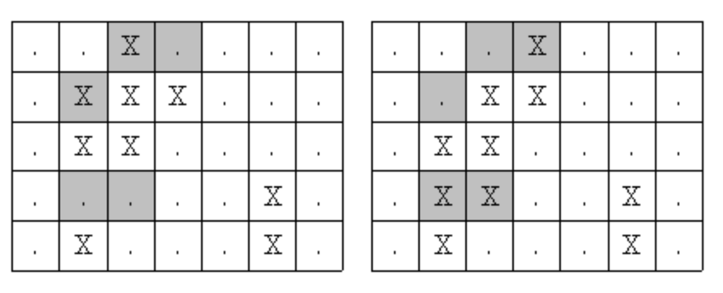




* Print most similar two pictures




```py
n=int(input())
a=[[input() for _ in range(5)] for _ in range(n)]
m=36
for i in range(n-1):
  for j in range(i+1,n):
    d=0
    for k in range(5):
      for l in range(7):
        if a[i][k][l]!=a[j][k][l]:
          d+=1
    if m>d:
      m=d
      i1,j1=i,j
print(i1+1,j1+1)
```


