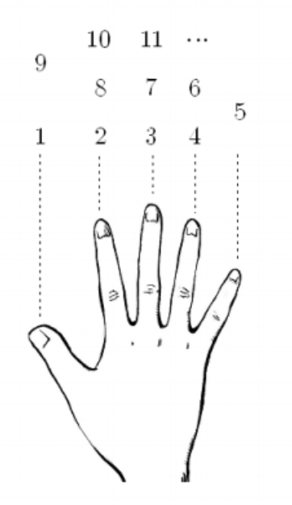








```py
turn = int(input()) % 8
if turn == 1:
  print(1)
elif turn == 2 or turn == 0:
  print(2)
elif turn == 3 or turn == 7:
  print(3)
elif turn == 4 or turn == 6:
  print(4)
elif turn == 5:
  print(5)
```


