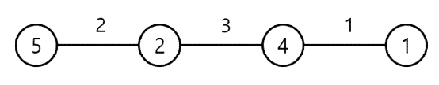




* Calculates the price of gas at each city's gas station and the minimum cost of moving from the left-most city to the right-most city by inputting the length of the road connecting each city.




```py
n=int(input())
a=[int(i) for i in input().split()]
b=[int(i) for i in input().split()]
c, r = 0, 0
for i in range(n-1):
  if b[i] < b[c]:
    c = i
  r += a[i] * b[c]
print(r)
```


