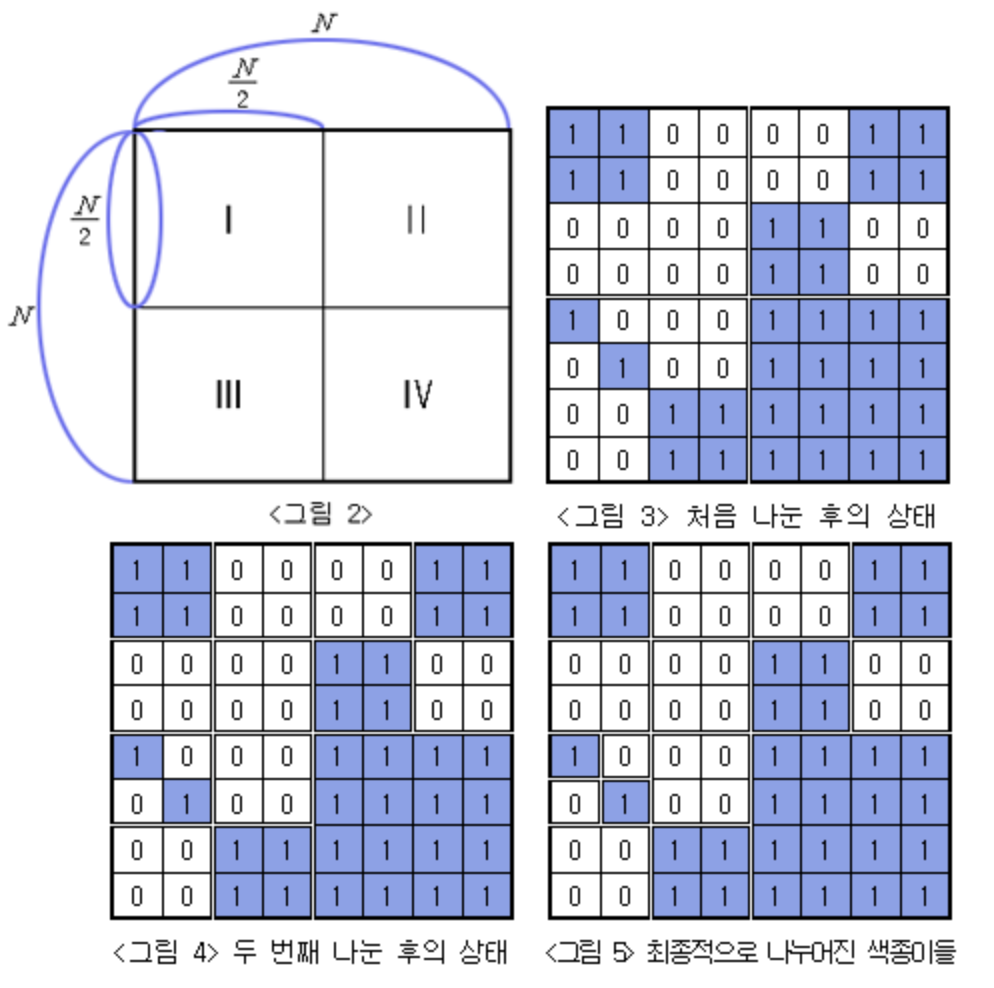




* The first line prints the number of white colored paper cut, and the second line prints the number of blue colored paper




```py
def recur(r, c, n):
  global G, blue, white
  total = sum(sum(li[c : c + n]) for li in G[r : r + n])
  if total == 0:
    white +=1
  elif total == n ** 2:
    blue += 1
  else:
    recur(r, c, n // 2)
    recur(r + n // 2, c, n // 2)
    recur(r, c + n // 2, n // 2)
    recur(r + n // 2, c + n // 2, n // 2)

G = []
n = int(input())
for _ in range(n):
  G.append(list(map(int, input().split())))

blue = 0
white = 0
recur(0, 0, len(G))
print(white)
print(blue)
```


