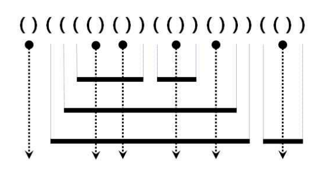





* Given a parenthesis representation of the arrangement of the iron rod and the laser
* Find the total number of pieces of the cut iron rod.




```py
bar_razor = list(input())
answer = 0
stk = []
for i in range(len(bar_razor)):
  if bar_razor[i] == '(':
    stk.append('(')
  else:
    if bar_razor[i - 1] == '(':
      stk.pop()
      answer += len(stk)
    else:
      stk.pop()
      answer += 1
print(answer)
```


