# Machine Learning

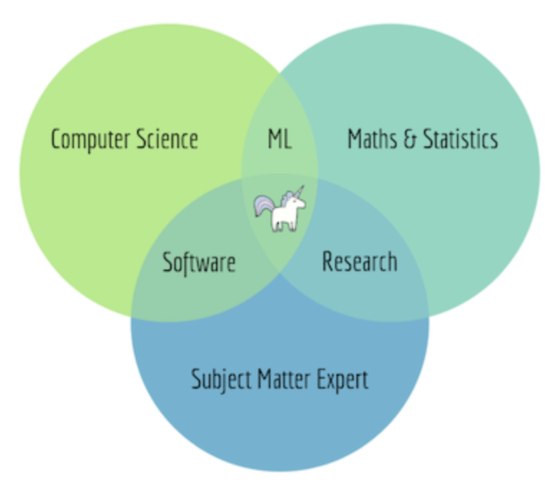

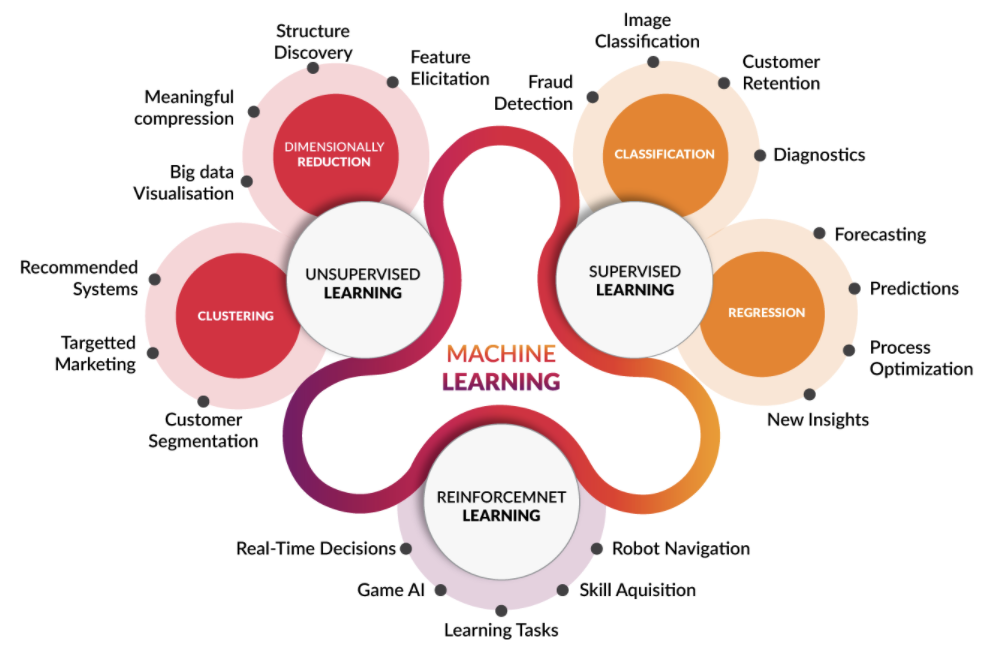

* The field of study that gives computers the ability to learn without being explicitly programmed (Arthur Samuel 1959)
* A computer program is said to learn from experience E with respect to some task T and some performance measure P, if its performance on T, as measured by P, improves with experience (E. Tom mitchell, 1998)
* Algorithms that can figure out how to perform important tasks by generalizing from examples (UW, 2012)
* Practice of using algorithms to parse data, learn from it, and then make a determination or prediction about something in the world (NVIDIA, 2016)

> Terms

* Static Training
  * You can verify the model before applying it in production
* Dynamic Training
  * model stays up to date as new data arrives

* Unsupervised Learning
  * unlabeled data that the algorithm tries to make sense of by extracting features and patterns on its own
  * [ex] market segmentation, organize computing cluster, social network analysis, astronomical data analysis
  * [+] spectral classes do not always correspond to informational classes

* End to End
  * [+] Less hand-designing of components needed
  * [-] Face recognition → large data for subproblems (face detection, face classification)
  * [-] Not enough data → excludes potential useful hand-designed components

## Engineering

> Terms

* Feature Selection

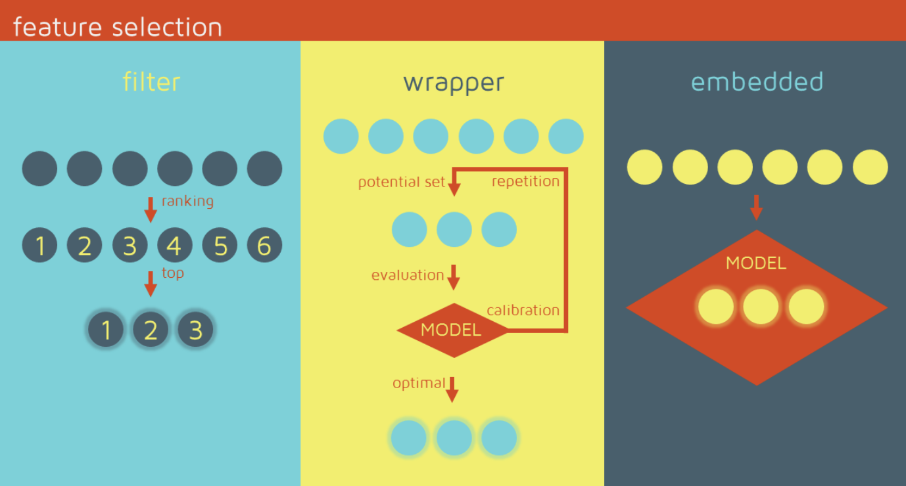

* Negative Sampling
  * train models that generally have several order of magnitudes more negative than positive one

> Learning

* Offline
  * [+] Make all possible predictions in a batch, using a mapreduce or similar.
  * [+] Write to a table, then feed these to a cache|lookup table
  * [-] long tail → can only predict things we know tail
  * [-] update latency likely measured in hours or days

* Online
  * Predict on demand, using a server
  * [+] can predict any new item as it comes
  * [-] monitoring needs are more intensive

> Dynamic Sampling

* Minlong Lin, 2013

$$
P\left(X^{!}\right)=1.0-P\left(\frac{X}{\text { Sum of Candidates }}^{0.7}\right)
$$

## Metric

* softmax

```py
import numpy as np

def softmax(x):
  """
  Args    : input value [N, dim]
  Returns : softmax [N, dim]
  """
  m = np.amax(x, axis=(0, 1))
  ret = np.exp(x - m) / np.sum(np.exp(x - m), axis=1, keepdims=True)
  return ret
```

* Cross Entropy
  * used for mutually exclusive classes (male vs female, grayscale vs color)
  * probability distribution of the event over k different events

$$
g(z)_{i}=\frac{e^{z_{i}}}{\sum_{j=1}^{K} e^{z_{j}}}
$$

$$
\begin{array}{ll}
J(W)=-(y \log (\hat{y})+(1-y) \log (1-\hat{y})) & \text { binary } \\
J(W)=-\frac{1}{N} \sum_{n=1}^{N} y_{n} \log \hat{y}_{n}+\left(1-y_{n}\right) \log \left(1-\hat{y}_{n}\right) & \text { multi class }
\end{array}
$$

> Similarity

* Cosine
  * Useful for positive | negative feedback
  * independent of vector length → commonly used measure for high-dimensional spaces

* Jaccard
  * [-] Cannot use if the input is binary (ex. Recsys thumbs up vs thumbs down)

$$
J \operatorname{accard}\left(U_{i}, U_{j}\right)=\frac{\left|U_{i} \cap U_{j}\right|}{\left|U_{i} \cup U_{j}\right|}
$$

```py
import gzip
import numpy
import random
import requests
from collections import defaultdict

# Data
"""
{'marketplace': 'US',
 'customer_id': '45610553',
 'review_id': 'RMDCHWD0Y5OZ9',
 'product_id': 'B00HH62VB6',
 'product_parent': '618218723',
 'product_title': 'AGPtek® 10 Isolated Output 9V 12V 18V Guitar Pedal Board Power Supply Effect Pedals with Isolated Short Cricuit / Overcurrent Protection',
 'product_category': 'Musical Instruments',
 'star_rating': 3,
 'helpful_votes': 0,
 'total_votes': 1,
 'vine': 'N',
 'verified_purchase': 'N',
 'review_headline': 'Three Stars',
 'review_body': 'Works very good, but induces ALOT of noise.',
 'review_date': '2015-08-31'}
"""
def jaccard(s1, s2): 
  numer = len(s1 & s2) 
  denom = len(s1 | s2)
  return numer / denom

def most_similar(i): 
  similarities = [] 
  users = item2user[i]
  
  candidate_items = set() 
  for u in users: 
    candidate_items |= user2item[u] 

  for i2 in candidate_items:
    if i == i2: continue
    sim = jaccard(users, item2user[i2])
    similarities.append((sim, i2))
  similarities.sort(reverse=True)
  return similarities[:10]

user2item, item2user = defaultdict(set), defaultdict(set)

item_name = {}
for d in data: 
  u, i = d['customer_id'], d['product_id'] 
  item2user[i].add(u) 
  user2item[u].add(i) 
  item_name[i] = d['product_title']

display(data[2])
for sim, iid in most_similar(data[2]['product_id']):
  print(f"{item_name[iid][:55]:<60} has {sim:.3f} most similar item")
```

* Pearson Correlation
  * Subtract by normalized value → Useful for numerical rating

$$
\frac{\sum_{j}\left(r_{i j}-\bar{r}_{i}\right)\left(r_{k j}-\bar{r}_{k}\right)}{\sqrt{\sum_{j}\left(r_{i j}-\bar{r}_{i}\right)^{2} \sum_{j}\left(r_{k j}-\bar{r}_{k}\right)^{2}}}
$$

> Accuracy

```py
def acc_prec_multiclass(preds, labels):
  TP, FP, TN, FN = [0 for i in range(202)], [0 for i in range(202)], [0 for i in range(202)], [0 for i in range(202)]
  classes = []
  
  for p, l in zip(preds, labels):
    if p == l:
      TP[pred] += 1
      for i in range (len(TP)):
        TN[i] += 1
      TN[pred] -= 1
    else:
      FP[pred] += 1
      FN[label] += 1
      for i in range (len(TN)):
        TN[i] += 1
      TN[pred] -= 1
      TN[label] -= 1

  for tp, fp, tn, fn in zip(TP, FP, TN, FN):
    accuracy = (tp + tn) / (tp + fp + tn + fn)  
    precision if fp + tp == 0 else tp / (fp + tp)
    recall = 0 if tp + fn == 0 else tp / (tp + fn)
    bcr = (precision + recall) / 2
    classes.append({"Class": i, "Precision": precision, "Accuracy": accuracy, "Recall": recall, "BCR": bcr})

  return classes
```

* F1
  * gives a larger weight to lower numbers
  * macro-F1 arithmetic mean of our per-class F1-scores
  * weighted-F1, weight each class by the number of samples from that class
  * micro-averaged F1, micro-F1 = micro-precision = micro-recall = accuracy

$$
2 \cdot \frac{\text { Prec } \cdot \text { recall }}{\text { Prec }+\text { recall }}=\frac{2 T P}{2 T P+F P+F N}
$$

* Fb
  * Low beta: precision is more important. 
  * High beta: recall is more important

$$
\left(1+\beta^{2}\right) \cdot \frac{\text { prec } \cdot \text { recall }}{\beta^{2} \cdot \text { prec }+\text { recall }}
$$

## Deep Learning

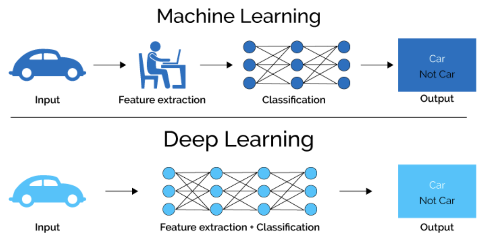

* Neural networks become deep neural networks if it contains two or more hidden layers
* Zhou, Boris proved Neural Network can approximate any convex continuous function

* If a model has low loss in the training data but poor on test, what should you do?
  * implement L2 regularization on the weights
  * decrease the number of hidden units in the model

* Overfitting?
  * a network is learning features in the train data not useful in generalizing predictions to the holdout set

* Which activation functions for the hidden units might cause vanishing gradients?
  * Tanh, sigmoid (Not relu)

* Why should bias be added?
  * Without b the line always goes through the origin (0, 0) and you may get a poorer fit. When x = 0.

> Notation

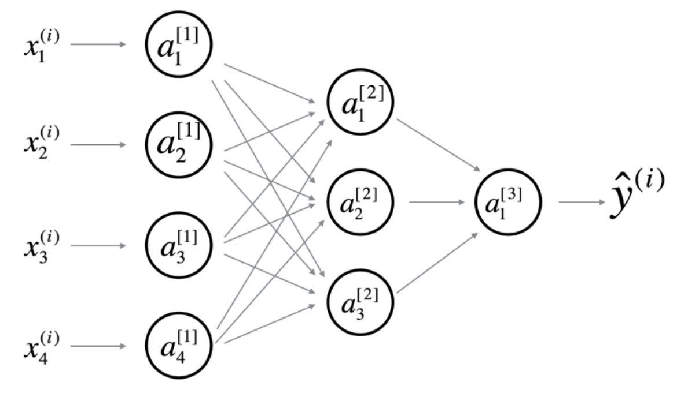

> Terms

* Auto-encoder
  * denoise auto-encoder to make robust
  * learn efficient data encodings in an unsupervised manner

* Epoch
  * one forward pass and one backward pass of all the training examples

* Batch
  * number of training examples in one forward/backward pass. higher batch size needs more memory space

* Iteration
  * Number of passes each pass using number of examples

* Normalization
  * inputs and each hidden unit throughout the network, on a per-unit basis, over each minibatch

* Fine-tuning
  * process in which the parameters of a trained model must be adjusted very precisely
  * to validate that model taking into account a small data set that does not belong to the train set.

* Inception
  * CNN uses convolutions kernels of multiple sizes as well as pooling within one layer

* Internal representation (Rumelhart, 87)

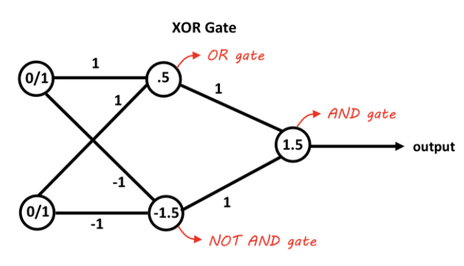

* Graph Neural Netwrok (GNN)

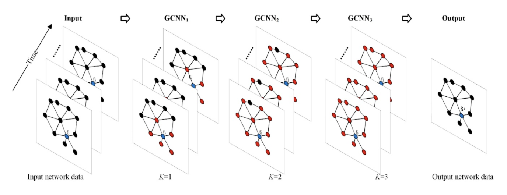

### Activation Function

* non-linear, differentiable
* multi-class situation vs binary situation
* One hot encoding

> non-exclusive vs mutually exclusive

* sum of all probabilities will be equal to one

> Linear

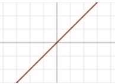

$$
g(a) = a
$$

* no matter how many layers it had, it will behave just like a single-layer perceptron

> Relu

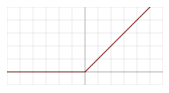

* good performance especially when dealing with vanishing gradient

$$
g(z)=max(0,z) \\
g'(z)=1 (z>0), 0
$$

### Gradient Descent

> Delta Rule

$$
\Delta w_{ij}^p = \eta \delta_j^p a_i^p%0
$$

$$
\delta_{j}^{p}=\frac{\partial J^{p}}{\partial a_{j}^{p}}=\sum_{k} \frac{\partial J^{p}}{\partial a_{k}^{p}} \frac{\partial a_{k}^{p}}{\partial a_{j}^{p}}=\sum_{k} \delta_{k}^{p} w_{j k}
$$

> Deep Learning

$$
\frac{\partial E}{\partial a_{j}}=\sum_{k} \frac{\partial E}{\partial a_{k}} \frac{\partial a_{k}}{\partial a_{j}}
$$

$$
=-\sum_{k} \delta_{k} \frac{\partial a_{k}}{\partial z_{j}} \frac{\partial z_{j}}{\partial a_{j}}
$$

$$
=-\frac{\partial z_{j}}{\partial a_{j}} \sum_{k} \delta_{k} \sum_{i} \frac{\partial w_{i k} z_{i}}{\partial z_{j}} 
$$

$$
=-g^{\prime}\left(a_{j}\right) \sum_{k} \delta_{k} w_{j k}
$$


> Adaptive learning rate

* Increase local gain if the gradient for that weight doesn't change the sign
* Limit the gains to lie in some reasonable range
* Use full batch learning or big mini-batches

> Momentum

* The magnitudes of the gradients can be different for different layers, especially if small initial weights 

* Standard 
    * standard momentum method first computes the gradient at the current location 
    * then takes a big jump in the direction of the updated accumulated gradient. 
* Nesterov
    * Nesterov momentum first makes a big jump in the direction of the previously accumulated gradient. 
    * Then measure the gradient where you end up and make corrections.

> L1 Normalization

$$
L 1(W)=\sum_{k} \sum_{l}\left|W_{k, l}\right|
$$

> L2 Normalization

$$
L 2(W)=\sum_{k} \sum_{l} W_{k, l}^{2}
$$

### Training

> Analyze datao

* look for class imbalance, misclassified labels, duplicate data.
* spatial position matter

> Visualize features

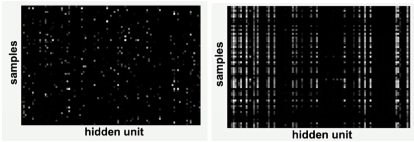

* Feature maps need to be uncorrelated and have high variance. 
* Hidden units are sparse across samples and across features.

> Starts with simple baseline

* Fix random seed → stable.
* Simplify - turn off data augmentation.
* Add significant digits to your eval, verify loss @ init. 
* human baseline → annotate label and prediction
* Overfit one batch to see if you can achieve 0 loss.
* Measure error on both training and validation set. 
* use backprop to chart dependencies

> Overfit

* Pick a known model
* Adam is safe → try with 3e-4

> Regularize

* Get more data. Data augmentation
* Pretrain data. 
* Decrease batch size. 
* Dropout, weight decay, early stop
* Try a larger model → early stopped performance of larger often be better.

### RNN

> Map time into space

* Auto regressive model
  * Linear model
  * Predict the next term in a sequence from a fixed number of previous terms using delay taps.

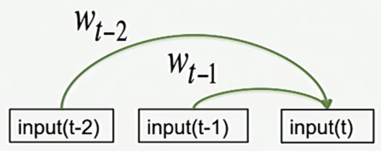

* Feed-Forward neural network
  * generalized autoregressive models by using one or more layers of non-linear hidden units.
  * Transformer networks use identical networks over every location in the input (up to 256 locations)
  * The networks then interact via attention mechanisms

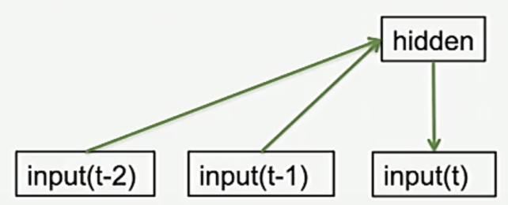


> Map time into state

* Jordan network

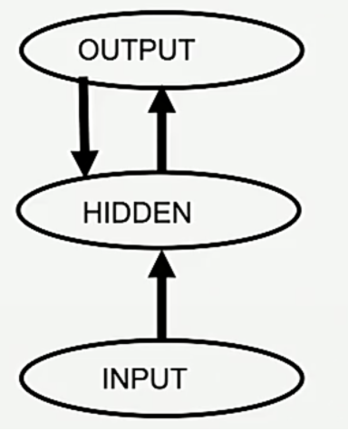

* One time step back

* Elman network

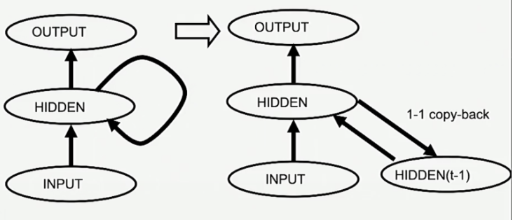


### LSTM

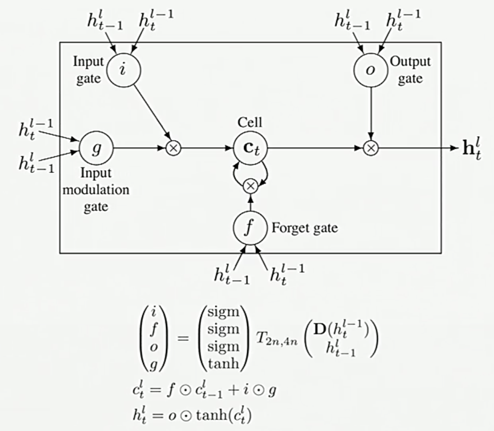

* preserve data for a long time in the activities of an RNN, use a circuit that implements an memory cell.
* A linear unit that has a self-link with a weight of 1 will maintain its state. 
* Information is stored in the cell by activating its write gate.
* Information is retrieved by activating its read gate
* We can backpropagate through this circuit because logistic units have nice derivatives.

$$
\begin{aligned}
\boldsymbol{g}^{(t)} &=\phi\left(W_{g x} \boldsymbol{x}^{(t)}+W_{i h} \boldsymbol{h}^{(t-1)}+\boldsymbol{b}_{g}\right) \\
\boldsymbol{i}^{(t)} &=\sigma\left(W_{i x} \boldsymbol{x}^{(t)}+W_{i h} \boldsymbol{h}^{(t-1)}+\boldsymbol{b}_{i}\right) \\
\boldsymbol{f}^{(t)} &=\sigma\left(W_{f x} \boldsymbol{x}^{(t)}+W_{f h} \boldsymbol{h}^{(t-1)}+\boldsymbol{b}_{f}\right) \\
\boldsymbol{o}^{(t)} &=\sigma\left(W_{o x} \boldsymbol{x}^{(t)}+W_{o h} \boldsymbol{h}^{(t-1)}+\boldsymbol{b}_{o}\right) \\
\boldsymbol{s}^{(t)} &=\boldsymbol{g}^{(t)} \odot \boldsymbol{i}^{(i)}+\boldsymbol{s}^{(t-1)} \odot \boldsymbol{f}^{(t)} \\
\boldsymbol{h}^{(t)} &=\boldsymbol{s}^{(t)} \odot \boldsymbol{o}^{(t)}
\end{aligned}
$$

## NLP

* an automated way to understand or analyze the natural languages and extract the required information from such data by applying machine learning Algorithms
* Used in Semantic Analysis, Automatic summarization, Text classification, Question answering

> Terms

* Entity (Words of interest)
  * names of persons, locations and companies

* Entity Linking
  * Name variations (New York, NY, neuyork)
  * Ambiguity (Paris Hilton vs Paris in France)
  * Absence (Domain specific knowledge base)
  * Scalability (Chatbot, Search)
  * Evolving Information (Recent news articles in which there are mentions)
  * Multiple Languages (Support queries performed in multiple languages)

* Knowledge base
  * words of interest are mapped from input text to corresponding unique entities in target knowledge base

* Hypernym
  * Is a Relation | a word of less specific meaning
  * chiroptophobia and phobia
  * opera and music

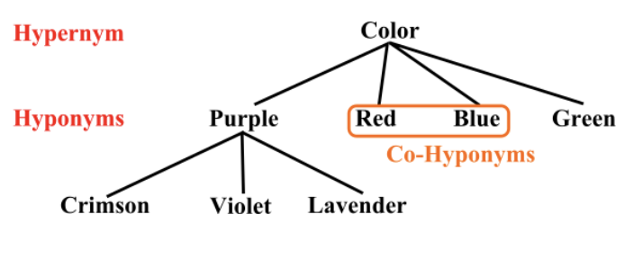

* Hyponym
  * Subclass of
  * If X is a hyponym of Y, and Y is a hyponym of Z, then X is a hyponym of Z
  * pigeon, eagle and seagull are hyponyms of bird

* Meronym
  * Part of

```sh
a 'tire' is part of a 'car'             # Part meronym
a 'car' is a member of a 'traffic jam'  # Member meronym
a 'wheel' is made from 'rubber'"​        # Substance (stuff) meronym
```

* LDA
  * Latent Dirichlet Allocation

* POS tagging
  * PoS Tagger is a piece of software that reads a text in some language and assigns PoS to each word
  * make more complex categories than those defined as basic PoS (ex noun-plural)

* Pragmatic Analysis
  * It deals with outside word knowledge, which means knowledge that is external to the documents|queries.
  * Pragmatic analysis that focuses on what was described is reinterpreted by what is actually meant, deriving the various aspects of language that require real-world knowledge

* Dependency Parsing
  * Aka Syntactic Parsing, the task of recognizing a sentence and assigning a syntactic structure to it.

* Tokenization
  * Methods of dividing the text into various tokens. (in the form of the word)

* Latent Semantic Indexing
  * LSI, aka Latent semantic analysis, is a mathematical method developed to increase the accuracy of retrieving
  * It helps to find out the hidden relation between the words by producing a set of various concepts related to the terms of a sentence to improve the information understanding.
  * technique used for the purpose is called Singular value decomposition, useful for working on small sets of a static document

* Synonym
  * Similar words

* Syntactic analysis
  * a sentence may be interpreted in more than one way due to ambiguous sentence structure
  * proper ordering of words.

* Pragmatic analysis
  * Can be defined as the words which have multiple interpretations
  * Pragmatic Analysis is part of the process of extracting information from text.

## Recommender System

* Information retrieval
* static content base → invect time in indexing content
* dynamic information need → queries presented in real time
* common approach TFIDF → rank documents by term overlap

* Implicit data : purchase | video viewing | click data
* explicit data : star reviews
* candidate generation | filtering | ranking # What are components of Top-N recommender
* Because people have to search for them.    # Why are older movies rated higher?

> Metrics

* AB Test
  * Ultimate metric

* Churn
  * How quickly does new user behavior influence your recommendations?

* Responsiveness
  * How often do recommendations change?

* Coverage
  * % of <user, item> pairs that can be predicted
  * balance between coverage and accuracy

* Diversity
  * avg similarity between recommendation pairs

* Novelty
  * mean popularity rank of recommended items
  * how popular the items that you are recommending 
  * more obscure items that may lead to serendipitous discovery from the users

* Ranking
  * Used in ranking algorithm
  * discontinuous and thus non-differentiable

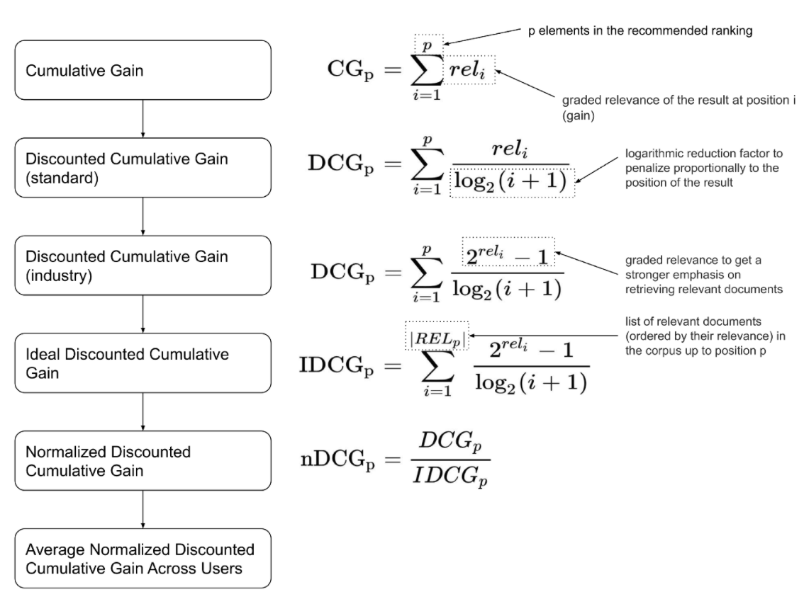

## Models

> Item-item collaborative filtering

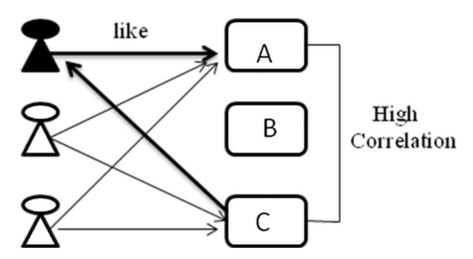

* Good amount of information of items’ own features, rather than using users’ interactions and feedbacks
* Genre, year, director, actor, textual content of articles extracted by applying NLP

> User-User collaborative filtering

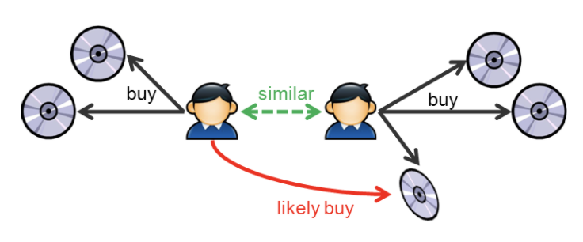

* Select top X similar users, take weighted average of ratings from X users with similarities as weights
* Explicit Rating → a rate given by a user to an item on a sliding scale
* Implicit Rating → indirect users preference, such as page views, clicks, purchase records
* [-] If one user purchases one item, this changes ranking of every other item that was purchased
* [-] No use for new users and new items 
* [-] Won't necessarily encourage diverse results

### Tree

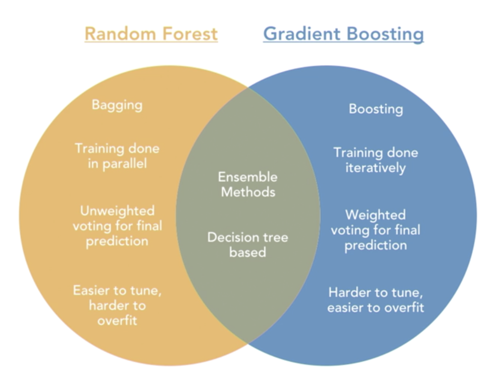

* Useful for tabular data
* avoid overfitting in two ways: to add a stopping criteria, or to use tree pruning

> Gradient Boosting Decision Tree

* ensemble that takes an iteratively combine weak learners to create a strong learner
* focus on mistakes of prior iterations
* [+] powerful, accepts various inputs, used for classification / regression, outputs feature importance
* [-] longer to train, likely to overfit, difficult to tune
* Overfit
  * max_depth (7), subsample, colsample_bytree, colsample_bylevel, eta, num_rounds
* Under fit
  * min_child_weight (0, 5, 15, 500), lambda alpha

> Random Forest

* each decision tree gets a random sample | columns of the training data to be sent to each tree
  * [+] does not increase generalization error when more trees are added to the model
  * [-] don’t train well on smaller datasets
  * [-] problem of interpretability with random forest
  * [-] Random forests do not handle large numbers of irrelevant features
  * [-] models requires O(NK) memory storage, (N - # of base, K - # of trees)

> Extra Tree

* Split of each selected feature is random → less computationally expensive than a random forest
* Extra Trees show low variance

## Reinforcement Learning

> Terms

* Tasks

```sh
Episodic Tasks    # Interaction breaks into episodes, which end with a terminal state. 
Continuing Tasks  # Interaction goes on continually without terminal state.
```

* Policy
  * Target : One we are learning
  * Behavior : One we are choosing action from

* Generalized policy iteration (GPI)
  * interaction between policy-evaluation and policy improvement

* Planning
  * any process that takes input model, and improves a policy 

* Backup Diagram

### Model

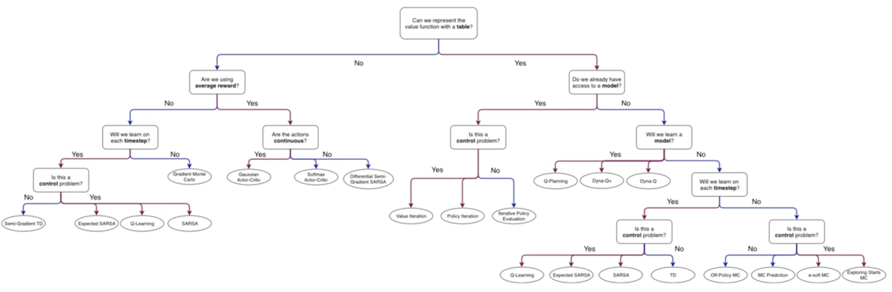

* Dyna

```text
# Q+
Initialize:
  Q(s, a) and Model(s, a) for all s 2 S and a 2 A(s)
Loop forever:
  S ← current (nonterminal) state
  A ← e-greedy(S, Q)
  Take action A: observe resultant reward, R, and state, S' 
  Q(S, A) ← Q(S, A) + α [R + γ maxaQ(S', a) - Q(S, A)] 
  Model(S, A) ← R, S'
  Loop repeat n times: 
    S ← random previously observed state
    A ← random action previously taken in S
    R, S' ← Model(S, A) 
    Q(S, A) ← Q(S, A) + α[(R + κτ0.5) + R + γ maxaQ(S', a) - Q(S, A)]
```

* Monte Carlo

```text
# e-soft
Input : a policy π to be evaluated, ε > 0
Initialize: 
  π ← an arbitrary ε-soft policy 
  Q(s, a) ∈ R (arbitrarily) for all s ∈ S, a ∈ A(s)
  Returns(s, a) ← an empty list, for all s ∈ S, a ∈ A(s).
Loop: 
  Generate an episode from S0, A0, following π : S0, A0, R1, …, ST-1, AT-1, RT 
  G ← 0
  Loop for each step of episode, t = T - 1, T - 2, ..., 0:
    G ← γG + Rt+1 
    Append G to Returns(St, At) 
    Q(St, At) ← average(Returns(St, At))
    A* ← argmaxa Q(St, a)
    For all a ∈ A(St):
      

# Exploring start
Initialize: 
  π(s) ∈ A(s)  (arbitrarily), for all s ∈ S. 
  Q(s, a) ∈ R (arbitrarily), for all s ∈ S, a ∈ A(s).
  Returns(s, a) ← an empty list, for all s ∈ S, a ∈ A(s).
Loop: 
  Choose S0 ∈ S, A0 ∈ A(S0) randomly s.t. all pairs have probability > 0
  Generate an episode from S0, A0, following π : S0, A0, R1, …, ST-1, AT-1, RT 
    G ← return that follows the first occurence of s, a
    Append G to Returns(s, a)
    Q(s, a) ← average(Returns(s, a))
    For each s in the episode:
      π(s) ← argmaxa Q(s, a)

# Off-policy
Input:
  an arbitrary target policy π 
Initialize, for all s ∈ S, a ∈ A(s):
  Q(s, a) ← arbitrary
  C(s, a) ← 0
Repeat:
  b ← any policy with coverage of π 
  Generate an episode using b:
  S0, A0, R1, …, ST - 1, AT - 1, RT, ST
  G ← 0
  W ← 1
  For t = T - 1, T - 2, … down to 0:
    G ← γG + Rt+1
    C(St, At) ← C(St, At) + W
    Q(St, At) ← Q(St, At) + W | C(St, At) [G - Q(St, At)]
    W ← W π(At|St) | b(At|St)
    If W = 0 then exit For loop

# Prediction
Initialize: 
  π ← policy to be evaluated 
  V ← an arbitrary state-value function 
  Returns(s) ← an empty list, for all s ∈ S 
Repeat forever: 
  Generate an episode using π 
  For each state s appearing in the episode: 
    G ← the return that follows the first occurrence of s 
    Append G to Returns(s) 
    V (s) ← average(Returns(s))
```

* SARSA

```text
# Differential Semi-G
Initialize state S, and action A
Loop for each step:
  Take action A, observe R, S’
  Choose A’ as a function of q̂(S’, ·, w) (e.g. ε-greedy)
  δ ← R - R̄+ q̂(S’, A’, w) - q̂(S, A, w)
  R̄ ← R̄ + β δ
  w ← w + αδ ∇q̂(S, A, w)
  S ← S’
  A ← A’     

# Expected
Loop for each episode:
  Initialize S
  Choose A from S using policy derived from Q (e.g. ε-greedy)
  Loop for each step of episode:
    Take action A, observe R, S’
    Choose A’ from S’ using policy derived Q (e.g. ε-greedy) 
    Q(S, A) ← Q(S, A) + α[R + γQ(S’, A’) - Q(S, A)]
    Q(S, A) ← Q(S, A) + α[R + γΣaπ(a | St+1)Q(St+1, a) - Q(St, At)]
    S ← S’; A ← A’;
  until S is terminal
```

* Q Learning

```text
Initialize:
  Q(s, a) = random, for all s ∈ S, a ∈ A(s)
  Q(terminal, *) = 0
Loop: 
  Initialize S 
  Loop for each step of episode: 
    Choose A from S using policy derived from Q (e.g. e-greedy)
    Take action A, observe R, S' 
    Q(S, A) ← Q(S, A) + α [R + γ maxa Q(S', a) - Q(S, A)] 
    S ← S' 
  until S is terminal
```

* Q planning

```text
Loop:
  Select a state, S ∈ S, and an action, a ∈ A(s) at random 
  Send s, a to a sample model, and obtain a sample next reward, R, and a sample next state, S' 
  Apply one-step tabular Q-learning to S, A, R, S' 
    Q(S, A) ← Q(S, A) + α[ R + γmaxaQ(S', a) - Q(S, A)]
```

* TD0

```text
Input:
  policy π to be evaluated, step size α 
Initialize:
  V(s), for all s ∈ S+, arbitrarily except that V(terminal) = 0 
Loop for each episode:
  Initialize S
  Loop for each step of episode: 
    A ← action given by π for S
    Take action A, observer R, S' 
    V(S) ← V(S) + α[R + γV(s') - V(S)]
    S ← S'
  until S is terminal

> Semi-Gradient
Loop for each episode: 
    Initialize S 
    Loop for each step of episode: 
        Choose A ~ π(*|S)
        Take action A, observe R, S' 
        w ← w + α[R + γ v̂(S', w) - v̂(S, w)] Δv̂(S, w) 
        S ← S' 
until S is terminal
```
