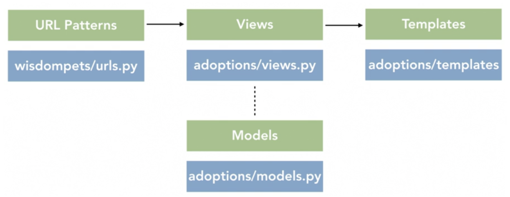

# Django



* Model-view-controller
* URL patterns to decide which view to pass the request to for handling
* project can contain multiple apps
* automatically reloads Python code for each request as needed

> Error

* django.template.exceptions.TemplateDoesNotExist: home.html
  * Update INSTALLED_APPS from settings.py
* AppRegistryNotReady: Apps aren't loaded yet
  * adding an app in INSTALLED_APPS in the settings.py file but you do not have that app installed in your computer
* Unable to configure handler 'console'
  * formatters -> formatter in LOGGING config

> Term

* app
  * Web application that does something
  * a Weblog system, a database of public records or a small poll app

* project
  * a collection of configuration and apps for a particular website

## File

* admin.py
  * admin file defines admin interface see / edit

* app.py
  * controls settings specific to this app

* django-admin
  * startproject pollster
  * startapp polls

* migration/
  * holds files to migrate DB when schema changes

* models.py
  * python objects, providing data layer to construct DB schema and queries

* Path converter
  * str: Matches any non-empty string, excluding the path separator, '/'
  * int: Matches zero or any positive integer
  * slug: Matches any slug string consisting of ASCII letters or numbers, plus the hyphen and underscore characters
  * uuid: Matches a formatted UUID
  * path: Matches any non-empty string, including '/', allows to match against a complete URL path, as with str

* tests.py
  * writing unit tests for the functionality of this app

* views.py
  * request handler, which handles HTTP requests and response defines logic, control flow

* settings.py
  * export DJANGO_SETTINGS_MODULE=mysite.settings




```py
pip install django
django-admin startproject mysite
# mysite/
#  manage.py
#  mysite/
#    __init__.py
#    settings.py
#    urls.py
#    asgi.py
#    wsgi.py

django-admin startproject polls
# polls/
#   __init__.py
#   admin.py
#   apps.py
#   migrations/
#     __init__.py
#   models.py
#   tests.py
#   views.py
```




```py
from django.contrib import admin
from django.urls import include, path
from sample_app import views

urlpatterns = [
  path('polls/', include('polls.urls')),
  path('admin/', admin.site.urls),
  path("<int:num>/", views.even_odd)]
```




```py
from django.http import HttpResponse
def index(request):
  return HttpResponse("Hello, world. You're at the polls index.")
```





```py
from django.urls import path
from . import views

urlpatterns = [
  path('', views.index, name='index'),
]
```




> urls.py

* url routing specific to this app
* path(path, view, template)            # first patching → no match 404

* include()
  * include other URL patterns.
  * admin.site.urls is the only exception to this.

* path()
  * route : string that contains a URL pattern
  * view, and two optional: kwargs, and name




```py
DATABASES = {
  'default': {
    'ENGINE': 'djongo',
    'NAME': 'your-db-name',
    'CLIENT': {
      'host': 'your-db-host',
    }
  }
}
```




### CLI

> manage.py

* createsuperuser
* dbshell
* makemigrations
  * Generate migration files for later use
  * When update models.py
* migrate
  * Sync DB with models (create, remove | field change)
* showmigrations
  * Show if migrated
* runserver
  * port : starts server on internal IP at port
  * 0:8080 : Listen all public port
  * startapp polls : start particular app
  * nohup python manage.py runserver & : run server on background
* startapp name : create new app
* shell : interactive mode

### Templates




```html


<!DOCTYPE html>
<html>
  <head>
    <title>CRM</title>
    <link
      rel="stylesheet"
      href="https://stackpath.bootstrapcdn.com/bootstrap/4.3.1/css/bootstrap.min.css"
      integrity="sha384-ggOyR0iXCbMQv3Xipma34MD+dH/1fQ784/j6cY/iJTQUOhcWr7x9JvoRxT2MZw1T"
      crossorigin="anonymous"
    />

    <link
      rel="stylesheet"
      type="text/css"
      href=""
    />
  </head>
  <body>
    
    <div class="container-fluid"> </div>
    <hr />
    <h5>Our footer</h5>
  </body>

  <script
    src="https://code.jquery.com/jquery-3.3.1.slim.min.js"
    integrity="sha384-q8i/X+965DzO0rT7abK41JStQIAqVgRVzpbzo5smXKp4YfRvH+8abtTE1Pi6jizo"
    crossorigin="anonymous"
  ></script>
  <script
    src="https://cdnjs.cloudflare.com/ajax/libs/popper.js/1.14.7/umd/popper.min.js"
    integrity="sha384-UO2eT0CpHqdSJQ6hJty5KVphtPhzWj9WO1clHTMGa3JDZwrnQq4sF86dIHNDz0W1"
    crossorigin="anonymous"
  ></script>
  <script
    src="https://stackpath.bootstrapcdn.com/bootstrap/4.3.1/js/bootstrap.min.js"
    integrity="sha384-JjSmVgyd0p3pXB1rRibZUAYoIIy6OrQ6VrjIEaFf/nJGzIxFDsf4x0xIM+B07jRM"
    crossorigin="anonymous"
  ></script>
</html>
```




```html
  

<br />

<div class="row">
  <div class="col-md-5">
    <h5>CUSTOMERS:</h5>
    <hr />
    <div class="card card-body">
      <a class="btn btn-primary btn-sm btn-block" href="">Create Customer</a>
      <table class="table table-sm">
        <tr>
          <th></th>
          <th>Customer</th>
          <th>Orders</th>
        </tr>
      </table>
    </div>
  </div>

  <div class="col-md-7">
    <h5>LAST 5 ORDERS</h5>
    <hr />
    <div class="card card-body">
      <a class="btn btn-primary btn-sm btn-block" href="">Create Order</a>
      <table class="table table-sm">
        <tr>
          <th>Product</th>
          <th>Date Orderd</th>
          <th>Status</th>
          <th>Update</th>
          <th>Remove</th>
        </tr>
      </table>
    </div>
  </div>
</div>

```




```js


<nav class="navbar navbar-expand-lg navbar-dark bg-dark">
 
  <button class="navbar-toggler" type="button" data-toggle="collapse" data-target="#navbarNav" aria-controls="navbarNav" aria-expanded="false" aria-label="Toggle navigation">
    <span class="navbar-toggler-icon"></span>
  </button>
  <div class="collapse navbar-collapse" id="navbarNav">
    <ul class="navbar-nav">
      <li class="nav-item active">
        <a class="nav-link" href="#">Dashboard</a>
      </li>
      <li class="nav-item">
        <a class="nav-link" href="#">Products</a>
      </li>
    </ul>
  </div>
</nav>
```




```js
 

<br />

<div class="row">
  <div class="col-md">
    <div class="card card-body">
      <h5>Products</h5>
    </div>
    <div class="card card-body">
      <table class="table">
        <tr>
          <th>Product</th>
          <th>Category</th>
          <th>Price</th>
        </tr>
      </table>
    </div>
  </div>
</div>


```




```js
 

<br />

<div class="row">
  <div class="col-md">
    <div class="card card-body">
      <h5>Customer:</h5>
      <hr />
      <a class="btn btn-outline-info btn-sm btn-block" href=""
        >Update Customer</a
      >
      <a class="btn btn-outline-danger btn-sm btn-block" href=""
        >Delete Customer</a
      >
    </div>
  </div>

  <div class="col-md">
    <div class="card card-body">
      <h5>Contact Information</h5>
      <hr />
      <p>Email:</p>
      <p>Phone:</p>
    </div>
  </div>

  <div class="col-md">
    <div class="card card-body">
      <h5>Total Orders</h5>
      <hr />
      <h1 style="text-align: center; padding: 10px"></h1>
    </div>
  </div>
</div>

<br />
<div class="row">
  <div class="col">
    <div class="card card-body">
      <form method="get">
        <button class="btn btn-primary" type="submit">Search</button>
      </form>
    </div>
  </div>
</div>
<br />

<div class="row">
  <div class="col-md">
    <div class="card card-body">
      <table class="table table-sm">
        <tr>
          <th>Product</th>
          <th>Category</th>
          <th>Date Orderd</th>
          <th>Status</th>
          <th>Update</th>
          <th>Remove</th>
        </tr>
      </table>
    </div>
  </div>
</div>


```




```js
<br>

<div class="row">
	<div class="col">
		<div class="col-md">
			<div class="card text-center text-white  mb-3" id="total-orders">
			  	<div class="card-header">
			  		<h5 class="card-title">Total Orders</h5>
			  	</div>
			  	<div class="card-body">
			    	<h3 class="card-title"></h3>
			  	</div>
			</div>
		</div>
	</div>

	<div class="col">
		<div class="col-md">
			<div class="card text-center text-white  mb-3" id="orders-delivered">
			  	<div class="card-header">
			  		<h5 class="card-title">Orders Delivered</h5>
			  	</div>
			  	<div class="card-body">
			    	<h3 class="card-title"></h3>
			  	</div>
			</div>
		</div>
	</div>

	<div class="col">
		<div class="col-md">
			<div class="card text-center text-white  mb-3" id="orders-pending">
			  	<div class="card-header">
			  		<h5 class="card-title">Orders Pending</h5>
			  	</div>
			  	<div class="card-body">
			    	<h3 class="card-title"></h3>
			  	</div>
			</div>
		</div>
	</div>
</div>
```




## Modules

> django

* django.setup()

> conf

* urls
  * url(r"regex", where_to_send_requests)
* settings

> contrib

* admin.site
  * admin.site.register(Team)




```py
from django.contrib.auth.models import User

# Create
user = User.objects.create_user(username="Ulrich",email="ulrich@gmail.com",password="mac12")
user = User.objects.get(username='Ulrich')

# Read
Book.objects.filter(title="A") | Book.objects.filter(title="B") # or
Book.objects.filter(title="A", title="B")                       # and
Book.objects.exclude(title="A")                                 # Not
User.objects.filter(membership__team_id="prake")                # Join

# Update
user.email="helsinki@gmail.com"
user.save()

```




### core




```py
parser.add_argument('poll_ids', nargs='+', type=int) # positional argument
parser.add_argument('--delete', action='store_true') # Named (optional) arguments
```




### db

> models

* Model : superclass of every models
  * Meta : subclass of Model
    * unique_together : composite key (deprecated in favor of UniqueConstraints)
* Field(unique=True, Null=False, Blank=False, Default=None, help_text=None, primary_key=False)
  * AutoField(primary_key=True) : Autoincremented integer field
  * CharField(max_length=255, choices) : single line view
  * TextField() : Multi line view
  * EmailField()
  * URLField()
  * IntegerField() : blank is equivalent to 0
  * DecimalField
  * BooleanField
  * DateTimeField
  * ForeignKey : id of record in another table
  * ManyToManyField(`Table`)
  * ForeignKey(cls, on_delete=models.CASCADE)
    * CASCADE : object referenced by a ForeignKey is deleted, the object containing also deleted
    * PROTECT : throw error if ForeignKey is deleted
    * SET_DEFAULT : change to default only if default exists




```py
# Enusure image is not resized when description changes
class Model(model.Model):
  _image=models.ImageField(upload_to='folder')
  thumb=models.ImageField(upload_to='folder')
  description=models.CharField()

  def set_image(self, val):
    self._image = val
    self._image_changed = True

    # Or put whole logic in here
    small = rescale_image(self.image,width=100,height=100)
    self.image_small=SimpleUploadedFile(name,small_pic)

  def get_image(self):
    return self._image

  image = property(get_image, set_image)

  # this is not needed if small_image is created at set_image
  def save(self, *args, **kwargs):
    if getattr(self, '_image_changed', True):
      small=rescale_image(self.image,width=100,height=100)
      self.image_small=SimpleUploadedFile(name,small_pic)
    super(Model, self).save(*args, **kwargs)
```




> models.query

* QuerySet

> django

* django.setup()

> http

* HttpRequest
* HttpResponse
  * content : raw bytes




```py
from django.shortcuts import render
from django.http import HttpResponse

def index(request):
  return HttpResponse("Hello World!")

# Single paramter
def show_age(request, age):
  return HttpResponse(f"I am {age} years old.")
```




> rest_framework

* viewsets
  * ModelVieSet : special view

* JSONRenderer
  * render

* LimitOffsetPagination




```py
NSTALLED_APPS = [
...
'rest_framework',
...
]
```




```py
from rest_framework import serializers
from rest_framework import JSONRender

from .models import Hero

class HeroSerializer(serializers.HyperlinkedModelSerializer):
  class Meta:
    model = Hero
    fields = ('name', 'alias') # "__all__"
    # exclude = []
```




```py
class ProductsPagination(LimitOffsetPagination):
  default_limit = 10
  max_limit = 100
class ProductList(ListAPIView):
  pagination_class = ProductsPagination
```




```py
from rest_framework.test import APIRequestFactory
factory = APIRequestFactory()
request = factory.post('/notes/', {'title': 'new idea'})

from django.urls import reverse
from rest_framework import status
from rest_framework.test import APITestCase
from myproject.apps.core.models import Account

class AccountTests(APITestCase):
  def test_create_account(self):
    """ Ensure we can create a new account object. """
    url = reverse('account-list')
    data = {'name': 'DabApps'}
    response = self.client.post(url, data, format='json')
    self.assertEqual(response.status_code, status.HTTP_201_CREATED)
    self.assertEqual(Account.objects.count(), 1)
    self.assertEqual(Account.objects.get().name, 'DabApps')
```




> shortcuts

* render()
  * request, ''




```py
from django.shortcuts import render
from django.http import HttpResponse

def index(request):
  my_dict = {'insert_me': "Hello I am from views.py!"}
  return render(request,'first_app/index.html',context=my_dict)

def home(request):
  return HttpResponse("Welcome to home page!")

def educative(request):
  return HttpResponse("Welcome to Educative page!")
```




```js
<!DOCTYPE html>
<html>
<head>
  <meta charset="UTF-8">
  <title>My First Application</title>
</head>
<body>
  <h1>Hello this is index.html!</h1>
  {{insert_me}}
</body>
</html>
```




```py
TEMPLATE_DIR= os.path.join(BASE_DIR,"templates")

TEMPLATES = [
    {
        'BACKEND': 'django.template.backends.django.DjangoTemplates',
        'DIRS': [TEMPLATE_DIR,],
        'APP_DIRS': True,
        'OPTIONS': {
            'context_processors': [
                'django.template.context_processors.debug',
                'django.template.context_processors.request',
                'django.contrib.auth.context_processors.auth',
                'django.contrib.messages.context_processors.messages',
            ],
        },
    },
]
```





### View

* Placed at PROJECT/urls.py
* Should contain as little logic as possible, mostly just a pointer to each of your apps specific URLConf’s

> urls

* path("path", views.home)
  * name : [optional] "index"
* resolve('/')

### Test

* placed in APP/tests
* APP/fixtures/fixture.json

> test

* TestCase
  * assertEqual / True / In
  * assertTemplateUsed




```py
# Test call command
from django.test import TestCase
from io import StringIO

class SmokeTest(TestCase):
  def test_root_url_resolves_to_home_page_view(self):
    found = resolve('/')
    self.assertEqual(found.func, home_page)

    # Assert not raises
    args = []
    opts = {}
    out = StringIO()
    try:
      call_command('update_md', {"directory": "cs", "suffix": ".delete"}, stdout=out)
      self.assertContains(out.getvalue(), "SUCCESS")
    except ExceptionType:
      self.fail("myFunc() raised ExceptionType unexpectedly!")
```





### third party

> django_filters

* 'django-filter' in INSTALLED_APPS
* rest_framework.DjangoFilterBackend




```py
from rest_framework.generics import ListAPIView
from django_filters.rest_framework import DjangoFilterBackend

from user.serializers import UserSerializer
from user.models import User


class UserList(ListAPIView):
  queryset = User.objects.all()
  serializer_class = UserSerializer
  filter_backends = (DjangoFilterBackend,)
  filter_fields = ("team_id")
```




> health_check

* pip install django-health-check




```py
urlpatterns = [
  url(r'^ht/', include('health_check.urls')),
]
```




```py
INSTALLED_APPS = [
    # ...
    'health_check',                             # required
    'health_check.db',                          # stock Django health checkers
    'health_check.cache',
    'health_check.storage',
    'health_check.contrib.migrations',
    'health_check.contrib.celery',              # requires celery
    'health_check.contrib.celery_ping',         # requires celery
    'health_check.contrib.psutil',              # disk and memory utilization; requires psutil
    'health_check.contrib.s3boto3_storage',     # requires boto3 and S3BotoStorage backend
    'health_check.contrib.rabbitmq',            # requires RabbitMQ broker
    'health_check.contrib.redis',               # requires Redis broker
]

HEALTH_CHECK = {
    'DISK_USAGE_MAX': 90, # percent
    'MEMORY_MIN': 100,    # in MB
}
```





## Flask

* [Flask](https://www.youtube.com/watch?v=Z1RJmh_OqeA)
* [Flask + https](https://blog.miguelgrinberg.com/post/running-your-flask-application-over-https)
* [Flask + Firebase](https://medium.com/firebase-developers/hosting-flask-servers-on-firebase-from-scratch-c97cfb204579)
* [Flask + Google login](https://realpython.com/flask-google-login/)
* [Flask + Firestore](https://medium.com/google-cloud/building-a-flask-python-crud-api-with-cloud-firestore-firebase-and-deploying-on-cloud-run-29a10c502877)

* application context
  * keeps track of the application-level data during a request, CLI command




```sh
# Structure
# flask-fire (root dir)
# ├── server
# | ├── src
# |    └── app.py
# |    └── templates
# |       └── index.html
# | ├── Dockerfile
# ├── static
# |  └── style.css
# ├── firebase.json
# ├── .firebaserc
FROM python
COPY . /app
WORKDIR /app
RUN pip install flask
EXPOSE 5000
CMD ["python", "app.py"]

# docker build -t flask-test .
# docker run -d -p 5000:5000 flask-test
```




```py
from flask import Flask
app = Flask(__name__)

@app.route("/")
def hello():
  return "Hello Docker!"

if __name__ == '__main__':
  app.run(debug=True, host='0.0.0.0')
```




```py
global jinja accessible by {{ stage }}
@app.context_processor
def inject_stage_and_region():
  return dict(stage="alpha", region="NA")
```




* CLI
  * flask run --cert adhoc : run in https
  * FLASK_APP : app.py
  * FLASK_ENV : development

### Modules

> flask_login




```py
from flask_login import UserMixin
from selenium.webdriver.support.ui import WebDriverWait
from selenium.webdriver.support import expected_conditions as EC
from selenium.webdriver.common.by import By
from selenium import webdriver
from collections import defaultdict
from concurrent.futures import ThreadPoolExecutor, as_completed
from itertools import islice
from ..common import get_chrome_driver, PATH, logger
import json
import re
import os
import time

class Member(UserMixin):
  def __init__(self, member_id="", baekjoon_id="", team_id="", en_name="", kr_name="", solved_problem_ids=None, is_admin=False, id=""):
    self.id = member_id  # for flask_login mixin
    self.member_id = member_id
    self.baekjoon_id = baekjoon_id
    self.team_id = team_id
    self.en_name = en_name
    self.kr_name = kr_name
    self.solved_problem_ids = set(solved_problem_ids) if solved_problem_ids else set()
    self.is_admin = is_admin

  def __repr__(self):
    return f"{self.id}"

  @staticmethod
  def update_baekjoon_solved(member):
    from ..database import remote_db
    driver = get_chrome_driver()
    try:
      driver.get(f"https://www.acmicpc.net/user/{member.baekjoon_id}")
      WebDriverWait(driver, 10).until(EC.presence_of_element_located((By.CLASS_NAME, 'panel-body')))
      member.solved_problem_ids = list(f'BJ_{prob_id}' for prob_id in driver.find_element_by_class_name('panel-body').text.split())
      remote_db.add("member", member)
      return True
    except Exception as e:
      logger.warning(f"{e}")
      logger.warning(f"{member}")
      return False
    finally:
      driver.quit()

  @staticmethod
  def update_all_baekjoon_solved(members, limit=10000):
    logger.debug(f"update_all_baekjoon_solved({members})")

    with ThreadPoolExecutor() as ex:
      futures = [ex.submit(Member.update_baekjoon_solved, member) for member in islice(members, limit)]
      return all(future.result() for future in as_completed(futures))
```




> flask_wtf

```py
LoginManager
current_user
login_required
login_user
logout_user
flask_debugtoolbar

app.config['SECRET_KEY'] = '<replace with a secret key>'
toolbar = DebugToolbarExtension(app)
```