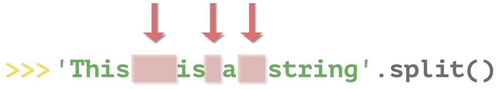
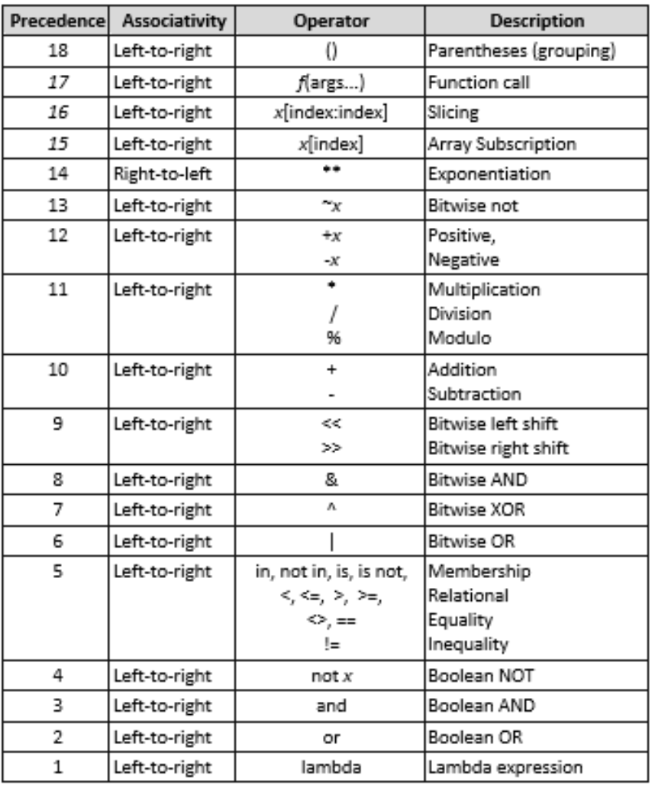
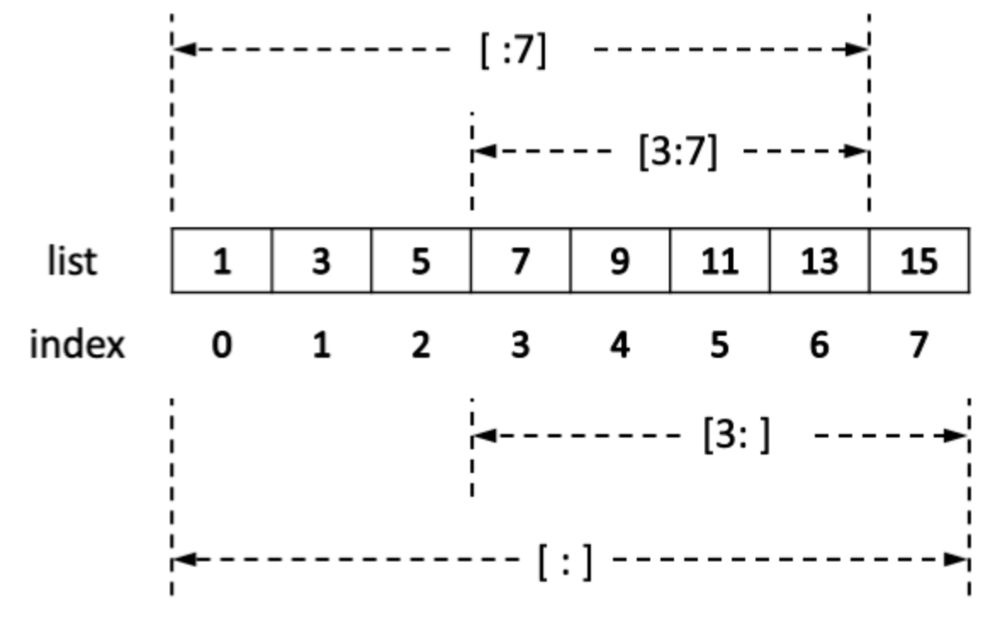

# Syntax

* syntax is set of rules defined by computer language

> Convention

* Import
  * a blank line group import
  * Standard library | third party | Local application/library specific

* Variable Naming
  * _single_leading : from M import * doesn’t import these objects
  * single_trailing_ : avoid conflicts with Python keyword (ex. class_, id_)
  * CONSTANT_VAR : all capital letters with underscores separating words
  * ClassName : capwords
  * function_name, var_name

> Term

* Muttable : list, set, dict are mutable

> Error

* NameError: name 'prin' is not defined
  * try to use a variable or a function name that is not valid
  * prin(1) -> print(1)

* SyntaxError: unexpected EOF while parsing
  * print(1 -> print(1)

* AttributeError: 'builtin_function_or_method' object has no attribute 'split'
  * a = input.split()

* IndentationError: expected an indented block
  * for must be indented by some space

```py
for i in range(3):
print(1)
```

* TypeError 'float' object cannot be interpreted as an integer
  * range function takes int
  * range(11 / 2)

* TypeError 'int' object is not iterable
  * min(1) -> min function takes iterable

* UnboundLocalError: local variable 's' referenced before assignment
  * variable can't be both local and global inside a function




```py
def f():
  # global s    # Solution
  print(s)      # Error
  s = "I love London!"
  print(s)

s = "I love Paris!"
f()
```




* AttributeError: <'classmethod' or 'staticmethod'>,  object has no attribute '__name__'
  * apply classmethod and staticmethod last when using multiple decorators




```py
class My_class(object):
  @classmethod
  @print_function_name
class GameObject(Enemy):
  pass
```




## Keyword

* [Variable 1](https://docs.google.com/forms/d/1WqtkeaNlVPNL4Q56uLiseUAVoRHRQxFwjje5VOb4tjA/edit)
* [Variable 2](https://docs.google.com/forms/d/1ggcgV1g-E0RV6QLgD3Ynnb6uJi3ooaLtQkUhH4fozaU/edit)
* [Type](https://docs.google.com/forms/d/1LdvIke1OI0rPIMZpoUnOB3BC00dAiwxwPGIUDbWxLvc/edit)
* Cannot be used as identifier
* Lists of keywords in python
* \# : single line comment
* """`comment`""" : multi line comment

> Keywords

* lambda




```py
# Lambday that does nothing def do_nothing(*args): pass
lambda *args: None
```




* break




```py
for item in container:
  if search_something(item):
    process(item)
    break
else:    # else executes after the loop completes normally
  not_found_in_container()
```




* is : compares identities, reference

* pass
  * null operation → placeholder when a statement is required syntactically

* yield
  * Insert a line result = [] at the start of the function.
  * Replace each yield expr with result.append(expr).
  * Insert a line return result at the bottom of the function.




```py
def cube_numbers(nums):     # Cube numbers
  for i in nums:
    yield(i**3)

def recursive_items(dictionary):
  for key, value in dictionary.items():
  if type(value) is dict:
    yield from recursive_items(value)
  else:
    yield (key, value)

cubes = cube_numbers([1, 2, 3, 4, 5])
for i in range(5):
  print((next(cubes)), 1)

a = {'a': {'b': 'c', 'd': 'e'}, 'f': 'g'}
print(list(recursive_items(a)))
```




### Scope

* global
  * in a function if we want to do assignments / change them

* nonlocal
  * Nonlocal is similar in meaning to global. But it takes effect primarily in nested methods
  * w/o it variables are read-only (to write a variable create a new local variable in the innermost scope)




```py
def global_():
  def scope():
    a = 0

    def change_local():
      a = 1  # Variable 'a' is redefined as a local
      print(f'Inside change_local() \t {a}')     # 1

    def change_global():
      global a
      a = 2
      print(f'Inside change_global() \t {a}')    # 2

    def change_nonlocal():
      nonlocal a
      a = 3
      print(f'Inside change_nonlocal() \t {a}')  # 3

    global func_global

    def func_global():
      print("I am global function")


    print(f'Before \t {a}\n')
    change_local()
    print(f'After change_local() \t {a}\n')      # 0

    change_global()
    print(f'After change_global() \t {a}\n')     # 0

    change_nonlocal()
    print(f'After change_nonlocal() \t {a}\n')   # 3

  scope()
  print(f"outside scope \t {a}")                 # 2
  func_global()
```


```




## Numeric

* float, bool, str, tuple, complex, frozenset, unicode
* change address when operates
* never explicitly destroyed
  * when they become unreachable they may be garbage-collected
* complex : 5 + 3j
* str : "A"
  * int("123") : convert str to int
* isinstance(entry, dict) # check for type
* str(123) : convert int to str

> Numeric

* Common
  * abs(x)
  * divmod() -> Tuple(int, int)
    * Return (quotient, remainder)
  * complex(re, im) -> complex
    * a complex number with real part re, imaginary part im. im defaults to zero.
  * pow(`x`, `y`, `base`) : equivalent to (x ** y) % base

* int
  * is_integer()
  * bin(`num`) -> str : Convert an integer number to a binary string prefixed with 0b
* float : 1.5, -0.0, float('Inf')
  * as_integer_ratio() -> Tuple(int, int) : return a pair of integers whose ratio is exactly equal
  * fromhex(s)
  * hex() -> str
* complex
### byes

| Operation | Meaning                         |
| --------- | ------------------------------- |
| x \| y    | bitwise or of x and y           |
| x ^ y     | bitwise exclusive or of x and y |
| x & y     | bitwise and of x and y          |
| x << n    | x shifted left by n bits        |
| x >> n    | x shifted right by n bits       |
| ~x        | the bits of x inverted          |

* Negative shift counts are illegal and cause a ValueError to be raised
* A left shift by n bits is equivalent to multiplication by pow(2, n)
* A right shift by n bits is equivalent to floor division by pow(2, n)

* [Binary](https://docs.google.com/forms/d/1q-TTG8LYhtCI1a1o9c2fgHKecOrrP5bXHxxIZXb2FK8/edit)

* bit_length() : number of bits necessary to represent an integer in binary
* from_bytes(bytes, byteorder, *, signed=False) -> int
  * integer represented by the given array of bytes
* to_bytes() : return array of bytes representing an integer




```py
n&-n           # Get lowest set bit
(n&(n-1))==0   # Check power of two

int('0b1111')  # 15    (2 → 10)
int('A0', 16)  # 160   (16 → 10)
bin(11)        # '0b1011' (10 → 2)
oct(15)        # '0o17'   (10 → 8)
hex(10)        # '0xA'    (10 → 16)

print('2', '10', '16')   # table
for i in range(50):
  print(bin(i)[2:], '\t', i, '\t', hex(i)[2:])
```




## Iterable

* `s`.index(x[, i[, j]]) -> int : index of the first occurrence of x in s (at or after index i and before index j)

* len(`s`) -> int : find length of `s`
* min(`s`j) : Find minimum item of `s`
* max(`s`) : Find maximum of `s`k

* `x` in `s` -> bool : True if an item s in eqal to x else False
* `x` not in `s` -> bool : False if an item of s is equal to x, else True
* `s` + `t` : the concatenation of s and t
* s[i] : ith item of s, origin 0

### str



* Sequence of unicode Character
  * [String_1](https://docs.google.com/forms/d/1OcKS_YdzQKEySMmq_Xas6bJDND0sId_4H-g7Q4WAl8A/edit)
  * [String_2](https://docs.google.com/forms/d/1snU0q32ZGaCc8Q-qOZ7XAUt51i28lZi3pPIiT12kN54/edit)
  * [Split](https://docs.google.com/forms/d/1cSrstATAUQt7WNtsoUzL1eATQsCw65FlxD5qL5HnmKA/edit)

* constants
  * ascii_letters : ascii_lowercase + ascii_uppercase
  * digits, punctuation
* count(‘a’) : count number of str
* find(sub[, start[, end]]) : lowest index in the string where substring sub is found | -1 if not
* index(sub[, start[, end]]) : equivalent to find raise value error
* isdigit() : Checks if string only contains 0-9
* isupper() islower() : Return True if upper case or lower case
* join(seq)
  * [Join](https://docs.google.com/forms/d/1_tIWmaxMZktjNbkwjPmqEEeEbE4B9-Ap4JJXmg01Ed4/edit)
* lower() / upper() : convert to upper or lower case
* maketrans()
* partition(word) : Search for word, and return a tuple with before, match, after
* replace(“P”, “-”) : replace P to -
* rstrip([chs]) : default whitespaces | e.x. 'mississippi'.rstrip('ipz') → 'mississ'
* rfind(str, beg=0 end=len(string)) : highest index in the string where substring sub is found | -1 if not
* rjust(width[, fillchar]) : right justified in a string of specified length
* split(sep=None, maxsplit=-1) : using sep as the delimiter string
* strip() : removes chars from side (default whitespace)
* startswith(str, beg=0)) : check if starts with str
* swapcase() : all the upper case letters are lower case and vice versa
* title() : Upper only first char




```py
# join
"".join([str(x) for x in l])

# maketrans
tb = 'ab'.maketrans({'a': '1', 'b': '4'}) # create dictionary
'ab'.translate(tb)  # 14
```




> Encoding

* encoding
  * [Unicode](https://docs.google.com/forms/d/1qQc3AO59rHViwuUL7bH3ICWN9pD_TeTNNWKGNxA5Tfs/edit)
* python2 encoding ‘ascii’ encoding
* Unicode → ASCII, code point is < 128, value of the code point, error otherwise




```py
'한'.encode('UTF-8'))            # b'\xed\x95\x9c (bytes)
b'\xed\x95\x9c'.decode('utf-8') # 한 (str)
str(b'\xed\x95\x9c', 'utf-8')   # 한 (str)
f"'한' | u'한' \t '한' ({type('한')})"  # 한

'한'.encode('UTF-8')             # b'\xed\x95\x9c' <class 'bytes'>
b'\xed\x95\x9c'.decode('utf-8') # 한
f"{str(b'hello', 'utf-8')}"
## print(b'\u0660'.decode('utf-8'))

# Python 2
coding: utf-8  # python2 header
type('가')      # <type 'str'>
type(u'가')     # <type unicode'>
'hello'.decode('utf-8')     # byte → str
unicode('hello', 'utf-8')

# python 3
type('한')            # <class 'str'>
'한'.encode('UTF-8')  #
unicode_string.encode(enc)  # unicode → str
byte_string.decode(enc)     # str → unicode
b'hello'.decode('utf-8')    # byte → str
str(b'hello', 'utf-8')

unicode(string[, encoding, errors])  # convert
```




> regex

* re.DOTALL : match new line
* re.I : case insensitive matching
* r"(?<=...)" : positive lookbehind
* r"(?<!...)" : negative lookbehind.
* r"(?=...)" : positive lookahead. A (?!B) only match if A followed by B
* r"(?!...)" : negative lookahead. A (?!Sam) match Tom Sam

* Escape
  * r"\." : dot
  * r"\-" : dash
  * "\( | \)" : braces
  * "\[ | \]" : bracket

* findall(pattern, string, flags=0) : Return all non-overlapping matches of pattern
* finditer(pattern, string)
* match() : match at the beginning of the string
* search() : Checks for one match
* split(pattern, string, maxsplit=0) : split(r'\W+', 'Words, words') ⇒ ['Words', 'words', '']

* Word
  * r"[a-c]" : contain a, b, c
  * r"[^a-c]" : not contain a, b, c
  * r"^a" : starts with a
  * r"a$" : ends with a
  * r"\b(words)\b" : word boundary
  * r".*a" : greedy match (all the way to the end, and then backtrack to a)
  * r".*?" : non-greedy (will try to match extra characters until it matches 1)
  * "\n" : references the nth capturing group
  * "^([aeiou]).+\1$" : Starts and End with same vowel
  * "^\d\d(-?)\d\d\1\d\d\1\d\d" : 12345678 or 12-34-56-78
  * r"一-龥" : Chineses Character
  * r"가-힇" : Korean Character
  * r"ぁ-ゔ|ァ-ヴー|々〆〤" : Japanese Character

* Length
  * {5} : five character
  * {2,6} : between 2, 6
  * \+ / * : 1 / 0 or more
  * ? : optional

* Conditional
  * (cat | dog) : cat or dog

* : Type
  * r"\w" : Unicode letter, ideogram, digit, underscore  ; Capital <>
  * [r"\d", r"\D"] : digit | Non-digit
  * [r"\s", r"\S"] : space, tab, newline | non-space, tab, newline
  * r"\t" : tab

* re.match
  * expand(template) : obtained by doing backslash substitution on template
  * group(n) : 0 for entire match, n th match
  * groups() : Tuples containing all match
  * groupdict() : (?P<first_name>\w+) → firstname:
  * string : The string passed to match() or search()

* re.findall
  * ("{[^{}]+}", "{A}, {{B}} {{C}, {D}, E}") : Nested Parenthesis
  * ("\((?:1|82)\)", "(82) (821) (1) 82 1") : phone number
  * ("(?i)\d{2}:\d{2}(?:am|pm)", "02:40pm 12:29AM") : Non capture group
  * (r'(.*?)D', "ABCD, ABD") : Grap little as possible
  * (r'([a-zA-Z0-9_.+-]+@[a-zA-Z0-9-]+\.[a-zA-Z0-9-.]+)', "rbtmd10@gmail.com, fakeemail@@f.com") : email

* re.search
* re.split
* re.sub
  * re.sub('\W+', ' ', ex) : made up string to Test 2 한국different regex23 methods




```py
# findall
ex = 'made|up string*.to>>>>Test----   2""""""한국different~regex23-methods'
re.findall('\S+', ex)     # ['made|up', 'string*.to>>>>Test----', '2""""""한국different~regex23-methods']
re.findall('\w+', ex)     # ['made', 'up', 'string', 'to', 'Test', '2', '한국different', 'regex23', 'methods']
re.findall(dr, ex)        # ['23']
re.findall('\w{4}\-', ex) # ['Test-', 'ex23-']

# Search
txt = "The rain in Spain"
x = re.search(r"\bS\w+", txt)
print(x.string)    # "The rain in Spain"
ex = 'made|up string*.to>>>>Test----   2""""""한국different~regex23-methods'
re.search('\w+', ex) #   <re.Match object; span=(0, 4), match='made'>
re.search('\w+', ex)    # end : 4, group : made, groupdict : {}, groups : (), span : (0, 4), start : 0

# split
ex = 'made|up string*.to>>>>Test----   2""""""한국different~regex23-methods'
re.split('\s', ex)  # ['made|up', 'string*.to>>>>Test----', '', '', '2""""""한국different~regex23-methods']
re.split('\s+', ex) # ['made|up', 'string*.to>>>>Test----', '2""""""한국different~regex23-methods']
re.split('\w+', ex) # ['', '|', ' ', '*.', '>>>>', '----   ', '""""""', '~', '-', '']
re.split('\W+', ex) # ['made', 'up', 'string', 'to', 'Test', '2', '한국different', 'regex23', 'methods']
```




### list

* append()
  * Adds an element at the end of the list
* clear() : Removes all the elements from the list
* copy() : Returns a copy of the list
* count() : Returns the number of elements with the specified value
* extend()
  * Add the elements of a list (or any iterable), to the end of the current list
* insert()
  * Adds an element at the specified position
* index() : Returns the index of the first element with the specified value
* remove() : Removes the first item with the specified value
* reverse() : Reverses the order of the list
* pop(default=-1)
  * Removes the element at the specified position




```py
# Create
list(range(0, 5))     # [0, 1, 2, 3, 4, 5]

[[0] * 5] * 5               # [WRONG] creates 5 copies of the same list
[[0]*5 for i in range(5)]   # 2D List

li = list(map(int, input().split()))  # From input

# Add
L = ['red', 'green', 'blue']
L.append('yellow')  # ['red', 'green', 'blue', 'yellow']
[1,2,3].insert(0, 4)  # [4, 1, 2, 3]
[1,2,3].extend([4,5]) # [1, 2, 3, 4, 5]

# Index
L = ['a','b','c','d','e','f','a','b','c','d','e','f']
print(L.index('x'))     # Triggers ValueError: 'x' is not in list
L = ['a','b','c','d','e','f','a','b','c','d','e','f']
print(L.index('c',4,7)) # within search bound

# Iter
vowels = ['a', 'e', 'i', 'o', 'u']
print(next(iter(vowels)))  # prints 'a'
```




## Hash

### set

* [Set](https://docs.google.com/forms/d/1YFC2YHaTgsQxkSEtDufCzpiKTz43Nr8Iw5Hn7grw2oA/edit)
* not sorted by default

* issubset(`other`)
* set <= other
  * every element in the set is in other

* set | `other` | …
* union(*`others`)
  * a new set with elements from the set and all `others`

* set & other
* intersection(*other)
  * element that are in both set and other

* set ^ other
* symmetric_difference(other)
  * set with elements in either the set or other but not both

* set < other : set <= other and set != other
* set >= other : if every element in another is in the set.
* set > other : set >= other and set != other
* set - other : set with elements in the set that are not in the others
* add(elem) : Add elem to the set
* copy() : a shallow copy of the set
* discard(elem) : Remove element elem from the set if it is present
* isdisjoint(`other`) : True if the set has no elements in common with `other`
* pop() : Remove and return an arbitrary element. Raises KeyError if empty. O(1)
  * Raise KeyError if set is empty
* remove(elem) : Remove elem from the set. Raises KeyError if elem is not in the set.




```py
# Create
a = set() : Create
a = set([2, 3])

# Add
a.add(1)
a.add(3)

# Remove
a.remove(3)
if 3 in a:
  print("3 exists")

print(a)    # {1, 2, 3}
```




### dict

* [Dictionary](https://docs.google.com/forms/d/1KUGnlx0pG4nUksDXLK00ZZZATBUBQfGVUZw2SxLTP_U/edit)

* items() : iter((key, value))
* keys() : iter(key)
* values() : iter(value)
* d[key] : item of d with key key. Raises a KeyError if key is not in the map.
* clear() : remove all items from the dictionary
* fromkeys()
* list(d) : a list of all the keys
* len(d) : the number of items
* pop(key[, default]) : If key in d, remove it and return, else return default (error if no default)
* update([other]) : Update dict with the key|value pairs from other, overwriting existing keys
* setdefault(key, val) : returns the value of the item, if doesn’t exist, insert val
* iter(d)
  * an iterator over the keys




```py
# Create
dic = { "model": "Mustang", "year": 1964 }
dictionary = dict(zip(['a', 'b', 'c'], [1, 2, 3]))

d = {}
for key, value in pairs:
  d.setdefault(key, []).append(value) # Create empty list if not exists (defaultdict)
return d

# Add
sorted_x = sorted(x.items(), key=lambda kv: kv[1]) # Sort by value
inv_map = {v: k for k, v in my_map.items()}        # reverse key, value
dict.fromkeys(iterable[, value])

x = ('key1', 'key2', 'key3')
y = 0
thisdict = dict.fromkeys(x, y) # {'key1': 0, 'key2': 0, 'key3': 0}
thisdict = dict.fromkeys(x)    # {'key1': None, 'key2': None, 'key3': None}

# Read
list(dic)           # All keys
list(dic.values())  # all values

```




## Operation






```py
# addition
print("1" + "1")           # 11
print(int("1") + int("1")) # 2

# Multiplication
print("5" * 5)    # 55555
print(5 * 5)      # 25
print(-5 * -5)    # 25

# Division
print(24 // 5)    # 4

# Modular
print(-5 % 3)     # 1
print(5 % 2)      # 1
print(5.1 % 1)    # 0.1
```




### Conditional

* [Logical](https://docs.google.com/forms/d/19qlt2Br_eGbxlK5Q34e7NvDNVfmXW5MTOcqLDpWpjRo/edit)
* [Operators](https://docs.google.com/forms/d/1rkJPN_TXCsETwXcGvyBvYQj1UiaW3jb9gNqY0ug69F8/edit)
* [If](https://docs.google.com/forms/d/1t0c4Q6POa8BmpOYU2efDHGHDGZB7DsHatMGo9rVoHcE/edit)

| Operator | Description         |
| -------- | ------------------- |
| >        | greater than        |
| <        | less than           |
| ==       | equal to            |
| <=       | less or equal to    |
| >=       | greater or equal to |
| !=       | not equal to        |

* any object is consider to be True unless it __bool__ defined as False or __len__ is 0
* "", (), [], {}, set(), range(0), 0, 0.0, 0j, Decimal(0), Fraction(0, x) are False
* == : compare object’s value
* is : compare object's address (never changes once created)

```

| a     | b     | a and b | a or b |
| ----- | ----- | ------- | ------ |
| True  | True  | True    | True   |
| True  | False | False   | True   |
| False | True  | False   | True   |
| False | False | False   | False  |




```py
a = int(input())
if a == 1:
  print("One")
elif a == 2 or a == 3:
  print("Two or Three")
elif not a > 10:    # same as a <= 10
  print("Large")
else:
  print("Too Large")
```




### Exception

* Builtins exceptions
  * ImportError
  * NotImplementedError
  * ZeroDivisionError




```py
# Catch all exception
test_cases = [(1, 0), ('1', 1), (1, 1)]
for x, y in test_cases:
  try:
    z = x / y
  except ZeroDivisionError as e:
    print(e)
  except:         # Catch all exception
    print(sys.exc_info()[0])
  else:
    print("Successful")

# Raise exception quitely
class StopExecution(Exception):
  def _render_traceback_(self):
  pass

raise StopExecution
```




### Iterate

* strings, list, set, dictionary are iterables

* [Range](https://docs.google.com/forms/d/1dz9jZFRHZ-o8WkX8YMZOGZHQNHc2Y0IP1pr1i0u4bPw/edit)
* [For](https://docs.google.com/forms/d/16-2IDV2GtXfgGp-U0EfyfdR9koq8bL5a3NepdAgupzU/edit)
* [List_1](https://docs.google.com/forms/d/1OjjwrnTEIrhmoP7e7bzcU81yK9B7fKGViyWFRQJ_uNY/edit)
* [List_2](https://docs.google.com/forms/d/1JOb7wz4EX5AVQ5JjGPFercOH7VgmozrD9d8r4p7NdnQ/edit)
* [2D](https://docs.google.com/forms/d/1n5pIPsNG1zgzMWEwxq4zJITLHx_fLYJUsOhIDZlLoc0/edit)
* [Index](https://docs.google.com/forms/d/1U_VWE-a4XXsrV81rmktAdtdeF5GoF3A3eSQiqa15d4E/edit)



* negative index starts from backward (-1 for last element)




```py
li = [1, 2, 0 6]
li[i]    # element in i th index, starts from 0

s = 'This is to demonstrated substring functionality in python.'
s[12:22:3] # esre
[:,:,-1]   # reverse
```




* Comprehension
  * constructs that allow sequences to be built from other sequence




```py
[n * 10 for n in [1, 2, 3, 4]               # [10, 20, 30, 40]
[i for i in range(30) if i % 3 == 0]        # [0, 3, 6, 9, 12, 15, 18, 21, 24, 27]
[n for li in lis for n in [[1, 2], [4, 5]]] # [1, 2, 4, 5]
{x**2 for x in [1, 1, 2]}                   # Set Comprehension
dic = {'a': 10, 'b': 34, 'A': 7, 'Z': 3}    # Dict Comprehension
{ k.lower(): dic.get(k.lower(), 0) + dic.get(k.upper(), 0)  for k in dic.keys()}    # {'a': 17, 'z': 3, 'b': 34}
print(f"{a}=5" if a == 5 else f"{a}!=5 ")
print(f"{a}=={b}" if a == b else f"{a} != {b}")
```




## Function

* args (*) unpacks the sequence|collection into positional arguments
* kwargs (**) does the same, only using a dictionary and thus named arguments
* Set types

> Argument




```py
# Regular argument
def sum(a, b, c, d):
  return a + b + c + d


# Arbirary length
def sum(*values, **options):
  s = 0
  for i in values:
  s = s + i
  if "neg" in options and options["neg"]:
  s = -s
  return s

s = sum(1, 2, 3)            # returns 6
s = sum(1, 2, 3, neg=True)  # returns -6
s = sum(1, 2, 3, neg=False) # returns 6

# Positional : / and * in argument
def f(a=2, /):
  pass

f(a=1)   # Error, positional only argument


def f(a, /):
  pass

f()       # Error, argument required
f(a=1)    # Error, positional only argument


def f(*, a=1):
  pass

f(1)      # Error, keyword only arguments


def f(a): # Positional and keyword
  pass

f()       # Error, argument required
```




```py
def add_to(num, target=[]):
  target.append(num)
  return target
add_to(1)  ⇒ [1]
add_to(2)  ⇒ [1, 2]

def f():
  city = "Hamburg"
  def g():
    global city
    city = "Geneva"
  print("Before calling g: " + city)
  print("Calling g now:")
  g()
  print("After calling g: " + city)

f()
print("Value of city in main: " + city)
```




> closure

* the function we return still has access to the internal scope of the function that returned it
* Python’s closures are late binding




```py
def outer_func(msg):
  def inner_func():
  print('Hi' + msg)
  return inner_func()

my_func = outer_func(‘Sean’)
my_func()  # Hi Sean
```




```py
def create_multipliers():
  return [lambda x : i * x for i in range(5)]

for multiplier in create_multipliers():
  print(multiplier(2), end=" ")    # 8 8 8 8 8

def create_multipliers():
  return [lambda x, i = i : i * x for i in range(5)]  # Solution
```




### Builtins

* [Builtin](https://docs.google.com/forms/d/1h5ecgQP-LY4t2Ws2dIiKW_hIoNF4LdygvobNjGnQYik/edit)
* [zip](https://docs.google.com/forms/d/1Jk4mCZZ_7ONrFjg9UUuSJha-GKOn4fU8pnMCApkj8Eo/edit)

* getattr()
* dir()
  * returns list of the attributes and methods of any object

* help()




```py
# Show all builtins
print(__builtins__.__dict__)  # show builtins

for attr in dir("AB"):       # show methods
  print(getattr("AB", attr)) # attr() to run

help("AB")        # run interactive help system
```




```py
# try all methods of object
for method in [method for method in dir(match) if not method.startswith('_')]:
  try:
    print(f"\t {method} : {getattr(match, method)()}")
  except:
    pass
```




* all(it)
  * True if all elements of the iterable are true
* any(it)
  * True if any element of the iterable is true
* eval()
  * parses expression passed in and runs python expression within
* id(obj)
  * print address of object
* import(name, globals, locals, fromlist=(), level=0) : invoked by the import statement
* type(obj)
  * isinstance() checks if given object is an instance of the subclass
* vars(obj)
  * returns the __dict__ attribute of the given object
* zip(*it)
  * aggregates multiple it in a tuple
* locals()
  * a in locals() to check if variable exists
* globals()
* compile(source, fn, mod)
* enumerate(it, start=0)
  * for i, (k, v) in enumerate({1:'a', 2:'b'}.items())
* isinstance(obj, class)
  * if object is instance | subclass of classinfo class

* iter(object, sentinel)
  * iterator object for the given object
  * iteritems are deprecated
* filter(func, iterable)
* type(int) : print type




```py
# classmethod
filter(lambda a: not a.startswith('__'), dir(obj))

# even odd
l = [1, 2, 3, 4, 5]
even = list(filter(lambda n : n % 2 == 0, l))   # [2, 4]
odd = list(filter(lambda n : n % 2 == 1, l))    # [1, 3, 5]

l = [(1, 'a'), (2, 'b'), (3, 'c'), (4, 'd'), (5, 'e')]
even = list(filter(lambda n : n[0] % 2 == 0, l))  # [(2, 'b'), (4, 'd')]
odd = list(filter(lambda n : n[0] % 2 == 1, l))   # [(1, 'a'), (3, 'c'), (5, 'e')]

# xor every element
nums = [1, 2, 3, 4, 5]
reduce(lambda x, y: x ^ y, nums)
```




* reduce(func, iterable, start=1)
  * (from functools lib)
* setattr(object, name, value)
* sum()
  * sum of all iterables

* open(f, mode='r')
  * \+ : both read and write
  * a / w : append / create a new file if it does not exist
  * b : binary mode
  * r : read
  * t : text mode (default mode)
  * x : open for exclusive creation, failing if the file already exists




```py
# prepend
with open(filename, 'r+') as f:
  content = f.read()
  f.seek(0, 0)
  f.write(line.rstrip('\r\n') + '\n' + content)

# with open('some_file', 'w') as file: (Context manager)
file = open('some_file', 'w')
try:
  file.write('Hola!')
finally:
  file.close()

# Open multiple file
with open('a', 'w') as a, open('b', 'w') as b:
  do_something()

```




* abs
  * [min, max, abs](https://docs.google.com/forms/d/18Y-LtjIQXnTucECDhzw7PGnc7PdZ_m9IwlMUkF4l8aw/edit)




```py
print(min(1, 2))      # 1
print(min([5, 1, 2])) # 5
print(abs(-1))        # -1
```




* print(*obj, sep=' ', end='\n')
  * (Before 3.6) '{1} {0}'.format('one', 'two')
  * f"{0.35:.3%}" : 35.000% (Percent)
  * f"{1000000:,}" : 1,000,000 (comma separator)
  * f"{3.1415:.2f}" : 3.14 (decimal places)
  * f'{3.1415:+.2f}' : +3.14 (decimal places + sign)
  * f"{0!r / s / a}" : repr() str()  ascii() on the argument firs
  * f"{1000000000:.2e}" : 1.00e+09 (Exponent notation)
  * f"{5:0 > / < / ^ 2d}" : xxxx5 (left / right / center padding)




```py
print("Hello World")
print(12352, end="")        # no newline after print
print(12352, 1235, sep="")  # no space between comma
print("""line1
line2""")       # Multiline

# suppress print
import sys
sys.stdout = open(os.devnull, 'w')
print('Hello')        # will be ignored
sys.stdout = sys.__stdout__

# color print
class bcolors:
  HEADER = '\033[95m'
  OKBLUE = '\033[94m'
  OKCYAN = '\033[96m'
  OKGREEN = '\033[92m'
  WARNING = '\033[93m'
  FAIL = '\033[91m'
  ENDC = '\033[0m'
  BOLD = '\033[1m'
  UNDERLINE = '\033[4m'

print(f"{bcolors.WARNING}Warning: No active frommets remain. Continue?{bcolors.ENDC}")

# Escape (₩ is used instead of backslash in korean keyboards)
print("\" \' \\")    # Double Quote / single quote / backslash
print("\n \r \t")    # New Line / Carriage Return / Tab
```




* input()
* map(func, iterable)
  * returns a generator, print('\n'.join(map('syntax.mdnsyntax.py'.join, grid)))
  * Must be casted (to save memory)




```py
str = input()         # string
num = int(input())    # single integer
num = float(input())  # single float
a, b = map(int, input().split())  # two integers
li = list(map(int, input().split()))  # list of ints

import sys
a = sys.stdin.read()        # All input at once
input = sys.stdin.readline  # Faster Input
```




* sort()
* sorted()
  * Sorts the list
  * reverse=False : True to make descending
  * [Sort](https://docs.google.com/forms/d/1N8vskW2-pWB9XH1I2QEF8HqDXwo72BSavbt_ch9eTRU/edit)




```py
l.sort(key=..., reverse=...)    # Sort in place

print(''.join(sorted(('5','3','2'))))
print(''.join(sorted('hello')))
```




```py
[x for _,x in sorted(zip(Y,X))] # Sort based on other array
sorted([('c', 2),('a', 1)], key=lambda x: x[1])  # Sort by second element of tuple

def takeSecond(elem):
  return elem[1]
random = [(2, 2), (3, 4), (4, 1), (1, 3)]
random.sort(key=takeSecond)     # Sort by custom function
```




## Class

* created at runtime, and can be modified further after creation
* normally class members are public, and all member functions are virtual
* namespace of the class
* <ClassName>.__dict__
* <Instance>.__dict__

> Error

* TypeError: Cannot create a consistent method resolution




```py
class Player:
  pass

class Enemy(Player):
  pass

class GameObject(Player, Enemy):
  pass

g = GameObject()
```


k

* GameObject is inheriting from Player and Enemy. Because Enemy already inherits from Player

> Variable

* Can be accessed through class name and any instance of the class
* If access using `self.<ClassVariable>`, the value is changed only for the instance

  * Optional to method




```py
def get(self, timeout=None):
  if timeout is None:
    self.timeout = timeout
```




* Dunder Method : method used with __<dunder_name>__
  * add : when a + b
  * code : co_varnames
  * hash : immutable built-in objects are hashable | hashable equal objects have same hash
  * init : called to initialize the object | cannot return value
  * len : same as len('test')
  * new(cls) : called when object is created | cls represents class that is needed to be instantiated
  * repr : to be unambiguous, compare / readable
  * slots
    * only allocate space for a fixed set of attributes in slots, Reduce RAM
  * PyPy by default




```py
# __repr__
return "Class: '{}' \n{!r}".format(self.__class__.__name__, self.__dict__)

# __slots__
class MyClass(object):
  __slots__ = ['name', 'identifier']
  def __init__(self, name, identifier):
    self.name = name
  self.identifier = identifier
    self.set_up()

setitem   # Setter
getitem   # Getter
class Building(object):
  def __init__(self, floors):
    self._floors = [None]*floors
  def __setitem__(self, floor_number, data):
    self._floors[floor_number] = data
  def __getitem__(self, floor_number):
    return self._floors[floor_number]
building1 = Building(4)   # Construct a building with 4 floors
building1[0] = 'Reception'
building1[1] = 'ABC Corp'
building1[2] = 'DEF Inc'
print( building1[2] )
```




```py
# Static
@staticmethod
def is_workday(day):
  return day.weekday() != 5 and day.weekday() != 6

# Overloading multiple constructor
@classmethod
def from_string(cls, emp_str):
  first, last = emp_str.split(‘-’)
  return cls(first, last)
```




> enum




```py
from enum import Enum

class Shape(Enum):
  BIG = 1
  MEDIUM = 2
  SMALL = 3

class Animal:
  SHAPE = Shape

class Lion(Animal):
  def introduce(self):
    return self.SHAPE
lion = Lion()
print(lion.introduce())
```




### Consturctor




```py
# set multiple args
def __init__(self, **kwargs):
  valid_keys = ["title", "first_name", "last_name", "is_guest", "company_name", "mobile", "landline", "email", "password", "fax", "wants_sms_notification", "wants_email_notification", "wants_newsletter","street_address"]
  for key in valid_keys:
    setattr(self, key, kwargs.get(key))
```




### Inheritance

* Changes apply to subclass first
* help(ClassName) to explore more about the class
* search for attributes inherited from a parent class as depth-first, left-to-right,

```py
isinstance(manager1, Manager)
issubclass(manager1, Employee)
```




```py
class Developer(Employee):
  def __init__(self, first, last, prog_lang):
    super().__init__(first, last, pay)
    self.prog_lang = prog_lang
```




> Dataclass

* Work in python 3.7 or above
* implement a .__repr__() and an .__eq__() method that can do basic object comparisons

* init : Add .__init__() method? (Default is True.)
* repr : Add .__repr__() method? (Default is True.)
* eq : Add .__eq__() method? (Default is True.)
* order : Add ordering methods? (Default is False.)
* unsafe_hash : Force the addition of a .__hash__() method? (Default is False.)
* frozen : If True, assigning to fields raise an exception. (Default is False.)




```py
@dataclass
class DataClassCard:
  rank: str
  suit: str = "1"

# Position = make_dataclass('Position', ['name', 'lat', 'lon'])  # Equivalent
class RegularCard
  def __init__(self, rank, suit = "1"):
    self.rank = rank
    self.suit = suit

  def __repr__(self):
    return (f'{self.__class__.__name__}' f'(rank={self.rank!r}, suit={self.suit!r})')

  def __eq__(self, other):
    if other.__class__ is not self.__class__:
    return NotImplemented
    return (self.rank, self.suit) == (other.rank, other.suit)

```




```py
from dataclasses import dataclass, field
from math import asin, cos, radians, sin, sqrt

@dataclass(order=True)
class Position:
  name: str = field(compare=False)
  lon: float = 0.0
  lat: float = 0.0

  def distance_to(self, other):
    r = 6371  # Earth radius in kilometers
    lam_1, lam_2 = radians(self.lon), radians(other.lon)
    phi_1, phi_2 = radians(self.lat), radians(other.lat)
    h = (sin((phi_2 - phi_1) / 2) ** 2 + cos(phi_1) * cos(phi_2) * sin((lam_2 - lam_1) / 2)**2)
    return 2 * r * asin(sqrt(h))

seoul = Position('Seoul', 100.8, 59.9)
oslo = Position('Oslo', 10.8, 59.9)
vancouver = Position('Vancouver', -123.1, 49.3)

print(f"oslo to vancouver is {oslo.distance_to(vancouver)}km away")
print(list(sorted([oslo, vancouver, seoul])))
```




> namedtuple

```py
NamedTupleCard = namedtuple('NamedTupleCard', ['rank', 'suit'])
Person = namedtuple('Person', ['first_initial', 'last_name']
ace_of_spades = NamedTupleCard('A', 'Spades')
ace_of_spades == Person('A', 'Spades')    # True
```

### Pattern

* [Theory](../cs/cs.md#Patterns)

> Creational

* [Creational Theory](../cs/cs.md#Creational)

* Singleton
  * subclass of the singleton has its own state
  * objects are the same, not just the state




```py
# ref. http://mataeoh.egloos.com/7081556
class Singleton(object):
  _instance = None
  def __new__(class_, *args, **kwargs):
  if not isinstance(class_._instance, class_):
    class_._instance = object.__new__(class_, *args, **kwargs)
  return class_._instance

# Singleton decorater (Used with @singleton)
def singleton(cls):
  instances = {}
  def getinstance():
    if cls not in instances:
    instances[cls] = cls()
    return instances[cls]
  return getinstance
```




* Borg
  * subclass have the same state as their parents classes objects







```py
class Borg:
  _shared_state = {}
  def __init__(self):
    self.__dict__ = self._shared_state

class Singleton(Borg):
  def __init__(self, **kwargs):
    Borg.__init__(self)
  def__str__(self):

Singleton(HTTP = "Hypertext Transfer Protocol")
Singleton(SNMP = "Simple Network Management Protocol") # {HTTP: "Hyp…,", SNMP: "SIM…"}
```

> Factory

```py
def get_pet(pet):
  pets=dict(dog=Dog("Bosom"), cat=Cat("Neo"))
  return gets[pet]
```

* Serializer

```py
import json
import xml.etree.ElementTree as et


class SerializerFactory:
  def __init__(self):
    self._creators = {}

  def register_format(self, format, creator):
    self._creators[format] = creator

  def get_serializer(self, format):
    creator = self._creators.get(format)
    if not creator:
      raise ValueError(format)
    return creator()


class ObjectSerializer:
  def serialize(self, serializable, format):
    serializer = factory.get_serializer(format)
    serializable.serialize(serializer)
    return serializer.to_str()


class JsonSerializer:
  def __init__(self):
    self._current_object = None

  def start_object(self, object_name, object_id):
    self._current_object = {
      'id': object_id
    }

  def add_property(self, name, value):
  self._current_object[name] = value

  def to_str(self):
    return json.dumps(self._current_object)


class XmlSerializer:
  def __init__(self):
    self._element = None

  def start_object(self, object_name, object_id):
    self._element = et.Element(object_name, attrib={'id': object_id})

  def add_property(self, name, value):
    prop = et.SubElement(self._element, name)
    prop.text = value

  def to_str(self):
    return et.tostring(self._element, encoding='unicode')


class Song:
  def __init__(self, song_id, title, artist):
    self.song_id = song_id
    self.title = title
    self.artist = artist

  def serialize(self, serializer):
    serializer.start_object('song', self.song_id)
    serializer.add_property('title', self.title)
    serializer.add_property('artist', self.artist)


if __name__ == "__main__":
  factory = SerializerFactory()
  factory.register_format('JSON', JsonSerializer)
  factory.register_format('XML', XmlSerializer)

  json_serial = factory.get_serializer("JSON")

  song = Song('1', 'Water of Love', 'Dire Straits')
  serializer = ObjectSerializer()

  print(serializer.serialize(song, 'JSON'))
  print(serializer.serialize(song, 'XML'))
```

> Structural

* Decorator
  * adhering to the Single Responsibility Principle
  * allows functionality to be divided between classes with unique areas of concern




```py
# 1. Nested decorator, func = dec2(dec1(func))
@dec2
@dec1
def func(arg1, arg2, ...):
  pass

# 2. Multiple args, same as func = decomaker(argA, argB, ...)(func)
@decomaker(argA, argB, ...)
def func(arg1, arg2, ...):
  pass

# 3. Getter, Setter, Deleter
@property
def fullname(self):
  return ‘{} {}’.format(self.first, self.last)

@fullname.setter
def fullname(self, name):
  first, last = name.split(‘ ‘)
  self.first = first
  self.last = last

# Deleter
@fullname.deleter
def fullname(self):
  self.first = None
  self.last = None

class classmethod(object):    # classmethod
  def __init__(self, method):
    self.method = method
  def __get__(self, instance, cls):
    return lambda *args, **kw: self.method(cls, *args, **kw)
```



> Behavior

* about communication between separate objects

* Proxy
  * class functioning as an interface to something else




```py
class Image:
  def __init__(self, filename):
    self._filename = filename

  def load_image_from_disk(self):
    print("loading " + self._filename)

  def display_image(self):
    print("display " + self._filename)


class Proxy:
  def __init__(self, subject):
    self._subject = subject
    self._proxystate = None


class ProxyImage(Proxy):
  def display_image(self):
    if self._proxystate == None:
      self._subject.load_image_from_disk()
      self._proxystate = 1
    print("display " + self._subject._filename)

proxy_image1 = ProxyImage(Image("Dog"))
proxy_image2 = ProxyImage(Image("Cat"))

proxy_image1.display_image()  # loading necessary
proxy_image1.display_image()
proxy_image2.display_image()  # loading necessary
proxy_image2.display_image()
proxy_image1.display_image()
```




* Observer




```py
import logging
class Observable:
  def __init__(self):
    self._observers = []

  def register_observer(self, observer):
    logging.info(f"Attaching observable {observable}")
    self._observers.append(observer)
    if observable.hasmethod("update"):
      logging.info(f"Successfully attached [Total Observer: {len(_observers)}]")
      return True
    else:
      logging.warn("Observable must implement 'update' method")
      return False

  def detach_observer(self):
    logging.info(f"Dettaching observer {observer}")
    if observable in self._observers:
      logging.info(f"Successfully detached [Total Observer: {len(_observers)}]")
      return True
    else:
      logging.warn("Observable have not yet been added")
      return False

  def notify_observers(self, *args, **kwargs):
    for observer in self._observers:
      observer.notify(self, *args, **kwargs)

# Test
class TestNotObservable:
  pass
class TestObservable:
  def update(self):
    pass

notObservable = TestNotObservable()
observable = TestObservable()

self.assertFalse(BankModel.attach(nonObservable))
self.assertTrue(BankModel.attach(observable))
self.assertFalse(BankModel.attach(observable))
```




> Functional

* Mixin
  * Language feature
  * defines the combinations of symbols that are considered to be correctly structured statements or expressions in that language

```py
class OrderedCounter(Counter, OrderedDict):
  'Counter that remembers the order elements are first encountered'
  def __repr__(self):
  return '%s(%r)' % (self.__class__.__name__, OrderedDict(self))

  def __reduce__(self):
  return self.__class__, (OrderedDict(self),)
```

