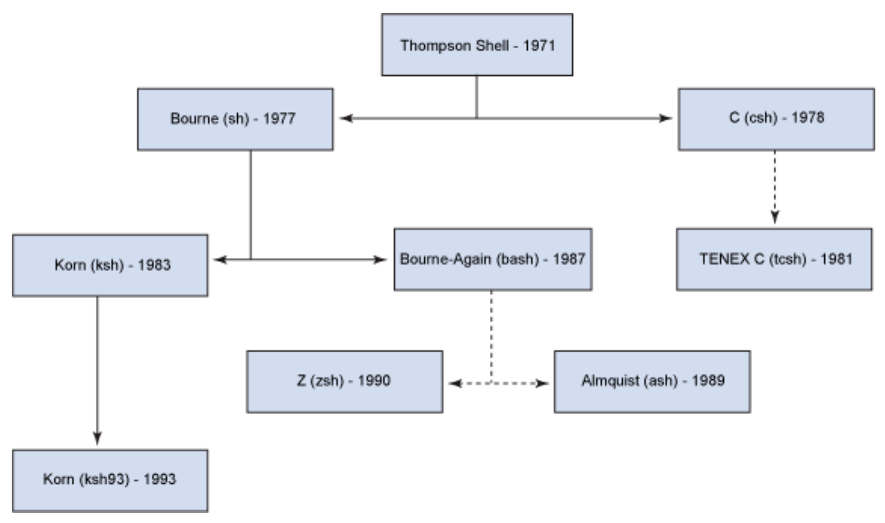
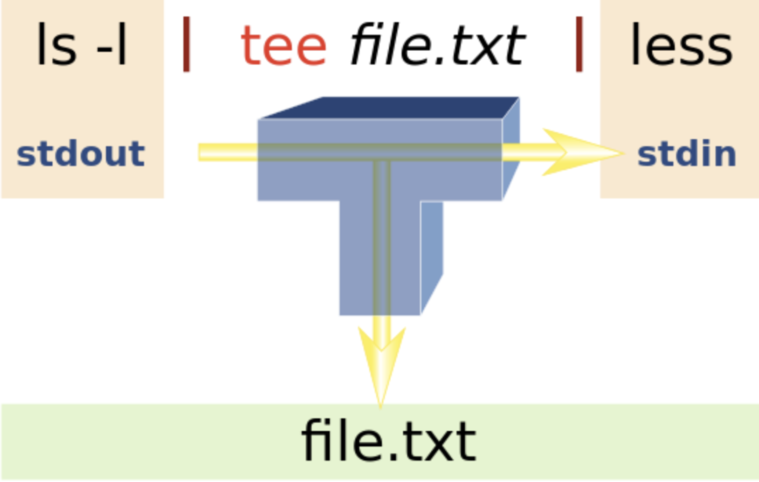
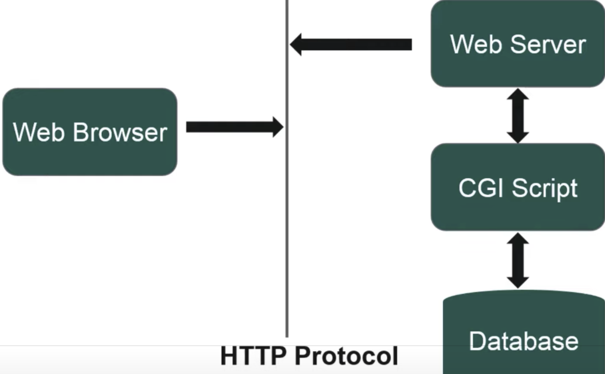

# Shell

* Environment is set at login and are valid for the duration of the session
* $0 : Which shell am I using

> Term

* Shell
  * a program which processes commands and returns output, like bash in Linux
* Terminal
  * program that run a shell

> Type



* bash
  * born again shell
  * -c string : commands are read from string. Arguments after the string are assigned to the positional parameters, starting with $0

* csh
  * c shell

* zsh
  * Recursive path expansion → For example “/u/lo/b” expands to “/usr/local/bin”
  * Spelling correction and approximate completion: If you make a minor mistake typing a directory name, ZSH will fix it for you
  * Plugin and theme support: ZSH includes many different plugin frameworks

* event designators
  * !n : n th command
  * !! !-n : previous command / nth previous command
  * ^old^new : change old from previous command to new (only one)
  * !#:n / $ : nth / last word in current command
  * !!:gs/string1/string2 : change old from previous command to new (multiple)

> Shortcut

* ctrl + r : Search history
* ctrl + w : Delete a word
* ctrl + l : Clear screen
* command + t : Create new tab
* command + n : Create new window
* ctrl + a / e : Move to the beginning / end of the line
* ctrl + u | k : Delete to the beginning / end of the line
* option + ← / → : Navigate left / right
* ctrl + (shift) + tab : Navigate tabs
* command + (shift) + d : Split terminal
* defaults write com.apple.finder AppleShowAllFiles TRUE : Show hidden folder on Mac

> Error

* Broken pipe
  * IP changed or server can't guarantee security

* Connection to _ closed by remote host
  * Administrator Disconnect

* getcwd() failed: No such file or directory
  * execute a command from a path that doesn't exists (deleted by other terminal)

* The System is going down for reboot NOW!
  * Remote server shuts down

* @@@@@@@@@@@@@@@@@@@@@@@@@@@@@@@@@@@@@@@@@@@@@@@@@@@@@@@@@@@
@    WARNING: REMOTE HOST IDENTIFICATION HAS CHANGED!     @
@@@@@@@@@@@@@@@@@@@@@@@@@@@@@@@@@@@@@@@@@@@@@@@@@@@@@@@@@@@
IT IS POSSIBLE THAT SOMEONE IS DOING SOMETHING NASTY!
Someone could be eavesdropping on you right now (man-in-the-middle attack)!
It is also possible that a host key has just been changed.
The fingerprint for the ECDSA key sent by the remote host is
SHA256:kxkE5MRHdMciAYqcryrEn6fMRSXFuSuqixJZDU.
Please contact your system administrator.
Add correct host key in /home/sean/.ssh/known_hosts to get rid of this message.
Offending ECDSA key in /home/sean/.ssh/known_hosts:23
  remove with:  sh
  ssh-keygen -f "/home/sean/.ssh/known_hosts" -R "11.11.1.12"
Password authentication is disabled to avoid man-in-the-middle attacks.
Keyboard-interactive authentication is disabled to avoid man-in-the-middle attacks.
  * scp -oStrictHostKeyChecking=no
  * ssh-keygen -f "/home/sean/.ssh/known_hosts" -R "11.11.1.12"

* Unable to fetch some archives, maybe run apt-get update or try with --fix-missing?
  * -> run apt update
  * apt install tftp

* Problem with update-manager: No module named 'apt_pkg' in Ubuntu 13.10, having installed Python 3.4 on /usr/local/lib
  * sudo apt-get install --reinstall python3-apt

* device or resource busy (when rm file)
  * lsof +D /path and kill
  * umount /path

* ~ doesn't give correct value
  * Tilda must be first character of word and not quoted


## Installer

* apt
  * apt-get is one of apt parts → mostly can be ignored
  * native Ubuntu system-wide package manager
  * packages are usually only updated for each separate Ubuntu release
  * used with the Debian family distributions and handles deb software packages
  * update : update apt
  * list --installed : List installed packages
  * /var/lib/apt/lists : Storage area for state information for each package resource
  * /var/lib/apt/lists/partial/ : Storage area for state information in transit
  * install -y git / openjdk-8-djk : accept all while downloading

* brew (macOS)
  * packages compiled to version-specific subdirectories → multiple versions can be in machine
  * Homebrew is a 3rd party addition – on both macOS and Ubuntu
  * cask is extension to brew that allows management of graphical applications through Cask project
  * list
  * services
    * start postgres
    * stop postgres
  * link : creates symlinks to installations you performed
  * cleanup : run occasionally to avoid running out of disk
  * tap adoptopenjdk/openjdk : install old java
  * cask install adoptopenjdk8 : 9, 10, 11

* choco
  * choco install python
  * [Install](https://chocolatey.org/docs/installation)

* Debian
  * open source community, stability and security
  * freeze and scrutinize all packages → packages can be a little old
  * Linux Mint, Ubuntu, Elementary OS, and Kali Linux

* curl
  * providing a library and command-line tool for transferring data using various network protocols
  * -L : (HTTP) If requested page has moved to a different location use that
  * -P, --ftp-port address : (FTP) Reverses default listener roles when connecting with FTP
  * -q / -s / -i : Quite /Silent (no progress, error) / Include the HTTP-header in output
  * -m --max-time : maximum time in seconds
  * -o file / -O : Write output to file / local file named like the remote file we get
  * -X POST : request type
  * -H 'Content-Type: app/json' : header
  * -d '{"id": "tom", "age": "7"}' : data




```sh
curl -s https://raw.githubusercontent.com/sivel/speedtest-cli/master/speedtest.py | python -
error() {
  print_error $@
  exit 1
}

curl -m 2 www.google.com &> /dev/null || error "Failed to access external"
```




* rqm (Redhat Package Manager)
  * manipulates specifically packages it is asked to manipulate
  * needs to know the exact location of .rqm package

* ant
  * Java installer

* dpkg
  * used to install, remove, and provide information about .deb
  * --ad-architecture : package can be installed without using --force-architecture

* wget
  * -P : /path/to/folder
  * --spider : behave as a Web spider, just check that website are there.
  * --ask-password : secure safe
  * --http-user / http-passwd : Specify username user and password on an HTTP (not safe)

* update-alternatives
  * maintain symbolic links determining default commands
  * --config : name
  * --install /usr/bin/python3 python3 /usr/bin/python3.8 2 : set python3.8 with priority 2

* yum
  * usually used with the RHEL family OS's and handles RPM software packages
  * /etc/yum.conf : configuration file and related utilities
  * /etc/yum.repos.d/ : options
  * install package_name : install package_name
  * remove package_name : remove a package
  * autoremove package_name : unneeded dependencies
  * list : list all packages




```sh
PKGS=(
  libusbx-devel
  gtk2
  gstreamer1
)
yum install -y ${PKGS[@]}
```




## Process


* pgrep
  * find or signal processes by name

* fuser
  * show which processes are using a specified computer file, file system, or Unix socket
  * -v -n tcp 80 : check what processes are using a network port:

* ltrace
  * intercepts library calls and system calls made by your application to C libraries such as the glibc
  * analyze the performance of libraries when they are used by applications

* strace
  * intercepts system calls make by glibc and other libraries directly into Linux Kernel
  * uses ptrace to inspect system calls by the process and how long each took
  * strace -f

* ps
  * <> : PPID PID PGID SID TTY TPGID STAT UID TIME COMMAND
  * a : show processes for all users
  * u : display the process's user/owner
  * x : show processes not attached to a terminal
  * -e : show the environment after the command
  * -f : ASCII art process hierarchy
  * axjf : display the process tree on Linux
  * aux | grep apt : see all downloading files
  * -o thcount= pid : Total thread in pid
  * -L pid : Prints all thread used by pid
  * ax -L --no-headers | wc -l : Total thread now
  * /proc/sys/kernel/threads-max : Total possible thread
  * ax -o pid,nlwp,cmd  | sort -nr -k2,2 : Ordered by number of threads

* sleep
  * sleep : default is seconds, m, h, d

* top
  * show cpu usage
  * current time | uptime | users sessions logged in | average load on the system (1, 5, 15 min)
  * Processes totals (73 total) | running | sleeping | stopped | waiting to be stop from parent
  * user | system | priority nice |  I/O operations | hardware interrupts | software interrupts | hypervisor
  * PID: PID of the process(4522)
  * USER: The user that is the owner of the process (root)
  * PR: priority of the process (15)
  * NI: The “NICE” value of the process (0)
  * VIRT: virtual memory used by the process (132m)
  * RES: physical memory used from the process (14m)
  * SHR: shared memory of the process (3204)
  * S: S=sleep R=running Z=zombie D=uninterruptible sleep, IO (S)
  * %: percentage of CPU used by this process (0.3)
  * %: RAM used by the process (0.7)
  * TIME: total time of activity of this process (0:17.75)
  * COMMAND: name of the process (bb_monitor.pl)
  * -o key : Order process display by sorting on key in descending order
  * -n nprocs : Only display up to nprocs processes.
  * -user user : Only display processes owned by user
  * k : Kill Process (PID and signal-9)
  * c : display full command
  * u : Specify process of user
  * shift + t : Sort by longest uptime
  * shift + m : Sort by largest memory usage
  * shift + p : Sort by largest CPU usages
  * space : refresh

* htop
  * visualize memory usage in top

* vm_stat (mac)
  * show Mach virtual memory statistics




```sh
cat /proc/sys/kernel/threads-max # possible thread count
ps ax -L --no-headers | wc -l    # currently running thread count
ps -o thcount= 19783             # number of thread used by process
```




```sh
# human readable one liner
vm_stat | perl -ne '/page size of (\d+)/ and $size=$1; /Pages\s+([^:]+)[^\d]+(\d+)/ and printf("%-16s % 16.2f Mi\n", "$1:", $2 * $size / 1048576);'
```




### Signal

* man 7 signal

* suspend
  * Suspend the execution of this shell until it receives a SIGCONT signal

* kill
  * pid : kill pid process
  * -HUP "$PPID" : logout, restart user

* pkill
  * find or signal processes by name

* trap
  * SIGKILL and SIGSTOP cannot be detected by trap

* wait
  * waits for completing any running process (if many, only PID of last command)




```sh
command signal        # execute command when signal
'myhandler' INT; myhandler() { ... ;}    #
```





```sh
# grep cpu at certain second
for i in 1 2 4 8 16 32; do
  ~/measure -t $i & sleep 10;
  top -n 1 -d 1 -i -b;
  wait;
done
```




* cron
  * daemon to execute scheduled commands




 ```sh
 # ┌────────────── second (optional)
 # │ ┌──────────── minute
 # │ │ ┌────────── hour
 # │ │ │ ┌──────── day of month
 # │ │ │ │ ┌────── month
 # │ │ │ │ │ ┌──── day of week
 # │ │ │ │ │ │
 # │ │ │ │ │ │
 # * * * * * *
 ```





## Util

### Date

* date
  * <> : display date
  * +%Y%m%d : Format
  * -s "2 OCT 2006 18:00:00" : Change format using +
  * -u {month}{day}{hour}{minute}{year} : set date
  * -s "`ssh server date`"

* time
  * -v : change verbosity, more statistics with Linux kernel v2.6
  * user : time CPU spent executing application code on behalf of program
  * Swaps : num times the process was swapped to disk
  * system : time CPU spent executing system or kernel code on behalf of application
  * Exit status : exit status of the application.
  * real / elapsed : time between when the program started and finished execution.
  * Page size (bytes) : page size of the system
  * Major (I/O) page faults : num major page faults that required to be read from disk
  * In / Voluntary context switch : num times the process yielded / taken from CPU

### Help

* apropos
  * "description" : search the whatis database for strings

* man
  * <> : format and display the on-line manual pages

* whatis
  * command : search the whatis database for complete words

### Ownership

> Term

* root
  * aka superuser, administrator, admin or supervisor
  * can do everything
  * Unix-like systems, for example, the user with a user identifier (UID) of zero

* Owner
  * the assigned owner of the file or directory

* Group
  * members of the group that owns the file or directory

* Other
  * all other users that owns the file or the directory

> CLI

* chmod
  * -R : change files and directories recursively

* chown
  * -R : change user / group ID for file hierarchies
  * user:group filename : transfer filename to user, group
  * sudo chown -R `whoami` /usr/local : add permission to all usr/local files




```sh
cut -d: -f1 /etc/passwd
```




```sh
vi /etc/default/useradd
HOME=/home/sean
useradd vivek
passwd sean
finger sean
```




### Pipeline

> CLI

* awk
  * Created by Aho, Weinberger & Kernighan
  * gsub(regexp, replacement [, targ]) : Global replacement of string
  * FS : File separator
  * OFS : Output file separator
  * NF : The number of fields in the current input record.
  * NR : The total number of input records seen so far
  * -F : Specify the input field separator
  * '_[$0]++' *.csv : Find duplicate line
  * '{print}' input.txt : Prints every line of data from the specified file
  * '/PAT1/,/PAT2/' file : Lines between inclusive
  * '{print $1,$4}' input.txt : $n prints nth word delimited by space
  * '{print NR,$0}' input.txt : NR prints line number, $0 prints entire string
  * '/abc/ {print}' input.txt : Prints every line containing abc
  * 'NR==n {print $0}' input.txt : Prints n th line
  * -F 'pattern' 'NF{print NF-1}' b4 : Count number of pattern in each line
  * '/ptn/ {c++} END {print c}' input.txt : Count pattern in the string
  * '/PAT1/{flag=1; next} /PAT2/{flag=0} flag' file : lines between exclude PAT1, PAT2
  * '{ t = $1; $1 = $2; $2 = t; print; }' input.txt : Swap first two column

* xargs
  * -E : (for mac)
  * -0 : Change xargs to expect NUL
  * -t : prints command that will be executed to terminal
  * find . -name "to_move*" | xargs -I{} mv {} ./class/book/images/ : find and move




```sh
seq 10 | xargs  (-n1) # 1 2 3 4 5 6 7 8 9 10 (vertical)
find . -regex ".*mp4" -print0 | xargs -0 -L 1 python3 scripts.py open_video
eval $(grep -v -e '^#' .env | xargs -I {} echo export \'{}\')
```




* cut
  * -d : use as separater (-f1) to grep index
  * -c n- : remove first n - 1 chatacter
  * -d -f1 /etc/passwd : Get all user I can use

* tee
  * read from standard input and write to standard output and files
  * -a : Append output to files rather than overwriting



* grep
  * global regular expression print
  * key * \c
  * -E : Interpret pattern as an extended regular expression
  * -i : Case-insensitive search
  * -L : Lists the files which do not include the search term
  * -n : Show matching line numbers
  * -v : Reversing the meaning of a grep search
  * -o : Output only matched substrings
  * -r : Recursively search subdirectories listed
  * -A num : how many lines after the match
  * -B num : how many lines before the match
  * -C num : how many lines before, after the match
  * -rL "print" . : all files without print

* egrep
  * extended grep
  * '19|20|25' calendar : grep multiple patterns

* sed
  * stream editor for filtering and transforming text
  * invalid command code .
  * for OS use empty argument -i ''
  * s/ : Replace
  * /p : print
  * -n : suppress line echoed to stdout after commands
  * -i.bak : In place (-i '' for BSD)
  * '0,/pattern/ d' file : remove first line if pattern
  * '/^#[^!]/d'   file : remove all comments except shebang
  * "s/hello/hi/" file : Replace hello to hi in file.txt
  * -n  :nclude/p;q' file # (p)rints all cpp files, then (q)uits
  * -i '1d' file : delete first line
  * -i  :BJ/d' file       # delete first line if match
  * -i '1s :h1\n/' file   # append to beginning of file

* shuf
  * -n : number of lines

* sort
  * -h : compare human readable numbers
  * -g : sort by number
  * -r : reverse sort
  * -k n : nth column

* uniq
  * -c : show counting

* tr
  * -d : search and delete any character or string from a text
  * -s : compress same adjacent character output to single token
  * tr "a-z" "A-Z" : prints in capital letters

### User

> Term

* History from file
  * /var/log/secure : Red Hat
  * /var/log/auth.log : Debian

* Sudo config




```sh
Defaults:chris timestamp_timeout=20
```




> CLI

* last
  * check login history
  * last -15 : all logged user
  * last user : particular user
  * last pts/2 : terminal conncted

* lastlog
  * reports user's last login information from /var/log/last/log

* lastb
  * check user's bad login history

* w
  * Show who is logged on and what they are doing

* who
  * show who is logged on

* su
  * <> : Change user
  * -c command : Pass single command to user

* id
  * print real and effective user and group IDs
  * -u : print only effective user ID

* groups
  * Display all groups
  * user : list of all groups a user belongs to (first group is primary)

* passwd
  * Change password of current user
  * user : Change password for other user

* adduser (preferred)
  * non-interactive, and not distro-specific
* useradd
  * useradd : native binary compiled with the system
  * -m : create the home directory

* userdel
  * -r : removes files in the user's home directory along with the home directory itself

* usermod
  * -a : Add the user to the supplementary group
  * -g : List of supplementary groups which the user is also a member of
  * -l new old : change username
  * -a -G group user : add user to group on mac

* dscl (mac)
  * sudo scutil --set HostName mac : Change host Display name gyuseung@mac
  * read /Groups/admin GroupMembership : Reading the membership of the admin group:
  * append /Groups/admin GroupMembership usershortname : Adding a user
  * delete /Groups/admin GroupMembership usershortname : Removing a user: (from the group not the system)


* sudo




```sh
local result=1
which sudo 2>&1 1>/dev/null
[ $? -eq 0 ] && result=0        # 0 - ok/ 1 - nok
sudo -Hiu $user env | grep $var # grep other person’s env

Add user (default id: 1000)
ARG USER_ID=1002

RUN useradd -ms /bin/bash ${USER_NAME} && usermod -aG wheel ${USER_NAME} \
    && echo "${USER_NAME} ALL=(ALL) NOPASSWD: ALL" > /etc/sudoers.d/${USER_NAME} \
    && echo 'Defaults env_keep = "http_proxy https_proxy"' >> /etc/sudoers.d/${USER_NAME}
```




* visudo
  * edit sudoer file
  * locks the sudoers file against simultaneous edits
  * add to sudo group
  * usermod -aG sudo id

### Terminal

* clear
  * clear terminal

* chsh
  * -s /bin/bash user : change user’s shell to bash

* env (printenv)
  * Print all local variables

* set
  * change shell options, set positional parameters, display names and values of shell variables
  * use - to set and + to unset (ex. set -e)
  * Set | unset values of shell options and positional parameters
  * -a : automatically export all variables
  * -e : Exit immediately if a command exits with a non-zero status
  * -P : If set, follow symbolic links when executing commands

* locale
  * print enabled language
  * -e : any trap on ERR is inherited by shell functions (bash -e)
  * -o pipefail : return value of a pipeline is value of last (rightmost) command to exit

* locale-gen
  * en_US.UTF-8 : Create UTF-8

* source
  * run command in current shell
  * When script run (with ./myscript.sh), it creates own process context (a new process environment)

* export : a new shell is spawned to run the script
  * & pass environment values to a child process
  * export LC_ALL=C : Change shell language to english
  * export name=sean : Set name variable to sean
  * /etc/environment : sets variable system wide for every user on boot
  * /etc/bash.bashrc : executed if the bash shell is opened
  * ~/.<shell_name>rc : to make it run when start an interactive shell
  * ~/.<shell_name>profile : to make when log in

* unset
  * remove exported variable

* lsb_release
  * LSB (Linux Standard Base) and distribution-specific information on the CLI
  * -a : Display all information.
  * [Sample Output]
  * LSB Version : core-4.1-amd64:core-4.1-noarch
  * Distributor ID: : CentOS
  * Description: : CentOS Linux release 7.7.1908 (Core)
  * Release: : 7.7.1908
  * Codename: : Core




```sh
if command -v lsb_release >/dev/null 2>&1; then
  OS_NAME=$(lsb_release -i -s)
fi

# Load env
if [ -f .env ]
then
  export $(cat .env | sed 's/#.*//g' | xargs)
fi
```




* uname
  * Print operating system name
  * -a : Behave as though all of the options -mnrsv were specified.
  * -m : machine hardware name.
  * -n : nodename (name that system is known by to communication network)
  * -p : machine processor architecture name.
  * -r / s / v : operating system release / name / version.




```sh
can_escalate_privileges()  # by default (e.g. on Linux) user can do so
{
  local result=0
  if [ "$(uname)" = "FreeBSD" ]; then
    if ! groups $USER | grep wheel 2>&1 1>/dev/null; then
      result=1
    fi
  fi
  return $result
}

system_cpu=`uname -m`
```




* screen

* tmux
  * new -s : create session with name
  * ls : list all sessions
  * kill-session -t 0 : kill with session name 0
  * attach-session -t 0 : attach with session name 0
  * C-b d : Detach from session
  * C-b [ : Scroll Up and down
  * C-b PgUp

> alias

* alias
  * disabled in non-interactive shell
  * set shortcut to command
  * \aliased_command : temporaily disable aliased command using backslash
  * alias untar='tar -zxvf '

* unalias
  * unalias shortcut

* type
  * print out what command the alias will run


## File

> Term

* Linux
  * /bin : Executables needed in single user mode and to bring system up or repair
  * /etc : System related configuration file (local static file to control program operation)
  * /sbin : holds commands needed to boot the system for sudo user
  * /issue : Check Linux Version
  * /etc/paths : look for commands
  * /etc/hosts : Static table lookup for hostnames
  * /etc/init.d : start/stop scripts used to control daemon while system is running boot
  * /etc/services : Internet network service list
  * /opt : Install unbundled packages, each in its own subdirectory
  * /proc : interface to kernel data structures
  * /proc/pid : exe a copy of the binary image of the running process
  * /proc/sys : Info about system, allows system admin  to enable, disable kernel features
  * /usr : Files under it are shareable between OS instances
  * /usr/local : Install files built by administrator (make), not managed by system packager
  * /var : Variable data files (spool dir | files, administrative, log, transient | temp files)

* Mac
  * /boot : /System/Library/Kernels
  * /home : /Users
  * /root : /var/root

> CLI

* chattr
  * `+ / -` : Adds / removes attribute to existing attribute of files.
  * =       : Keep the existing attributes that the files have
  * i       : immutable

* basename
* dirname




```sh
/usr/lib/log    # /usr/lib vs /log
/usr/           # / vs usr
usr             # . vs usr
/               # / vs /
```




* lsattr
  * lists the file attributes on a second extended file system

* file
  * determine file type




```sh
if [ -f "$filename" -a "$(file -b --mime-encoding "$filename")" = binary ]; then
  echo It\'s a binary file
fi
```




* stat
  * displays the size and other stats of a file/directory or a filesystem.

* patch
  * apply a diff file to an original

* locate
  * fast but less accurate

* whereis
* locate the binary, source, and manual page files for a command

* which
  * returns the pathnames of the files which would be executed in the current environment

* ls
  * lists contents in the directory
  * -a : show hidden file
  * -d : list directories as plain files
  * -h : human readable
  * -i : Lists IP sockets
  * -l : file mod, # links, owner, group, bytes, modified path
  * -R : recursively
  * -S / t : by size, date
  * -1 "$PWD/"* : get all absolute path

* tree
  * brew install tree for mac
  * -d : Directory only
  * -f : Full path prefix for each file.
  * -I pattern : Do not list those files that match the wild-card pattern

* pwd
  * print working directory

* pushd
  * saves the current working directory in memory

* popd
  * changes current directory to directory that was most recently stored by pushd

* dirs
  * Display the list of currently remembered directories
  * -p : Causes dirs to print the directory stack with one entry per line

* cd
  * ~   : change to home directory
  * ..  : parent directory
  * `-` : change to last directory
  * -L  : Follow symbolic links (default)
  * -P  : Follow physical directory
  * "dir with_space"        : directory with whitespace
  * $(dirname a/b/file.cpp) : cd into file's located folder

* ag
  * multithreading / case-insensitive
  * apt install silversearcher-ag    # download on mac
  * -u : Search everything
  * -C 5 : five lines around
  * --hidden : find hidden file, except ~/.agignore
  * -G PATTERN 'ftp' . : specific file patterns

* find
  * -L : Follow symlink
  * -maxdepth n : search n level
  * -mmin -60 : modified in last 60 minutes
  * . -name / -regex FILENAME : Find file with name / regex
  * -path '*/nested/folder/*' : Find nested folder
  * -type d? : Find Directory
  * -exec ls -l {} \; : pipe with ls -l
  * . -type d -empty -delete : remove all empty directory
  * . -type f -execdir mv "{}" .. \; : Move to its parrent folder
  * . -not -iwholename '.git' -type f -exec sed -i '' 's/ *$//' '{}' ';' : remove trailng spaces recursively
  * -printf '%TY-%Tm-%Td %TT %p\n' | sort -r

* readlink
  * -f : show full path

### IO

* head
  * fn : print the first 10 lines of each FILE to standard output.

* tail
  * fn : print last 10 lines of each FILE
  * -f : wait for new strings, show dynamically
  * -n +2 "$FILE" : except first line

* wc
  * -l : Counter number of lines
  * tr -cd ',' | wc                : Count specific character
  * find . -name '*' | xargs wc -l : Count all number of lines

* more
  * additional development on “more” had stopped
  * uses same functions as vi editor
  * spacebar to go to the next page

* less
  * faster because it does not load the entire file at once
  * allows navigation though file using page up/down keys

* Open (mac)
  * . : Open current folder in finder

* code
  * open vscode
  * -n   : Create a new window
  * -r . : Open current directory in most recently used window
  * -diff f1 f2 : Open diff editor

* dd
  * -bs=BYTES : read and write up BYTES at a time (default 512)
  * -if=FILE  : read from FILE instead of stdin (/dev/zero)

> print

* echo
  * echo y | docker system prune    # Say yes in one line

* column
* cat [filename]
  * reads files sequentially, writing them to the standard output.
  * -T : print new line as ^IO
  * /etc/*-release : Prints linux distribution
  * file | grep -vi "the" : Print files with line the
  * file1.txt file2.txt > file3.txt : Merge two files into one




```sh
echo Hello      World      # Hello World
echo "Hello      World"    # Hello      World
echo Hello * World         # Hello (ls) World
echo "Hello "*" World"     # Hello * World
```




```sh
# Color print
RED="\033[1;35m"
YEL="\033[1;33m"
BLU="\033[1;36m"
GLN="\033[1;32m"
NCL="\033[0m"
echo -e "${RED}RED{NCL}"
echo -e "${BLU}BLUE{NCL}"
# Color print function
SET_FG="tput setab"
SET_BG="tput setaf"
COLOR_RED=1
COLOR_BLACK=0
COLOR_YELLOW=3
print_error() {
  echo -e "$($SET_BG $COLOR_RED)$($SET_FG $COLOR_BLACK)$@$($RESET)"
}

print_info() {
  echo -e "$($SET_BG $COLOR_BLACK)$($SET_FG $COLOR_YELLOW)$@$($RESET)"
}
```




```sh
{
echo -e "PATH_A \t ${PATH_A}"
echo -e "PATH_B \t ${PATH_B}"
echo -e "PATH_C \t ${PATH_C}"
} | column -s $'\t' -t
```




```sh
# print multiline
sql=$(cat <<EOF
SELECT foo, bar FROM db
WHERE foo='baz'
EOF
)
```




### Operation

* cp
  * copy file
  * -f : if destination file cannot be opened, remove and try
  * -T : if target already existed as a directory, then cp will fail
  * -r [directory] : copy all of the files including files inside of subfolders

* mv
  * -t DESTINATION file1 file2 file3 : multiple files
  * `ls -1 | grep -v no_move.jpg folder : move everything except one
  * ~/Linux/Old/!(Tux.png) ~/Linux/New/

* rm
  * **/.git : Remove all nested .git file
  * -r dir : Remove directories and their contents recursively
  * !(a.txt|b.txt) : Remove all except a.txt and b.txt

* touch
  * Create or update modified date on file

* diff
  * Check whether two files are equal
  * -y : Display side by side
  * <(echo a) <(echo b) : Print diff of two output command
  * ssh user@remote_host "cat foo" | diff - foo : diff over remote
  * <(ssh server1 'cat foo') <(ssh server2 'cat foo') : diff two remote file

* rmdir
  * remove directory

* mkdir
  * Create directory
  * -p dir1/dir2 : nested directory

* rename
  * "s/py/md/" *.pyj : rename all py to js

### Link

* ln
  * -f : remove existing destination files
  * -lnf : overwrite existing symbolic link
  * -n LINK : treat LINK as a normal file if it is a link to dir
  * -s /any/file linked : Create Symbolic link

* unlink
  * unlink linked-file

### Mount

* mount
  * attach filesystem found on device (type) at the directory dir
  * cat /proc/mounts : show all mounted files
  * sudo mount system.img temp_system

* umount
  * sudo umount temp_system

### Media

* ffmpeg
  * ffmpeg -i video.mp4 2>&1 | grep Duration : get duration

* imagemagick
  * displaying, converting, and editing raster image and vector image file




```sh
brew install imagemagick
convert *.jpg output.pdf
mogrify -format png *.psd
```




### Binary

* objdump
  * prints contents of object files and final linked images
  * -a / -h a.o : information in archive's headers / headers
  * -s (-j section / -b) a.o : full contents  (in sections / in binary)
  * -d (-j section) a.o : show file disassembled codes (in section)
  * -p /lib/libutil.so | grep dep : check dependency
  * -l -S libutil.so > a : find location of function in binary (libutil.so.0.8.2 ! func@0x17 + 0x94c - [unknown source file])

* hexdum
  * -C a.cpp : See original file with it

* string
  * print printable strings in a object, or other binary, file

* readelf
  * Display information about ELF files
  * when build type or cmake is changed, it becomes new binary

* binutils (mac)
  * -s libutil.so.1.5.4  | grep FILE : Which file contained in binary
  * -S program.so | grep debug_line

* ldd (linux)
  * print shared object required by each program
  * should not ldd on untrusted executable → objdump
  * doesn’t work on a.out shared libraries
  * ldd $(which python) / /bin/ls

* otool (mac)
  * -L a.out

* nm
  * display name list (symbol table)
  * -A : display fn
  * -C : decode low-level symbol names
  * -D : only display dynamic symbols
  * <> OBJECT-FN : lists symbols from object files
  * build_kmb/modules/core/libvascore.so : check for symbol

### Disk

* df (disk free)
  * report file system disk space usage
  * -a : file system's complete disk usage even if the Available field is 0
  * -h : free

* du (disk usage)
  * [-H | -L | -P] [-a | -s | -d depth] [-c] [-h | -k | -m | -g] [-x] [-I mask] [file ...]
  * -a : all files and folders
  * -s : display only a total for each argument
  * -d : max-depth
  * -h : human readable
  * -h -d1 .
  * -hs * | sort -h : order by size

* fdisk
  * -l : List partition tables for specified devices and exit

* dmidecode (DMI / SMBIOS table decoder)
  * sudo dmidecode | egrep "Socket Designation: Proc|((Thread|Core) Count)"

* ulimit
  * ulimit -c unlimited : dump core to current directory

* sysctl
  * Read and set values in /etc/sysctl.conf (kernel parameters)
  * sysctl kernel.core_pattern : get segfault location
  * sysctl -a | grep machdep.cpu / swap : show cpu / swap info in mac

* lsblk
  * lists information about all or the specified block devices

* getconf
  * retrieve standard configuration variables

* systemd (system daemon)

* systemctl
  * Control the systemd system and service manager
  * disable Unit
  * removes all symlinks to the unit files backing the specified units from the unit configuration directory
  * undoes any changes made by enable or link
  * get-default : get default target
  * list-units --type target : get all target (--all to print unactivated)
  * set-default name.target : change default target
  * isolate graphical.target : change target without reboot
  * enable : hook specified unit into relevant places → start on boot
  * list-units PATTERN : List units that systemd currently has in memory
  * list-sockets PATTERN : List socket units currently in memory
  * start PATTERN : Start (activate) one or more units specified on the command line
  * disable deviceservie :
  * status / / ssh : check status of root mount / ssh

* launchctl (mac)
  * mac systemctl

### Compression

* tar
  * archiving utility, store multiple files in a single file
  * (-)z : (un)z̲ip
  * (x) : ex̲tract files from the archive
  * v : print the filenames v̲erbosely
  * -C : Create a new archive
  * -f : argument is f̱ilename
  * czf main.js package.json LICENSE : create .tar.gz
  * tar -xvzf sample.tar.gz
  * tar -xvjf sample.tar.bz2

* md5sum [filename]
  * calculate md5sum

* gzip
  * -d : decompress

* zip
  * -r my_arch.zip my_folder

* gunzip
  * decompress files created by gzip, zip, compress, automatically detect input format
  *.gz : unzip .gz file

* unzip
  * -o : overwrite files WITHOUT prompting
  * file.zip -d folder : Download in

### Copy

* xclip
  * for linux

* pbcopy
  * for mac
  * cat a | xclip / pbcopy : copy to clipboard

* shopt [zsh]
  * shell builtin command to set and unset (remove) various Bash shell options
  * -s extglob : allows bang
  * -q : Suppresses normal output
  * -s dotglob nullglob : also glob hidden file

### Network

> Term

* Apache
  * Order allow,deny : Deny will win if matched by both directives
  * Order deny,allow : allow will win if matched by both directives
  * Require all granted   : Allow all requests
  * Require all denied    : Deny all requests
  * Require host safe.com : Only from safe.com are allowed



> Error

* 48)Address already in use: AH00072: make_sock: could not bind to address [::]:80
  * sudo launchctl unload -w /System/Library/LaunchDaemons/org.apache.httpd.plist
  * sudo apachectl -k restart

* Internal Server Error
  * server encountered an internal error or misconfiguration and was unable to complete your request

* /usr/local/bin/apachectl: line 95: lynx: command not found
  * sudo tail /var/log/apache2/error_log

> CLI

* apachectl
  * a wrapper over httpd and just sets some environment variables and adds further functionality
  * -V : show which apache config using
  * cgid_ : creates external daemon responsible for forking child processes to run CGI scripts

* dig
  * performs DNS lookups and displays the answers that are returned from the name servers

* hostname
* hostnamectl

* ip
  * brew install iproute2
  * n : ip neighbor
  * a : ip address
  * address show : show

* nc
  * -p : source_port
  * google.com 80 : try to establish a connection on port 80 to google.com




```sh
# in terminal 1
docker run -it -p 23456:23456 -p 23457:23457 --name server ubuntu:14.04 bash
nc -lp 23456 | nc -lp 23457

# in terminal 2  (can talk to terminal 3)
nc localhost 23456

# in terminal 3
nc localhost 23457
```




* local
  * -azvh file backup : save file in backup

* ss
  * -l : Show listening sockets (22 is opened by SSHD)
  * -p : List process name that opened sockets
  * -n : Don’t resolve service names i.e. don’t use DNS
  * -t / u : Show only TCP / UDP sockets on Linux

* sftp
  * FTP protocol over ssh port, encrypted
  * put / before every command to see local files
  * bye : exit sftp

* ufw
  * app list : list the ufw application profiles

* ipconfig
  * Internet Protocol Configuration used in Microsoft Windows operating system
  * view all the current TCP/IP network configurations values of the computer

* ifconfig
  * apt install net-tools
  * configure network interface parameters

* iptables
  * administration tool for IPv4/IPv6 packet filtering and NAT
  * displaying the route and measuring transit delays of packets across an Internet Protocol network

* gpg : OpenPGP encryption and signing tool
  * --keyserver hkp://keys.gnupg.net --recv BCE9D9A42D51784F
  * --verify ecs-cli.asc /usr/local/bin/ecs-cli

* traceroute
  * traceroute google.com

* tracepath
  * traces path to a network host discovering MTU along this path

* ufw (Uncomplicated firewall)
  * sudo ufw status
  * sudo ufw disable : disable firewall
  * sudo ufw enable : enable firewall

* telnet
  * connect destination host:port via a telnet protocol
  * if connection establishes means connectivity between two hosts is working fine

> httpd

* Apache HyperText Transfer Protocol (HTTP) server program
  * sudo brew services restart httpd
  * /usr/local/etc/httpd/httpd.conf : mac
  * /home1/irteam/apps/apache/conf/httpd.conf : server
  * /home1/irteam/apps/apache




```sh
Listen 8080         # Listening port
DocumentRoot        # where index.html is
ServerName          # localhost:8080
```




> nginx

* sudo nginx -s reload : update nignx




```sh
                  +--- host --------> node.js on localhost:8080
                  |
users --> nginx --|--- host/blog ---> node.js on localhost:8181
                  |
                  +--- host/mail ---> node.js on localhost:8282

server {
  listen       80;
  location / {
    proxy_pass http://127.0.0.1:8080;
  }
  ...
}

server {
  listen       ...;
  ...
  location / {
    proxy_pass http://127.0.0.1:8080;   # forward requests to `/` to server listening on `http://127.0.0.1:8080`.
  }

  location /blog {
    proxy_pass http://127.0.0.1:8181;
  }

  location /mail {
    proxy_pass http://127.0.0.1:8282;
  }
  ...
}
```




> Internet

* ping
  * apt install iputils-ping
  * test the reachability of a host on an Internet Protocol network

* speedtest-cli
  * sudo pip3 install speedtest-cli

### Transport

* rsync
  * copy every src to dest
  * Uses delta transfer algorithm and optimization to make copies faster
  * Uses 873 when using server
  * src dst
  * -a : skip newer files on receiver
  * -u : preserve everything
  * -C : auto-ignore files in the same way CVS does
  * -L : transform symlink into referent file/dir
  * -r : sync recursively
  * -v : increase verbosity
  * --update : skip files when the mtimes are identical
  * -h / -p / -g : preserve hard links / permissions / group
  * -rav sean/ . : copy all config files
  * --exclude-from : exclude all
  * -n / --dry-run : don’t actually run
  * -e
    * 'ssh -p 10022' : specify remote shell to use
    * "ssh -o StrictHostKeyChecking=no"
  * --exclude
    * {'file1.txt','dir1/*','dir2'} : exclude files / folders
  * -avCL -e "ssh tunnel ssh" cgw01.nlp:/home/data/*.db . : get files through tunnel
  * -rav --include '*/' --include '*.bin' --exclude='*' . remote:/data : Copy all bin files to remote

* scp src dst
  * -o : pass option to ssh in format used in ssh_config
  * user@remote:/dir . : copy remote to local
  * -3r remote1 remote2 : remote to remote
  * StrictHostKeyChecking=no :
  * local_file user@remote:/dir : copy local to remote

### Port

* lsof
  * list open files
  * -t : terse
  * +L1 : select open files that have been unlinked.
  * -i:3000 : show what is running on port 3000
  * kill -9 $(lsof -ti :80) : Kill what is running on port

* nmap
  * show which ports are opened

* netstat
  * review each of your network connections and open sockets.
  * -l : only listening sockets
  * -n : Show numerical addresses instead
  * -p : PID / name of program to which each socket belongs
  * -t : tcp
  * -u : udp
  * ESTABLISHED : connection is currently made there
  * LISTEN : socket is waiting for a connection
  * -tupan | grep LISTEN : see open ports
  * netstat -ano | grep :PORT_NUMBER : kill port | kill running on port

* nslookup
  * administration command-line tool to obtain domain names, IP address mapping, or other DNS records
  * interactive mode
  * type=MX : resource record type
  * set debug : to display the full response packets
  * server 8.8.8.8 : change the DNS server you're using

### ssh

> Error

* Pseudo-terminal will not be allocated because stdin is note a terminal
  * ssh -tt

> Command

* ssh
  * Forwarding sends data in one port through a SSH and send it to a port on the remote
  * -i : path to the private key
  * -l : login username (-l gyuseung == gyuseung@)
  * -p : port
  * -v : verbose
  * -o StrictHostKeyChecking=no : doesn’t check key
  * -tt server1 ssh server2 : ssh server1 and ssh server2 (cons: settings dependent on server1)
  * -L local_port:local_host:remote_port  server : port forwarding
  * -o ProxyCommand="ssh -W %h:%p server1" server2 : %h = server2, %p = ssh port in server2




```sh
Host base
  User base_id
  HostName base_host
  Port 10122

Host remote
  User remote_id
  HostName remote
  ProxyJump base

# s2 with proxy jump through server1
Host s2
  HostName server2
  User user2
  IdentityFile ~/.ssh/server2_id_rsa
  ProxyCommand ssh -W server2:22 server1

Host any_name
  HostName hostname
  User host-user
  PreferredAuthentications publickey
  IdentityFile "$HOME/.ssh/id_rsa"
```




* ssh-agent
  * -s : Generate Bourne shell commands on stdout

* ssh-keygen : create public, private key
  * public key (id_rsa.pub) encrypt messages, server knows a set of public keys it trusts
  * private key (id_rsa), stored in PC, decrypts messages (mathematical relations with public key)
  * append (id_rsa.pub) to known_hosts in ~/.ssh/authorized_keys
  * -b `4096` : Specifies the number of bits in the key to create
  * -H : hash known hosts file
  * -t `rsa` : select algorithm
  * -f `filename` : specifies `filename` of key file
  * -R `hostname` : removes key belongs to known host files

* ssh-copy-id
  * add local ~/.ssh/id_rsa.pub in remote .ssh/authorized_keys
  * ssh-copy-id user@hostname.example.com
  * ssh-keygen -t rsa -b 4096
  * ssh-copy-id -i $HOME/.ssh/id_rsa.pub host-user@hostname

* sshd
  * starts when system boots, master server that listens to incoming connections
  * /usr/sbin/sshd
  * -T : Extended test mode.  Check the validity of the configuration file

## rc

* #!/bin/bash -e : set which shell to run
* /etc/skel/.bashrc : reset rc files to original

* Setup




```sh
# Shell
case $- in
  *i*) ;;
    *) return;;
esac

HISTCONTROL=ignoreboth
shopt -s histappend # append to history file, don't overwrite it
HISTSIZE=1000       # set history size
HISTFILESIZE=1000   # set history file size

parse_git_branch() {
  git branch 2> /dev/null | sed -e '/^[^*]/d' -e 's/* \(.*\)/ (\1)/'
}
export PS1="\u@\h \W\[\033[32m\]\$(parse_git_branch)\[\033[00m\] $ "   # show branch in shell
export PS4='+(${BASH_SOURCE}:${LINENO}): ${FUNCNAME[0]:+${FUNCNAME[0]}(): }'
alias ..='cd ..'
cdl() {
  cd"$@";
  ls -al;
}
alias fn="find . -name "
alias fr="find . -regex "
alias ipe='ipconfig getifaddr en0'
alias ipi='curl ipinfo.io/ip'
alias ll="ls -la"
mkcdir ()
{
    mkdir -p -- "$1" && cd -P -- "$1"
}
alias mount='mount |column -t'
alias ports='netstat -tulanp'  # TCP / UDP
alias sshhosts="sed -n 's/^\s*Host\s+(.*)\s*/\1/ip' ~/.ssh/config"
alias speed='speedtest-cli --server 2406 --simple'
alias untar='tar -zxvf '
alias psm='ps aux | sort -nr -k 4 | head -3'
alias psm10='ps aux | sort -nr -k 4 | head -10'
alias psc='ps aux | sort -nr -k 3 | head -3'
alias psc10='ps aux | sort -nr -k 3 | head -10'
alias du1="du -hs * | sort -h"
alias du2="du -h -d 2 | sort -h"
export VISUAL=vim
export EDITOR="$VISUAL"

# Bash
alias ag="ag --hidden -U"

# C
source ~/github/opencv/build/setup_vars.sh
export PKG_CONFIG_PATH="/usr/local/lib/pkgconfig" # CXXFLAGS += -c -Wall $(shell pkg-config --cflags opencv4) LDFLAGS += $(shell pkg-config --libs --static opencv4)
export CMAKE_PREFIX_PATH=~/github/opencv/build    # PATH searched by CMake FIND_XXX()
export CPPFLAGS="-I/usr/local/opt/libffi/include"
export LDFLAGS="-L/usr/local/opt/libffi/lib"

# PYTHON
export FLASK_APP="server"

# Git Related
alias gaca="git add -A && git commit --amend --no-edit"
alias gacp="git add -A && git commit -m "blank" && git pull --rebase && git push"
alias gacap="git add -A && git commit --amend --no-edit && git push --force"
alias gaA="git add -A"
alias gau="git add -u"
alias gauca="git add -u && git commit --amend"
alias gb="git branch -vv"
alias gca="git commit --amend"
alias gd="git diff"
alias gdc="git diff --cached"
alias gfa="git fetch --all"
alias gl="git log"
alias gml="git log --stat --color --decorate --all --oneline"
alias gog="git log --abbrev-commit --name-status --color --graph --pretty=format:'%Cred%h%Creset -%C(yellow)%d%Creset %s %Cgreen(%cr) %C(bold blue)<%an>%Creset'"
alias gs="git status"
```




```sh
# Mac
# brew install ag         # recursively search text in folder
# brew install htop       # advanced top
# brew install vim        # text editor
# brew install git && gh  # version control
# brew install binutils   # readelf equivalent 'export PATH="/usr/local/opt/binutils/bin:$PATH"' >> ~/.zshrc

defaults write -g ApplePressAndHoldEnabled -bool false  # disable accentuate
defaults write com.google.chrome IncognitoModeAvailability -integer 1z  # disable incognito mode

alias ldd="otool -L"
alias xclip="pbcopy"
alias xargs="gxargs"
```




> Distribution

* Linux
  * Developed originally by Bell Laboratorie
  * Kernel interacts with computer hardwares to allow software / hardware to exchange information
  * Tries to make the distribution more user-friendly with more convenient features
  * Four categories based on original distribution - Arch, Debian, Red Hat, and Slackware

* WSL
  * compatibility layer for running Linux binary executables natively on Windows 10

* Red Hat
  * CentOS, Fedora, and Red Hat Enterprise Linux are derived

* BSD
  * Linux : MacOS

* Ubuntu
  * Desktop based Linux distribution

* window
  * Win+R shell:startup \(current user\) shell:common \(all user\)

```sh
systeminfo            # checks 32, 64 bitness
new-alias vi notepad  # use vi to replace notepad
```

* type
  * like cat in linux

```text
C:\>echo hi > a.txt
C:\>echo bye > b.txt
C:\>type a.txt b.txt > c.txt
C:\>type c.txt
```
