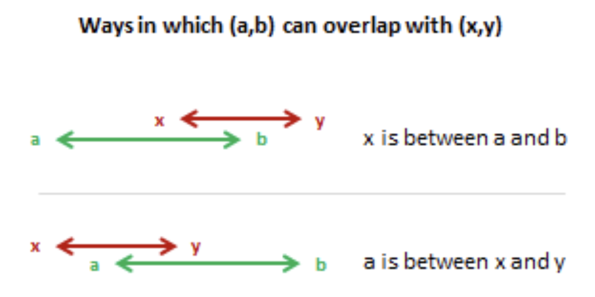
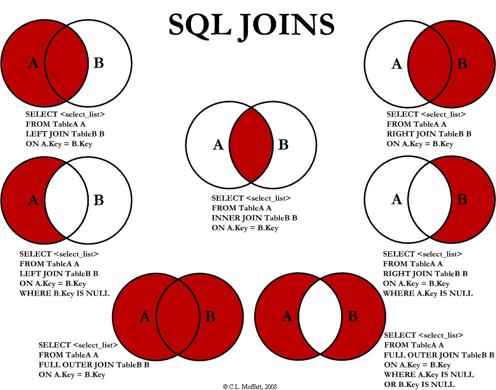
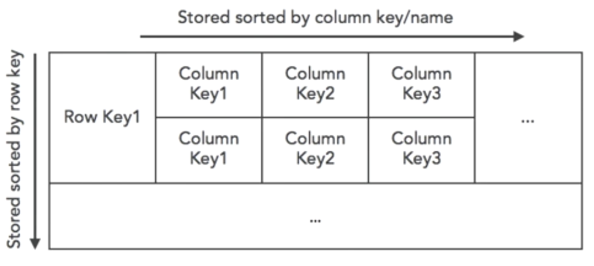
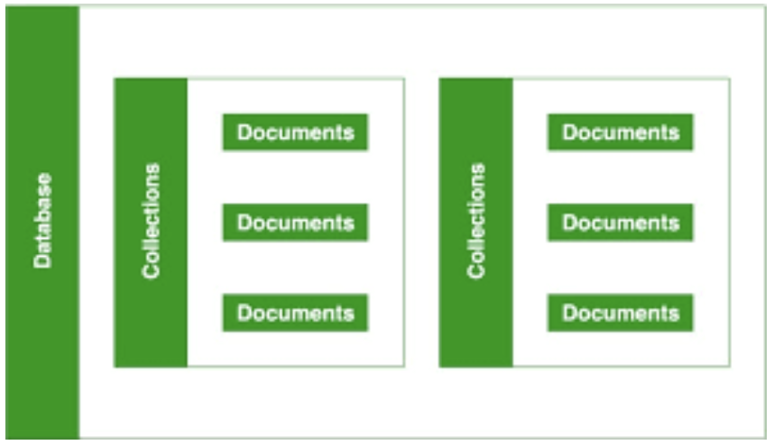
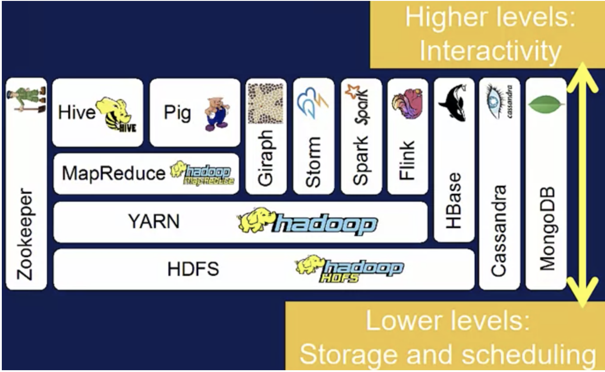

# Database

## Terms

* Dashboard
  * automatic data pipelines : dashboard
  * promotes trasnparency, accountability
  * purpose, scope, layout + flow, consistent naming structure

* Lake
  * vast pool of raw data, the purpose for which is not yet defined

* Warehouse
  * repository for structured, filtered data that has already been processed for a specific purpose

* Silo
  * Data produced from an organization that is spread out
  * Bad unsynchronized and invisible data

* Schema on read
  * creates the schema only when reading the data → NoSql

* Schema on write
  * defined as creating a schema for data before writing into the database → SQL

* smart
  * Connect with other devices and have knowledge of the environment.

* in situ
  * Bringing the computation to the location of the data.

* rollback
  * process that reverts writes operations to ensure the consistency of all replica set members

* sharding
  * architecture that partitions data by key ranges, distributes data among two or more database instances
  * enables horizontal scaling

* Transaction
  * a single logical operation on the data → must provide ACID

* ACID
  * Atomicity : all changes that we need to do for these promotions must happen altogether
  * Concurrency : multiple people updating a database simultaneously
  * Isolation : context of concurrency, multiple people updating a database simultaneously
  * Durability : once a transaction has been committed, it will remain so

* BASE
  * Basic Availability, Soft state, Eventual Consistency

* Fault Tolerance
  * enables a system to continue operating properly in the event of the failure of some of its components
  * Commodity cluster \(redundant data storage\)

* IaaS
  * User must install and maintain an operating system, and other applications
  * virtual machines, servers, storage, load balancers, network
  * Amazon EC2 cloud
* PaaS
  * Provided with entire computing platform
  * Execution runtime, database, web server, development tools
  * Google App engine, Microsoft Azure
* SaaS
  * cloud service provides hardware, software environment \(operating system, application software\)
  * Dropbox

> Roles

* Data Analyst
  * Discover Problem & Potential solution → Visualize, dashboard
  * Focus on Past & Present
* Scientist
  * Modeling
* Data Engineer
  * Data Architecture, Database maintenance \(Schema\), quality and pipelines

* BDMS
  * Continuous data ingestion
  * Support for common “Big Data” data types
  * A full query language
  * A flexible semi-structured data model

## Sql

* Language used to access and control RDBMSs
* Set up databases and modify them, as well as accessing them
* MySQL, Oracle, MS SQL Server, SQLite, Postgres, and MariaDB
* SQL are vertically scalable, increasing the horsepower \(higher Memory, CPU, etc.\) of the hardware
* Joins can be costly
* What does it mean for a query to be declarative?
  * Language specifies what data to obtain
* What is a global indexing table?
  * An index table in order to keep track of a given data type that might exist within multiple machines.
* Aggregate
  * A function that combines multiple values to produce a single new value
  * AVG, COUNT, MAX, MIN, SUM

```sql
-- single line comment
/* multi-line
   coment */
```

> Terms

* Constraints
  * PRIMARY, FOREIGN, UNIQUE, CHECK, NOT NULL
* Query
  * correlated query: A type of query that contains a subquery that requires information from a query one level up
* Repeated fields
  * Optimize repeating duplicate infromation to speed up query

> Errors

* Data truncated for column 'authProvider' at row 1
  * Your problem is that at the moment your incoming_Cid column defined as CHAR(1) when it should be CHAR(34).

> Null

* Null Check # A is null, A is not null
* Arithmetic operations involving any null return null
* Comparisons involving null return unknown new truth value
* Aggregate will ignore null values
* Null is treated like any other value in group-by

```sql
SELECT name FROM employee WHERE salary <= 100 OR salary > 100   -- ignore name with null salary
SELECT count(*) FROM customer   -- Count total number of customers
       count(credit)            -- Count number of customers who have credit
```

* Example

```sql
SELECT credit, count(credit) C FROM customer GROUP BY credit
```

| credit | C   |
| ------ | --- |
| 100    | 2   |
| Null   | 3   |

> Key

* Candidate Keys
  * Minimal Super Keys
* Foriegn Keys
  * FOREIGN KEY \(PersonID\) REFERENCES Persons\(PersonID\)
  * PersonID column in the Orders table is a FOREIGN KEY in the Orders table
* Primary Keys
  * Chosen candidate keys, cannot have null values in any tuple
  * table can have only one primary
* Super keys
  * A set of attributes SK of R such that no two tuples in any valid
  * relation instance r\(R\) will have the same value for SK

> UDF

```sql
CREATE TEMP FUNCTION DATE_FORMAT(x STRING) AS (CAST(CONCAT(SUBSTR(x, 0, 4), '-', SUBSTR(x, 5, 2), '5', SUBSTR(x, 7)) AS DATE));
```

> MySQL

```text
mysql -u user -p -e 'show databases;'

# mysql
SHOW DATABASES / SCHEMAS;
```

> Big Query

* FORMAT_TIMESTAMP("%F", timestamp, "America/Los_Angeles") AS purchase_date

```sql
CREATE OR REPLACE TABLE
```

> Relational algebra

* Find directors of current movies

{t: title | $$ \exists $$ s $$ \in $$ schedule [s(title) = t(title)]}

### DDL

> Database

```sql
Create database
CREATE DATABASE name
    [ [ WITH ] [ OWNER [=] user_name ]
           [ TEMPLATE [=] template ]
           [ ENCODING [=] encoding ]
           [ LC_COLLATE [=] lc_collate ]
           [ LC_CTYPE [=] lc_ctype ]
           [ TABLESPACE [=] tablespace ]
           [ CONNECTION LIMIT [=] connlimit ] ]
```

> Table

```sql
CREATE TABLE DEPT
( DNAME VARCHAR(10) NOT NULL,
DNUMBER INTEGER NOT NULL,
MGRSSN CHAR(9),
MGRSTARTDATE CHAR(9),
PRIMARY KEY (DNUMBER),
UNIQUE (DNAME),
FOREIGN KEY (MGRSSN) REFERENCES EMP ) ;

CREATE TABLE customer (
  name varchar(255) primary key,
  credit integer
);

CREATE TABLE loan (
  no varchar(255) primary key,
  type varchar(255),
  minCredit integer
);

CREATE TABLE borrower (
  cname varchar(255) primary key,
  lno varchar(255),
  due date,
  FOREIGN KEY (cname) REFERENCES customer(name),
  FOREIGN KEY (lno) REFERENCES loan(no)
);

INSERT INTO customer (name, credit) VALUES
  ('sean', 1),
  ('tom', 2),
  ('jason', 3);

INSERT INTO loan (no, type, minCredit) VALUES
  ('jumbo mortgage', 'student', 1),
  ('b', 'y', 2),
  ('c', 'z', 3);

INSERT INTO borrower (cname, lno, due) VALUES
  ('sean', 'jumbo mortgage', '1-1-1'),
  ('tom', 'jumbo mortgage', '2-2-2'),
  ('jason', 'c', '3-3-3');
```

* Delete all from table

```sql
TRUNCATE TABLE table_name;
DELETE * FROM table_name;
```

> View

```sql
CREATE VIEW Berto-Movies AS SELECT title FROM Movie WHERE director = 'Berto';

-- Return the teams defeated only by the leading teams
CREATE VIEW Leaders (name) AS
  SELECT s.name FROM Standings s
  WHERE NOT EXISTS
  (SELECT * FROM Standings s1 WHERE s.points < s1.points)

SELECT name FROM Teams
  WHERE name NOT IN
    (SELECT t.name FROM Teams t, Matches m
    WHERE t.name = m.aTeam AND m.aScore < m.hScore AND m.hTeam NOT IN Leaders
           OR  t.name = m.hTeam AND m.hScore < m.aScore AND m.aTeam NOT IN Leaders)
```

> Index

```sql
CREATE INDEX index_name ON table_name (column_name);
CREATE INDEX index_name ON table_name (column1, column2, ...);
```

> Delete

```sql
DELETE FROM table        -- Delete Everything
```

> Drop

```sql
DROP TABLE table_name;   -- Drop table
```

```sql
-- ALL databases where the role owns anything or has any privileges
DROP OWNED BY ryan;
DROP USER ryan;
```

> TRUNCATE

```sql
TRUNCATE TABLE <table_name>    -- Clear Table
```

> INSERT

```sql
INSERT INTO loan (no, type, minCredit) VALUES
  ('jumbo mortgage', 'student', 1),
  ('b', 'y', 2),
  ('c', 'z', 3);
```

> Alter

```sql
ALTER TABLE table_name ADD column_name d_type DEFAULT 3;  -- Add Column
ALTER TABLE table_name RENAME TO new_table_name;          -- Change table name
ALTER table PERSON ADD primary key (persionId,Pname,PMID) -- Add primary key
```

### Read

> Where

```sql
-- Find theaters showing movies by Bertolucci
SELECT s.theater FROM schedule s, movie m
  WHERE s.title = m.title AND m.director = “Bertolucci”

-- Find 11- 20th row
SELECT name FROM mydb ORDER BY score DESC LIMIT 10,10;

-- SELECT o.OrderId, maximum(o.NegotiatedPrice, o.SuggestedPrice) FROM Order o
SELECT
  o.OrderId,
  CASE WHEN o.NegotiatedPrice > o.SuggestedPrice THEN o.NegotiatedPrice
     ELSE o.SuggestedPrice
  END
FROM Order o

-- Get overlap between (begin <> end) and start <> finish
SELECT SUM(1 + GREATEST( datediff( LEAST(Book.endDate, finishDate), GREATEST(Book.beginDate, startDate)), -1 ))
  FROM Book WHERE Book.roomID = Room.id

-- Multiple equality
LEAST(a, b, c, d, e) = GREATEST(a, b, c, d, e)
```

* Date Range

| ID  | Qty | From_date  | To_date    |
| --- | --- | ---------- | ---------- |
| 3   | 12  | 2013-01-05 | 2013-01-07 |
| 6   | 22  | 2013-01-06 | 2013-01-10 |
| 8   | 11  | 2013-02-05 | 2013-02-11 |

```sql
-- sales data from 2013-01-03 to 2013-01-09
SELECT * FROM Product_sales
  WHERE NOT (From_date > @RangeTill OR To_date < @RangeFrom)
```



```sql
-- check range overlap
SELECT * FROM tbl WHERE existing_start BETWEEN $newSTart AND $newEnd OR
                        $newStart BETWEEN existing_start AND existing_end
```

> Group

```sql
-- daily visit
SELECT date, source.medium, COUNT(DISTINCT(visiterId)) AS visits FROM table, GROUP BY 1, 2 ORDER BY 1 DESC, 2;
```

> Sum

* 0 if negative

```sql
SUM(GREATEST(ordered_item.amount, 0)) as purchases
```

* sum vs +

| ID  | VALUE1 | VALUE2 |
| --- | ------ | ------ |
| 1   | 1      | 2      |
| 1   | 2      | 2      |
| 2   | 3      | 4      |
| 2   | 4      | 5      |

```sql
SELECT  ID, SUM(VALUE1), SUM(VALUE2) FROM tableName GROUP BY ID
```

| ID  | SUM(VALUE1) | SUM(VALUE2) |
| --- | ----------- | ----------- |
| 1   | 3           | 4           |
| 2   | 7           | 9           |

```sql
SELECT  ID, VALUE1 + VALUE2 FROM TableName
```

| ID  | VALUE1 + VALUE2 |
| --- | --------------- |
| 1   | 3               |
| 1   | 4               |
| 2   | 7               |
| 2   | 9               |

```sql
SELECT ID, SUM(VALUE1 + VALUE2) FROM tableName
  GROUP BY ID
```

| ID  | SUM(VALUE1 + VALUE2) |
| --- | -------------------- |
| 1   | 7                    |
| 2   | 16                   |

> cast

* CONVERT allows more options, such as changing character set with USING.

```sql
SELECT * FROM contacts WHERE contact_id BETWEEN 100 AND 200;

-- SQL Server string to date / datetime conversion - datetime string format sql server
-- MSSQL string to datetime conversion - convert char to date - convert varchar to date
-- Subtract 100 from style number (format) for yy instead yyyy (or ccyy with century)
SELECT convert(datetime, 'Oct 23 2012 11:01AM', 100) -- mon dd yyyy hh:mmAM (or PM)
SELECT convert(datetime, 'Oct 23 2012 11:01AM') -- 2012-10-23 11:01:00.000

-- Without century (yy) string date conversion - convert string to datetime function
SELECT convert(datetime, 'Oct 23 12 11:01AM', 0) -- mon dd yy hh:mmAM (or PM)
SELECT convert(datetime, 'Oct 23 12 11:01AM') -- 2012-10-23 11:01:00.000

-- Convert string to datetime sql - convert string to date sql - sql dates format
-- T-SQL convert string to datetime - SQL Server convert string to date
SELECT convert(datetime, '10/23/2016', 101) -- mm/dd/yyyy
SELECT convert(datetime, '2016.10.23', 102) -- yyyy.mm.dd ANSI date with century
SELECT convert(datetime, '23/10/2016', 103) -- dd/mm/yyyy
SELECT convert(datetime, '23.10.2016', 104) -- dd.mm.yyyy
SELECT convert(datetime, '23-10-2016', 105) -- dd-mm-yyyy

-- mon types are nondeterministic conversions, dependent on language setting
SELECT convert(datetime, '23 OCT 2016', 106) -- dd mon yyyy
SELECT convert(datetime, 'Oct 23, 2016', 107) -- mon dd, yyyy

-- 2016-10-23 00:00:00.000
SELECT convert(datetime, '20:10:44', 108) -- hh:mm:ss
```

### Join



```sql
Natural [ (FULL | LEFT | RIGHT) OUTER | INNER ] JOIN table_name ON _.a = _.b
```

> Semijoin

* step includes Project, Ship, Reduce
* increase the efficiency of sending data across multiple machines

> Natural Join

* associated tables have one or more pairs of identically named columns
* Equivalent to “on c1 and c2” and “using (c1, c2)”

```sql
-- Find the director of all movies showing in seoul
SELECT director FROM movie
  NATURAL JOIN schedule WHERE theater = 'seoul'
```

> Left Join

* returns all records from the left table (table1), and the matched records from the right table (table2)
* The result is NULL from the right side, if there is no match.

```sql
-- Find for each customer number of taken loans. If no loans, with zero. (name, loanCount).
SELECT c.name as name, COUNT(b.cname) as loanCount FROM bank.customer c
  LEFT JOIN bank.borrower b ON c.name = b.cname
  GROUP BY c.name;

-- List customers who took every type of loan (at least one loan from every type) (name)
SELECT c.name as name FROM bank.customer c
  LEFT JOIN bank.borrower b ON c.name = b.cname
  GROUP BY c.name HAVING COUNT(b.cname) = (SELECT COUNT(*) FROM bank.loan);
```

> Right Join

* returns all records from the right table (table2), and the matched records from the left table (table1)
* The result is NULL from the left side, when there is no match

| OrderID | CustomerID | EmployeeID | OrderDate  | ShipperID |
| ------- | ---------- | ---------- | ---------- | --------- |
| 10308   | 2          | 7          | 1996-09-18 | 3         |
| 10309   | 37         | 3          | 1996-09-19 | 1         |
| 10310   | 77         | 8          | 1996-09-20 | 2         |

| EmployeeID | LastName  | FirstName | BirthDate | Photo      |
| ---------- | --------- | --------- | --------- | ---------- |
| 1          | Davolio   | Nancy     | 12/8/1968 | EmpID1.pic |
| 2          | Fuller    | Andrew    | 2/19/1952 | EmpID2.pic |
| 3          | Leverling | Janet     | 8/30/1963 | EmpID3.pic |

```sql
SELECT Orders.OrderID, Employees.LastName, Employees.FirstName FROM Orders
  RIGHT JOIN Employees ON Orders.EmployeeID = Employees.EmployeeID
  ORDER BY Orders.OrderID;
```

| OrderID | LastName  | FirstName |
| ------- | --------- | --------- |
| Null    | West      | Adam      |
| 10248   | Buchanan  | Steven    |
| 10249   | Suyama    | Michael   |
| 10250   | Peacock   | Margaret  |
| 10251   | Leverling | Janet     |
| 10252   | Peacock   | Margaret  |
| 10253   | Leverling | Janet     |
| 10254   | Buchanan  | Steven    |

> Inner Join

* by default
* rows from either table that are unmatched in the other table are not returned

> Outer

* null pad when there is no matching pair

### Nested

* Queries are monotonic if DB1 $$ \subseteq $$ DB2 implies Query(DB1) $$ \subseteq $$ Query(DB2)
* Queries involving no negation can be unnested

```sql
-- Find directors of current movies

SELECT director FROM movie WHERE title IN (SELECT title FROM schedule)
-- ==
SELECT director FROM movie, schedule WHERE movie.title = schedule.title

-- Find directors of movies showing in seoul
SELECT m.director FROM movie m, (SELECT title FROM schedule WHERE theater = 'seoul') t
  WHERE m.title = t.title

-- Find actors playing in some movie by Berto
SELECT actor FROM movie WHERE title IN (SELECT title FROM movie WHERE director = 'Berto')
-- ==
SELECT m1.actor FROM movie m1, movie m2 WHERE m1.title = m2.title AND m2.director = 'berto'

-- Find all movies in which Berto does not act
SELECT title FROM movie WHERE title NOT IN (SELECT title FROM movie WHERE actor = 'berto')

-- Find theaters showing only movies by Berto
SELECT theater FROM schedule WHERE theater NOT IN
    (SELECT theater FROM schedule NATURAL LEFT OUTER JOIN
      (SELECT title, director FROM movie WHERE director = 'Berto') WHERE director IS NULL)

-- Loans who have a strictly greater number of borrowers than the average number of borrowers over all loans of that type
SELECT l.no FROM bank.loan l JOIN bank.borrower b ON l.no = b.lno
  GROUP BY l.no HAVING COUNT(*) >
    (SELECT COUNT(*) FROM bank.borrower b2 JOIN bank.loan l2 ON b2.lno = l2.no
     GROUP BY l2.type HAVING l2.type = l.type) | (SELECT COUNT(*) FROM bank.loan l2 WHERE l2.type = l.type);
```

* SQL cannot express all computable queries ⇒ Is there a way to get from CITY1 to city2

```sql
-- Way from city1 to city2 with at most 2 stop over.
SELECT x.from z.to FROM flight x, flight y, flight z
WHERE x.from = 'city1' AND x.to = y.from AND y.to = z.from AND z.to = 'city2'

-- Way from city1 to city with at most k stopovers.
-- Intuition : (SELECT * FROM T_{k-1}) UNION (SELECT x.A, y.B FROM G x, T_{k - 1} y WHERE x.B = y.A)
WITH recursive T as (SELECT * FROM G) UNION
(SELECT x.A, y.B FROM G x, T y WHERE x.B = y.A) SELECT * FROM T;

-- Find transitive closure of friend (drinkers who frequent the same bar) / frequent = (frequents, drinker, bar)
CREATE RECURSIVE VIEW T as
  (SELECT f1.drinker AS drinker1, f2.drinker AS drinker2 FROM frequent f1, frequent f2
WHERE f1.bar = f2.bar) UNION
  (SELECT t1.drinker1, f2.drinker AS drinker2 FROM T t1, frequents f1, frequents f2
WHERE t1.drinker2 = f1.drinker AND f1.bar = f2.bar)
```

### Union

```sql
-- For each team, return its name and total number of points. (name and points)

CREATE VIEW standings(name, points) AS
  SELECT name, SUM(pts) AS points FROM
  (SELECT aTeam AS name, 3 AS pts FROM matches WHERE ascore > hscore UNION ALL SELECT hTeam AS name AS pts FROM matches WHERE hscore > ascore UNION ALL
  SELECT aTeam AS name, 1 AS pts FROM Matches WHERE hScore = aScore UNION ALL
  SELECT hTeam AS name, 1 AS pts FROM Matches WHERE hScore = aScore UNION ALL
  SELECT name, 0 AS points FROM Teams)
  GROUP BY name
```

### Update

```sql
-- change all 'berto' entries to 'bertolucci'
UPDATE movie SET director='bertolucci' WHERE director='berto';

-- Increase all salary in toys dept by 10%
UPDATE employee SET salary = 1.1 * salary
WHERE dept = 'toys'

-- Change type of all “jumbo” loans to “student” and type of all original “student” loans to “jumbo”.
UPDATE bank.loan SET type =
  CASE type
    WHEN 'jumbo' THEN 'student'
    WHEN 'student' THEN 'jumbo'
  END
WHERE type = 'jumbo' OR type = 'student';

```

## NoSQL

|      | nested                                        | subcollections                                    | root-level collections                                                 |
| ---- | --------------------------------------------- | ------------------------------------------------- | ---------------------------------------------------------------------- |
| pros | Simple, Easy <br> Three recently visited chat | Size of Parent same <br> Create users within chat | Many to many relation one for users and another for rooms and messages |
| cons | Not scalable                                  | Hard to delete subcollection                      | Getting data that is naturally hierarchical increase complexity        |

### Type

> wide column

* Have column families, which are containers for rows
* Don’t need to know all the columns and row doesn’t have to have the same # of columns
* [+] Best suited for analyzing large datasets.
* Example : Cassandra, HBase



> Graph

* Store data whose relations are best represented in a graph.
* Data is saved in graph with nodes (entities), properties (information), lines (connections)
* Neo4J
* solr
  * distributed indexing, replication, load-balanced querying, automated failover | recovery, centralized config
  * powers the search and navigation features of many of the world's largest internet sites

### Elastic Search

> Terms

* Cluster


> Nodes

* Part of the cluster that stores the data with search and index capabilities
* Node names are lower-case and can have many of them

> Shard, Replica

* portion of the index

> Indexes

* Collection of similar documents

> Types

* category or partition of index

> Documents

* For single customer or order or an event resides in index

```text
<REST verb> <Index> <Type> <ID>
```

### Mongo DB



> Configuration

```sh
systemctl start mongod   # start mongodb
systemctl status mongod  # show mongodb status

/etc/mongod.conf     # configuration
/data/db             # default dbpath
/var/lib/mongo       # data directory
/var/log/mongodb     # log directory

27017                # default port for mongod and mongos instances
27018                # when running with --shardsvr command-line option
27019                # when running with --configsvr command-line option
```

> cli

* mongod

```sh
--repair                # repair
--dbpath arg            # Directory for datafiles defaults to /data/db

help                    # Show help.
db.help()               # Show help for database methods
db.<collection>.help()  # help on collection methods. collection can be non-existing
show dbs                # Print a list of all databases on the server
use <db>                # Switch current database to <db>
show collections        # Print a list of all collections for current database
```

* DDL

```js
db.dropDatabase()
db.createCollection('users')
```

> DML

* count

```js
user_cl.count()                       // Count # of drinkers.
user_cl.count(addr: {$exists: true})  // with unique addresses
```

```js
// db.<collection>.find(<query filter>, <projection>).<cursor modifier>
// SELECT <projection> FROM <collection> WHERE <query filter>

user_cl.find(name: {$ne : null))   // Non null value
user_cl.find().pretty()            // pretty
user_cl.find().sort({title:-1})    // sort by title
user_cl.find(tags.1: "summer")     // 2nd element in tags is "summer"
user_cl.find().forEach(function(d){print(d.id)}) // forEach
user_cl.find({_id:{$gt:24}}, {email:1, _id:0})   // Grab email info for indexes gt 24
user_cl.find(name: {$regex: |^go.*le$|})         // RE: starts with go ends with le
user_cl.find({tags: {$in : ["popular", "smart"] } })    // users tagged as popular or smart
user_cl.find({tags: {$nin : ["popular", "organic"] } }) // not tagged as
user_cl.insert({ name:'sean', rating:5})   // insert sean’s rating
post_cl.remove({ name : 'Ryan' })          // insert post named ryan
user_cl.update({ _id: 1 }, { rating: 4 }, { upsert: true } ); // Add if not present
user_cl.update({ _id: 1 }, { $set: { rating: 4}});            // Only update without erasing
user_cl.update({ _id: 1 }, { $inc : { rating: 10 } })         // Increment
user_cl.update({ _id: 1 }, { $rename : { rating: 'rate'} })   // rename
```

### Spark

* Driver Program creates Resilient distributed datasets (RDDs)
* Low-latency for small micro-batch size
* Batch and stream processing using disk or memory storage
* SparkSQL, Spark streaming, MLlib, GraphX

> Commands

* lazy evaluation → transformations are not executed until the action stage
* Narrow: processing logic depends only on data, residing in the partition → no data shuffling necessary
* Wide : transformation that requires data shuffling across node partitions

```py
collect()    # copy all elements to the driver
take(n)      # copy first n elements
reduce(func) # aggregate elements with func
saveAsTextFile(filename) # Save to local file or HDFS
```

* Narrow Transformation

```py
coalesce()    # reduce number of partitions
filter(func)  # keep only elements where function is true
flatMap(func) # map then aggregate
map(func)     # apply function to each element of RDD
```

* Wide Transformation

```py
groupbykey
reducebykey
```

* MLlib

```py
from pyspark.mllib.stat import Statistics
dataMatrix = sc.parallelize([[1,2,3],[4,5,6], [7,8,9],[10, 11, 12]])
summary = Statistics.colStats(dataMatrix)
```

```py
from pyspark.mllib.clustering import KMeans, KMeansModel
import numpy as np
data = sc.textFile("data.txt")
parsedData = data.map(lambda line: np.array([float(x) for x in line.split(' ')]))
clusters = Kmeans.train(parsedData, k=3)
```

* GraphX
  * Uses property graph model → both nodes and edges can have attributes and values
  * triplet view → logically joins vortex and edge properties.

### Hadoop



* A framework that allows us to store and process large data sets in parallel and distributed fashion
* Scalability commodity hardware for data storage
* Availability commodity hardware for distributed processing
* JVMs do not share state
* JVM processes differ between Hadoop 1.0 and 2.0

> Pros

* Long term availability of data
* Future anticipated data growth
* Many platforms over single data store (facilitate shared environment)
* High volume | variety
* Behavioral data → batch process, health care
* Pre-built hadoop images → quick prototyping, deploying, and validating of projects

> Cons

* Small data processing, Task level parallelism
* Advanced algorithms (highly coupled data processing algorithm)
* Replacement to your infrastructure (may not be suitable solution for business case)
* Random data access
* Machine learning → HDFS Bottleneck | Mapreduce Computation | No interactive shell | Java
* Line of Business → usually transactional and not a good fit (X - use relational database)

> Hadoop vs HBase

* HBase is NoSQL, hadoop uses an alternative file system (HDFS)

> Three ways

* commercial distribution  # Cloudera, Hortonworks, MapR
* Open source     # apache
* public cloud    # Iaas(VM, docker), PaaS(AWS, HDinsight), some commercial available

> Three layers of ecosystem?

* Data Management and Storage
* Data Integration and Processing
* Coordination and Workflow Management