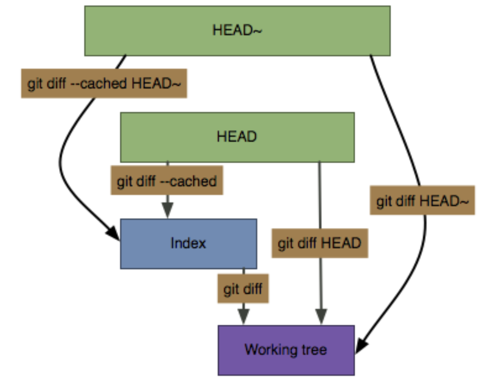
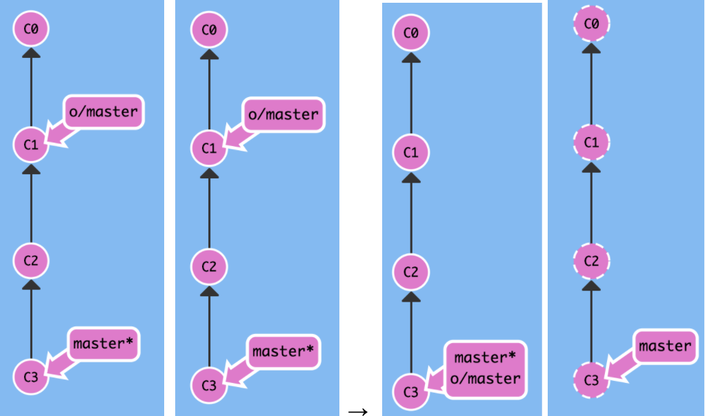
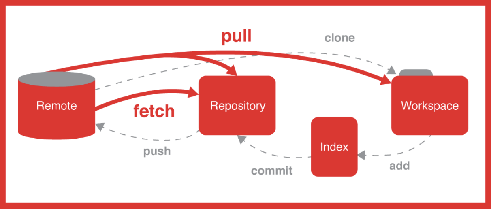
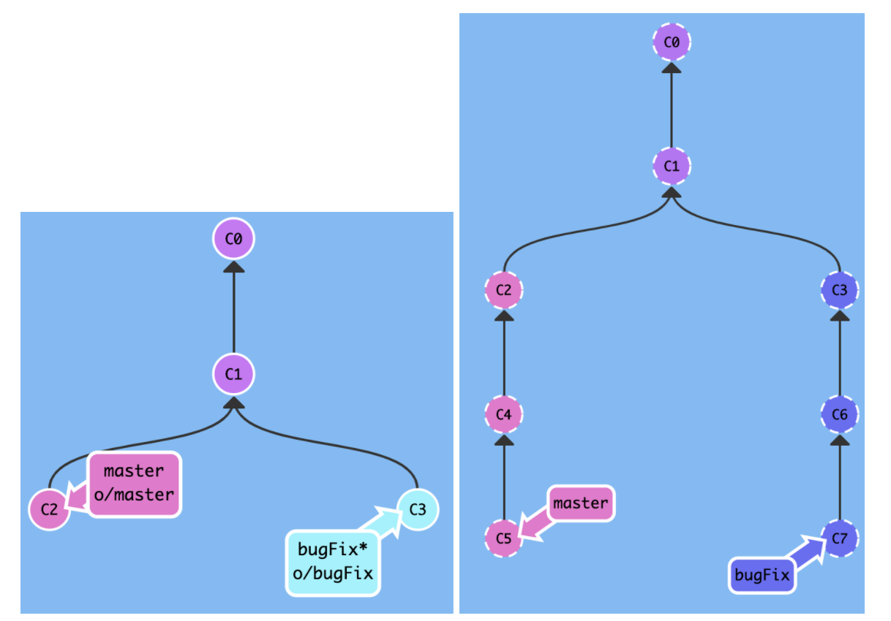
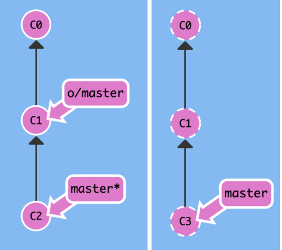
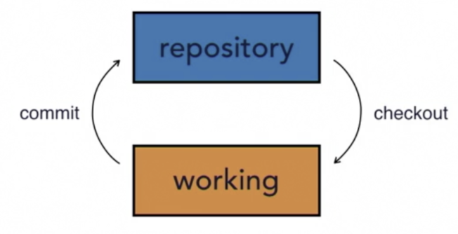
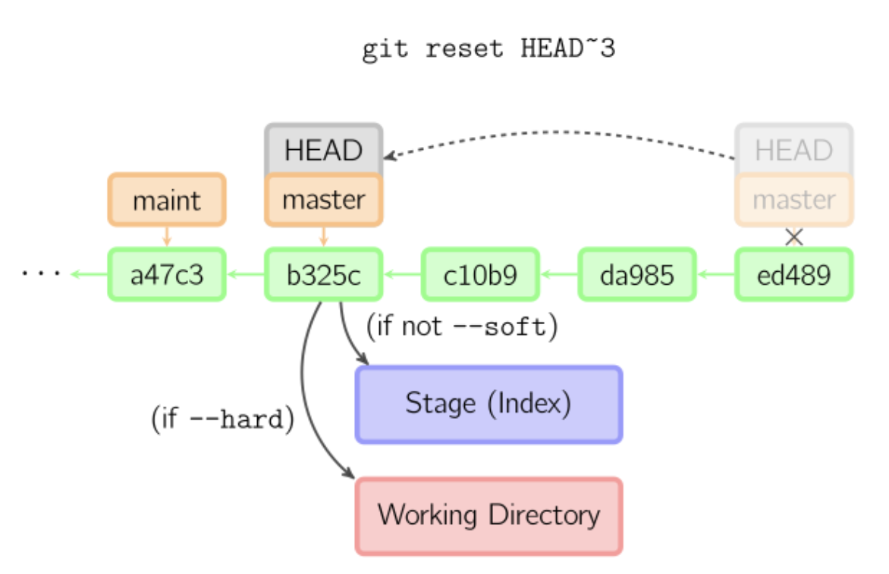
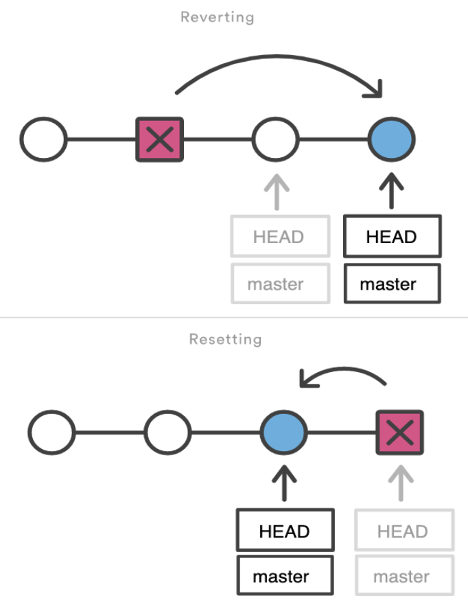
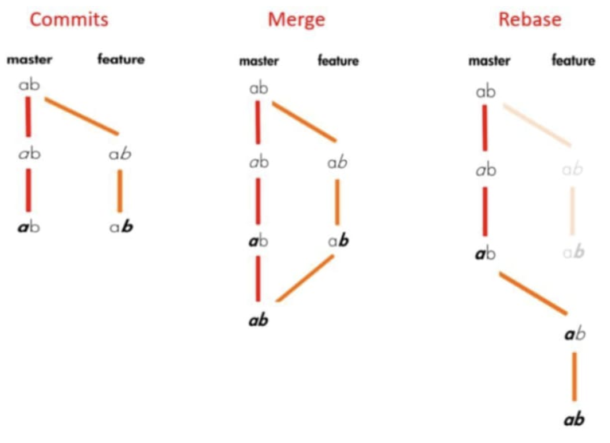
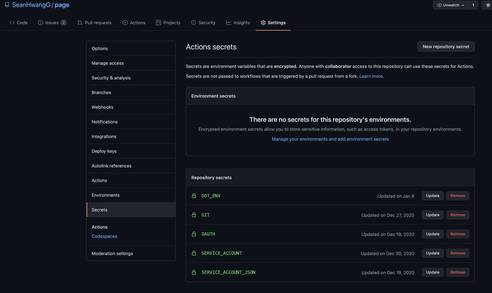

# Shell

## Git

* uses sha-1 to compare hash

### Convention

* Uses present tense for commit message

> Terms

* branch
  * simply a lightweight movable pointer to one of these commits

```sh
^(n)          # previous branch (nth parent)
~n            # n previous branch
```

* main (master before 2020.10)
  * default name for the first branch in convention, this contains the local development

* stage
  * a cache of files that you want to commit

* HEAD
  * pointer to the current branch

* origin
  * alias on your system for a particular remote repository

* workspace
  * where actual files are

* index (staging area)
  * where commits are prepared

* Merge
  * independent lines of development created by git branch and integrate them into a single branch

* fast-forwarding
  * try to merge C1 with a C2 that can be reached by following commit history, just move pointer forward

* squash
  * technique that helps you to take a series of commits and condense it to a few commits

* Repository
  * container that tracks the changes to your project files

* Bare repository
  * Repository without workspace
  * Can be used in a shared folder

* Issue
  * "fix \#33" commit messages closes issue

### Files

> .git

```sh
cat .git/HEAD        # see head
rm -rf .git          # Delete git repository
```

> .gitignore

```sh
*                    # Ignore everything    
!*.py                # But not these files...
```

> .gitconfig

```sh
[user]
    name = Gyuseung Hwang
    email = sean@remote.host
[credential]
    helper = cache --timeout=360000        # timeout for password
```

> .gitcredentials

```sh
Username: sean
Password: ss
```

> .gitmodules

* config file that stores mapping between project’s URL and local subdir

## Command


> git

```sh
-V / --version                            # Print git version
--no-pager                                # Print unicode
svn export <github_url>|trunk|codes       # Download some files from github
```

> Error

* error: cannot lock ref 'refs/remotes/origin/working/sample': 'refs/remotes/origin/working' exists; cannot create 'refs/remotes/origin/working/sample'  
  From [https://github.com/sample/repo](https://github.com/sample/repo)  
  ! \[new branch\] working/hojae -&gt; origin/working/hojae \(unable to update local ref\)

```sh
sean@ip-172-31-61-87:~/EnkorBackend$ git update-ref -d refs/remotes/origin/working
git update-ref -d refs/remotes/origin/development
```

### Config

> init

* initialize git repository, create .git file

> config

```sh
--global --edit                # Configure user name, email
--list                        # Print current configuration
--bool core.bare true        # Create bare repository
--global diff.submodule log    # show changes in submodule 
credential.helper store        # save id / pw in .gitcredentials
core.editor "nano"            # change default editor to vim
```

> submodule

* git in git

> add

```sh
URL                # 
git submodule add https://github.com/pybind/pybind11
```

> init

```sh
initialize your local configuration file
```

> update

```sh
fetch all data from that project and check out appropriate commit
--init
--remote                    # go into your submodules and fetch and update
```

> status

```sh

```

### lfs

* Large file

```sh
lfs install
git submodule foreach git push origin master

> Track all binary files
git lfs track **/*.bin

> error: external filter 'git-lfs filter-process' failed
lfs install --skip-smudge
```

> clone

```sh
<>                # Does not prompt for every large objects
```

### Inspect

> show

```sh
<>                  # Show current and see what has been changed
--shortstat         # only show stat
```

> status

* Show changes between commits, commit and working tree, etc

```sh
[<options>] [<commit>] [--] [<path>…​]
[<options>] --cached [<commit>] [--] [<path>…​]
[<options>] <commit> <commit> [--] [<path>…​]
[<options>] <blob> <blob>
[<options>] --no-index [--] <path> <path>
<>                  # changes between working directory and index
HEAD                # all changes between working directory and HEAD
--cached            # changes between index and HEAD | see added files
--name-only         # name only
--staged            # show changed between working directory and staged
--submodule         # show lines in submodules
```

> rev-parse

```sh
--short HEAD         # show current commit
--abbrev-ref HEAD    # show current branch
```

> blame

```sh
<>              # show file history
```

> log

```sh
master           # local commit history
master..         # branch commit history
origin           # server commit history
--reflog         # show all commits
--oneline        # show abbreviated version
-n n             # limit search to n
--author="sean"  # limit author
--graph          # In graph form
--grep = "init"  # search for message
-p <file>        # show changes over time for a specific file 
--since/until=2020-01-01        # from time

--graph --decorate --pretty=oneline --abbrev-commit --all    # git lola
```

> reflog

```sh
<>                    # View all ref updates (checkout, reset, commit, merge)
```

> revlist

* Lists commit objects in reverse chronological order

> ls-files

```sh
ls-files                    # show all files
--stage                
ls-tree -r -t -l --full-name HEAD | sort -n -k 4 | tail -n 10    # show largest files
```

> ls-tree

```sh
git ls-tree --name-only -r HEAD    # List all files on the branch
```

> diff



```sh
-U<n>                        # allows you to customize the number of lines to show around a change
--name-only --diff-filter=U  # show all unmerged files
```

### Operation

> mv

```sh
<> src dest           # move src to dest
mv -t dest src1 scr2  # move multiple item at once
```

> rm

```sh
<> fn               # rm fn and add to stage area
--cached            # only remove from the index
```

> clean

* Remove untracked files from the working tree

```sh
-n / --dry-run      # see what will be removed 
-d                  # recurse directory
-f                  # force
```

> format-patch

* Prepare patches for e-mail submission

> apply

* Apply a patch to files and/or to the index

> stash


```sh
pop ( -- filename)  # reapply all conflict (only filename)
show (-p)           # To show files changed in the last stash (content of the stashed files)
clear               # clear stashed files
list                # see lists of stashed files

git checkout stash -- .            # overwrite current file
git checkout stash@{0} -- fn    # stash pop certain files
```

> remote

```sh
<>                   # Find current repository
-r                   # List remote branches
-v                   # List all currently configured remotes
add <name> <url>     # Adds a remote <name> for repository at <url> / add origin for new
rm origin            # remove existing origin

get-url              # 
set-url <name> <new> # Changes URL remote points to
--
```

> filter-branch

```sh
git filter-branch --tree-filter 'rm -rf path/file' HEAD    # delete accidentally added file
```

> log

logs last

```sh
--all --grep='Build 0051'   # search by commit message
--pretty=oneline --abbrev-commit   # line only
```

> show

```sh
all                     # show all lfs files
```

> ls-files            \# Show all

### Forward

> add [filename]

* add files to staging area 

```sh
-A        # Add, delete updated codes (git add . + git add -u)
-a        # Adds only files that changed since the last commit before committing
-p        # add some parts of files
-u        # Update or remove previously tracked files from the entire working tree
```

> commit


* move files in staging area to local repository

```sh
--amend -m "new"      # change previous commit message
-a                    # automatically stage files that have been modified and deleted
-m msg                # given <msg> as the commit message
--signoff             # certifies who is the author of the commit
close, closes, closed, fix, fixes, fixed, resolve, resolves, resolved  # with following message close issue
git reset --soft HEAD@{1} && git commit -C HEAD@{1}                    # undo git commit --amend
```

> push



```sh
[]        
[repo] [ref]                # first push
-u / --set-upstream         # every successfully pushed, add upstream

remote local_br(:remote_br) # (omit one if identical)
origin branch               # push only one specific branch
origin --delete master      # delete branch

-f origin HEAD:master       # push detached head
-f origin commit:branch     # undo push
```

### Backward



> Clone

```sh
ssh://[user@]host.xz[:port]/path/to/repo.git/
git://host.xz[:port]/path/to/repo.git/      # does no authentication
http[s]://host.xz[:port]/path/to/repo.git/
native transport (i.e. git:// URL) and should be used with caution on unsecured networks.
<folder>        # get a local copy of an existing repository (default cwd)
--depth 1       # shallow clone
--recurse-submodules  # initialize, update each submodule in repository
-b / --branch   # clone branch
--bare          # clone bare repository
-j <n>, --jobs <n>  # number of submodules fetched at the same time.
```

> Fetch

* Before Fetch (left : Local, right : Remote with new bugFix)


* After Fetch


* downloads commits that remote has but missing from local repository and updates remote branches point
* does not change anything about your local state

```sh
--all && git reset --hard origin/master    # Download from remote and discard all 
--unshallow                          # fetch all older commits from shallow clone
```

> pull

* before pull


* after pull


```sh
[repo] [ref]                  # fetch + merge
--allow-unrelated-histories   # merge different git repository
origin master                 # update local copy with commits from remote repo
-C <git-working-directory> pull <git remote>  # pull in other directory
```

> Checkout



* checkout will also update HEAD to set the specified branch as the current branch

```sh
branch          # switch to branch
commit          # update HEAD
filename        # Discard changes in the working directory
origin/master   # check out remote 
-b branch       # create a new branch, use it 
-f branch commit # Reset <branch> to <commit>, even if <branch> exists
```

> Reset



```sh
tree path      # Unstage all changes in one file
file           # Unstage a file
HEAD filename  # Discard all changes from previous commit
--hard branch  # throws away all uncommitted changes
```

> Revert



* forward-moving undo

```sh
branch         # Creates new commit of existing commit
commit         # Undo commits in a public branch
```

### Branch


* the starred branch is your current branch

> branch

```sh
<>                    # show branch
branch                # create name <branch> 
-d / -D name          # Delete merged branch / not merged in upstream branch

-f b1 b2              # Move b1 to b2
-m A <B>              # Rename branch (current to A (A to B)
-u o/master (branch)  # set branch to track o/master (current branch)
-vv                   # Show all the local branches of your rep

-mc branch2           # branch2 will be created
--merged | egrep -v "(^\*|master|main|dev)" | xargs git branch -d        # delete merged branches
```

> cherry-pick

```sh
C1 C2          # copy C1, C2, … to our current HEAD
C1...C2        # copy commit from C1 to C2 to our current HEAD 
```

> Merge

* On feature branch
* Left : git merge master
* Right : git rebase master


```sh
--unset-upstream main               # unset upstream branch
branch_name                  # merge with another branch
-s ours branch1 branch2 branchN    # merge result is always that of the current branch HEAD
```

> mergetool

```sh
<>                # run left
```

* git config merge.conflictstyle diff3

```sh
<<<<<<<
This is the branch that I have currently checked out (i.e. HEAD).
|||||||
The common ancestor version.
=======
Changes made on the branch that is being merged in. This is often a feature branch
.>>>>>>>
```

> Rebase

* integrating changes from one branch onto another
* pastes feature branch to the end of the master branch

```sh
a (b)            # a → b (current if omitted)
- i --root       # Interactive rebase / from root
fetch && origin/master  # Merge remote master to the local branch
```

## Github

### CLI

```sh
gh gist create filename    # push to gist

?file=afile            # only one file in gist
```

### workflow

* name
  * workflow name GitHub displays on your repository's actions page. 
  * If omit name, GitHub sets it to workflow file path relative to root of the repository

* action
  * standalone commands that are combined into steps to create a job
  * smallest portable building block of a workflow

* events
  * specific activity that triggers a workflow

* workflow
  * an automated procedure that you add to your repository. 
  * made up of one or more jobs and can be scheduled or triggered by an event.


### action.yml

* secret
  * can be accessed with `${{ secrets.STAGING_DB_HOST }}`




* on push | [push, pull]
  * Specify the event that automatically triggers the workflow file

```yml
name: CI
on:         # Controls when the action will run. 
  push:     # Triggers the workflow on push or pull request events but only for the main branch
    branches: [ main ]
  pull_request:
    branches: [ main ]
  workflow_dispatch:    # Allows you to run this workflow manually from the Actions tab
jobs:                   # workflow run is made up of 1+ jobs that can run sequentially or in parallel
  build:                # This workflow contains a single job called "build"
    runs-on: ubuntu-latest          # type of runner that the job will run on
    steps:                          # represent a sequence of tasks that will be executed as part of job
      - uses: actions/checkout@v2   # Checks-out your repository under $GITHUB_WORKSPACE, so your job can access it
      - name: Run a onescript       # Runs a single command using the runners shell
        run: echo Hello, world!
      - name: Run a multi script    # Runs a set of commands using the runners shell
        run: |
          echo Add other actions to build,
          echo test, and deploy your project.
```


## Vim

```
--version       # Show version
-o *            # Open with horizontal split
-o *            # Open with vertical split
-p *            # Open with each tab
-r .swp         # recover swp file

:source ~/.vimrc   # Apply vimrc
:![cmd]            # run terminal command
:help key-notation # man page 
:history           # Last command
```

### Navigation

```
0 | $          # begin | end of the line
^              # first non-blank character
( | )          # begin | end of the current paragraph
zt | z. | zb   # cursor top | middle | bottom
H | M | L      # move to top | middle | low of the page
ctrl-f | b     # scroll full screen forward | backward
ctrl-d | u     # scroll half screen forward | backward
* / #          # Search current word forward / backward
/copy\C / \c   # Case sensitive / insensitive
```

> search

```
:g/pattern/d        # delete all line matching patterns
:g!/pattern/d
:g/^\s*$/d          # delete all blank lines
:g/^$/d             # Delete empty line
\c                  # ignore case
:s/sunny/(&)/       # & is matched text
:g/pattern/m$       # Move all lines matching a pattern to end of file
```

> Mark

```
`a             # goto position of mark a
ma             # mark a
:marks         # list all marks
:delmarks a    # delete mark
```

### Operation

> map

```
map / imap     # normal, visual mode / insert mode 
unmap          # cancel mapping 
inoremap       # insert mode non recursive
n / i          # normal / insert mode 
v / s / x      # visual select mode / select mode / visual mode only 
c              # command-line 
l              # lang-arg o pending

<D-            # mac command
<CR>           # carriage return usually the Enter on your keyboard

:map           # see current mapping
remap          # makes mappings work recursively
nnoremap       # one that works in normal mode
<silent>       # show no message when this key sequence is used
<leader>       # let mapleader = autocmd 

map <C-l> <Esc>:w<CR>:!clear;python %<CR>    # run python script
filetype cpp nnoremap <F5> :w <bar> exec '!g++ -g -O2 -std=gnu++17 -static %'<CR>
```

> Copy

```
yy          # yank line
dd          # delete and copy current line
ggyG        # yank entire file
:d          # delete current line
:m0         # move current line to line 0

:w !sudo tee %     # without permission
:wqa               # write close all
:%w !pbcopy        # copy to clipboard
:r !pbpaste        # paste from the clipboard
```

> Visual

```
ctrl + v | shift + i # enter      # python multiline comment
```

> macro

```
:reg
""          # unnamed | default register 
“+          # clipboard
"kyy        # copy current line to register k
“kp         # paste k register
```

> Register

```
q[a-z][command]q
@a
```

### File

```
:e []/file        # Reload current file | Open new file

! : ignore vimrc mapping configure
execute "normal! ihello my name is sean"

expand("%")       # path/file.txt
expand("%:t")     # file.txt
expand("%:p:h")   # /home/you/path/file.txt
expand("%:r")     # path/file
expand("%:e")     # txt

startinsert
strftime("%c")
type(var) ==   type(0) / type(function("tr")) / type([]) / type({}) / type(0.0)

%              # current file name
q:             # history
:saveas        # save file as
```

> split

```
:tabe file     # in a new tab

Ctrl+w+r       # vsplit swap window
Ctrl+w+=       # vsplit resize equal dimension

:vs file       # in a split mode
:Sex / Vex     # split and open file explore
:tabnew file   # open as a new tap
```

### Lastline

```
:retab               # Repace tab to spaces
```

### .vimrc

* Located in home\(~\) directory, get run every time when open vim

```
:so ~/.vimrc            # apply vimrc

set num                 # show line number
syntax on               # coloring
set tabstop=4           # Change Tab into 4 spaces
set shiftwidth=4        # Change >> length to 4
set et                  # Convert tab to space

set hlsearch            # highlight all matches in a file when perform a search,
set incsearch           # highlight next match while you're still typing search pattern

verbose                 # where setting is from

set encoding=utf-8      # Korean support
set fileencodings=utf-8,cp949

" AUTOCOMPLETE RELATED
func! AutoClose(...)
    let cur = getline(".")[col(".")]
    if cur != a:1
        if a:1 == "'" || a:1 == '"'
            execute "normal!a".a:1.a:1
        else
            execute "normal!a".a:1
        endif
        execute "normal!h"
    else
        execute "normal!l"
    endif
endfunc

inoremap ( ()<left>
inoremap [ []<left>
inoremap { {}<left>
inoremap ) <ESC>:call AutoClose(')') <CR>a
inoremap ] <ESC>:call AutoClose(']') <CR>a
inoremap } <ESC>:call AutoClose('}') <CR>a
inoremap " <ESC>:call AutoClose('"') <CR>a
inoremap ' <ESC>:call AutoClose("'") <CR>a
inoremap {<CR> {<CR>}<ESC>O
inoremap {;<CR> {<CR>};<ESC>O

" COMMAND RUN related
func! RunScript(...)
    execute ":wa"
    let fileName = a:1
    let fileType = a:2

    if fileType == 'cpp'
        execute ":!g++ -std=c++11 -o ".fileName fileName.".cpp && cat ".fileName.".txt 2> /dev/null | ./".fileName
    elseif fileType == 'py'
        execute ":!cat input.txt 2> /dev/null |" "python3" fileName.".py"
    endif
endfunc

nnoremap <C-l> :call RunScript(expand('%<'), expand('%:e')) <CR>

""autocmd *.py nnoremap <F5> :w <CR> :!cat input.txt 2> /dev/null | python % <CR>

"" SYNTAX
syntax on
colorscheme evening
se nu tabstop=4 shiftwidth=4 softtabstop=4 smarttab expandtab autoindent
set hlsearch  " highlight search and search while typing
set incsearch

"" SCREEN
noremap <Left> <C-w><Left>
noremap <Right> <C-w><Right>
```

### Data

> Primitive

```
str2float("2.3")
str2nr("3")
float2nr("3.14")
```

> String

```
len(str)
split("one.two.three", '.')    # ['one', 'two', 'three']
tolower('Hello')
'hello ' . name
```

> Dictionary

```
count(dict, 'x')
empty(dict)
get(dict, "apple")
has_key(dict, 'foo')
keys(dict)
len(dict)
max(dict)
min(dict)
remove(dict, "apple")
```

* print every pair

```
# Construct
let colors = {
    \ "apple": "red",
    \ "banana": "yellow"
}

# Access
echo colors["a"]   

for key in keys(dict)
  echo key . ': ' . dict(key)
endfor
```

### Logical

> Compare

```
if name ==# 'John'    # case-sensitive
if name ==? 'John'    # case-insensitive
if name == 'John'     # depends on :set ignorecase
"hello" =~ '/x/'      # regex match
"hello" !~ '/x/'

&&    # and
||    # or

if

let char = getchar()
if char == "\<LeftMouse>"
  " …
elseif char == "\<RightMouse>"
  " …
else
  " …
endif
```

### Flows

> For

```
for s in list
    echo s
    continue  " jump to start of loop
    break       " breaks out of a loop
endfor
```

* List

```
let longlist = mylist + [5, 6]
let mylist += [7, 8]
mylist[2:]
let alist = add(mylist, 4)
```

> while

```
while x < 5
endwhile
```

### Function

* Vimscript functions must start with a capital letter if they are unscoped

```sh
let temp = @@
let @@ = temp  : prevent overwriting current register

function Varg(...)
a:000    # a list containing all the extra arguments that were passed
a:0      # number of argument
a:1      # first argument
```

* C Prototype Function

```
func! CPrototypeFunction()
let temp = @@
    exe "normal! mayy"
    exe "normal! /Prototypes\<CR>"
    exe "normal! )kpA;\<ESC>"
    exe "normal@ 'a"
let @@ = temp
endfunc
```